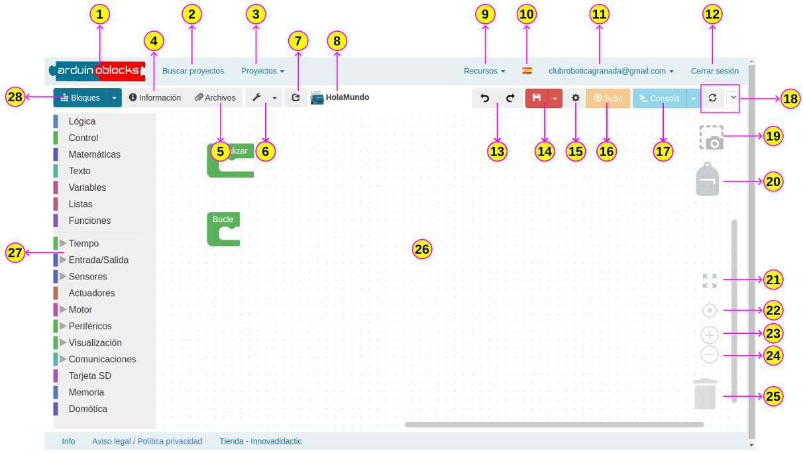
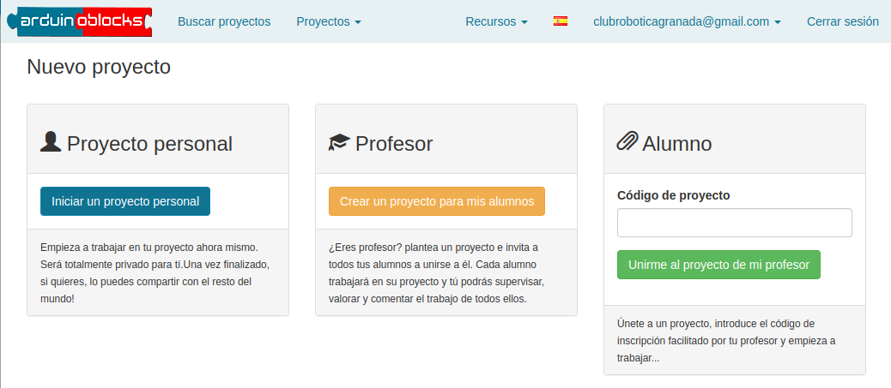
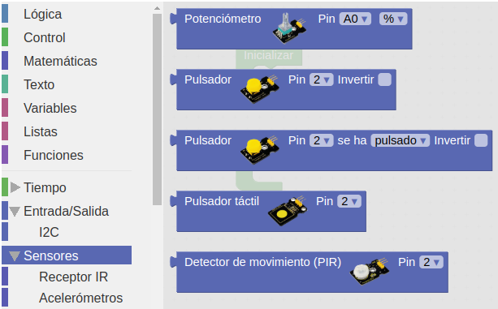
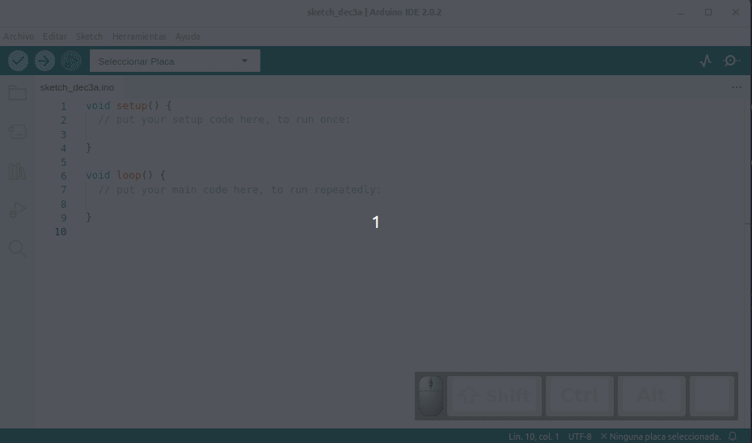
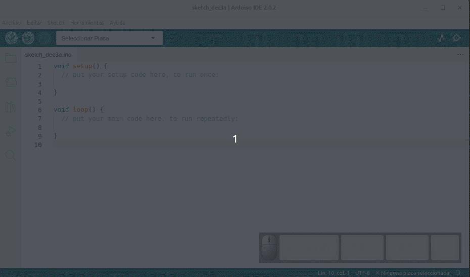

comenzar a utilizar la placa ESP32 STEAMakers, tienes que comprobar que tu ordenador tenga instalados los controladores necesarios. Por ello es aconsejable estudiar antes de nada los contenidos de este apartado.

## **Descripción**

  
*Placa ESP32 STEAMakers*

La placa **ESP32 STEAMakers** es una placa basada en el microcontrolador ESP32, que gracias a una disposición versátil de conectores facilita el acceso a sus numerosas entradas y salidas donde conectar toda clase de sensores y actuadores. Incorpora comunicación WiFi y Bluetooth integradas, así como mayor capacidad de procesamiento que las populares placas electrónicas Arduino UNO y clones de la misma.

Esta placa puede programarse mediante diversas plataformas y lenguajes, como Arduino IDE con código basado en C/C++ o entornos de programación visual Arduinoblocks y MicroBlocks.

Todo ello convierte al ESP32 STEAMakers en un recurso muy versátil y accesible para iniciarse en electrónica, programación y prototipado de proyectos de robótica, internet de las cosas, domótica, etc. Es especialmente adecuada para docentes y estudiantes gracias a su facilidad de programación y conectividad inalámbrica integrada.

El formato de placa tipo UNO hace posible reutilizar todo el material del que dispongamos para placas tipo UNO puesto que se ha conservado la compatibilidad de pines en la distribución.

Los pines de Señal (S) se corresponden con pines GPIO. Los pines GND (G) se corresponden con masa. Los pines VCC (V) a la tensión de los mismos. Puedes controlar el voltaje VCC mediante un interruptor deslizante para ponerlo a 5V o 3.3V.

Cuando se sitúa a 5V, el nivel en el puerto de comunicación serie es de 5V, el voltaje de los pines es de 5V. Cuando se cambia a 3.3V, el nivel en el puerto de comunicación serie es de 3.3V, el voltaje de los pines es de 3.3V.

También, de forma separada hay cuatro conjuntos de cuatro pines macho mas un conjunto de pines hembra, a modo de hub, para comunicación IIC o I2C. También existe un conjunto de 4 pines macho para comunicación serie.

## **Componentes de la placa**

  
*Componentes de la placa ESP32 STEAMakers*

1. **Botón de reset**. Para reiniciar la placa.
2. **Conmutador deslizante**. Permite controlar el voltaje en los pines V (VCC) entre 3.3V or 5V.
3. **Conector USB-B**. Para alimentación y cargar de firmware.
4. **Bus I2C**. Con conectores macho y hembra para GND - 3.3V/5V - SDA - SCL.
5. **Pines analógicos**. Conjunto de conectores de 3 pines con GND - 3.3V - (IO24 - A3),(IO35 - A2),(IO04 - A1),(IO02 - A0)
6. **Conector alimentación DC**. La placa se puede alimentar con una tensión continua externa de 7 a 12V desde la toma de alimentación DC.
7. **Tarjeta microSD**. Pines CS - CMD - SCK - D0. El soporte está en la cara posterior de la placa.
8. **Medidor de corriente y tensión**. Mediante el circuito integrado [ACS712T](https://www.allegromicro.com/en/products/sense/current-sensor-ics/zero-to-fifty-amp-integrated-conductor-sensor-ics/acs712) de [Allegro microsystems](https://www.allegromicro.com/en/) se suministran las medidas de consumo energético: corriente (IOUT) en el pin io36 y tensión (VOUT) en el pin io39.
9. **Pines varios**. De izquierda a derecha según la imagen anterior tenemos: io0, 5V, Reset, 3.3V, 5V, GND, GND y entrada de alimentación VIN entre 7 y 12V.
10. **Entradas analógicas y bus I2C**. A0 (io2) - A1 (io4) - A2 (io35) - A3 (io34) y Pines SDA y SCL del Bus I2C.
11. **Microcontrolador**. Chip [ESP32-WROOM-32](https://www.espressif.com/sites/default/files/documentation/esp32-wroom-32_datasheet_en.pdf).
12. **Comunicación serie**. Para conectar la comunicación serie. 4Pines (GND, VCC, RX, TX).
13. **Entradas salidas digitales**. Pines GPIO: D0 (RX0) - D1 (TX0) - D2 (io26) - D3 (io25) - D4 (io17) - D5 (io16) - D6 (io27) - D7 (io14) - D8 (io12) - D9 (io13) - D10 (io05) - D11 (io23) - D12 (io19) y D13 (io18).
14. **Pines I2C**. Pines para comunicaciones I2C de 4 pines (GNC, VCC, SDA y SCL).
15. **Pines G,V,S (GND, VCC, Señal)**. Pines digitales de entrada/salida, etiquetados de D2 a D13 con la misma correspondencia que se ha dado anteriormente. Estos pines digitales se pueden conectar mediante conectores hembra tipo dupont individuales o de 2,54mm de paso. Selecciona la tensión de 3,3 V o 5 V mediante el interruptor deslizante.

## **Compatibilidad y descripción de pines UNO/ESP32 STEAMakers**

!!! info "Importante:"
    Todos los pines IOxx son entradas y salidas digitales de propósito general, algunas con más funciones.

!!! failure "IMPORTANTE"
    **Utilizando la comunicación WiFi no funciona el ADC2.**

<table width="100%"  border="1" cellspacing="2" cellpadding="2" style="font-size:10px">
  <tr>
    <th>Pin UNO</th>
    <th>Pin ESP32</th>
    <th>Función</th>
    <th>Ampliación</th>
    <th>Descripción UNO</th>
  </tr>
  <tr>
    <td>D0</td>
    <td>IO03</td>
    <td>Rx</td>
    <td>UART 0 RX</td>
    <td>Pin de recepción Bluetooth y WiFi</td>
  </tr>
  <tr>
    <td>D1</td>
    <td>IO01</td>
    <td>Tx</td>
    <td>UART 0 TX</td>
    <td>Pin de transmisión Bluetooth y WiFi</td>
  </tr>
  <tr>
    <td>D2</td>
    <td>IO26</td>
    <td>ADC2 CH9</td>
    <td>DAC2</td>
    <td>Entrada/salida digital</td>
  </tr>
  <tr>
    <td>D3</td>
    <td>IO25</td>
    <td>ADC2 CH8</td>
    <td>DAC1</td>
    <td>Entrada/salida digital</td>
  </tr>
  <tr>
    <td>D4</td>
    <td>IO17</td>
    <td></td>
    <td>UART 2 TX</td>
    <td>Entrada/salida digital</td>
  </tr>
  <tr>
    <td>D5</td>
    <td>IO16</td>
    <td></td>
    <td>UART 2 RX</td>
    <td>Entrada/salida digital</td>
  </tr>
  <tr>
    <td>D6</td>
    <td>IO27</td>
    <td>ADC2 CH7</td>
    <td>ADC2-7 / TOUCH7</td>
    <td>Entrada/salida digital</td>
  </tr>
  <tr>
    <td>D7</td>
    <td>IO14</td>
    <td>ADC2 CH6</td>
    <td>ADC2-6 / TOUCH6</td>
    <td>Entrada/salida digital</td>
  </tr>
  <tr>
    <td>D8</td>
    <td>IO12</td>
    <td>ADC2 CH5</td>
    <td>ADC2-5 / TOUCH5</td>
    <td>Entrada/salida digital</td>
  </tr>
  <tr>
    <td>D9</td>
    <td>IO13</td>
    <td>ADC2 CH4	</td>
    <td>ADC2-4 / TOUCH4</td>
    <td>Entrada/salida digital</td>
  </tr>
   <tr>
    <td>D10</td>
    <td>IO05</td>
    <td></td>
    <td>VSPI CSO</td>
    <td>Entrada/salida digital</td>
  </tr>
   <tr>
    <td>D11</td>
    <td>IO23</td>
    <td></td>
    <td>VSPI MOSI</td>
    <td>Entrada/salida digital</td>
  </tr>
   <tr>
    <td>D12</td>
    <td>IO19</td>
    <td></td>
    <td>VSPI MISO</td>
    <td>Entrada/salida digital</td>
  </tr>
   <tr>
    <td>D13</td>
    <td>IO18</td>
    <td></td>
    <td>VSPI CLK</td>
    <td>Entrada/salida digital</td>
  </tr>
   <tr>
    <td>GND</td>
    <td>GND</td>
    <td></td>
    <td></td>
    <td></td>
  </tr>
   <tr>
    <td>AREF</td>
    <td>Reset</td>
    <td></td>
    <td></td>
    <td></td>
  </tr>
   <tr>
    <td>SDA</td>
    <td>IO21</td>
    <td>I2C</td>
    <td></td>
    <td>Serial DAta</td>
  </tr>
   <tr>
    <td>SCL</td>
    <td>IO22</td>
    <td>I2C</td>
    <td></td>
    <td>Serial CLock</td>
  </tr>
   <tr>
    <td>A0</td>
    <td>IO02</td>
    <td>ADC2 CH2</td>
    <td></td>
    <td>Entrada analógica</td>
  </tr>
   <tr>
    <td>A1</td>
    <td>IO04</td>
    <td>ADC2 CH0</td>
    <td></td>
    <td>Entrada analógica</td>
  </tr>
   <tr>
    <td>A2</td>
    <td>IO36</td>
    <td>ADC1 CH0</td>
    <td></td>
    <td>Entrada analógica</td>
  </tr>
   <tr>
    <td>A3</td>
    <td>IO34</td>
    <td>ADC1 CH6</td>
    <td></td>
    <td>Entrada analógica</td>
  </tr>
   <tr>
    <td>A4</td>
    <td>IO38</td>
    <td></td>
    <td></td>
    <td>Datos I2C</td>
  </tr>
  <tr>
    <td>A5</td>
    <td>IO39</td>
    <td>ADC1 CH3</td>
    <td></td>
    <td>Señal de reloj I2C</td>
  </tr>
  <tr>
    <td></td>
    <td>IO00</td>
    <td>¡ No conectar !</td>
    <td></td>
    <td></td>
  </tr>
  <tr>
    <td></td>
    <td>IO32</td>
    <td>D0- uSD</td>
    <td></td>
    <td></td>
  </tr>
  <tr>
    <td></td>
    <td>IO15</td>
    <td>CLK - uSD</td>
    <td></td>
    <td></td>
  </tr>
  <tr>
    <td></td>
    <td>IO33</td>
    <td>CMD - uSD</td>
    <td></td>
    <td></td>
  </tr>
  <tr>
    <td></td>
    <td>IO35</td>
    <td>IOUT</td>
    <td>Medidor de corriente</td>
    <td></td>
  </tr>
  <tr>
    <td></td>
    <td>IO37</td>
    <td>VOUT</td>
    <td>Medidor de tensión</td>
    <td></td>
  </tr>
</table>

## **Posibilidades de la placa**
La placa ESP32 STEAMakers facilita el acceso a las potentes capacidades del microcontrolador ESP32 mediante una disposición versátil de conectores y una amplia variedad de entradas y salidas. Esto permite crear de forma sencilla toda clase de proyectos interactivos con sensores, actuadores y comunicaciones inalámbricas.

Algunos ejemplos de proyectos que se pueden realizar en el aula:

* **MEDIR LA TEMPERATURA**

El sensor de temperatura integrado permite obtener el valor de la temperatura cercano al procesador de la placa. Puede mostrarse a través de una pantalla o enviar a un servidor.

* **DETECTAR EL NIVEL DE LUZ**

A través de un sensor de luz conectado a una de las entradas analógicas de la placa, se puede medir la intensidad lumínica de un espacio y activar actuadores en función de si hay más o menos claridad.

* **DETECTAR PROXIMIDAD O MOVIMIENTO**

Mediante un sensor de tipo Hall (magnético) interno en la placa o un sensor de ultrasonidos conectado a una entrada se puede detectar cuándo un objeto o persona se acerca o se aleja de la placa.

* **REPRODUCIR AUDIO**

Empleando un zumbador se pueden generar tonos y melodías que puedan formar parte de una experiencia interactiva.

* **CONTROLAR REMOTAMENTE POR WIFI**

Aprovechando la conectividad WiFi integrada, se pueden crear interfaces web o apps móviles para controlar de forma remota los componentes conectados a la placa.

* **COMUNICAR CON OTROS DISPOSITIVOS**

La conectividad Bluetooth permite que la placa intercambie datos en tiempo real con tablets, teléfonos inteligentes u otros sistemas externos con Bluetooth integrado.

## **Entorno de programación**
### Arduinoblocks
ArduinoBlocks [http://www.arduinoblocks.com](http://www.arduinoblocks.com/) es un entorno de programación visual por bloques que facilita la programación de la placa.

ArduinoBlocks es compatible con varias placas electrónicas. En su entorno de programación o IDE se pueden distinguir las siguientes partes:

  
*Entorno de programación o IDE de arduinoblocks*

<table>
<tr>
  <td>1</td>
  <td>Página principal arduinoblocks</td>
  <td>15</td>
  <td>Configuraciones de arduinoblocks</td>
</tr>
<tr>
  <td>2</td>
  <td>Repositorio de proyectos</td>
  <td>16</td>
  <td>Botón para grabar el programa en la placa una vez conectada</td>
</tr>
<tr>
  <td>3</td>
  <td>Desplegar para acceder a nuestros proyectos y para crear un proyecto nuevo</td>
  <td>17</td>
  <td>Botón para abrir la consola serie. Desplegando podemos abrir serial plotter</td>
</tr>
<tr>
  <td>4</td>
  <td>Acceso a la información del proyecto referente a nombre, descripción, etc.</td>
  <td>18</td>
  <td>Actualización puerto. Muestra puerto cuando hay una placa conectada (/dev/ttyUSBn)</td>
</tr>
<tr>
  <td>5</td>
  <td>Acceso a los archivos adjuntos al proyecto</td>
  <td>19</td>
  <td>Captura de pantalla del programa sin fondo</td>
</tr>
<tr>
  <td>6</td>
  <td>Acceso a herramientas de edición de matrices de leds, pantallas LCD y OLED, Neopixel e información RTTTL</td>
  <td>20</td>
  <td>Espacio para guardar instrucciones y estructuras de programación y reutilizarlas en el proyecto actual o en otro diferente</td>
</tr>
<tr>
  <td>7</td>
  <td>Botón para compartir el proyecto via correo electrónico</td>
  <td>21</td>
  <td>Botón para maximizar el tamaño de los bloques</td>
</tr>
<tr>
  <td>8</td>
  <td>Nombre del proyecto con el icono de la placa seleccionada para programar</td>
  <td>22</td>
  <td>Botón para centrar los bloques</td>
</tr>
<tr>
  <td>9</td>
  <td>Desplegable para acceder a Connector, documentación varia y librerias usadas por la aplicación</td>
  <td>23</td>
  <td>Botón para ampliar el tamaño de los bloques</td>
</tr>
<tr>
  <td>10</td>
  <td>Idioma del IDE de arduinoblocks</td>
  <td>24</td>
  <td>Botón para reducir el tamaño de los bloques</td>
</tr>
<tr>
  <td>11</td>
  <td>Identificación de la cuenta con la que hemos accedido</td>
  <td>25</td>
  <td>Papelera para descartar bloques no usados</td>
</tr>
<tr>
  <td>12</td>
  <td>Cerrar la sesión actual</td>
  <td>26</td>
  <td>Espacio de programación</td>
</tr>
<tr>
  <td>13</td>
  <td>Botones deshacer y rehacer</td>
  <td>27</td>
  <td>Bloques de programación organizados por categorias</td>
</tr>
<tr>
  <td>14</td>
  <td>Botón y un desplegable para guardar y exportar el proyecto</td>
  <td>28</td>
  <td>Desplegable para mostrar el código del programa, descargarlo en formato .ino o descargar en formato .zip (se descargan el programa y las librerias</td>
</tr>
</table>

#### <b>Programando con arduinoblocks</b>
Para poder conectar y programar las placas con arduinoblocks, es necesario instalar “AB-Connector” para permitir la comunicación entre el entorno arduinoblocks y la placa electrónica.

En "Recursos" de "arduinoblocks" tenemos todas las opciones de descarga y condiciones de instalación de “AB-Connector” para los sistemas operativos soportados. Para el caso de Ubuntu nos indica:

  
*AB-Connector*

Una vez instalado lo podemos encontrar entre las aplicaciones:

  
*AB-Connector*

Al abrir AB-Connector, aparece este cuadro de diálogo que va mostrando información sobre la placa y arduinoblocks:

  
*AB-Connector en ejecución*

Dejamos AB-Connector en ejecución minimizado en segundo plano.

<b>1.</b> En ArduinoBlocks, crea una cuenta pulsando en “Iniciar sesión” y, posteriormente, en “nuevo usuario”:

  
*Pantalla inicial arduinoblocks*

<b>2. </b> Al entrar en la plataforma te encontrarás esta pantalla:

  
*Sesión iniciada en arduinoblocks*

<b>3.</b> Al hacer clic en "Empezar un nuevo proyecto!" aparece la siguiente pantalla para seleccionar el tipo de proyecto:

  
*Nuevo proyecto*

<b>4.</b> Para crear un nuevo **proyecto personal**, debes rellenar un formulario. Si utilizas la placa ESP32 STEAMaker, debes seleccionar ESP32 STEAMaker en **Tipo de proyecto**.

  
*Tipo de proyecto*

<b>5.</b> Una vez creado el proyecto, después de haber cumplimentado su nombre y demás campos del formulario, se abre el entorno de programación:

  
*Proyecto creado*

<b>6.</b> En la parte izquierda de esta pantalla, encontrarás los bloques disponibles clasificados por diferentes categorías. Por ejemplo, en la siguiente imagen puedes ver los bloques de algunos de los sensores que se pueden controlar con la placa ESP32 STEAMaker.

  
*Algunos bloques de sensores*

<b>7.</b> Arrastra los bloques al espacio de programación para programar tu placa. Por ejemplo, podemos programar el envío en bucle de un mensaje por puerto serie. El **puerto serie**, también conocido como puerto de comunicaciones serie o interfaz serie, es un tipo de conexión utilizada en ordenadores y dispositivos periféricos para la transferencia de datos. La característica principal del puerto serie es que envía los datos en serie; es decir, bit a bit, a través de un solo canal o hilo. Los bloques más importantes para utilizar el puerto serie son:

  
*Bloques puerto serie*

<b>8.</b> El programa de este ejemplo sería así:

  
*Programa Hola mundo. [Descargar](../STEAMakers/programas/HolaMundo.abp)*

Dentro de la estructura “**Inicializar**” colocamos el bloque de configuración de la velocidad de transferencia de datos (“**baudrate**”) del puerto serie a 115200. Y en el bucle principal, colocamos el bloque para enviar un mensaje en concreto, seleccionando que se realice un salto de línea. Para que el mensaje no se muestre tan rapidamente hacemos que se reproduzca cada cierto tiempo.

<b>9.</b> Una vez creado el programa, debes transferirlo (subirlo) a la placa. Para ello, sigue los siguientes pasos:

* Comprueba que AB-Connector está ejecutańdose.
* Conecta la placa al ordenador mediante un cable USB.
* Selecciona el puerto de comunicación. Puedes conectar y desconectar el cable USB del ordenador para diferenciar cuál es el puerto de comunicación que utiliza la placa.
* Si no aparece el "/dev/ttyUSBn" directamente, pulsa en el icono de actualización. En entornos Linux, MacOS y Chromebook se muestra así el nombre. En Windows se muestra como COM.

  
*Establecer conexión USB*

* Pulsando en el botón “Subir”, carga el programa en la placa.

  
*Subir el programa a la placa*

!!! info "Tiempo de subida"
    En ESP32 el tiempo de subida será bastante mayor que en otras placas debido a la cantidad y peso de las librerias que utiliza ESP32.

Para poder visualizar el monitor serie y comprobar qué mensajes está enviando la placa al ordenador, debes abrirlo en tu entorno de programación, pulsando el botón “Consola”:

  
*Abrir consola serie*

<b>10.</b> Se abrirá la ventana siguiente:

  
*Consola serie*

<b>11.</b> Selecciona la tasa de baudios (velocidad de transmisión de datos) con la que has iniciado el puerto serie y después haz clic en conectar. Verás el resultado en pantalla.

  
*Consola serie recibiendo datos*

### Arduino IDE
Arduino IDE es un Entorno de Desarrollo Integrado multiplataforma (Linux, Windows y macOS) ideal para programar placas tipo Arduino y compatibles, con un lenguaje de programación basado en C/C++.

IDE (Integrated Development Environment, traducido como Entorno Integrado de Desarrollo) incorpora un editor de código que facilita la escritura de programas. También dispone de numerosas bibliotecas y ejemplos que ayudan a la programación.

Permite compilar y subir los programas a la placa con tan sólo un clic, visualizando el resultado a través del monitor serie, por ejemplo.

En el entorno de programación se pueden distinguir las siguientes partes:

#### ==Descarga==
Podemos descargarlo desde la [página de software de Arduino IDE 2.0](https://www.arduino.cc/en/software) y en el momento de creación de este apartado de la web nos ofrece la versión 2.3.2 además de los enlaces al editor online, tal y como vemos en la figura siguiente.

  
*Descargas*

En esta página tenemos disponibles las versiones Nightly y otras informaciones importantes como:

* La versión de escritorio no está disponible para Chromebook donde deberemos trabajar con el [editor web de Arduino](https://create.arduino.cc/editor/).
* Es posible programar las placas utilizando MicroPython. En la página [MicroPython with Arduino](https://docs.arduino.cc/micropython) tenemos toda la información.
* Opciones de descarga de versiones anteriores del IDE.
* Términos de servicio

Si tenemos alguna duda podemos seguir el tutorial en inglés de [descarga e instalación de Arduino IDE 2.0](https://docs.arduino.cc/software/ide-v2/tutorials/getting-started/ide-v2-downloading-and-installing).

#### ==Ventana principal del IDE==
En la figura siguiente vemos el aspecto que presenta el IDE en la versión 2.0.

  
*Arduino IDE 2.0*

A continuación se describen de forma rápida los apartados señalados en la figura anterior.

1. Verify/Upload (Verificar/Cargar): Para compilar y cargar el código en la placa.
2. Select board & port (Seleccionar placa y puerto): En el desplegable se muestran las placas detectadas de forma automática, junto con el puerto asignado.
3. Open Serial Plotter (abrir trazador seríe): Abre la herramienta de graficado como una nueva ventana.
4. Open Serial Monitor (abrir el monitor serie): abre la herramienta Serial Monitor, como una nueva pestaña en la consola.
5. Sketchbook (Carpeta de programas): es el directorio o carpeta donde se almacenan localmente los programas. Además, desde aquí se puede sincronizar con Arduino Cloud y también obtener los sketch del entorno online.
6. Boards Manager (Administrador de placas): para explorar los paquetes de Arduino y de terceros que se pueden instalar. Por ejemplo, usar una placa MKR WiFi 1010 requiere tener instalado el paquete *Arduino SAMD Boards*.
7. Library Manager (Ad https://docs.arduino.cc/software/ide-v2./img/teo-basica/soft/ministrador de librerías): Para navegar por las librerías propias de Arduino y las creadas por la comunidad.
8. Debugger (Depurador): Para probar y depurar programas en tiempo real.
9. Search (Buscar): búsqueda de palabras en el código.

#### ==Características principales del IDE 2.0==

* <b>Ajustar preferencias</b>  
En la animación de la figura siguiente vemos como acceder a la configuración de las mismas y también como se realiza algún ajuste adicional.

  
*Preferencias IDE 2.0*

* <b>La carpeta de programas</b>  
Los programas o sketches de Arduino se guardan como .ino y deben almacenarse en una carpeta con el mismo nombre. Por ejemplo, un programa de nombre 'mi_programa.ino' debe almacenarse en una carpeta llamada 'mi_programa'. Generalmente se guardan en una carpeta de nombre 'Arduino' en la carpeta personal.  
En la animación siguiente vemos como abrir y cerrar esta carpeta desde el botón de la barra lateral y como nos muestra el contenido

  
*Carpeta de programas*

* <b>Administrador de placas</b>  
Con el Administrador de placas se pueden buscar e instalar paquetes o "núcleos" para nuestras placas. Compilar y cargar un programa en una placa siempre requiere un paquete de la placa. Hay muchos paquetes de placa Arduino disponibles, como avr, samd, megaav y muchos más.  
Podemos decir que un "núcleo" está escrito y diseñado para microcontroladores específicos y sabemos que las diferentes placas tienen micros de diferentes tipos. Por ejemplo, un Arduino UNO tiene un **ATmega328P**, que usa el **núcleo AVR**, mientras que un Arduino Nano 33 IoT tiene un microcontrolador **SAMD21**, donde necesitamos usar el **núcleo SAMD**. En definitiva, para poder usar una placa concreta debemos instalar su núcleo específico.  
Al hacer clic en el botón de la barra lateral se nos abren todas las opciones disponibles y ne indica si están o no instalados y además dispone de un buscador que permite localizar el núcleo que necesitamos. Hay que tener presente que la instalación de algunos de ellos puede tardar varios minutos.  
En la animación vemos el funcionamiento de este botón.

  
*Administrador de placas*

* <b>Gestor de librerías</b>  
Este botón nos permite buscar e instalar librerías, que son extensiones de la API de Arduino que facilitan el control de un servo, leer un sensor específico o utilizar un módulo WiFi.  
En la animación vemos como utilizar este botón.

  
*Gestor de librerías*

* <b>Monitor serie</b>  
Esta herramienta que habitualmente estaba en una ventana separada ahora se integra en el editor. La herramienta sirve para comunicarse con la placa o para depurar programas.  
Una ventaja de tener el Serial Monitor integrado con el editor es la posibilidad de tener múltiples monitores abiertos simultáneamente. En el editor antiguo, al cambiar el puerto/placa, cambiaba en todas las ventanas. Además, estábamos limitados a una ventana de Serial Monitor, un obstáculo que el IDE 2.0 elimina.  
En la animación vemos el uso básico del mismo.

  
*Monitor serie*

Para obtener más información sobre Serial Monitor podemos visitar el [Serial Monitor tutorial](https://docs.arduino.cc/software/ide-v2/tutorials/ide-v2-serial-monitor).

* <b>Serial Plotter</b>  
Nos permite visualizar datos utilizando gráficos permitiendo monitorizar varias variables de manera simultanea. Para ver mejor el funcionamiento de este elemento vamos a utilizar un potenciómetro conectado al pin analógico A3 junto con una variable estática y una aleatoria. El código del ejemplo es:

~~~C++
int potenciometro;
int aleatoria;
int static_variable = 500;

void setup() {
  Serial.begin(9600);
}

void loop() {
potenciometro = analogRead(A3);
aleatoria = random(0, 1000);
  Serial.print("Potenciometro:");
  Serial.print(potenciometro);
  Serial.print(",");
  Serial.print("Valor aleatorio:");
  Serial.print(aleatoria);
  Serial.print(",");
  Serial.print("Variable estatica:");
  Serial.println(static_variable);
}
~~~

En la animación vemos como cargar el programa y el funcionamiento en la ventana del Serial Plotter.

  
*Serial Plotter*

* <b>Debugger</b>  
El depurador se utiliza para probar y depurar programas. Básicamente lo que permite es navegar a través de la ejecución de un programa, lo que sirve para detectar fallos o errores de código.  
El depurador solamente está disponible con las placas SAMD.  
Tenemos mas información en [Debugging tutorial](https://docs.arduino.cc/software/ide-v2/tutorials/ide-v2-debugger).

* <b>Autocompletado</b>  
Es una nueva característica de la versión 2.0 muy bien equipada. Debemos tener presente que para que funcione debemos tener seleccionada la placa a utilizar.  
En la animación siguiente vemos la herramienta funcionando.

  
*Autocompletado*

#### <b>Programando con Arduino IDE</b>
<b>1.</b> Para poder programar la placa ESP32 STEAMakers en el entorno Arduino IDE, es necesario que conectes la placa al ordenador con un cable USB y la selecciones en el desplegable “Selecccione placa y puerto”.

  
*Seleccionar placa y puerto*

<b>2.</b> Y selecciona la placa “ESP32-WROOM” y el puerto adecuado en la ventana que se abre:

  
*Seleccionados placa y puerto*

<b>3.</b> Una vez configurado el entorno, vamos a programar el envío en bucle de un mensaje por puerto serie. Copiamos el código del programa de arduinoblocks y quedaría así:

  
*Programa Hola mundo*

Se ha cambiado el tiempo a un segundo para asegurarnos que el programa es diferente al de arduinoblocks. Este es el código del programa listo para copiar:

~~~C++
unsigned long task_time_ms=0;

void setup()
{
	Serial.begin(115200);
	Serial.flush();
	while(Serial.available()>0)Serial.read();
}

void loop()
{
	yield();
  	if((millis()-task_time_ms)>=1000){
  		task_time_ms=millis();
  		Serial.println(String("Hola Mundo"));
  	}
}
~~~

<b>4.</b> Dentro de la estructura “**setup()**” se añade la instrucción “**Serial.begin(115200);**” para configurar la velocidad de transferencia de datos (“**baudrate**”) del puerto serie a 115200. En el bucle principal, el “**loop()**”, añadimos la instrucción "**Serial.println();**" para enviar un mensaje. Cargamos el programa en la placa clicando el botón de carga:

  
*Cargar el programa Hola mundo*

<b>5.</b> Abrimos la consola serie para visualizar los datos que recibe el ordenador desde la placa mediante la comunicación serie:

  
*Programa Hola mundo en ejecución*

## **Actividades iniciales**
Vamos a realizar tres actividades incrementando el nivel de dificultad y explicadas paso a paso con la finalidad de familiarizarno con esta placa.

### Mostrar un mensaje en la consola
Se trata de crear un programa que muestre en la consola serie de arduinoblocks un mensaje con el texto "Hola desde ESP32 STEAMakers. Tiempo transcurrido nn segundos" cada cinco segundos. Cada mensaje debe aparece en una línea diferente.

<b>1.</b> Comienza el programa configurando el puerto serie a una velocidad de transferencia de datos de 9600 baudios. Coloca el bloque "Iniciar baudios..." que encontrarás en "Comunicaciones → Puerto serie" en la estructura "Inicializar". De esta forma esta instrucción se ejecuta al inicio del programa y una sola vez. La programación del bloque "Inicializar" deberá quedar así:

  
*Bloque Inicializar en la actividad 1*

<b>2.</b> Coloca en el blucle principal la estructura "Ejecutar cada..." de la categoría "Tiempo". Aquí se va a indicar al programa cada cuanto tiempo debe ejecutar una acción. Escribe 5000 en el parámetro de la extrucutra para que se ejecute cada 5000 ms, o lo que es lo mismo, cada 5 segundos. En este momento el bloque principal estará así:

  
*Bloque Bucle en la actividad 1*

<b>3.</b> Dentro de la estructura anterior coloca la acción a realizar en el intervalo de tiempo especificado. En este caso enviar un mensaje por el puerto serie. Selecciona el bloque "Enviar" de la categoria "Comunicaciones  → “Puerto serie”.

<b>4.</b> Coloca un bloque "crear texto con..." que encontrarás en la categoría "Texto" y asegurate que esté marcada la opción "Salto de línea" para que cada vez que se muestre el mensaje se haga en una nueva línea. En la primera línea escribe dentro del bloque el mensaje de texto "Hola desde ESP32 STEAMakers. Tiempo transcurrido: ". En la segunda línea coloca el bloque para realizar operaciones que encontrarás en la categoria "Matemáticas". En la parte izquierda coloca el bloque "Tiempo transcurrido (milisegundo)" que encontrarás en "Tiempo", selecciona la operación de división y a la derecha colocamos el bloque "Un numero" de la categoria "Matemáticas" en el que escribes 1000 para que el tiempo se muestre en segundos. Añade una nueva línea al bloque y en un bloque de texto escribe " segundos".

<b>5.</b> El programa completo es el siguiente:

  
*[Programa actividad 1](../STEAMakers/programas/SM_actividad_1.abp)*

<b>6.</b> Descarga el programa en la placa haciendo clic en el botón "Subir". Para hacerlo tienes que tener conectada la placa al ordenador mediante un cable USB y AB-Connector en ejecución. Una vez cargado el programa abre la "Consola serie" para visualizar el envio del mensaje de forma periódica.

  
*Consola serie de la actividad 1*

### Temperatura y humedad
En esta actividad vamos a realizar un control del color de una tira de 8 LEDs RGB direccionables. Será una especie de semáforo basado en el estado de confort y como afecta a los seres humanos. Basaremos las medidas en un sensor de temperatura y humedad DHT22.

==**Estado de confort**==

En la web ARQUITECTURA & ENERGÍA podemos encontrar un artículo donde se nos explica con bastante profundad el tema del [corfort térmico](http://www.arquitecturayenergia.cl/home/el-confort-termico/).

Puede definirse confort térmico, o más propiamente comodidad higrotérmica, como la ausencia de malestar térmico. En fisiología, se dice que hay confort higrotérmico cuando no tienen que intervenir los mecanismos termorreguladores del cuerpo para una actividad sedentaria y con una indumentaria ligera. Esta situación puede registrarse mediante índices que no deben ser sobrepasados para que no se pongan en funcionamiento los sistemas termorreguladores (metabolismo, sudoración y otros).

En la imagen siguiente vemos los valores de temperatura y humedad que delimitan las zonas de confortabilidad.

  
*Confort térmico en función de temperatura y humedad*

Sobre el gráfico vamos a delimitar zonas de temperatura y humedad para establecer su color. Por motivos de simplicidad lo vamos a hacer delimitando zonas rectangulares, pero comprobamos que no cometemos grandes errores y para nuestro propósito nos sirve.

**1.- Zona Roja**: en la imagen siguiente tenemos delimitadas las zonas:

* Humedad Relativa: superior al 85% e inferior al 20%
* Temperatura: superior a 27ºC e inferior a 16ºC

  
*Delimitación color rojo zona de confort*

**2.- Zona Amarilla**: en la imagen siguiente tenemos delimitadas las zonas:

* Humedad Relativa: entre el 20% y el 40% y entre el 65% y el 85%
* Temperatura: entre 16ºC y 18ºC y entre 24ºC y 27ºC

  
*Delimitación color amarillo zona de confort*

**3.- Zonas Verde, rojo y amarillo**: en la imagen siguiente tenemos delimitadas todas las zonas, correspondiendo a la verde los siguientes datos:

* Humedad Relativa: entre el 40% y el 65%
* Temperatura: entre 18ºC y 24ºC

  
*Delimitación zona de confort*

==**Actividad**==

<b>1.</b> Comenzamos por crear dos variables de tipo numérico desde "Variables → Crear variable (Número)”, una para la temperatura y otra para la humedad. En la imagen siguiente vemos el proceso de creación de la variable temperatura.

  
*Creación de la variable temperatura*

<b>2.</b> Coloca el bloque "Establecer..." que se ha creado dentro de la estructura "Inicializar". Realiza un duplicado del mismo y colocalo a continuación del anterior seleccionando en uno la temperatura y en otro la humedad.

  
*Colocación de los bloques Inicializar*

<b>3.</b> Conecta el sensor DHT22 al pin analógico D5 (IO16). Asegúrate de realizar las conexiones de manera correcta respetando el orden de los pines.

  
*Conexión del sensor DHT22*

<b>4.</b> Conecta la tira de LEDs RGB direccionables D3 (IO25). Asegúrate de realizar las conexiones de manera correcta respetando el orden de los pines.

  
*Conexión de la tira de LEDs RGB direccionables*

<b>5.</b> Inicializar la tira de LEDs mediante el bloque "Iniciar GRB 800kHz..." de la categoria "Visualización". Hay que indicar el número de LEDs así como el pin al que están conectados. El bloque "Inicializar" deberá estar asi:

  
*Bloque Iniciar GRB...*

<b>6.</b> Para obtener el valor de la humedad colocamos coloca en el "Bucle" el bloque "Establecer humedad" y le acoplamos a la derecha el bloque "DHT-22" que se encuentra en la categoría "Sensores". Selecciona Humedad y pin 16 (D5). Duplicar este bloque y seleccionar temperatura tanto en variable como en el sensor. Con esto, en las variables vamos a tener el valor de ambas medido por el sensor DHT22.

<b>7.</b> De la categoría "Lógica" arrastra un bloque "si...hacer..." y los expandes a dos opciones "sino si...hacer...". Actualmente la situación de "Bucle" es:

  
*Bloque Bucle con condicional*

<b>8.</b> Establece la condición para la zona roja que se va a dar cuando la humedad supera el 85% o está por debajo del 20% o la temperatura está por encima de 27ºC o por debajo de 16ºC. En la animación siguiente vemos como se compone la condición para el rojo.

  
*Proceso para establecer la condición para rojo*

Después de completar la condición esta debe queda de la siguiente forma:

  
*Condición para rojo*

<b>9.</b> Coloca un bloque "Contar con..." de la categoría "Control" en el primer "hacer" del condicional. Cambia el nombre de la variable a "LED_RGB" y establece el valor final de la cuenta en 7. El cambio de nombre de variable no es imprescindible pero ayuda a entender mejor lo que estamos haciendo. Finalmente arrastra un bloque "Establecer pixel #", coloca en el número el bloque que tiene el valor de la variable de control y establece el color rojo. De esta forma todos los LEDs se iluminarán en color rojo cuando se de cualquiera de las condiciones que delimitan la zona. El programa tendrá el siguiente aspecto:

  
*Condición para rojo completa*

<b>10.</b> Establece la condición para la zona amarilla que se va a dar cuando la humedad está entre el 65 y el 85% o está entre el 20 y el 40% o la temperatura está entre 24 y 27ºC o entre 16 y 18ºC.

<b>11.</b> Establece la condición para la zona verde que se va a dar cuando la humedad está entre el 40 y el 85% o la temperatura está entre 18 y 24ºC.

<b>12.</b> Finalmente, para dar tiempo al sensor a que lea los datos, añade una pausa detrás del condicional mediante el bloque "Esperar" de la categoria "Tiempo". Para que los LEDs RGB direccionables se iluminen debes añadir un bloque "Mostrar" de la categoria "NeoPixel". El programa final es el siguiente:

  
*[Programa actividad 2](../STEAMakers/programas/SM_actividad_2.abp)*

### Monitor de consumo
En esta última actividad, crea un programa que muestre el valor de la intensidad, el voltaje y la energia consumida por la placa ESP32 STEAMakers en la consola serie a intervalos de 5 segundos.

<b>1.</b> Comienza el programa configurando el puerto serie a una velocidad de transferencia de datos de 9600 baudios. Coloca el bloque "Iniciar baudios..." que encontrarás en "Comunicaciones → Puerto serie" en la estructura "Inicializar". De esta forma esta instrucción se ejecuta al inicio del programa y una sola vez. La programación del bloque "Inicializar" deberá quedar así:

  
*Bloque Inicializar en la actividad 3*

<b>2.</b> Coloca dentro del bucle principal un conjunto de instrucciones de forma secuencial para mostrar una serie de datos a través de la consola serie. Para ello, utiliza el bloque “Enviar” por puerto serie de la categoría “Comunicaciones → Puerto serie”. Plantea este orden para enviar el conjunto de datos (Las comillas de los textos se omiten):

* Texto: “Intensidad: ” (sin salto de línea)
* Lectura Medidor de energía: Amps (A) (sin salto de línea)
* Texto: “ A” (con salto de línea)
* Texto: “Voltaje: ” (sin salto de línea)
* Lectura Medidor de energía: Volts (V) (sin salto de línea)
* Texto: “ V” (con salto de línea)
* Texto: “Energía: ” (sin salto de línea)
* Lectura Medidor de energía: Energy (Wh) (sin salto de línea)
* Texto: “ W.h” (con salto de línea)
* Texto: “--------------------------------” (con salto de línea)

<b>3.</b> Puedes escribir el texto directamente en el bloque “Enviar” por puerto serie. El bloque para realizar la lectura del medidor de energía interno de la placa ESP32 STEAMakers lo encontrarás en “Sensores → Integrados” y simplemente hay que seleccionar qué magnitud quieres que mida en cada caso.

<b>4.</b> Al final de las instrucciones anteriores, para que el programa se detenga 5 segundos, utiliza el bloque "Esperar...milisegundos" de la categoría "Tiempo".

El programa completo será el siguiente:

  
*[Programa actividad 3](../STEAMakers/programas/SM_actividad_3.abp)*

<b>5.</b> En la consola se debería ver algo como la imagen siguiente:

  
*Consola del programa actividad 3*

## **Seguridad**
A la hora de utilizar la placa ESP32 STEAMakers, es fundamental seguir unas pautas de seguridad para garantizar tanto el buen funcionamiento de la placa como la seguridad de los usuarios. A continuación, se exponen varios consejos clave:

* **Evita cortocircuitos:** Hay que asegurarse de que la placa no esté alimentada cuando se manipulan materiales y herramientas conductores de electricidad. Esto ayuda a prevenir cortocircuitos inesperados que podrían dañar la placa o causar accidentes.
* **Manipula la placa con cuidado:** Los pines donde se conectan componentes diversos son delicados y pueden romperse o doblarse si se aplica una gran fuerza o palanca. Hay que ser especialmente prudente en la manipulación y evitar caídas o golpes que puedan afectar a la placa.
* **Controla la temperatura:** Es necesario tener en cuenta que la temperatura de la placa puede aumentar considerablemente durante el uso prolongado. Algunos componentes pueden calentarse y es importante evitar el contacto directo para prevenir
quemaduras o daños en la placa.
* **Revisa regularmente los componentes:** Es conveniente comprobar regularmente el estado de los componentes electrónicos y las conexiones. Los conectores sueltos o desgastados pueden causar un mal funcionamiento de la placa o ser un riesgo de seguridad.
* **Usa adecuadamente la alimentación:** Utiliza sólo las fuentes de alimentación recomendadas. Un voltaje incorrecto puede dañar la placa o incluso ser peligroso, ya que puede producir sobrecalentamiento de componentes o cortocircuitos.
* **Mantén la placa en un entorno seco y limpio:** La presencia de líquidos o polvo puede causar cortocircuitos o dañar los componentes de la placa.

Siguiendo estos consejos, podrás disfrutar de una experiencia segura y enriquecedora con la placa programable.
