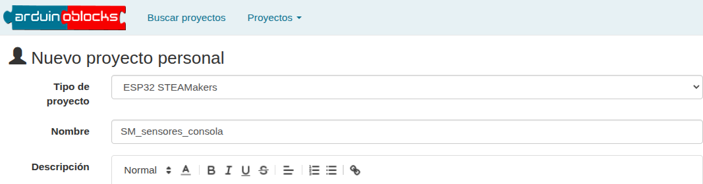
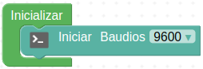
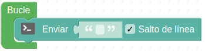
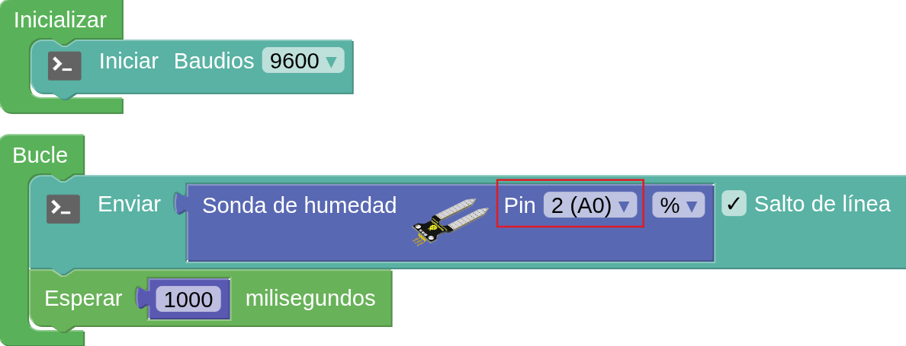
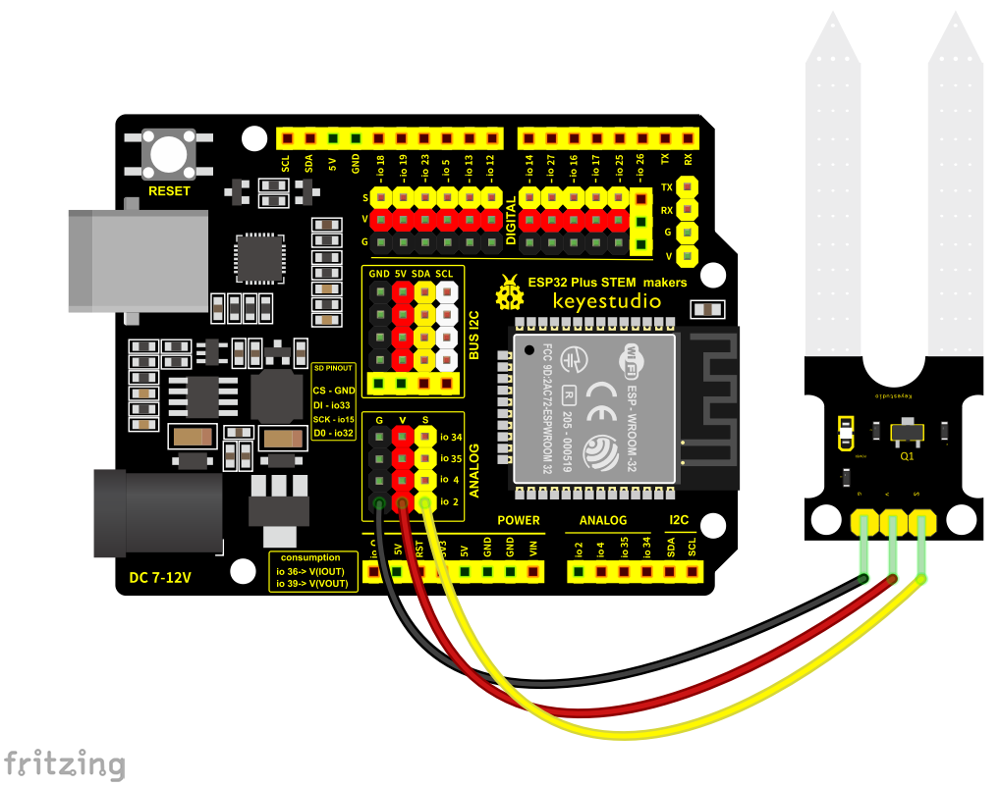
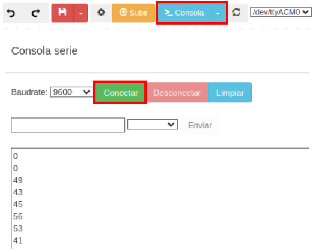
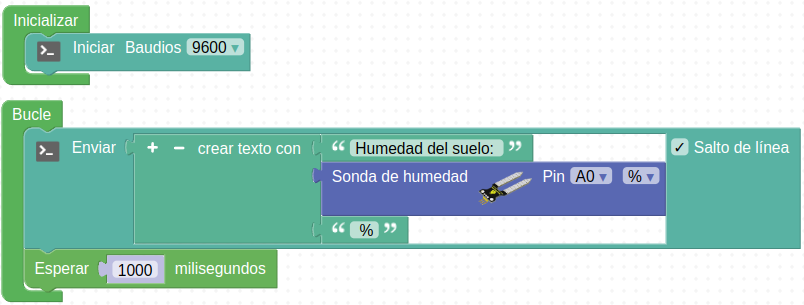
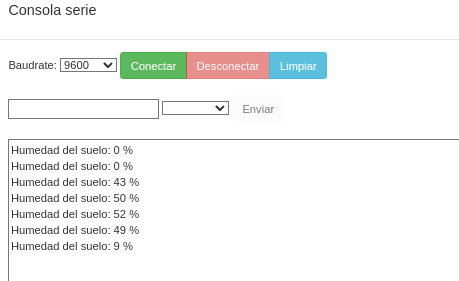

## **Actividad**
En esta guía rápida encontrarás las instrucciones para conectar sensores (de los que se pueden encontrar en los [conjuntos de sensores y actuadores](https://github.com/fgcoca/manual_de_practicas_esp32_steamakers/blob/main/README.md)) en la placa ESP32 STEAMakers y mostrar los datos en la consola del puerto-serie.

!!! danger "Por seguridad"
	Es muy conveniente tener la placa desprovista de cualquier tipo de alimentación mientras realizamos el conexionado de elementos. En caso contrario se pueden producir despefectos irreversibles en cualquiera de los elementos.

### Humedad del suelo

#### **Material necesario**

* Placa ESP32 STEAMakers
* Sensores que puede encontrar en los diversos conjuntos:
    - Del conjunto de primaria (no descrito en el enlace anterior): Colisión (KS0021), seguidores de línea - infrarrojo- (KS0050), humedad suelo (KS0049), PIR (KS0052).
    - Del conjunto de secundaria básico: Iluminación (KS0098), humedad suelo (KS0049), temperatura (KS0022), colisión (KS0021), seguidores de línea -infrarrojo- (KS0050), PIR (KS0052).
    - Del conjunto de secundaria avanzado: Sensor de sonido (KS0035), giroscopio y acelerómetro (KS0170), sensor de CO₂ (KS0457), sensor de humedad y temperatura DHT11 (KS0034), sensor presión barométrica (KS0405).
* Cable GVS o 3 cables dupont hembra-hembra
* Ordenador. Antes de empezar a utilizar la placa STEAMakers, es necesario comprobar que nuestro dispositivo esté listo para trabajar. Encontrarás toda la información en [Antes de](https://fgcoca.github.io/GuiasFundamentales/UNO/contUNO/).

#### **Procedimiento**

**1.** Ejecuta el programa AB-Connector. Recuerda que debe estar en ejecución todo el rato mientras trabajas con Arduinoblocks.

**2.** Ve a ArduinoBlocks, inicia sesión y comienza un nuevo proyecto del tipo “ESP32 STEAMakers”:

  
*Proyecto SM_sensores_consola. Creación*

**3.** En la categoria de "Comunicaciones" busca "Puerto Serie" y coloca en "Inicializar" un bloque "Iniciar baudios 9600".

  
*Proyecto SM_sensores_consola. Iniciar puerto serie*

**4.** En "Bucle" sitúa un bloque "Enviar" dejando activado el salto de línea.

  
*Proyecto SM_sensores_consola. Enviar puerto serie*

**5.** En la categoría “Sensores”, busca el sensor para medir la humedad del suelo (KS0049) y sitúa el bloque correspondiente en el espacio vacío que hay en “Enviar”. Aparece como "Sonda de humedad" y la imagen del sensor. Fíjate que indica a qué pin se debe conectar el sensor. Puedes elegir el pin que desees de los que salen en el desplegable, teniendo en cuenta que el pin que selecciones en el bloque será el que debes utilizar para realizar la conexión (en nuestro caso A0). También puedes elegir entre ver la lectura en porcentaje (%) o en valor absoluto (0…1023). Pon también una espera de un segundo a continuación después del bloque enviar para evitar que haga las lecturas demasiado seguidas.

  
*Proyecto SM_sensores_consola. Programa*

**6.** Conecta el sensor de humedad de suelo a la placa utilizando un cable de tipo GSV o tres cables dupont hembra-hembra. El pin a utilizar será el GPIO02 (A0).

  
*Conexionado*

!!! warning "CUIDADO"
    Si utilizas cables dupont, controla que cada cable conecte los terminales correspondientes de la placa y de la pantalla (GND con GND, VCC con VCC y S con S).

    Si utilizas un conector GSV ten cuidado de respetar el orden de los pines, es decir, que las conexiones son las mismas que con cables individuales.

**7.** Subimos el proyecto a la placa haciendo clic en el botón "Subir". Una vez compilado y subido correctamente el programa, haz clic en "Consola" y después en "Conectar".

  
*Proyecto SM_sensores_consola. Completo - Consola*

Comenzarás a ver valores medidos por el sensor en la consola o terminal serie.

**8.** También se pueden combinar bloques de texto, de la categoria "Texto", con las medidas efectuadas por el sensor. En el ejemplo siguiente se han realizados cambios al respecto:

  
*[Proyecto SM_sensores_consola](../STEAMakers/programas/SM_sensores_consola.abp)*

La consola se verá ahora de la siguiente forma:

  
*Proyecto SM_sensores_consola. Completo - Consola*

