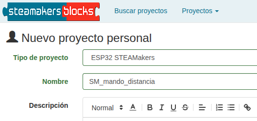

Es conveniente repasar los contenidos explicados en [Emisor y receptor de infrarrojos](https://fgcoca.github.io/GuiasFundamentales/previos/#emisor-y-receptor-de-infrarrojos).

!!! danger "Por seguridad"
    Es muy conveniente tener la placa desprovista de cualquier tipo de alimentación mientras realizamos el conexionado de elementos. En caso contrario se pueden producir despefectos irreversibles en cualquiera de los elementos.

## **Material necesario**

* Placa ESP32 STEAMakers
* mando IR (KS9002)
* Receptor IR (KS0026)
* Cables GVS
* Ordenador. Antes de empezar a utilizar la placa STEAMakers, es necesario comprobar que nuestro dispositivo esté listo para trabajar. Encontrarás toda la información en [Antes de](https://fgcoca.github.io/GuiasFundamentales/UNO/contUNO/).

## **Procedimiento**

**1.** Ejecuta el programa Connector. Recuerda que debe estar en ejecución todo el rato mientras trabajas con steamakersblocks. Iniciamos un nuevo proyecto de tipo "ESP32 STEAMakers".

**2.** Ve a steamakersblocks, inicia sesión y comienza un nuevo proyecto del tipo “ESP32 STEAMakers”:

  
*Proyecto SM_mando_distancia. Creación*

**3.** Desde la categoría “Variables”, crea una nueva variable de tipo texto “codigo_mando” (el código que recibirá del comando es un texto en formato HEX).

  
*Proyecto SM_mando_distancia. Crear variable*

**4.** Sitúa el bloque "Establecer codigo_mando" en el bloque "Bucle".

  
*Proyecto SM_mando_distancia. Bloque Establecer*

**5.** De la categoría “Sensores / Receptor IR”, selecciona el bloque “Receptor de IR (Texto HEX)”, cámbialo al pin 25 (D3) y colócalo como valor de la variable.

  
*Proyecto SM_mando_distancia. Receptor IR*

**6.** A continuación, programarás la placa para que, al pulsar la flecha izquierda del mando, se dibuje una flecha hacia la izquierda en la consola del puerto-serie, mientras que si pulsa la flecha derecha del mando, se dibujará una flecha hacia la derecha. El procedimiento que seguiremos se haría de forma análoga para cada una de las teclas del mando.

**7.** De la categoría “Comunicaciones / Puerto serie”, selecciona el bloque “Iniciar Bauds 115200” y colócalo en el bloque “Inicializar”. A continuación, de la categoría “Lógica”, sitúa un bloque “Si…hacer” en el bloque “Bucle”.

  
*Proyecto SM_mando_distancia. Consola y condicional*

**8.** Lo que harás a continuación es comparar el texto que llega desde el mando con el que recibe el receptor IR. Si estos textos coinciden, se escribe el símbolo correspondiente en la consola del puerto serie. Comienza con la flecha de la izquierda. Después del “sí” del bloque condicional, pon un bloque “igual a” de la categoría “Texto” (recuerda que estamos comparando cadenas de texto en formato HEX) y verifica si el valor de la variable “codigo_mando” que ha recibido el receptor IR desde el mando es una flecha hacia la izquierda. Busca el bloque con el mando en la categoría “Sensores / Receptor IR”, elige el valor “Izquierda” y compáralo con el valor que tenga la variable. Si son iguales, se enviará el texto “<–” a la consola serie. Para ello, ve a la categoría “Comunicaciones / Puerto serie”, elige el bloque “Enviar”, sitúalo después de “Hacer” y dibuja la flecha hacia la izquierda.

  
*Proyecto SM_mando_distancia. Enviar <--*

**9.** Repite el mismo procedimiento con la flecha a la derecha, haciendo los cambios oportunos.

  
*[Proyecto SM_servo. Programa](../STEAMakers/programas/SM_mando_distancia.abp)*

!!! info "IMPORTANTE:"
    El sensor funciona a 5V. comprueba que tienes el interruptor selector de voltaje en la posición correcta:

    

    

    

**10.** Haz clic en “Subir”, asegurándote primero de que tienes el puerto correctamente seleccionado.

  
*Proyecto SM_mando_distancia. Subir*

**11.** Ve a “Consola”, arriba a la derecha, y haz clic en “Conectar” para ver las medidas en la consola del puerto-serie.

  
*Proyecto SM_mando_distancia. Consola*

!!! Failure "**IMPORTANTE:**"
    Puede ocurrir que no te funcione porque tengas seleccionado un valor incorrecto del modelo del mando en el bloque correspondiente. Si fuera el caso, cambie al valor alternativo y vuelva a intentarlo.

    

    

    

