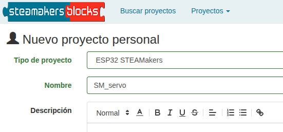
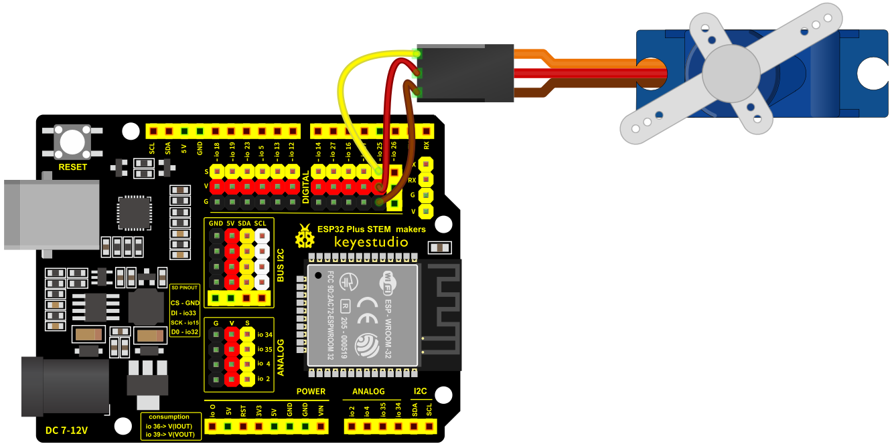
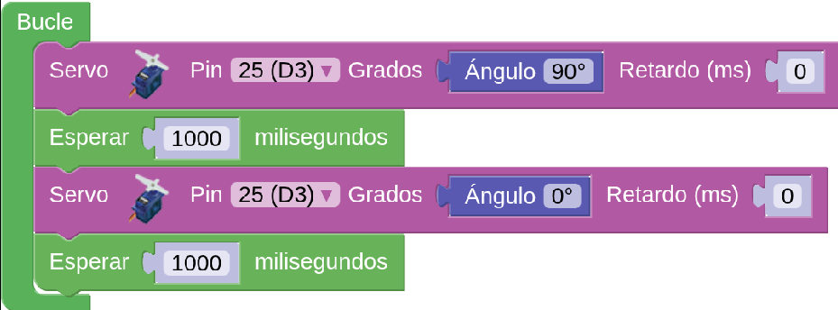
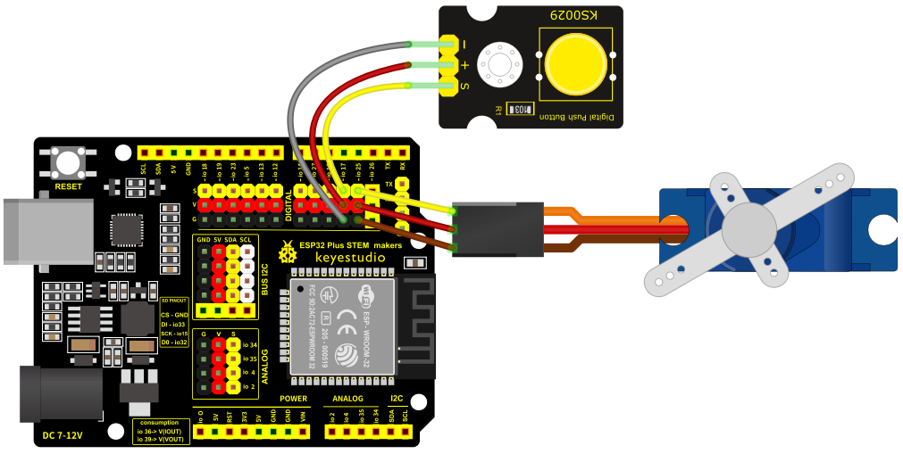
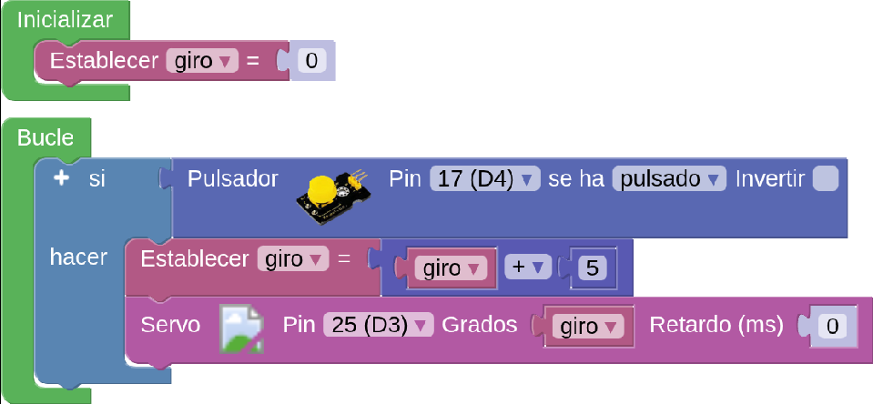
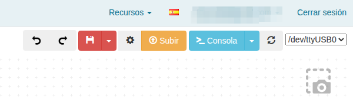

Antes de nada se recomienda repasar los conceptos dados en [Control de un servomotor](https://fgcoca.github.io/GuiasFundamentales/previos/#control-de-un-servomotor) y el uso de las listas de datos.

!!! danger "Por seguridad"
	Es muy conveniente tener la placa desprovista de cualquier tipo de alimentación mientras realizamos el conexionado de elementos. En caso contrario se pueden producir despefectos irreversibles en cualquiera de los elementos.

## **Material necesario**

* Placa ESP32 STEAMakers
* Servomotor 9g negro con rotación de 0 a 180 grados KS0194
* Pulsador táctil capacitivo (KS0031) o de botón (KS0029)
* Cable SVG o 3 cables dupont hembra-hembra
* Ordenador. Antes de empezar a utilizar la placa STEAMakers, es necesario comprobar que nuestro dispositivo esté listo para trabajar. Encontrarás toda la información en [Antes de](https://fgcoca.github.io/GuiasFundamentales/UNO/contUNO/).

## **Procedimiento**

==**INFORMACIÓN**==

!!! info "==**IMPORTANTE**=="
    A partir de esta entrada se comienza a utilizar el nuevo dominio de la aplicación que pasa a denominarse **[steamakersblocks](https://www.steamakersblocks.com/)**, siendo su funcionamiento idéntico al utilizado hasta ahora. El nuevo logotipo es el siguiente:

	

**1.** Ejecuta el programa Connector. Recuerda que debe estar en ejecución todo el rato mientras trabajas con steamakersblocks. Iniciamos un nuevo proyecto de tipo "UNO".

**2.** Ve a steamakersblocks, inicia sesión y comienza un nuevo proyecto del tipo “ESP32 STEAMakers”:

  
*Proyecto SM_servo. Creación*

**3.** Conecta el servomotor a alguno de los pines digitales de la placa (en el ejemplo utilizaremos el pin D3 - IO25), teniendo en cuenta que el cable marrón del servomotor corresponde a la G -tierra- (color negro de la placa), el cable rojo del servomotor corresponde a la V -voltaje- (color rojo de la placa) y el cable naranja del servomotor corresponde al S -señal- (color amarillo de la placa).

  
*Proyecto SM_servo. Conexión*

**4.** A continuación, de la categoría “Motores / Servo” selecciona el bloque “Servo” y colócalo en el bloque “Bucle”. Selecciona el pin al que tienes conectado el servomotor e indica el ángulo de giro y si deseaa que tenga algún retraso antes de hacerlo.

  
*Proyecto SM_servo. Bloque servo*

**5.** En este ejemplo, para ver el servomotor en funcionamiento, harás que el servomotor gire un ángulo de 90º, pasado un segundo volverá a su posición inicial (0º) y pasado otro segundo volverá a girar 90º. Esto lo hará de manera continua: Dentro del bloque “Bucle” coloca el bloque servo con un giro de 90º. A continuación, de la categoría “Tiempo”, pon un bloque de espera de 1000 milisegundos, seguido de un bloque de giro del servo a 0º y de una nueva espera de un segundo, tal y como se muestra en la imagen:

  
*Proyecto SM_servo. Giro 90_0_90*

**6.** Haz clic en el botón "Subir" situado arriba a la derecha.

**7.** De esta forma, estás trabajando con el servomotor con giros con ángulos definidos. Si deseas que el ángulo de giro dependa de algún otro parámetro, puedes crear una variable y hacer que el ángulo de giro dependa del valor de esta variable. Por ejemplo, si deseas que el servomotor gire 5º cada vez que toques un pulsador, puede hacer lo siguiente: Conecta un pulsador (KS0029) a un pin de la placa (en el ejemplo, lo conectamos al pin D4 - IO17 en mi caso) teniendo especial cuidado que el orden de los pines sea el correcto.

  
*Proyecto SM_servo. Conexión*

**8.** Desde la categoría “Variables”, crea una variable del tipo número (en el ejemplo le llamamos “giro”). A continuación, sitúa el bloque “Establecer gir=0” dentro del bloque “Inicializar”, de esta manera, el valor inicial de la variable será 0. Pon un bloque de la categoría “Lógica” “Si…hacer” en el bloque “Bucle”. A continuación del “sí”, coloca el bloque “Pulsador” que encontrará en la categoría “Sensores” y elige el pin donde lo tengas conectado. A continuación del “hacer”, actualizarás el valor de la variable “giro”, sumándole 5º. Para ello, de la categoría “Variables”, elige el bloque “Establecer giro” y, a continuación, de la categoría “Matemáticas” elija un bloque de suma y dentro pon la variable “giro” más 5. Por último, haz que el servomotor gire según el valor de esta variable, tal y como se muestra en la imagen:

  
*[Proyecto SM_servo. Programa](../STEAMakers/programas/SM_servo.abp)*

**9.** Haz clic en el botón "Subir" situado arriba a la derecha.

  
*Proyecto SM_servo. Subir*

