Una alternativa que considero aconsejable para iniciarse en la programación con la placa Keyestudio UNO es acompañarla del escudo TdR STEAM. Es mas, es por donde aconsejaría comenzar.

En la web [Retos con TdR-STEAM y keyestudio UNO](https://fgcoca.github.io/TdR-STEAM-and_UNO/) tienes disponible toda una colección de retos y actividades realizadas con este conjunto de placas y algún hardware adicional.

La mayoría de retos y actividades se dan solucionadas para facilitar el aprendizaje,  pero se reta al lector a solucionar cada caso por si mismo y solamente recurrir a la solución cuando resulte imprescindible.

Reproduzco aquí la información básica del escudo.

## **TdR STEAM**
El escudo tiene el aspecto que vemos en la imagen siguiente:

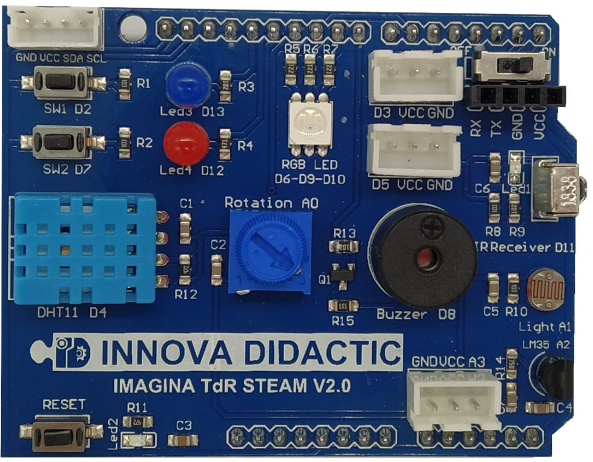  
*TdR STEAM*

Las partes que lo componen las vemos en la imagen siguiente y en los apartados subsiguientes se describen:

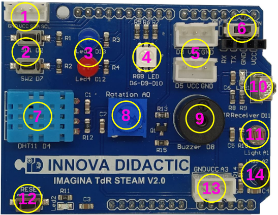  
*Partes de la TdR STEAM*

### <b>1. Interfaz I2C</b>
Interfaz I2C o IIC conectados a los pines VCC, GND, SDA (A4) y SCL (A5). El pin A4 corresponde con SDA (Serial DAta) y es por donde se transmiten los datos en la comunicación I2C. El pin A5 es SCL (Serial CLock) donde está la señal de sincronización o reloj de la comunicación I2C.

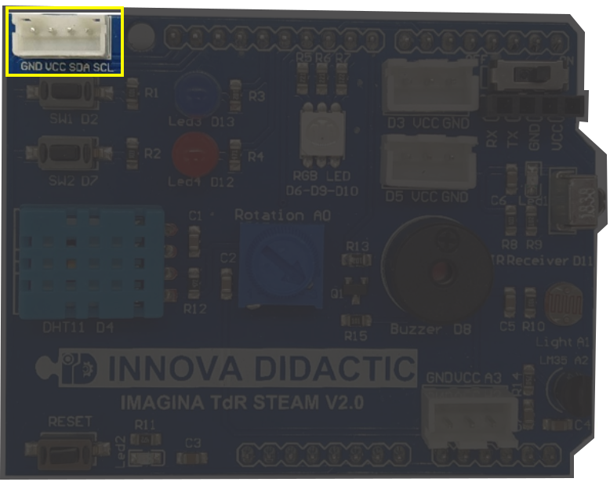  
*Conector I2C en la TdR STEAM*

### <b>2. Pulsadores</b>
Los pulsadores SW1 y SW2 se conectan a D2 y D7 respectivamente y se configuran como entradas digitales con sus correspondientes resistencias de polarización que hacen que cuando están en reposo pongan su entrada digital correspondiente a "0" (cero lógico) y que se ponga a "1" (uno lógico) cuando los accionemos.

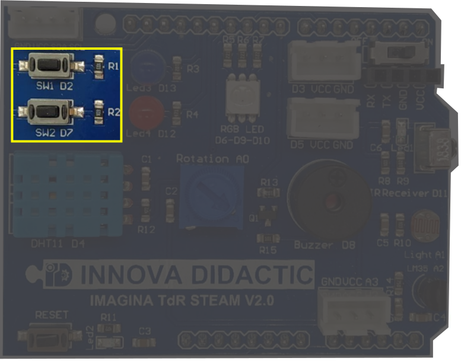  
*Pulsadores SW1 y SW2*

### <b>3. Diodos LED</b>
Diodos LED Azul (LED3) y Rojo (LED4) conectados a D13 y D12 respectivamente. Configurados como salidas con su resistencia limitadora.

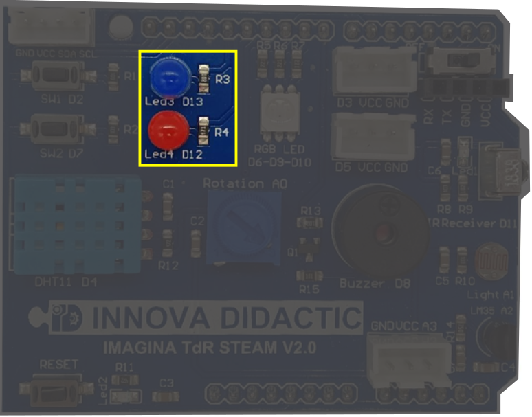  
*Diodos LED*

### <b>4. Led RGB</b>
El Led RGB o neopixel de la placa es del tipo 5050 conectado a los pines D6 (Red), D9 (Green) y D10(Blue). Estos tres pines son PWM y nos van a permitir regular su intensidad.

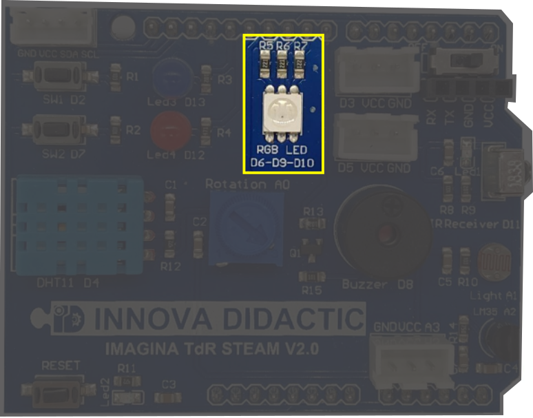  
*Led RGB*

### <b>5. Conectores E/S digital</b>
Son dos conectores para Entradas/Salidas digitales dotados de alimentación y conectados a los pines D3 y D5. A estos conectores podemos colocarles sensores externos.

  
*Led RGB*

### <b>6. Comunicaciones serie</b>
Conector de comunicaciones Bluetooth y WiFi con conmutado (Swich On/Off) conectado a los pines D0 (Rx) y D1 (Tx).

El puerto de comunicaciones serie nos permite conectar módulos Bluetooth o WiFi. Este puerto va equipado con un conmutador para poder conectarlo o desconectarlo ya que utiliza los mismos pines Rx/Tx que se utilizan para comunicarse con el ordenador. Si vamos a subir firmware a la placa debe estar en posición OFF y si vamos a trabajar con Bluetooth o WiFi en posición ON.

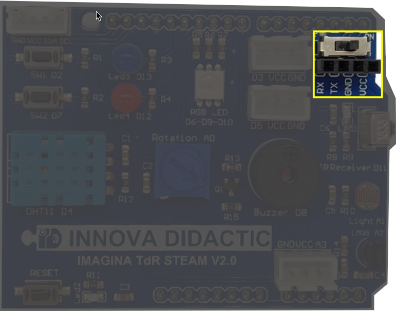  
*Comunicaciones serie*

### <b>7. DHT11</b>
Sensor digital de Temperatura y Humedad DHT11 conectado como entrada a D4.

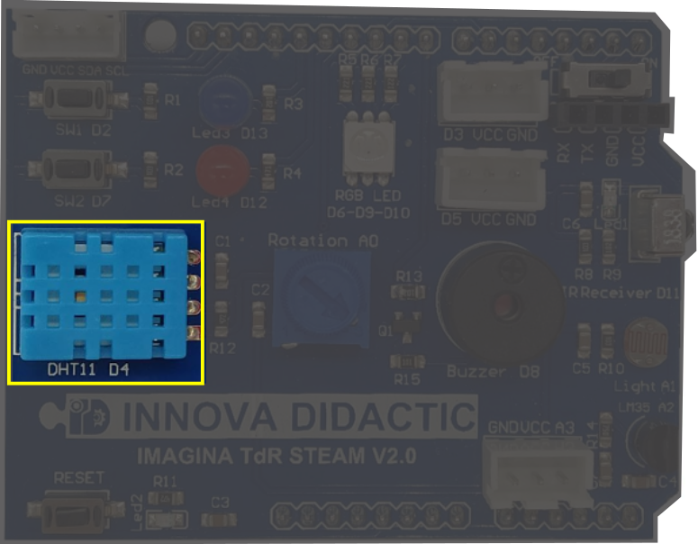  
*DHT11*

### <b>8. Potenciómetro</b>
Potenciómetro giratorio de 270º conectado como entrada analógica al pin A0.

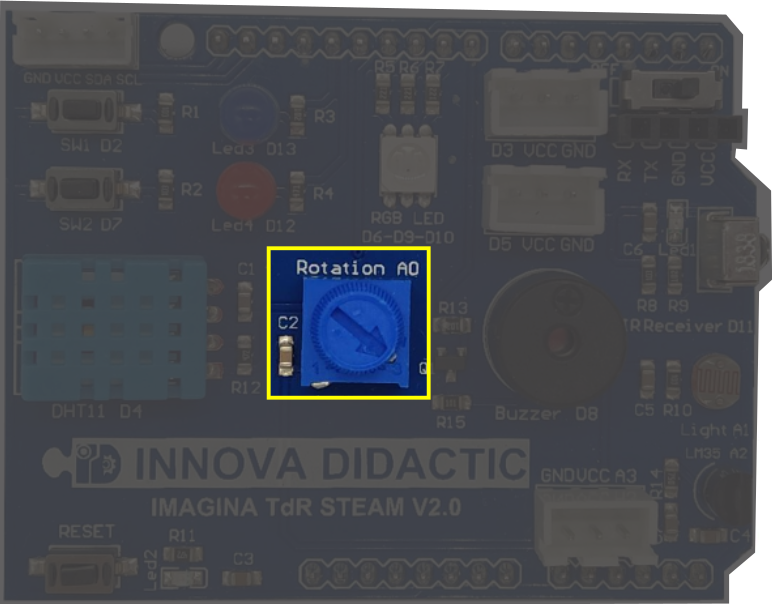  
*Potenciómetro*

### <b>9. Buzzer</b>
El zumbador Piezoeléctrico o buzzer es un pequeño altavoz conectado a la salida digital D8.

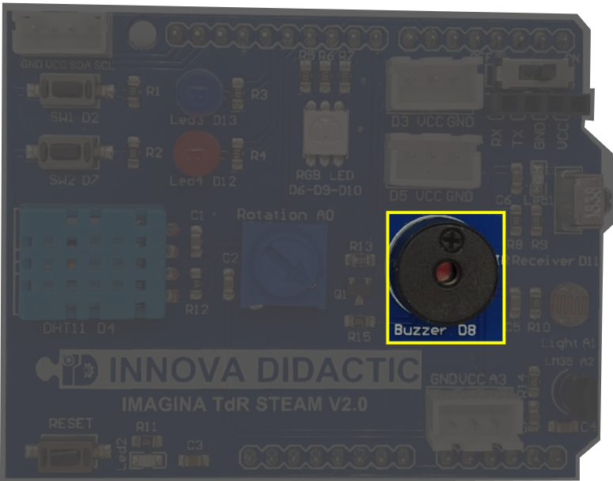  
*Buzzer*

### <b>10. Receptor IR</b>
Diodo receptor de infrarrojos (IR) conectado a la entrada digital D11.

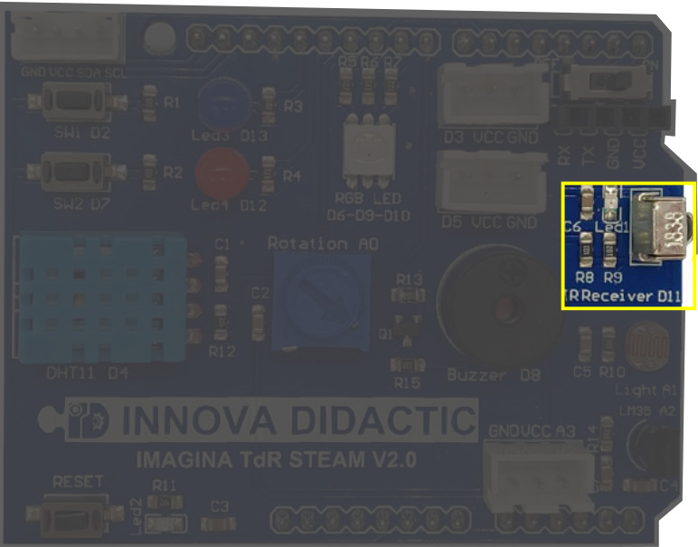  
*Receptor IR*

### <b>11. LDR</b>
Sensor de luminosidad o resistencia LDR conectada al pin analógico A1.

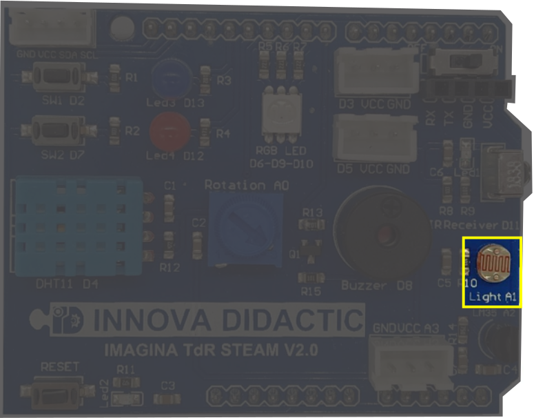  
*LDR*

### <b>12. Reset</b>
Botón de Reset conectado directamente a la entrada de reset de la placa Keyestudio UNO. Sirve para inicializar el funcionamiento del conjunto.

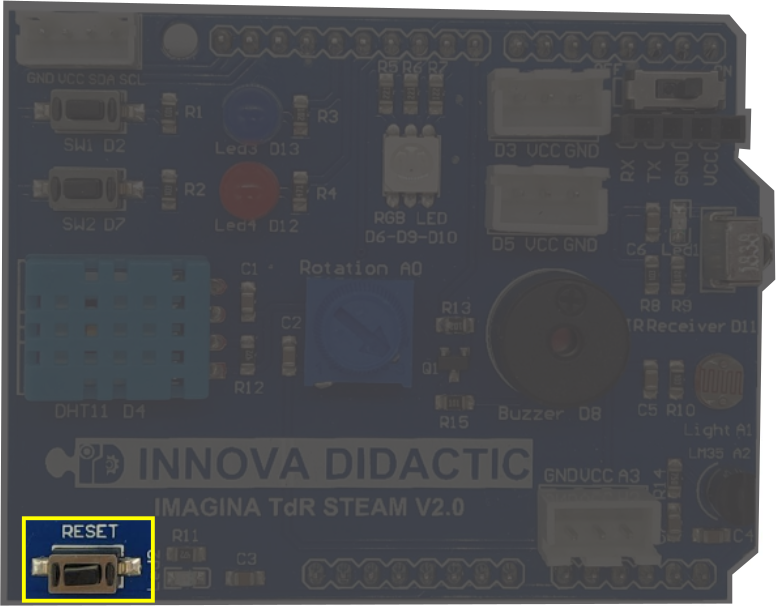  
*Reset*

### <b>13. Entrada analógica</b>
Conector para entrada analógica desde sensor externo conectado al pin A3.

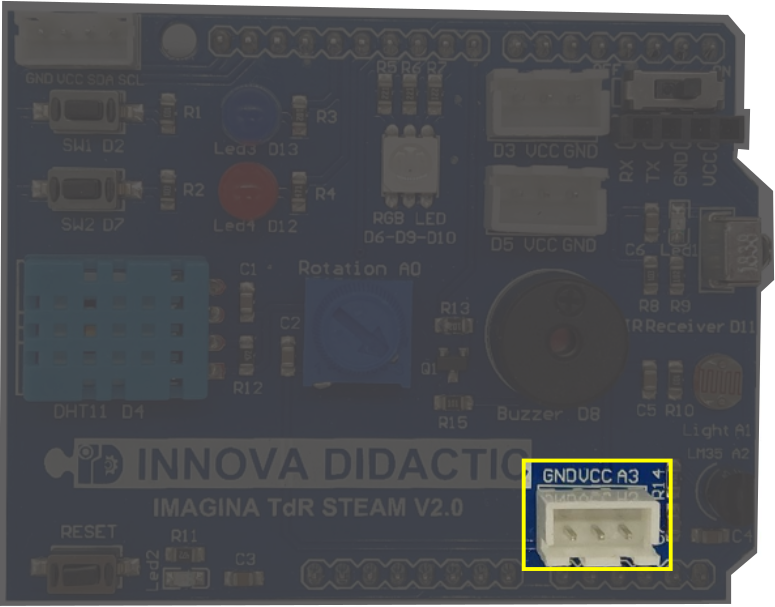  
*Entrada analógica*

### <b>14. LM35</b>
Sensor de temperatura (LM35) conectado al pin analógico A2.

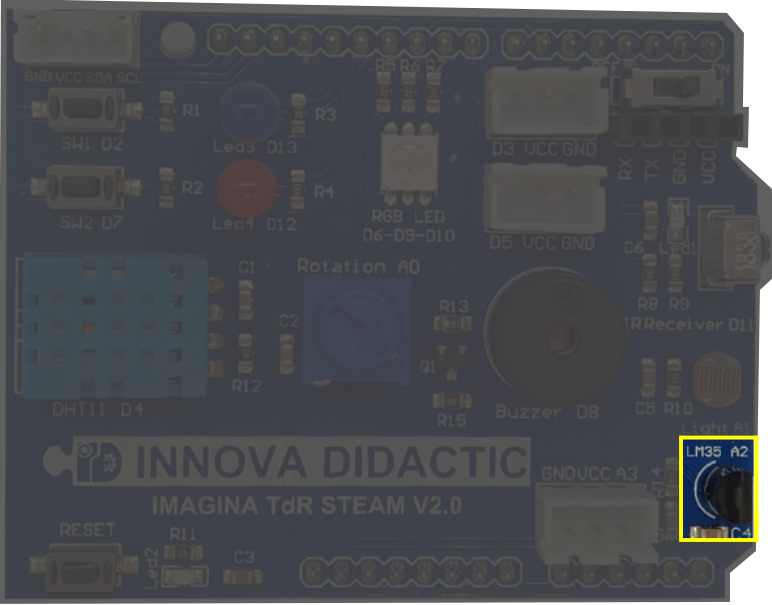  
*LM35*

