## **Actividad**
En esta guía rápida encontrarás las instrucciones para enviar los datos recogidos de sensores a la plataforma web ThingSpeak.

!!! danger "Por seguridad"
	Es muy conveniente tener la placa desprovista de cualquier tipo de alimentación mientras realizamos el conexionado de elementos. En caso contrario se pueden producir despefectos irreversibles en cualquiera de los elementos.

### Material necesario

* Placa ESP32 STEAMakers
* Los sensores que se usarán en este ejemplo son: temperatura y humedad DHT-11 (KS0034) y CO₂ (KS0457)
* Cable GVS o 3 cables dupont hembra-hembra
* Cable I2C o 4 cables dupont hembra-hembra
* Ordenador. Antes de empezar a utilizar la placa STEAMakers, es necesario comprobar que nuestro dispositivo esté listo para trabajar. Encontrarás toda la información en [Antes de](https://fgcoca.github.io/GuiasFundamentales/UNO/contUNO/).

#### **Procedimiento**

**1.** Ejecuta el programa AB-Connector. Recuerda que debe estar en ejecución todo el rato mientras trabajas con Arduinoblocks.

**2.** Ve a ArduinoBlocks, inicia sesión y comienza un nuevo proyecto del tipo “ESP32 STEAMakers”:

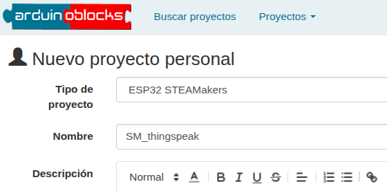  
*Proyecto SM_thingspeak. Creación*

**3.** Para empezar, debes conectar la placa a una red WiFi. Si no sabes cómo hacerlo, consulta el [apartado 3.3.24 del Free Book](https://docs.google.com/document/u/1/d/e/2PACX-1vQSrOKHpbLQHVbGFdAvp7DcndoftoHDI20nvwGMaxu_7bGc1bUCmi4U6DZrJWRSudc2iXBg43QMuzCT/pub). A continuación, de la categoría “Comunicaciones / WiFi / IoT / MQTT Client”, selecciona el bloque “MQTT Iniciar” y sitúalo en el bloque “Inicializar”. Asegurate de que la dirección del broker es “mqtt3.thingspeak.com”

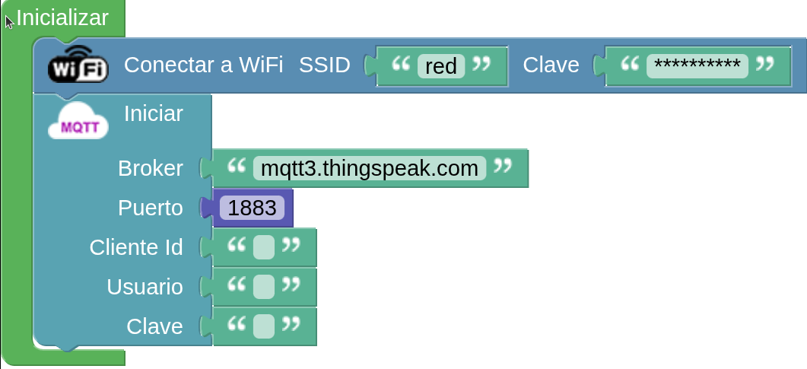  
*Proyecto SM_thingspeak. Iniciar WiFi y MQTT*

**4.** Para rellenar los datos que faltan en el bloque, es necesario obtenerlos de ThingSpeak. Si no te has registrado nunca, regístrate para utilizar cuentas libres y gratuitas hciendo clic en el botón “Get Started For Free” de la página inicial del Thingspeak:

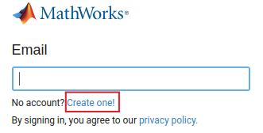  
*Proyecto SM_thingspeak. Resgistro Thingspeak*

**5.** Una vez esté dentro de la plataforma con tu usuario, ve a “Channels/My Channels”, haz clic sobre el botón “New Channel”, pónle un nombre y guárdalo.

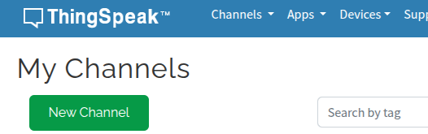  
*Proyecto SM_wifi. Nuevo canal*

**6.** A continuación, debes añadir el dispositivo. Ve a “Devices/MQTT” y haz clic en el botón “Add a new device”.

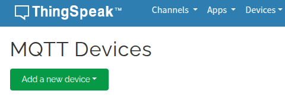  
*Proyecto SM_thingspeak. Añadir nuevo dispositivo*

**7.** Pon un nombre al dispositivo, selecciona el canal que has creado anteriormente del desplegable y haz clic en el botón “Add Channel” y por último haz clic en el botón “Add Device”

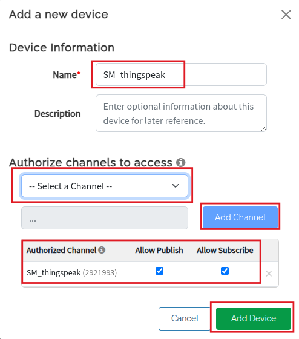  
*Proyecto SM_wifi. Añadir nuevo dispositivo*

**8.** Una vez tengas el dispositivo creado, te aparecerán los datos que necesitas para el bloque “MQTT Iniciar”: Cliente ID, Username y Password. Copia cada dato en el campo correspondiente:

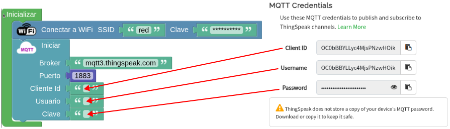  
*Proyecto SM_thingspeak. Credenciales*

**9.** Ahora ya tienes ThingSpeak preparado para empezar a enviar datos de los sensores. En este ejemplo, conectaremos el sensor DHT-11 (KS0034) que nos permitirá obtener datos de temperatura y humedad y el sensor de CO₂ (KS0457).

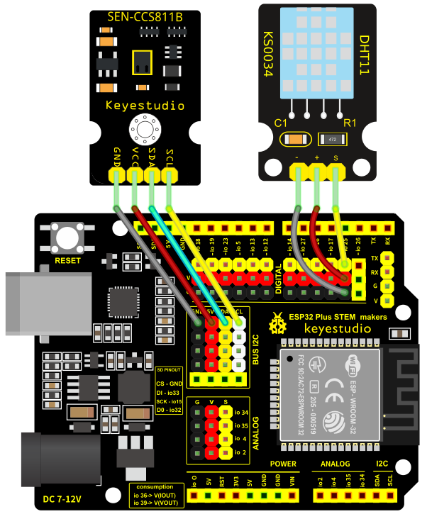  
*Proyecto SM_thingspeak. Conexiones*

Desde la categoría “Comunicaciones / Wifi / IoT / MQTT Client” selecciona el bloque “MQTT Publicar Tema… Valor…”. En el espacio “tema”, sitúa el bloque “ThingSpeak multiPublish Channel ID”, poniendo la ID de tu canal (la encontrará en ThingSpeak). En el apartado "Valor" pondremos las lecturas recogidas por los sensores. Coloca el bloque “ThingSpeak multipublish Values” y después un bloque “ThingSpeak multipublish Field” para cada campo (temperatura, humedad y CO₂).

En este caso, en el primer bloque, seleccionará Field1 (temperatura). Ve al apartado “Sensores” y busca el sensor DHT-11, escogiendo el pin correcto donde está conectado el sector (en el ejemplo, está conectado al PIN IO25 - D3) y selecciona la opción “Temperatura”.

En el segundo bloque, seleccione Field2 (humedad); en este campo se publicará el dato de humedad del mismo sensor DHT-11.

Para el tercer bloque selecciona Field3 (CO₂) y deberás buscar el sensor de CO₂ dentro de la categoría “Sensores” y colocar el bloque.

Por último, coloca todo lo anterior dentro de un bloque de la categoría “Tiempo” que haga que la publicación se ejecute cada 20 segundos, tal y como se muestra en la siguiente imagen:

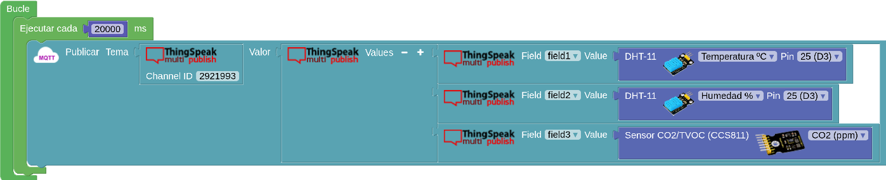  
*Proyecto SM_thingspeak. Publicación*

**10.** Para añadir nuevos campos a ThingSpeak, ve al apartado “Channel Settings” y selecciona tantos campos como te hagan falta.

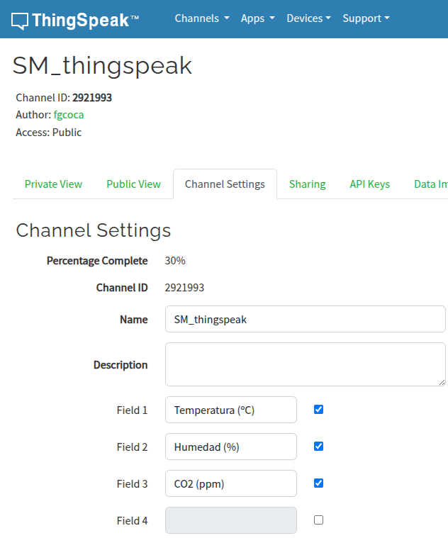  
*Proyecto SM_thingspeak. Campos en Thingspeak*

**11.** El programa completo listo para su descarga es:

  
*[Proyecto SM_thingspeak. Programa completo](../STEAMakers/programas/SM_thingspeak.abp)*

**12.** Vuelve al entorno arduinoblocks y haz clic en el botón "Subir", en la parte superior derecha. Tras unas cuantas iteraciones del bucle Thingspeak tendrá este aspecto:

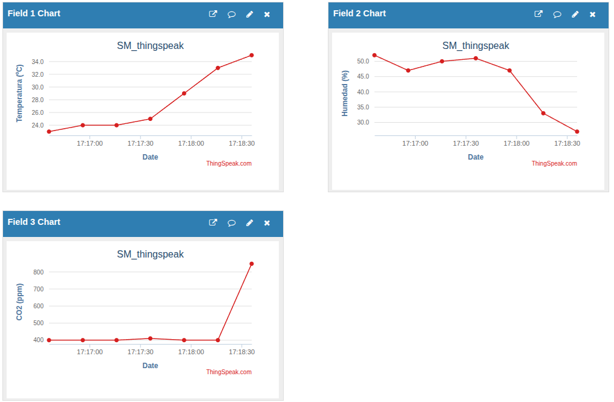  
*Proyecto SM_thingspeak. Gráficos Thingspeak*

