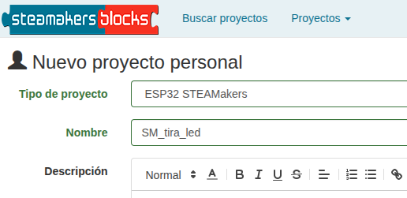
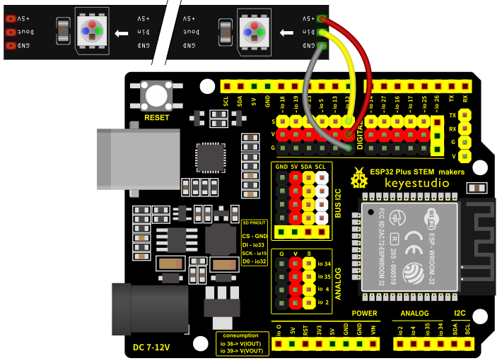
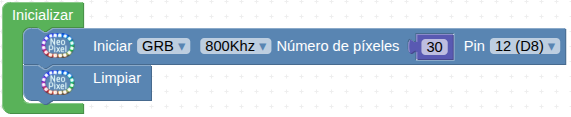
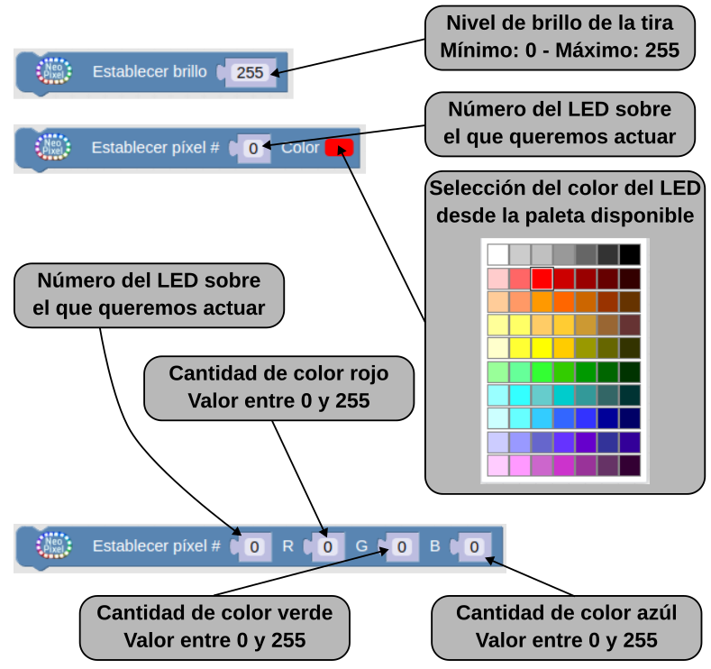
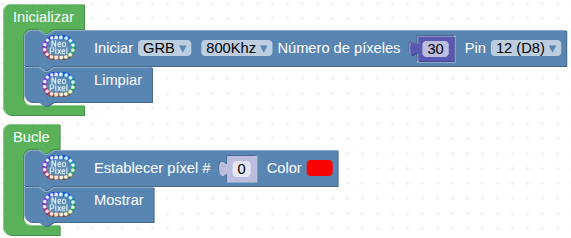
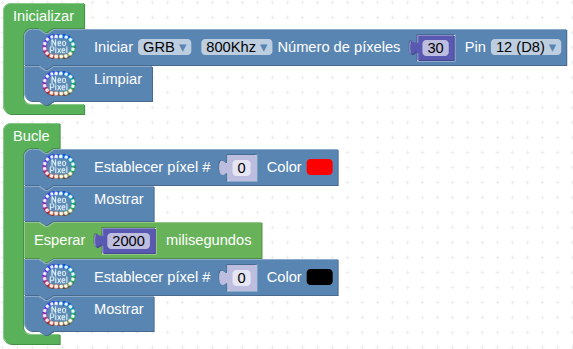
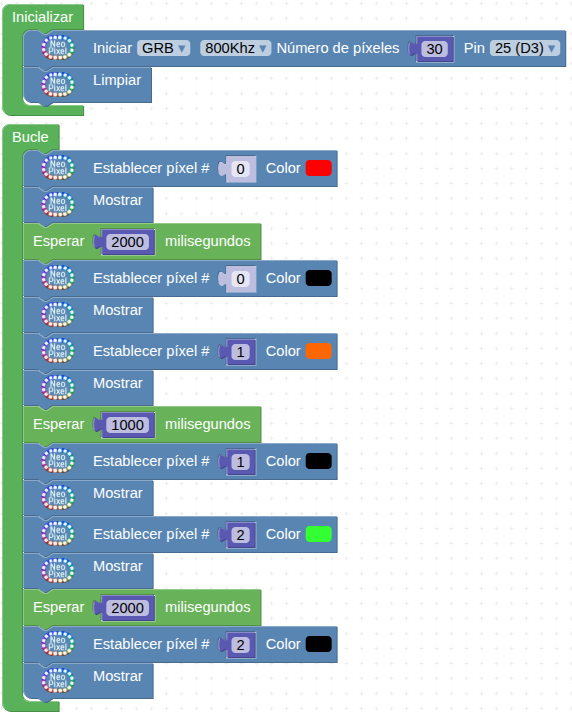
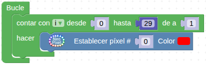
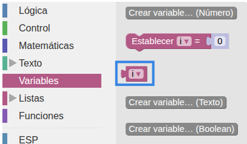
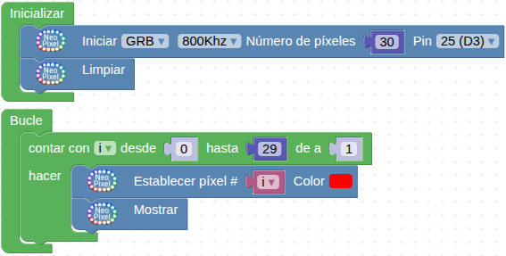

Para saber mas sobre tiras de LEDs RGB direccionables puedes consultar la web [Tiras y matrices de LEDs](https://fgcoca.github.io/tiras-y-matrices-de-LEDs/).

!!! danger "Por seguridad"
    Es muy conveniente tener la placa desprovista de cualquier tipo de alimentación mientras realizamos el conexionado de elementos. En caso contrario se pueden producir despefectos irreversibles en cualquiera de los elementos.

## **Material necesario**

* Placa ESP32 STEAMakers
* Tira de 30 LEDs
* Cable SVG o 3 cables dupont hembra-hembra
* Ordenador. Antes de empezar a utilizar la placa STEAMakers, es necesario comprobar que nuestro dispositivo esté listo para trabajar. Encontrarás toda la información en [Antes de](https://fgcoca.github.io/GuiasFundamentales/UNO/contUNO/).

## **Procedimiento**

**1.** Ejecuta el programa Connector. Recuerda que debe estar en ejecución todo el rato mientras trabajas con steamakersblocks. Iniciamos un nuevo proyecto de tipo "ESP32 STEAMakers".

**2.** Ve a steamakersblocks, inicia sesión y comienza un nuevo proyecto del tipo “ESP32 STEAMakers”:

  
*Proyecto SM_tira_led. Creación*

**3.** Incorpora el cable adaptador que encontrarás en el conjunto en el extremo de la tira de leds. A continuación, conecta la tira de leds a alguno de los puertos de la placa. En el ejemplo utilizamos el pin 12 (D8).

  
*Proyecto SM_tira_led. Conexionado*

**4.** La tira de LEDs debe inicializarse. Para ello, ve a la categoría “Visualización / NeoPixel” y coloca el bloque “Iniciar GRB 800Khz…”. A continuación, cambia el número de píxeles a 30, que son los que tienen las tiras de LEDs de los conjuntos y selecciona el pin al que tengas conectada la tira. Bajo el bloque “Iniciar”, coloca un bloque “Limpiar”, para asegurar que todos los LEDs estén apagados cuando se inicie el programa.

  
*Proyecto SM_tira_led. Iniciar tira*

**5.** En esta misma categoría verás que hay varias opciones para trabajar con los LEDs de forma individual. Puedes establecer el color, el brillo, etc. Ten en cuenta que la numeración comienza en el “0”, por lo que los LEDs van desde el 0 hasta el 29.

  
*Bloques de Neopixels*

**6.** Si quieres iluminar un píxel en concreto de un color, sólo tiene que situar el bloque “Establecer píxel #…” en el bloque “Bucle”, indicar el número del led que deseas iluminar y a continuación poner el bloque “Mostrar”.

  
*[Proyecto SM_tira_led](../STEAMakers/programas/SM_tira_led.abp)*

**7.** Haz clic en “Subir”, asegurándote primero de que tienes el puerto correctamente seleccionado.

  
*Proyecto SM_tira_led. Subir*

Éste sería el funcionamiento más básico, pero a continuación proponemos algún ejemplo más complejo.

### Semáforo
**1.** En este ejemplo haremos que el primer led muestre el color rojo durante 2 segundos, a continuación se apagará el primer led y el segundo led mostrará el color naranja durante 1 segundo. Por último, se apagará el segundo led y el tercero mostrará el color verde durante 2 segundos, como si fuera un semáforo. Comienza por inicializar la tira y a continuación, de la categoría “Visualización / NeoPixel”, elige el bloque “Establecer píxel #”, define que sea el píxel 0 y el color rojo. A continuación, coloque el bloque “Mostrar”, seguido de una pausa de 2000 milisegundos (de la categoría “Tiempo”). Para apagar el led, coloca un bloque “Establecer píxel # 0” y elige el color negro, seguido del bloque “Mostrar”.

  
*Proyecto SM_semaforo*

**2.** A continuación, enciende el segundo led (led #1). Para ello, elige el bloque “Establecer píxel #1”, y establce el color naranja, seguido de un bloque “Mostrar” y una pausa de 1000 milisegundos. Para apagar el píxel, coloca el bloque “Establecer píxel #1” en color negro y seguidamente ilumina el píxel 3 de color verde, situando el bloque “Establecer píxel #2” con el color verde, seguido de un bloque “Mostrar”. Para terminar, pon una espera de 2000 milisegundos y apaga el píxel 2 con el bloque “Establecer píxel #2” de color negro, seguido del bloque “Mostrar”.

  
*[Proyecto SM_semaforo](../STEAMakers/programas/SM_semaforo.abp)*

**3.** Sube el programa a la placa y comprueba el funcionamiento.

### Iluminar todos de un color
**1.** Comienza como siempre por inicializar la tira de LEDs.

**2.** Para iluminar todos los LEDs de un mismo color, podríamos ir situando bloques del tipo “Establecer píxel #…”, seguidos del bloque “Mostrar” para cada uno de los 30 LEDs, lo que resultaría largo y bastante infructuoso,  pero existen alternativas para hacerlo de forma más rápida y eficiente. En este ejemplo, utilizarás un bloque de la categoría “Control” para hacerlo.

**3.** Ve a la categoría “Control” y selecciona el bloque “Contar con y desde 0 hasta 9 en incrementos de 1”. Cambia el valor 9 por 29, para que la variable “i” considere desde el led 0 (primer led de la tira) hasta el led 29 (último led de la tira). A continuación, de la categoría “Visualización / NeoPixel”, coloca un bloque “Establecer píxel #…”.

  
*Proyecto SM_iluminar_todos_un_color*

**4.** Para llenar el vacío donde va el número del led, ve a la Categoría “Variables”; encontrarás la variable “i”.

  
*Proyecto SM_iluminar_todos_un_color*

Sitúala en el espacio del número del led y a continuación sitúa también el bloque “Mostrar”.

  
*[Proyecto SM_iluminar_todos_un_color](../STEAMakers/programas/SM_iluminar_todos_un_color.abp)*

**5.** Sube el programa a la placa y comprueba el funcionamiento.
