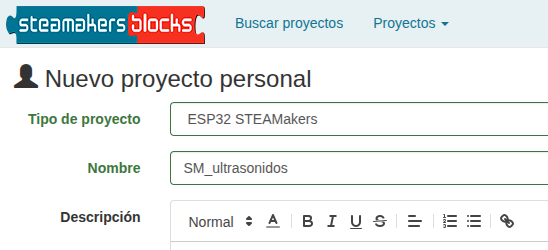
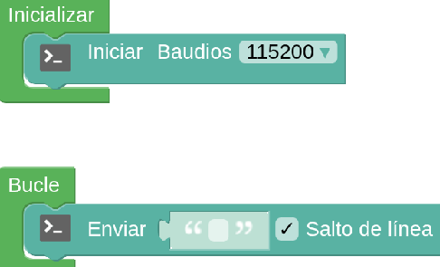
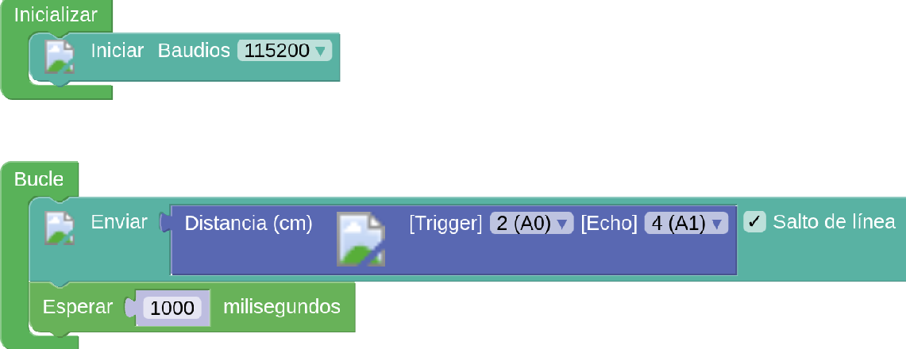
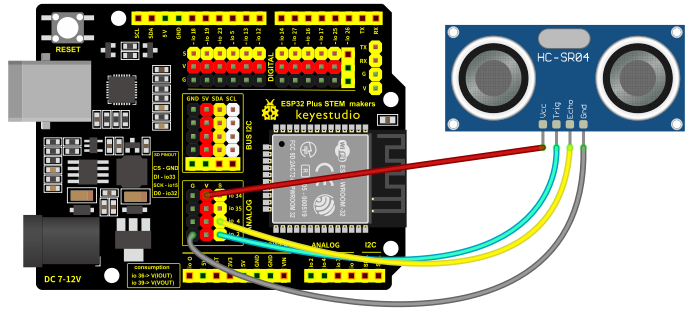
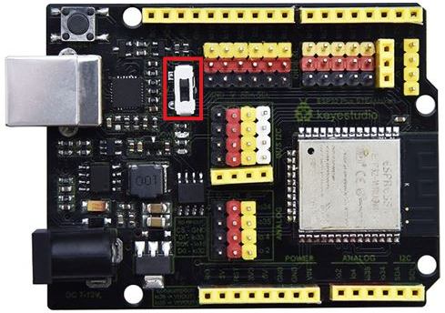
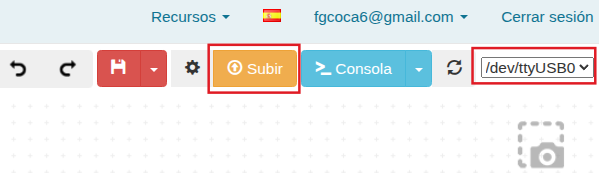
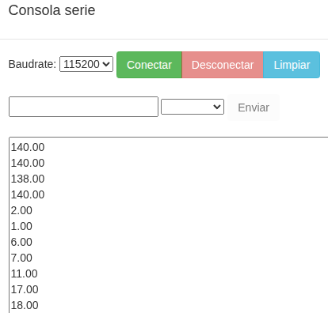
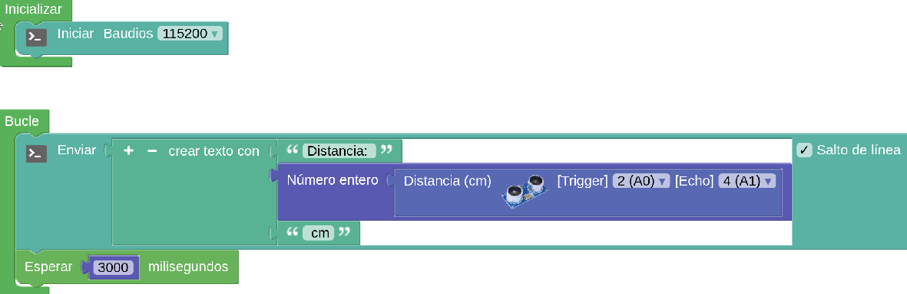
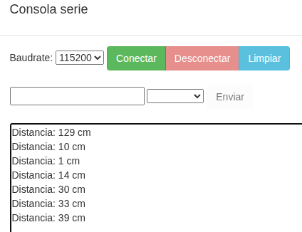

Antes de nada se recomienda repasar los conceptos dados en [El sensor de ultrasonidos HC-SR04](https://fgcoca.github.io/GuiasFundamentales/previos/#el-sensor-de-ultrasonidos-hc-sr04).

!!! danger "Por seguridad"
    Es muy conveniente tener la placa desprovista de cualquier tipo de alimentación mientras realizamos el conexionado de elementos. En caso contrario se pueden producir despefectos irreversibles en cualquiera de los elementos.

## **Material necesario**

* Placa ESP32 STEAMakers
* Sensor de ultrasonidos HC-SR04
* 4 cables dupont hembra-hembra
* Ordenador. Antes de empezar a utilizar la placa STEAMakers, es necesario comprobar que nuestro dispositivo esté listo para trabajar. Encontrarás toda la información en [Antes de](https://fgcoca.github.io/GuiasFundamentales/UNO/contUNO/).

## **Procedimiento**

**1.** Ejecuta el programa Connector. Recuerda que debe estar en ejecución todo el rato mientras trabajas con steamakersblocks. Iniciamos un nuevo proyecto de tipo "UNO".

**2.** Ve a steamakersblocks, inicia sesión y comienza un nuevo proyecto del tipo “ESP32 STEAMakers”:

  
*Proyecto SM_ultrasonidos. Creación*

**3.** En steamakersblocks, lo que harás será ver en la consola del puerto-serie las distancias que mide el sensor de ultrasonidos. Para empezar, en el bloque “Inicializar”, sitúa el bloque “Iniciar Bauds 115200” que encontrarás en la categoría “Comunicaciones / Puerto Serie y en el bloque “Bucle”, pon el bloque “Enviar …” que encontrará en la misma categoría.

  
*Proyecto SM_ultrasonidos. Bloques iniciales*

**4.** A continuación, de la categoría “Sensores”, sitúa el bloque “Distancia (cm)”, que corresponde al sensor de ultrasonidos en el espacio en blanco del bloque “Enviar” que has utilizado anteriormente. Cambia el valor de [Trigger] al pin IO02 (A0) y el de [Echo] al pin IO04(A1).

**5.** Así conseguirías enviar las lecturas del sensor a la consola del puerto-serie de forma continua y no tendrías apenas tiempo de leerlas. Para evitar esto, pondremos una pausa de un segundo (1000 milisegundos) al final del bucle. Ve a la categoría “Tiempo” y coloque un bloque “Esperar 1000 milisegundos” después de enviar.

  
*[Proyecto SM_ultrasonidos. Programa](../STEAMakers/programas/SM_ultrasonidos_P.abp)*

**6.** Conexión del sensor a la placa. Verás que el sensor de ultrasonidos dispone de 4 pines de conexión: VCC, Trig, Echo, Gnd. Conecta el sensor a la placa tal y como se muestra en la imagen:

  
*Proyecto SM_ultrasonidos. Conexionado*

Hemos conectado el pin “Trig” del sensor al pin 02 de la placa y el pin “Echo” al pin 04, para hacerlos coincidir con los que indica el bloque que vamos a utilizar en steamakersblocks. Si quieres puedes utilizar otros pines para realizar las conexiones, haciendo los cambios correspondientes en el bloque en steamakersblocks.

!!! info "IMPORTANTE:"
    El sensor funciona a 5V. comprueba que tienes el interruptor selector de voltaje en la posición correcta:

    

    

    

**7.** Haz clic en “Subir”, asegurándote primero de que tienes el puerto correctamente seleccionado.

  
*Proyecto SM_ultrasonidos. Subir*

**8.** Ve a “Consola”, arriba a la derecha, y haz clic en “Conectar” para ver las medidas en la consola del puerto-serie.

  
*Proyecto SM_ultrasonidos. Consola*

**9.** Se puede mejorar la presentación en la consola añadiendo texto antes y después de la medida y también quitar los decimales de la misma, como vemos en esta segunda versión del programa.

  
*[Proyecto SM_ultrasonidos. Programa mejorado](../STEAMakers/programas/SM_ultrasonidos_Pmejor.abp)*

La consola se ve ahora así:

  
*Proyecto SM_ultrasonidos. Consola del programa mejorado*

