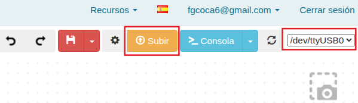

## **Actividad**
En esta guía rápida encontrarás las instrucciones para conectar la placa a una red WiFi.

!!! danger "Por seguridad"
	Es muy conveniente tener la placa desprovista de cualquier tipo de alimentación mientras realizamos el conexionado de elementos. En caso contrario se pueden producir despefectos irreversibles en cualquiera de los elementos.

### Material necesario

* Placa ESP32 STEAMakers
* Ordenador. Antes de empezar a utilizar la placa STEAMakers, es necesario comprobar que nuestro dispositivo esté listo para trabajar. Encontrarás toda la información en [Antes de](https://fgcoca.github.io/GuiasFundamentales/UNO/contUNO/).

#### **Procedimiento**

**1.** Ejecuta el programa AB-Connector. Recuerda que debe estar en ejecución todo el rato mientras trabajas con Arduinoblocks.

**2.** Ve a ArduinoBlocks, inicia sesión y comienza un nuevo proyecto del tipo “ESP32 STEAMakers”:

  
*Proyecto SM_wifi. Creación*

**3.** En la categoria de "Comunicaciones/WiFi/IoT" busca "Conectar a WiFi" y colocalo en "Inicializar".

  
*Proyecto SM_wifi. Iniciar WiFi*

**4.** Escribe el SSID (Service Set Identifier) y la contraseña de la red WiFi.

  
*Proyecto SM_wifi. Iniciar WiFi*

**5.** Para comprobar que la placa se ha conectado correctamente a la red wifi se puede hacer desde la consola. Situa el bloque “Iniciar Baudios 115200" de la categoría “Comunicaciones / Puerto serie” en el bloque “Inicializar”. En el bloque “Bucle” pon un bloque condicional “Si…hacer” de la categoría “Lógica”. A continuación, de la categoría “Comunicaciones/WiFi/IoT” pon el bloque “¿Está conectado?” en la primera parte del condicional (si…) y en la segunda parte del condicional (hacer) pon el bloque “Enviar” que encontrarás en la categoría “Comunicaciones / Puerto serie”. En el espacio en blanco escribe “conectado”. Por último, coloca el bloque “Esperar para siempre (fin)” que encontrarás en la categoría “Tiempo”; con esto hará que el mensaje se muestre una sola vez en la consola.

  
*Proyecto SM_wifi. Programa*

**6.** Haz clic en “Subir”, asegurándote primero de que tienes el puerto correctamente seleccionado.

  
*Proyecto SM_wifi. Subir*

**7.** Una vez le salga el mensaje que el programa se ha compilado correctamente, haz clic en “Consola” y después en “Conectar”. Ajusta la velocidad y si no se muestra el mensaje pulsa el botón de reset de la placa.

  
*Proyecto SM_wifi. Consola*

**8.** También se puede ver la IP de la conexión enviándola a la consola con el bloque “Dirección IP”, de la categoría “Comunicaciones/WiFi/IoT”

  
*[Proyecto SM_wifi](../STEAMakers/programas/SM_wifi.abp)*

La consola se verá ahora de la siguiente forma:

  
*Proyecto SM_wifi. Consola*

