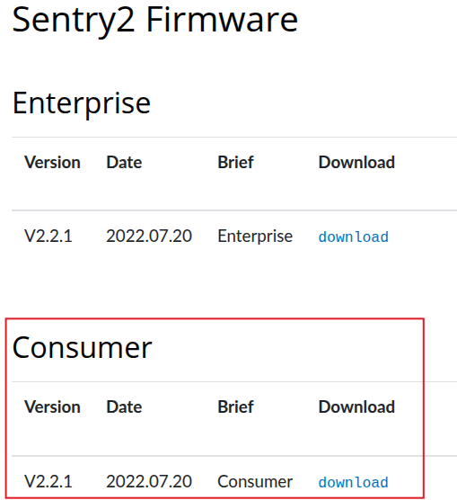
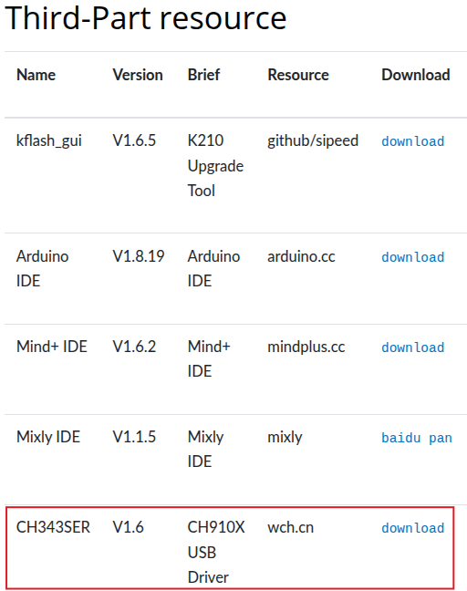
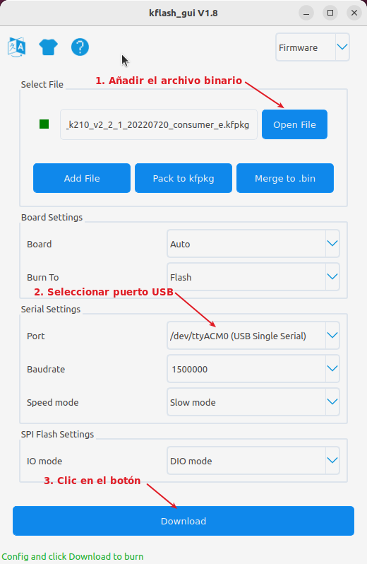

## **Descarga**
Encontrarás la última versión del firmware en la:

[Página de descarga del firmware](https://tosee.readthedocs.io/en/latest/Sentry2/Download/index.html#chapter-download-firmware-index)

Donde se debe hacer clic sobre **download** de la versión "Consumer":

  

En el caso actual se descarga el archivo:

"*vs_main_sentry_k210_v2_2_1_20220720_consumer_e.kfpkg*"

## **Instrucciones**
**&#x24f5;** Para el flasheo del firmware tenemos que descargar e instalar el software adecuado. En este caso se va a utilizar [kflash v1.8.1](https://github.com/sipeed/kflash_gui/releases) de [Sipeed](https://sipeed.com/), una plataforma AIoT de hardware de código abierto. Para el trabajo en Linux utilizaré, por ejemplo, un AppImage.

**&#x24f6;** Si resulta necesario se debe descargar e instalar los [drivers USB](https://tosee.readthedocs.io/en/latest/Sentry2/Download/index.html#chapter-download-third-party-index).

  

**&#x24f7;** Una vez completados los pasos anteriores es momento de conectar Sentry2 al ordenador mediante un cable USB tipo C.

**&#x24f8;** Ejecuta kflas_gui y completa según la imagen siguiente:

  

Después de hacer clic en el botón "Descargar", verá la imagen que se muestra a continuación y, a continuación, haga clic verticalmente en el joystick durante unos 2 segundos para iniciar la descarga.