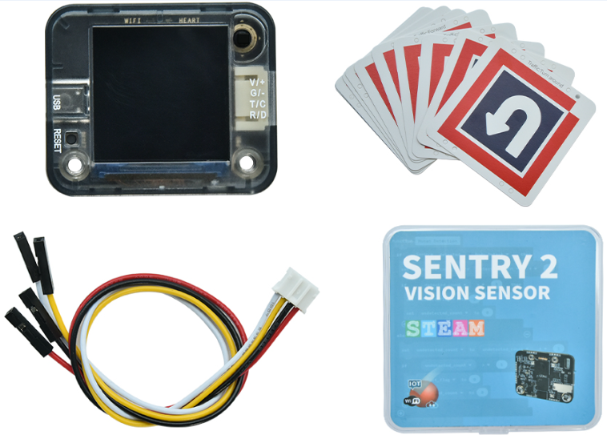
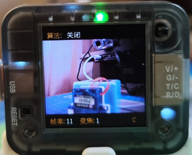
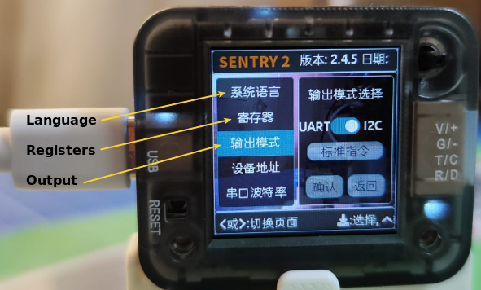
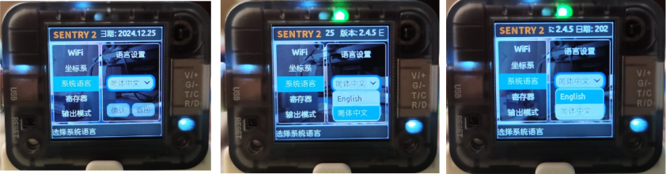
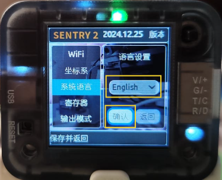
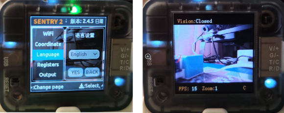

En este apartado se describe de forma básica la cámara de visión artificial Sentry2 en base a:

* Documentación [Tosee Intelligent Document](https://tosee.readthedocs.io/en/latest/index.html).
* Documento creado por Toni Hortal titulado Sentry 2 que ha compartido conmigo y que he tenido muy presente para elaborar esta guía.

  

## **Inicio rápido**

  

1. Conecta la Sentry2 al ordenador mediante un cable USB-C.
2. Mueve el joystick hacia arriba o hacia abajo para cambiar entre pantallas de la cámara.
3. Dirige Sentry2 hacia el objeto que deseas reconocer.

Es muy posible que la primera vez que se conecta la Sentry2 se inicie con el idioma configurado en Chino, tal y como vemos en la imagen siguiente:

  

Lo más habitual será que tengamos la necesidad de configurarla para idioma Inglés, para lo que describimos el proceso.

Acciona la palanca hacia la derecha hasta encontrar la pantalla siguiente:

  

Con el cursor arriba/abajo desplazate hasta situarte sobre la opción "Language" y pulsa el botón que incorpora la palanca. La pantalla estará como vemos en la imagen de la izquierda. Si vuelves a pulsar se despliegan los idiomas disponibles (Inglés y Chino) y con el cursor hay que seleccionar Inglés y pulsar el botón.

  

Con Inglés seleccionado pulsa el botón y con el cursor sitúate según se observa en la imagen siguiente:

  

El aspecto final si todo es correcto será el de la imagen izquierda y la pantalla inicial la de la derecha:

  

## **Seguridad**
A la hora de utilizar el sensor de visión artificial Sentry2, es fundamental seguir unas pautas de seguridad para garantizar tanto el buen funcionamiento del mismo como la seguridad de los usuarios. A continuación, se exponen varios consejos clave:

* **Evita cortocircuitos:** Hay que asegurarse de que el sensor no esté alimentado cuando se manipulan materiales y herramientas conductores de electricidad. Esto ayuda a prevenir cortocircuitos inesperados que podrían dañarlo o causar accidentes.
* **Manipula con cuidado:** Los pines donde se conectan componentes diversos son delicados y pueden romperse o doblarse si se aplica una gran fuerza o palanca. Hay que ser especialmente prudente en la manipulación y evitar caídas o golpes que puedan afectar a la placa.
* **Controla la temperatura:** Es necesario tener en cuenta que la temperatura de la placa puede aumentar considerablemente durante el uso prolongado. Algunos componentes pueden calentarse y es importante evitar el contacto directo para prevenir quemaduras o daños en la placa.
* **Revisa regularmente los componentes:** Es conveniente comprobar regularmente el estado de los componentes electrónicos y las conexiones. Los conectores sueltos o desgastados pueden causar un mal funcionamiento de la placa o ser un riesgo de seguridad.
* **Usa adecuadamente la alimentación:** Utiliza sólo las fuentes de alimentación recomendadas. Un voltaje incorrecto puede dañar la placa o incluso ser peligroso, ya que puede producir sobrecalentamiento de componentes o cortocircuitos.
* **Mantén la placa en un entorno seco y limpio:** La presencia de líquidos o polvo puede causar cortocircuitos o dañar los componentes de la placa.

Siguiendo estos consejos, podrás disfrutar de una experiencia segura y enriquecedora con la placa programable.
