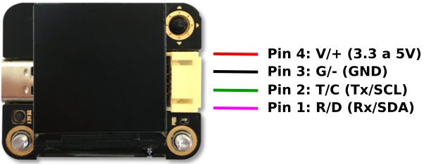

## **Resumen**
- Processador → K210, 400 MHz
- Lente de la cámera → 200 píxels
- Voltage de funcionamiento → 3,3 - 5 V
- Dimensiones → 42 x 36 x 12 mm
- Pantalla → TFT-IPS de 1,3”
- Resolución de la pantalla → 240 x 240 píxels

Sus principales funcionalidades son:

- Reconocimiento de colores
- Detección de bloques de color
- Reconocimiento de etiquetas
- Aprendizaje
- Detección de líneas
- Reconocimiento de tarjetas
- Reconocimiento de caras

Sentry2 es un sensor de visión artificial diseñado con un procesador de red neuronal RISC-V de 64 bits avanzado K210.

  

Este dispositivo integra varios algoritmos de visión avanzados que pueden satisfacer las necesidades básicas de procesamiento de imágenes. El chip ESP8285-WiFi integrado se puede programar desde el IDE de Arduino para realizar reconocimiento en línea, transmisión de imágenes, AIoT (Artificial Intelligence of Things) y otras aplicaciones. El ESP8285 se puede utilizar como controlador para el K210, lo que facilita la programación de IA sin necesidad de un controlador externo.

Aplicaciones: robots, coches inteligentes, diseño creativo, educación STEAM, creadores, juguetes, AIoT.

En la imagen vemos los nombre y situación de sus principales partes:

  

- **LED**: representa diferentes estados de detección.
- **Cámara**: captura de imágenes. El usuario puede ajustar el nivel de zoom, el balance de blancos, el brillo, la saturación y otros parámetros de la cámara.
- **Antena WiFi**: el chip WiFi ESP8285 puede realizar reconocimiento en línea, transmisión de imágenes y aplicaciones AIoT.
- **Procesador K210**: un potente MCU (Multipoint Control Unit) con unidad de procesamiento de red neuronal, procesador RISC-V de doble núcleo y 64 bits.
- **Ranura microSD**: admite tarjetas microSD (también conocidas como TF, que significa TransFlash) para el almacenamiento de imágenes (nota: no se admiten todos los tipos de tarjetas SD, solo con comunicación SPI).
- **USB**: el chip USB-UART integrado puede comunicarse y controlarse directamente con el ordenador, así como actualizar el firmware.

!!! Danger "**PRECAUCIÓN**"
    La alimentación USB se conecta al puerto de comunicación de 4 pines. **Nunca se deben usar dos alimentaciones al mismo tiempo**.

- **Pantalla LCD**: pantalla TFT-ISP (Thin Film Transistor - In-Plane Switching) a color con alta definición y amplio ángulo de visión.
- **Joystick**: para interactuar con la interfaz de usuario, admite control en cinco direcciones (arriba, abajo, izquierda, derecha, pulsar).
- **Reset o botón de reinicio**: reinicia el hardware.
- **Puerto de salida**: puerto de salida de 4 pines para comunicación, compatible con los modos UART e I2C.

## **Parámetros del hardware**

|Parámetro|Valor|Unidad|Notas|
|---|:-:|:-:|---|
|Tensión|3.3 a 5|V|No alimentar por USB e I2C/UART simultaneamente|
|Corriente|150|mA|Alimentada a 5V y en modo reconocimiento de caras|
|Tamaño|40x32x12.5|mm|Sin carcasa|
|Peso|15|g|Sin carcasa|
|Distancia entre agujeros de montaje|32|mm||
|Diámetro agujeros de montaje|3|mm||
|Tipo de cámara|CMOS|||
|Resolución cámara|200|pixel||
|FPS|25|fps||
|Campo de visión FOV|68|º||
|Tipo|TFT-ISP LCD|||
|Tamaño|1.3|Pulgadas||
|Resolución pantalla|240x240|pixel||

## **Algoritmos de visión**
Sentry 2 integra una variedad de algoritmos de visión sin conexión para reconocer objetos sin red, y el chip WiFi ESP8285 integrado puede realizar la función de reconocimiento de imágenes basada en nube.

|ID|Nombre| |Información|
|:-:|---|---|---|
|1|Color|Colores (*)|Devuelve el valor R (rojo), G (verde), B (azul) y su etiqueta en cada región. Hasta 25 regiones|
|2|Blob|Bloques de color (*)|Detecta un bloque de color especificado. Admite la selección de bloques de color negro, blanco, rojo, verde, azul y amarillo a la vez|
|3|Apriltat|Etiquetas April|Admite las familias Apriltag 16H5, 25H9, 36H11. Hasta 25 etiquetas|
|4|Line|Líneas (*)|Encuentra líneas y devuelve sus puntos finales y grados. Admite de 1 a 5 líneas|
|5|Learning|Aprendizaje|Entrena objetos y los categoriza. Hasta 15 modelos|
|6|Card|Tajetas (tráfico)|Identifica patrones de tarjetas especiales, incluidas 10 tarjetas de tráfico|
|7|Face|Caras|Detección y reconocimiento facial que admite la detección de máscaras. Hasta 15 caras|
|8|20Class|Objetos comunes|Clasifica 20 objetos comunes como gato, coche, etc|
|9|QRCode|Códigos QR|Reconocimientos de código QR sencillo. No disponible en la versión comercial|
|10|Custom|Personalizar|Algoritmos personalizados que se ejecutan en el chip WiFi ESP8255 incorporado|
|11|Motion|Movimiento|Determina si hay zonas en movimiento en la imagen. No disponible en la versión comercial|

!!! Note "(*)"
    Los algoritmos **Colores**, **Bloques de color** y **Líneas** se pueden abrir simultáneamente con el resto de algoritmos, mientras que el resto ^^NO se pueden abrir a la vez entre sí^^, pero SÍ que se pueden abrir a la vez que los 3 citados.

    Por ejemplo, podríamos abrir simultáneamente **Colores**, **Líneas** y **Caras**, pero NO **Colores**, **Tarjetas** y **Caras**.

## **Cómo se utiliza**
Sentry2 se puede conectar a un controlador a través del puerto de salida (ver imagen siguiente) o a un ordenador mediante un cable USB. El puerto de salida se puede configurar en modo UART o I2C y también es posible modificar la dirección del dispositivo y la velocidad de transmisión.

Desde el enlace se pueden [descargar](https://tosee.readthedocs.io/en/latest/Sentry2/Download/index.html#chapter-download-index): Controladores, firmware, manuales y recursos de terceros.

!!! Danger "**PRECAUCIÓN:**"
    ¡El puerto USB y el puerto de comunicación no se pueden alimentar al mismo tiempo!

## **Definición de los pines del puerto de salida**
Para la conexión entre la placa controladora y el sensor Sentry2 resultará útil la información de pines del conector de salida:

  

|Pines|Modo UART|Modo I2C|
|:-:|:-:|:-:|
|1|Rx|SDA|
|2|Tx|SCL|
|3|GND|GND|
|4|VCC|VCC|

!!! Danger "**ATENCIÓN:**"
    Cuando se inserta el cable USB, este puerto puede suministrar energía a dispositivos externos.
    
    
<b>Este puerto NO puede conectarse directamente a una fuente de alimentación, no se puede acceder al sistema de 3,3V.</b>

## **Conexionado**
Veamos en primer lugar como conectar el sensor de visión IA a una placa ESP32 STEAMakers.

### **Modo UART**

  

En modo UART debes asegurarte de:

* La conexión Tx - Rx entre la placa y Sentry2 está cruzada. Sentry2 Rx → Tx placa y Sentry2 Tx → Rx placa.
* Dado que los pines RX y TX de STEAMakers son utilizados para la carga del firmware, es necesario desconectar las conexiones Rx y Tx durante la carga del programa. Se recomienda utilizar el modo I2C.

### **Modo I2C ESP32 STEAMakers**

  

### **Modo I2C ESP32 micro:STEAMakers**

  

!!! Note "NOTA:"
    Si quieres utilizar el puerto serie por software, puedes especificar otros puertos de entrada/salida. Para más detalles, mira el SoftSerialExample en el IDE de Arduino.
