Antes de comenzar se recomienda encarecidamente leer los contenidos anteriores relativos a Sentry2.

  

## **Introducción**
Aunque podemos programar la cámara de visión artificial Sentry 2 con el IDE de Arduino (C++) o con MicroPython tienes más información, mayoritariamente en chino, en:

* [https://tosee.readthedocs.io/zh/latest/Common/Arduino/index.html](https://tosee.readthedocs.io/zh/latest/Common/Arduino/index.html)
* y en [https://tosee.readthedocs.io/zh/latest/Sentry2/microPython/index.html](https://tosee.readthedocs.io/zh/latest/Sentry2/microPython/index.html)
* así como con [Mixly](https://tosee.readthedocs.io/zh/latest/Sentry2/Mixly/index.html), [Mind+](https://tosee.readthedocs.io/zh/latest/Sentry2/MindPlus/index.html), [MakeCode](https://tosee.readthedocs.io/zh/latest/Sentry2/MakeCode/index.html) o [Scratch](https://www.bilibili.com/video/BV19h4y1g72X/).

**[STEAMakersBlocks](https://www.steamakersblocks.com/)** facilita su programación con bloques que permiten:

* iniciar el dispositivo
* establecer el algoritmo de visión (escogiendo uno de los 8 tipos disponibles)
* establecer el número máximo de resultados esperados
* establecer el zoom de la cámara (entre 1 y 5)
* obtener el número de resultados
* obtener, para cada resultado, sus valores (coordenadas, tamaños e identificación)
* identificar la imagen obtenida en función del color, del tipo de tarjeta o del objeto

Los bloques disponibles son:

  

### **Bloque Iniciar**

  

Podemos conectar a nuestra placa microcontroladora hasta 4 cámaras Sentry 2, y con este bloque podemos seleccionar las direcciones individuales del bus I2C.

Es el primer bloque que utilizaremos siempre, concretamente dentro del blog **Inicializar**.

### **Establecer algoritmo**

  

Con este bloque escogeremos el algoritmo de visión que queremos utilizar, de entre los 8 disponibles:

  

Es el segundo bloque que utilizaremos siempre, también dentro del bloque **Inicializar**, aunque podemos utilizarlo en cualquier otro lugar del programa si queremos cambiar el algoritmo de visión.

Para más información sobre cada algoritmo, aquí tienes los enlaces:

* [ID:1 Color](https://fgcoca.github.io/GuiasFundamentales/Sentry2/vision/#id1-color)
* [ID:2 Blob (bloques de color)](https://fgcoca.github.io/GuiasFundamentales/Sentry2/vision/#id2-blob-bloques-de-color)
* [ID:3 Apriltag (etiquetas)](https://fgcoca.github.io/GuiasFundamentales/Sentry2/vision/#id3-apriltag-etiquetas)
* [ID:4 Line (lineas)](https://fgcoca.github.io/GuiasFundamentales/Sentry2/vision/#id4-line-lineas)
* [ID:5 Learning (aprendizaje)](https://fgcoca.github.io/GuiasFundamentales/Sentry2/vision/#id5-learning-aprendizaje)
* [ID:6 Card (tarjeta)](https://fgcoca.github.io/GuiasFundamentales/Sentry2/vision/#id6-card-tarjeta)
* [ID:7 Face (Caras)](https://fgcoca.github.io/GuiasFundamentales/Sentry2/vision/#id7-face-caras)
* [ID:8 20Class (objetos)](https://fgcoca.github.io/GuiasFundamentales/Sentry2/vision/#id8-20class-objetos)

### **Establecer máximo número de resultados**

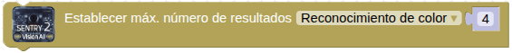  

Generalmente estableceremos este valor a 1, pero puede interesarnos, en algunos casos, obtener más resultados.

### **Establecer zoom**

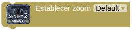  

Aumentar el zoom hará que el objeto sea mayor, pero el campo de visión será más pequeño y verás menos. Reducir el zoom hará que el objeto sea menor, pero el campo de visión será mayor y te permitirá ver más.

También puedes cambiar el zoom con el joystick de la cámara:

* Acercar (zoom in) → pulsación larga hacia arriba
* Alejar (zoom out) → pulsación larga hacia abajo

Admite de 1 a 5 niveles de ajuste:

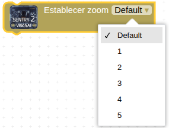  

### **Número de resultados del algoritmo**

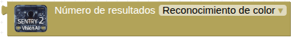  

Nos permite confirmar si se han obtenido resultados al aplicar el algoritmo seleccionado, concretando su número. Lo utilizaremos dentro de un bloque **+ si … hacer …** o de un bloque **+ si … hacer … si no …**, básicamente para comprobar si hay algún resultado al aplicar el algoritmo de visión.

### **Obtener los valores de los resultados del algoritmo**

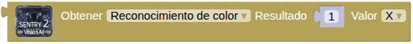  

Cada algoritmo de visión devuelve 5 valores para cada resultado, que son (excepto para los algoritmos de reconocimiento de color, detección de líneas y aprendizaje profundo):

· coordenada X  
· coordenada Y  
· ancho  
· altura  
· identificación de la etiqueta → valor numérico

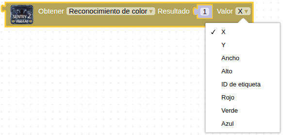  

El algoritmo de reconocimiento de color devuelve estos 4 valores para cada resultado:

· rojo (entre 0 y 255)  
· verde (entre 0 y 255)  
· azul (entre 0 y 255)  
· identificación de la etiqueta (**negro**, **blanco**, **rojo**, **verde**, **azul**, **amarillo**, **desconocido**) → 1, 2 , 3, 4, 5, 6, 0

Tienes toda la información en [ID: 1 → Color](https://fgcoca.github.io/GuiasFundamentales/Sentry2/vision/#id1-color)

El algoritmo de detección de líneas devuelve estos 5 valores para cada resultado:

· coordenada X del punto final de la línea (superior)  
· coordenada Y del punto final de la línea (superior)  
· coordenada X del punto inicial de la línea (inferior) → es la opción Anchura del desplegable  
· coordenada Y del punto inicial de la línea (inferior) → es la opción Altura del desplegable  
· grados de la línea → es la opción ID de etiqueta del desplegable

Tienes toda la información en ID: [4 → Line (líneas)](https://fgcoca.github.io/GuiasFundamentales/Sentry2/vision/#id4-line-lineas)

El algoritmo de aprendizaje profundo devuelve estos 5 valores para cada resultado:

· fijo, 160  
· fijo, 120  
· fijo, 224  
· fijo, 224  
· identificación de la etiqueta de la imagen aprendida

por lo que nosotros sólo utilizaremos uno, el que aparece como ID de etiqueta en el bloque, que es el número con el que se ha identificado la imagen al aplicar el algoritmo de aprendizaje con la cámara.

Tienes toda la información en ID: [5 → Learning (aprendizaje)](https://fgcoca.github.io/GuiasFundamentales/Sentry2/vision/#id5-learning-aprendizaje)

### **Etiqueta de color**

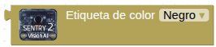  

Nos proporciona la identificación de la etiqueta del resultado obtenido al aplicar el algoritmo de reconocimiento de color o el algoritmo de reconocimiento de bloques de color:

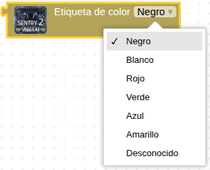  

### **Etiqueta de tarjeta**

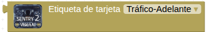  

Nos proporciona la identificación de la etiqueta del resultado obtenido al aplicar el algoritmo de reconocimiento de tarjetas (tráfico, formas o números):

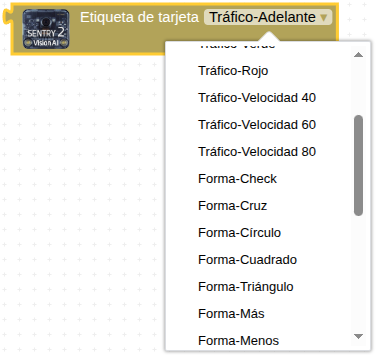  

Tienes toda la información en [ID: 6 → Card (tarjetas)](https://fgcoca.github.io/GuiasFundamentales/Sentry2/vision/#id6-card-tarjeta)

### **Etiqueta de objeto**

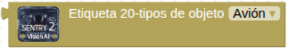  

Nos proporciona la identificación de la etiqueta del resultado obtenido al aplicar el algoritmo de reconocimiento de objetos predeterminados:

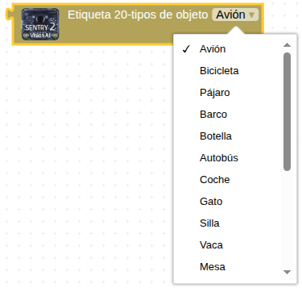  

Tienes toda la información en [ID: 8 → 20Class (objetos)](https://fgcoca.github.io/GuiasFundamentales/Sentry2/vision/#id8-20class-objetos)

## **Ejemplos de utilización**
### Contador de color
Cuando Sentry 2 detecta algo de color rojo, irá acumulando el número de detecciones que se mostrará en la consola serie. Cuando enviemos desde la consola serie la letra R, el valor del contador se pondrá a cero.

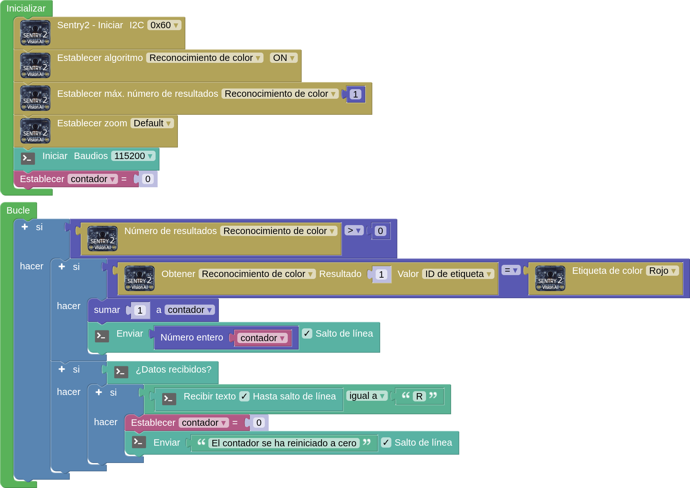  
**[Descargar el programa](../program/Sentry2/Reconocer%20color%20con%20Sentry2.abp)**

Un posible resultado es el siguiente:

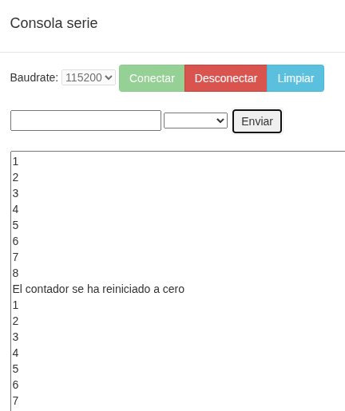  

Un ejemplo de uso puede ser un sistema de clasificación de caramelos por colores en una línea de producción. La Sentry 2 estaría montada sobre la cinta transportadora y configurada para detectar distintas regiones de interés. El programa analizaría la salida del algoritmo de reconocimiento de color para cada región y, en base al color detectado, activaría un mecanismo (como un desviador neumático) para dirigir cada caramelo a su contenedor correspondiente.

### Bloques de color
#### **Reconocimiento del color de la luz de un semáforo**
Configuramos manualmente la Sentry2 para detectar bloques de color rojo, amarillo y verde. Sólo los bloques rojos y verdes situados en la zona central de la imagen pueden ser los colores emitidos por los semáforos.

* Si se reconoce la luz roja, se enciende el LED rojo y se muestra "ROJO" en la pantalla.
* Si se reconoce la luz verde, se enciende el LED verde y se muestra "VERDE" en la pantalla.
* Si se reconoce la luz amarilla, se apagan los dos LEDs y se muestra "NINGUNO" en la pantalla.

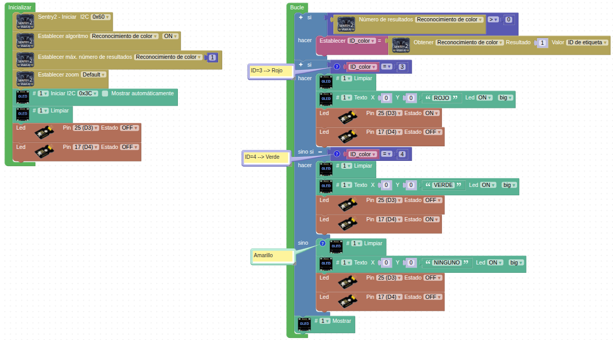  
***[Descargar el programa](../STEAMakers/programas/Sentry2_reconocer_color_luz_semaforo.abp)***

#### **Robot seguidor de objeto de color**
Se trata de un sistema de seguimiento de objetos donde un robot sigue uno de un color específico. El sensor detectaría el bloque de color y proporcionaría su posición, permitiendo al robot ajustar su movimiento para mantener el objeto dentro de su campo de visión.

