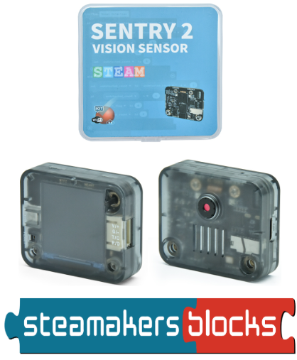
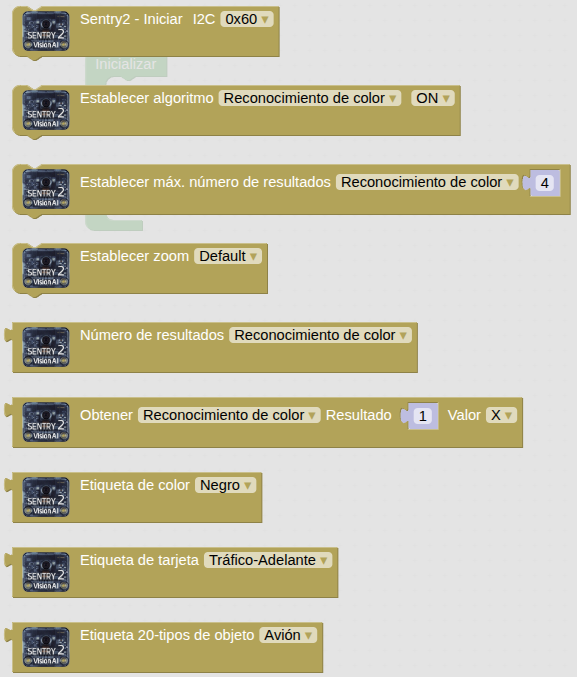
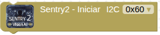
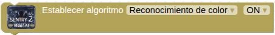
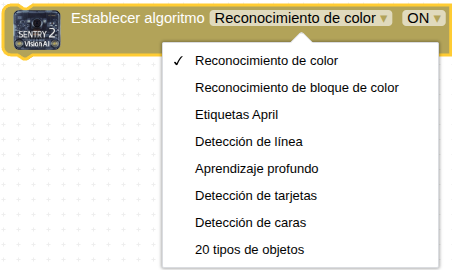

Antes de comenzar se recomienda encarecidamente leer los contenidos anteriores relativos a Sentry2.

  

## **Introducción**
Aunque podemos programar la cámara de visión artificial Sentry 2 con el IDE de Arduino (C++) o con MicroPython tienes más información, mayoritariamente en chino, en:

* [https://tosee.readthedocs.io/zh/latest/Common/Arduino/index.html](https://tosee.readthedocs.io/zh/latest/Common/Arduino/index.html)
* y en [https://tosee.readthedocs.io/zh/latest/Sentry2/microPython/index.html](https://tosee.readthedocs.io/zh/latest/Sentry2/microPython/index.html)
* así como con [Mixly](https://tosee.readthedocs.io/zh/latest/Sentry2/Mixly/index.html), [Mind+](https://tosee.readthedocs.io/zh/latest/Sentry2/MindPlus/index.html), [MakeCode](https://tosee.readthedocs.io/zh/latest/Sentry2/MakeCode/index.html) o [Scratch](https://www.bilibili.com/video/BV19h4y1g72X/).

**[STEAMakersBlocks](https://www.steamakersblocks.com/)** facilita su programación con bloques que permiten:

* iniciar el dispositivo
* establecer el algoritmo de visión (escogiendo uno de los 8 tipos disponibles)
* establecer el número máximo de resultados esperados
* establecer el zoom de la cámara (entre 1 y 5)
* obtener el número de resultados
* obtener, para cada resultado, sus valores (coordenadas, tamaños e identificación)
* identificar la imagen obtenida en función del color, del tipo de tarjeta o del objeto

Los bloques disponibles son:

  

* **Bloque Iniciar**

  

Podemos conectar a nuestra placa microcontroladora hasta 4 cámaras Sentry 2, y con este bloque podemos seleccionar las direcciones individuales del bus I2C.

Es el primer bloque que utilizaremos siempre, concretamente dentro del blog **Inicializar**.

* **Establecer algoritmo**

  

Con este bloque escogeremos el algoritmo de visión que queremos utilizar, de entre los 8 disponibles:

  

Es el segundo bloque que utilizaremos siempre, también dentro del bloque **Inicializar**, aunque podemos utilizarlo en cualquier otro lugar del programa si queremos cambiar el algoritmo de visión.

Para más información sobre cada algoritmo, aquí tienes los enlaces:

