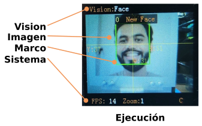
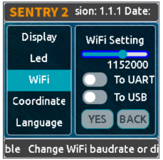

Sentry2 tiene dos tipos de páginas o modos de interfaz de usuario:

## **Ejecución (Running)**

  

En este modo el significado de las partes es:

* Estado de la cámara: En esta área se muestra el nombre actual del modo de visión.
* Imagen: Muestra las imágenes de la cámara.
* Marcos: Enmarca los objetos detectados, como el cuadro de detección, las coordenadas o la información.
* Estado del sistema: Velocidad de fotogramas de la cámara, nivel de zoom o estado de la conexión WiFi.

## **Configuración (Setting)**

  

En la página de ejecución, puedes hacer clic derecho en el joystick para acceder a la página de configuración de la interfaz de usuario. Hay tres páginas: **Configuración Vision**, **Configuración cámara** y **Configuración hardware**.

  

Si haces clic con el joystick hacia la izquierda, saldrá de la página actual y pasará una por una hasta volver a la página de ejecución.

* **Configuración Vision**: habilita o deshabilita la configuración del modo de visión y parámetros.
* **Configuración cámara**: puedes configurar el zoom de la cámara, el balance de blancos, la saturación, etc.
* **Configuración hardware**: configura el modo de salida, la velocidad de transmisión UART, la dirección del dispositivo, el color de la luz, el idioma y otras configuraciones de hardware.

### **Configuración del hardware**
En la tabla siguiente se resumen las operaciones posibles con el joystick:

|Página actual|Operación|Resumen|
|:-:|:-:|---|
|Ejecución|Clic arriba|Cambia a la última visión|
|Ejecución|Clic abajo|Cambia a la siguiente visión|
|Ejecución|Clic izquierdo|Instantánea (cuando hay insertada tarjeta microSD)|
|Ejecución|Clic derecho|Entra en la página de configuración|
|Ejecución|Pulsar|Modelos de entrenamiento (para visiones especiales)|
|Ejecución|Pulsación larga arriba|Acercar zoom|
|Ejecución|Pulsación larga abajo|Alejar zoom|
|Ejecución|Pulsación larga izquierda|Enciende/apaga la pantalla LCD|
|Ejecución|Pulsación larga|Borra todos los modelos (para visiones especiales)|
|...|||
|Configuración|Clic arriba|Cambia al menú o botón anterior|
|Configuración|Clic abajo|Cambia al siguiente menú o botón|
|Configuración|Clic izquierdo|Cambia a la anterior página de configuración Vuelve a la página de ejecución |
|Configuración|Clic derecho|Cambia a la siguiente página de configuración|
|Configuración|Pulsar|Selecciona|
|...|||
|Inicio|Pulsación mayor de 10 segundos arriba|Restaura la configuración de hardware por defecto|
|Inicio|Pulsar|Entra en modo actualización de firmware de K210|
|Inicio|Pulsación larga abajo|Entra en modo actualización de firmware de ESP8255|

!!! Note "NOTA:"
    Un clic es una pulsación corta, para que sea una pulsación larga debes mantener pulsado el botón durante al menos 2 segundos antes de soltarlo.

#### **Configuración de salida**

Si quieres utilizar un controlador para comunicarte con la Sentry2 debes hacer ajustes en algunas configuraciones de salida.

  

1. En la página de *'ejecución'*, haz clic derecho tres veces en el joystick para acceder a la página de configuración del hardware.
2. En la opción *'Salida' (Output)*, pulsa el botón del joystick para acceder a la configuración.
3. Selecciona el modo *'[UART](https://es.wikipedia.org/wiki/Universal_Asynchronous_Receiver-Transmitter)'* o *'[I2C](https://es.wikipedia.org/wiki/I%C2%B2C)'*. Por lo general, el modo I2C es más rápido, lo que favorece la mejora de la velocidad de fotogramas del procesamiento de imágenes especialmente si tu controlador no es compatible con el modo UART de alta velocidad de transmisión.
4. Elige el *'Protocolo estándar'* o el *'Protocolo simple'* para el modo UART. Por lo general, hay que seleccionar *'Protocolo estándar'* para utilizar la biblioteca de controladores.
5. Haz clic en *'YES'* para volver atrás.
6. Seleccione la opción *'Dirección' (Address)* en los menús de la izquierda.
7. Configura la dirección de hardware de Sentry2 con un valor entre *'0x60'* y *'0x63'*, haz clic en *'YES'* y vuelve atrás. El valor predeterminado es: *'0x60'*.
8. Accede a la página de configuración *'UART'* si seleccionas este modo.
9. **Mueve el control deslizante hacia la izquierda o hacia la derecha para configurar la velocidad de transmisión UART a alguno de los valores siguientes: 9600, 19200, 38400, 57600, 115200, 921600, 1152000, 2000000**.
    
    Una velocidad de transmisión más alta puede reducir el tiempo de transferencia de datos, lo que puede mejorar la velocidad de fotogramas de la imagen. Debes comprobar que la velocidad de transmisión máxima de tu controlador sea compatible. Si la comunicación es anómala, debes reducir la velocidad de transmisión.

10. Haz clic izquierdo con el joystick tres veces para volver a la página de ejecución.

#### **Configuración USB**

Sentry2 puede comunicarse con el ordenador mediante un cable USB-C. Su velocidad de transmisión se puede configurar por separado. El modo USB también se basa en el *'protocolo estándar o simple'*.

  

**Velocidad en baudios**: admite velocidades de 9600, 19200, 38400, 57600, 115200, 921600, 1152000 y 2000000 baudios. El USB se puede desactivar si el control deslizante 'To UART' está a la izquierda.

**To UART**: activa o desactiva la transmisión de datos entre el USB y la UART.

!!! Tip "Consejo:"
    Si los datos enviados coinciden con las instrucciones del protocolo, se ejecutan las instrucciones en lugar de la salida.

#### **Configuración de la pantalla**

Los resultados de la detección, cuando el modo visión está en funcionamiento, se indican a través de tres marcas: cuadro de detección, coordenadas X-Y e información.

  

**Box**: Cuadro rectangular que muestra los objetos detectados.

**X-Y**: Dibuja las líneas de coordenadas horizontales y verticales del objeto detectado y muestra:

* X: posición horizontal
* Y: posición vertical
* W: anchura del objeto
* H: altura del objeto.

**Info**: muestra información del objeto, como su etiqueta de clasificación y su nombre.

#### **Configuración diodos LED**

Hay dos diodos LED en la parte delantera del hardware para indicar el estado de la detección. El color del LED cambiará en función de los resultados de la detección de cada fotograma.

  

El usuario puede configurar el color del LED para el estado *'detectado'* o *'no detectado'* respectivamente. Haz clic en el joystick para cambiar el color siguiendo la secuencia siguiente:

  

El color negro significa que el LED está apagado.

Cuando los colores *'Detected' (Detectado)* y *'Undetected' (No detectado)* son iguales, los LED permanecerán encendidos.

El rango de *'Brillo'* va de 0 a 15, donde 0 es como apagar la luz y 15 es el más brillante. Por lo general, se recomienda ajustar el brillo a 1 o 2.

* **Apagar el LED**

    En algunos casos, el LED debe apagarse, ya que su iluminación puede causar interferencias en el reconocimiento de imágenes (como la visión de color o de manchas). Hay dos formas de apagar el LED:

        1. Establecer 'Detected' y 'Undetected' en negro.
        2. Establecer el brillo a 0.

* **Luz de relleno**

Cuando el entorno es oscuro o hay contraluz, es necesario utilizar luz de relleno:

        1. Establece 'Detected' y 'Undetected' a blanco.
        2. Establece 'Brillo' a 15.

#### **Comnfiguración WiFi**

El chip ESP8285-WiFi integrado en Sentry2 puede comunicarse con el chip K210 a través de un puerto UART interno. Cuando se activa la función *'Custom Vision'*, el chip ESP8285 entra en funcionamiento.

  

**Baudrate**: Velocidad en baudios. Admite velocidades de 9600, 74880, 115200, 921600, 1152000, 2000000, 3000000, 4000000 baudios. El WiFi se desactivará si el control deslizante está a la izquierda.

**to UART**: Activa o desactiva la transmisión de datos entre WiFi y UART.

**to USB**: Habilita o deshabilita la transmisión de datos entre WiFi y USB.

!!! Tip "Consejo:"
    Si los datos enviados coinciden con las instrucciones del protocolo, se ejecutan las instrucciones en lugar de la salida.

#### **Configuración de coordenadas**

Sentry2 soporta dos sistemas de coordenadas: Absolutas y Porcentuales.

  

**Absoluto**: En este modo, se devuelven los resultados de coordenadas reales. El rango va de 0 a 319 (horizontal) y de 0 a 239 (vertical). El punto central es (160,120). Este modo tiene una mayor precisión.

**Porcentuales**: En este modo, los resultados de las coordenadas reales se cuantifican en un rango de 0 a 100, tanto en el rango en dirección horizontal como en dirección vertical. El punto central es (50,50).

#### **Configuración de idioma**

Se puede cambiar el idioma entre Chino e Inglés.

  

#### **Configuración de registros**

Operaciones con registros Sentry2: Modo de guardado automático (Auto Save Mode), Guardar registro (Save Register), Configuración predeterminada (Default Settings).

  

**Auto Save (Autoguardado)**: Algunos valores de los registros se guardarán automáticamente si se habilita este modo; de lo contrario, los registros se restablecerán a su valor predeterminado después del siguiente inicio. Por lo general, este modo debe estar deshabilitado.

**Save REG**: Guarda los valores actuales de los registros.

**Default**: Restaura los registros a la configuración de fábrica. Haz clic primero en este botón y, a continuación 'YES'.

### **Configuración de la cámara**

#### **Zoom digital**

Puedes ampliar la vista de zoom de la cámara para ver objetos lejanos. Admite de 1 a 5 niveles de ajuste.

Al aumentar el zoom, el objeto se verá más grande, pero el campo de visión será más pequeño. Por el contrario, al reducir el zoom, el objeto se verá más pequeño, pero el campo de visión será mayor.

También puedes cambiar el zoom con el joystick: para acercar, manten pulsado hacia arriba; para alejar, manten pulsado hacia abajo.

#### **Autobalanace de blancos (AWB)**

Diferentes condiciones de iluminación (luz blanca o luz amarilla) pueden provocar un desequilibrio en el color blanco. Es necesario ajustar el balance de blancos. Hay disponibles cuatro modos: Automático, Bloqueado, Blanco y Amarillo.

**Auto (Automático)**: este modo es el modo predeterminado y se aplica a la mayoría de los entornos.

**Lock (Bloqueado)**: cuando hay una gran área de fondo monocromático en la imagen, el blanco se desequilibra, lo que provoca errores en el reconocimiento del color. Por lo tanto, es necesario bloquear el balance de blancos antes del reconocimiento para evitar el ajuste automático del color. El método es el siguiente:

    1. Apunta la cámara hacia un papel blanco y manten una distancia de unos 20 cm.
    2. Entra en el menú 'AWB' y selecciona el modo 'Bloqueado'.
    3. Haz clic en 'YES'.
    4. Vuelve a la página de ejecución.

**White (Blanco)**: úsalo en entornos con luz blanca.

**Yellow (Amarillo)**: úsalo en entornos con luz amarilla.

#### **Saturación**

Aumentar la saturación hará que el color se vuelva más brillante, se intensifique y resalte.

Disminuir la saturación hará que el color se vuelva más apagado y, a niveles muy bajos, parecerá blanco y negro.

==**Brillo**==

Para cambiar el brillo de la imagen si resulta necesario.

==**Contraste**==

Aumentar el contraste hará que la diferencia entre lugares próximos con diferencia de color sea mayor.

Reducir el contraste hará que la imagen se vea apagada.

#### **Sharpness (Nitidez)**

Aumentar la nitidez hará que el contorno de los bordes sea más claro y los detalles más evidentes, pero si se aumenta demasiado se producirá ruido.

Reducir la nitidez difuminará la imagen.

#### **Control de autoexposición AEC**

La luz intensa permite reducir el valor de exposición cuando se expone la imagen.

Por el contrario, si el entorno es oscuro, se debe aumentar el valor de exposición.

#### **Rotación**

La imagen rota 180 grados si se habilita.

### **Ejecutando visión**
Hay varias formas de activar/desactivar la visión: desde la página de la interfaz de usuario, haciendo clic en el joystick o mediante comandos del controlador.

#### **Interfaz de usuario**

  

1. Selecciona visión en los menús de la izquierda de la página de configuración de 'Vision'.
2. Algunas visiones se pueden configurar, haz clic en *'Configuración'* para acceder.
3. Si aparece el botón rojo *'Stop'* en la parte inferior izquierda del área de control de la derecha, significa que el algoritmo está cerrado actualmente. Al hacer clic en él, cambiará a un botón verde *'run'*, lo que significa que el algoritmo se ha iniciado. Vuelve a hacer clic en él y volverá a cambiar al botón rojo Detener.

#### **Con joystick**

  

1. Haz un clic corto con el joystick hacia arriba y hacia abajo para activar o desactivar visión. La visión anterior se cerrará si se está ejecutando una nueva visión.
2. La secuencia de cambio de visión se ordena por ID de visión.

#### **Comandos del controlador**

Para hacerlo de esta manera, el controlador necesita leer y escribir registros para habilitar o deshabilitar la visión. [Se proporcionan las librerias de controladores para diferentes plataformas de programación](https://tosee.readthedocs.io/en/latest/Sentry2/Download/index.html).

En el modo UART, la lectura o escritura de registros debe realizarse de acuerdo con el protocolo estándar o el protocolo simple. Para obtener más detalles, consulta las secciones relacionadas.

En el modo I2C se pueden leer o escribir registros directamente.

Habilitar visión:

1. Escribe el ID de visión en el registro 0x20-VISION_ID.
2. Escribe 0x01 en el registro 0x21-VISIO_CONF1 para habilitar visión; o al contrario, escribe 0x00 para deshabilitarla.

Para obtener más detalles, consulta los registros.

### **Resultados de visión**

#### **Resultados en pantalla**

El objeto objetivo se marcará en la pantalla cuando sea detectado. Significado de las marcas:

  

#### **Resultados por comandos**

Los resultados solamente los puede leer el controlador. Para leer resultados:

1. Escribir el identificador de visión en el registro 0x20-VISION_ID.
2. Leer el registro 0x34-RESULT_NUM para obtener el número de objetos detectados.
3. Escribir el identificador del resultado que se desea leer en el registro 0x24-RESULT_ID.
4. Leer los resultados en los registros 0x80~0x89.

|Dirección|Nombre|Resumen|
|:-:|---|---|
|0x80|RESULT_DATA1_H8|8 bits de mayor peso de Resultado 1|
|0x81|RESULT_DATA1_L8|8 bits de menor peso de Resultado 1|
|0x82|RESULT_DATA2_H8|8 bits de mayor peso de Resultado 2|
|0x83|RESULT_DATA2_L8|8 bits de menor peso de Resultado 2|
|0x84|RESULT_DATA3_H8|8 bits de mayor peso de Resultado 3|
|0x85|RESULT_DATA3_L8|8 bits de menor peso de Resultado 3|
|0x86|RESULT_DATA4_H8|8 bits de mayor peso de Resultado 4|
|0x87|RESULT_DATA4_L8|8 bits de menor peso de Resultado 4|
|0x88|RESULT_DATA5_H8|8 bits de mayor peso de Resultado 5|
|0x89|RESULT_DATA5_L8|8 bits de menor peso de Resultado 5|
