## **Resumen**
El sensor de visión Sentry2 integra una variedad de algoritmos de visión offline para reconocer objetos sin necesidad de conexión a la red, y el chip ESP8285-WiFi integrado permite realizar la función de reconocimiento de imágenes basada en la nube.

## **Listado**

|ID|Nombre|Resumen|
|:-:|:-:|---|
|1|Color|Devuelve el valor R (rojo), G (verde) y B (azul) y la etiqueta de cada región. Hasta 25 regiones|
|2|Blob (Burbuja) |Detectar un bloque de color específico. Admite la selección simultánea de bloques de color negro, blanco, rojo, verde, azul y amarillo|
|3|Apriltag|Compatible con familia Apriltag 16H5, 25H9, 36H11. Hasta 25 etiquetas|
|4|Line|Busca líneas y devuelve sus extremos y grados, admite entre 1 y 5 líneas|
|5|Learning|Entrenar objetos y clasificarlos. Hasta 25 datos de modelo|
|6|Card|Identificar patrones especiales de tarjetas, incluyendo 10 de tráfico, 9 de formas y 10 de números|
|7|Face|Detección y reconocimiento facial, compatible con detección de máscaras, puede almacenar datos de 25 modelos|
|8|20Class|Clasifica 20 objetos comunes, como gato, coche, persona, etc|
|9|QrCode|Reconocimiento de un código QR sencillo|
|10|Custom|Ejecutar algoritmos personalizados que se ejecutan en el chip ESP8285-WiFi integrado|
|11|Motion|Determinar si hay áreas en movimiento en la imagen|

## **Introducción detallada**

### **ID:1 Color**

* **Resumen**  
El usuario puede establecer desde una hasta 25 regiones para el reconocimiento de colores y obtener los valores R (rojo), G (verde) y B (azul) y la etiqueta de cada región. Las coordenadas y el tamaño de cada región se pueden configurar.

  

* **Etiqueta Color**  
Una etiqueta de color es un número que se utiliza para representar un color:

  

|Etiqueta|Nombre|Etiqueta|Nombre|Etiqueta|Nombre|
|:-:|---|:-:|---|:-:|---|
|1|Negro (Black)|2|Blanco (White)|3|Rojo (Red)|
|4|Verde (Green)|5|Azul (Blue)|6|Amarillo (Yellow)|
|0|Desconocido (Unknown)|||||

* **Parámetros**  
El usuario puede configurar las regiones para el reconocimiento:

|Parámetro|Resumen|
|:-:|---|
|1|Coordenada X del centro de la región|
|2|Coordenada Y del centro de la región|
|3|Ancho de la región|
|4|Alto de la región|
|5|Ninguno|

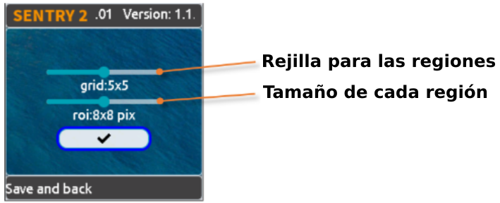  

Existen varios parámetros preestablecidos en la página de configuración de la interfaz de usuario:

Cuadrícula (X x Y): 1x1, 2x2, 3x3, 4x4, 5x5, 1x10, 2x10, 6x1, 6x2

Tamaño (Ancho x Alto): 2x2, 4x4, 8x8, 16x16, 32x32

!!! Note "NOTA:"
    Para representar un cuadrado en el sistema de coordenadas porcentuales, la anchura y la altura no son iguales, sino que se ajustan a la relación 3:4. Por ejemplo, si la anchura de un cuadrado es del 12%, entonces su altura h debe ser 12/3 × 4 = 16 %. En el sistema de coordenadas absolutas, los tamaños preestablecidos del área de reconocimiento son: 1x1, 2x3, 3x4, 6x8, 9x12.

* **Resultados**  
En la pantalla aparecerá un recuadro rectangular que identifica el color, y un recuadro de cuatro esquinas que identifica el color desconocido.

  

|Resultado|Resumen|
|:-:|---|
|1|R, valor del canal rojo con rango 0 a 255|
|2|G, valor del canal verde con rango 0 a 255|
|3|B, valor del canal azul con rango 0 a 255|
|4|Ninguno|
|5|Etiqueta de color|

### **ID:2 Blob (bloques de color)**

* **Resumen**  
Busca un bloque de color determinado en una imagen y devuelve sus coordenadas y tamaño. Admite la detección de múltiples colores y múltiples resultados. La etiqueta de color tiene la misma definición que en Color vision.

  

* **Parámetros**  
El usuario debe decidir primero qué color desea detectar. El ancho y el alto de la pieza de color mínima se pueden configurar para reducir los resultados falsos:

|Resultado|Resumen|
|:-:|---|
|1|Ninguno|
|2|Ninguno|
|3|Ancho mínimo|
|4|Alto mínimo|
|5|La etiqueta Color será detectada|

  

Existen varios parámetros preestablecidos en la página Interfaz de Usuario:

>
* **Nivel de rendimiento del algoritmo**: Para seleccionar el rendimiento de la visión según los diferentes requisitos de la aplicación, entre 'Sensible', 'Equilibrado' y 'Preciso'.
* **Número máximo de bloques**: Admite de 1 a 5 bloques para cada color.
* **Tamaño mínimo del bloque**: En sistema de coordenadas absolutas: 2x2, 4x4, 8x8, 16x16, 32x32, 64x64, 128x128 píxeles. En sistema de coordenadas porcentuales: 1x1, 2x3, 3x4, 6x8, 9x12, 21x28, 42x56 %.
* Color a detectar: Se muestra un icono de ojo abierto si la etiqueta de color está activada.

* **Resultados**  

  

Obtén los resultadfos:

|Resultado|Resumen|
|:-:|---|
|1|Coordenada X del centro del bloque|
|2|Coordenada Y del centro del bloque|
|3|Ancho del bloque|
|4|Alto del bloque|
|5|Etiqueta Color|

### **ID:3 Apriltag (etiquetas)**

Los [AprilTag](https://april.eecs.umich.edu/software/apriltag) son marcadores visuales para detección e identificación mediante sistemas de visión artificial desarrollados por investigadores de la universidad de Michigan.

Tecnicamente su diseño fiducial y sistema de codificación se basan en lexicografia. El sistema se describe en los artículos enlazados en la web anterior.

Conceptualmente son similares a los códigos QR pero diseñados para cargas de datos mucho mas pequeñas (entre 4 y 12 bits), lo que permite una detección mejor a mayor distancia. Están diseñados para calcular su posición 3D precisa respecto a la cámara.

Se utilizan como marcadores fiduciales en robótica y otras aplicaciones.

Un marcador fiducial o solamente fiducial es un objeto colocado en el campo de visión de un sistema de imágenes que aparece en la imagen producida, para su uso como punto de referencia o medida.

Su nombre procede del laboratorio de robótica "April" de la Universidad de Michigan, siendo AprilTag una biblioteca y algoritmo que permite a un sistema identificar características en hasta seis grados de libertad.

* **Resumen**  
Busca etiquetas AprilTag en una imagen, compatible con las familias de codificación 16H5, 25H9 y 36H11, y hasta 25 resultados. Debes decidir qué familia de codificación utilizar antes de habilitar esta función, y solo se puede procesar una familia.

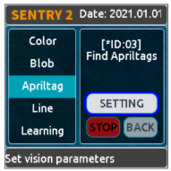  

**Etiqueta**  

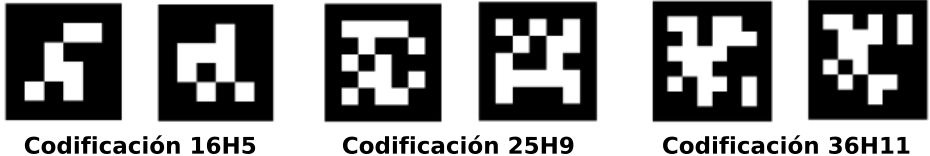  

En el enlace puedes [descargar imágenes de AprilTag](https://github.com/AprilRobotics/apriltag-imgs/tree/master) y aprender mas sobre el tema.

* **Parámetros**  

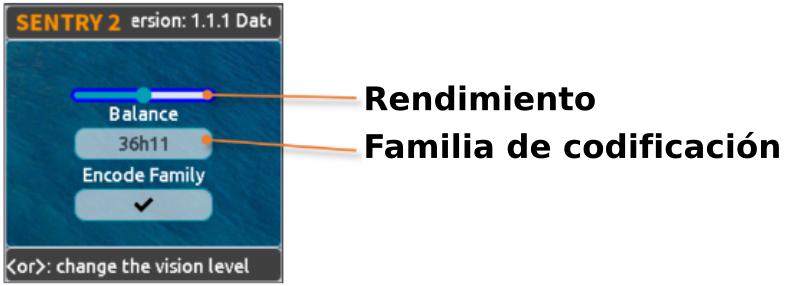  

Existen varios parámetros preestablecidos en la página de configuración de la interfaz de usuario:

>
* **Nivel de rendimiento del algoritmo**: Para seleccionar el rendimiento de la visión según los diferentes requisitos de la aplicación: 'Sensible (Sensitive)', 'Equilibrado (Balance)' y 'Preciso (Accurate)'.
* **Familia de codificación**: Compatible con 16H5, 25H9 y 36H11.

* **Resultados**  

  

Obtén los resultadfos:

|Resultado|Resumen|
|:-:|---|
|1|Coordenada X del centro del marcador|
|2|Coordenada Y del centro del marcador|
|3|Ancho del marcador|
|4|Alto del marcador|
|5|Etiqueta|

### **ID:4 Line (lineas)**

* **Resumen**  
Busca desde una hasta 5 líneas en una imagen y devuelve las coordenadas y los grados de sus dos extremos. Si se trata de una curva, devuelve un segmento de línea aproximado.

  

* **Parámetros**  
En la página de configuración de la interfaz de usuario se pueden establecer varios parámetros.

  

>
* **Nivel de rendimiento del algoritmo**: Para seleccionar el rendimiento de la visión según los diferentes requisitos de la aplicación: 'Sensible (Sensitive)', 'Equilibrado (Balance)' y 'Preciso (Accurate)'.
* **Número máximo de líneas**: Rango de 1 a 5

* **Resultados**  

  

!!! Note "NOTA:"
    La horizontal hacia la derecha es 0 grados, el valor aumenta en sentido antihorario. Hacia arriba es 90 grados, y la horizontal hacia la izquierda es 180 grados.

Se utilizan 5 colores diferentes para distinguir las líneas: rojo, amarillo, verde, azul y púrpura.

 

  

|Resultado|Resumen|
|:-:|---|
|1|Coordenada X del punto final de la línea (superior)|
|2|Coordenada Y del punto final de la línea (superior)|
|3|Coordenada X del punto inicial de la línea (inferior)|
|4|Coordenada Y del punto inicial de la línea (inferior)|
|5|Grados de la línea|

### **ID:5 Learning (aprendizaje)**

* **Resumen**  
Los objetos pueden ser entrenados y reconocidos por esta cámara de visión artificial y se pueden guardar hasta 25 datos de modelos.

  

* **Parámetros**  

**Entrenamiento de un nuevo objeto**: El nuevo objeto se puede entrenar en la página en ejecución:

  

Se asignará automáticamente una etiqueta al nuevo objeto. El principio es: seleccionar el número más pequeño de los ID disponibles.

**Eliminar todos los objetos**: Manten pulsado verticalmente el joystick durante más de 2 segundos en la página en ejecución.

  

|Parámetro|Resumen|
|:-:|---|
|1|Ninguno|
|2|Ninguno|
|3|Ninguno|
|4|Ninguno|
|5|Escribe 0 para borrar el objeto actual o 100 para entrenamiento|

Puedes renombrar o borrar el objeto entrenado.

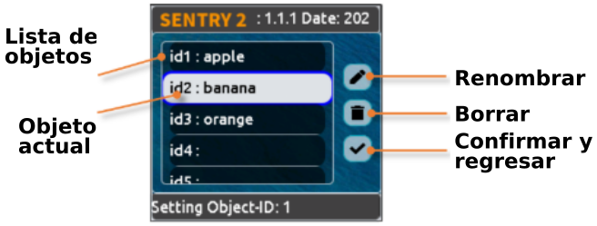  

>  * **Renombrar**:

  

>  * **Borrar**:

  

* **Resultados**  
La visión solo puede juzgar la existencia del objeto entrenado, pero no sus coordenadas y tamaño, por lo que el cuadro de reconocimiento es un valor de salida fijo.

  

|Resultado|Resumen|
|:-:|---|
|1|Fijado, 160|
|2|Fijado, 120|
|3|Fijado, 224|
|4|Fijado, 224|
|5|Etiqueta|

### **ID:6 Card (tarjeta)**

* **Resumen**  
Reconocer una tarjeta específica en la imagen y devolver sus coordenadas, tamaño, etiqueta y otra información. Incluye tarjetas de tráfico, de formas y de números.

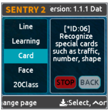  

Las etiquetas se muestran en la siguiente tabla. Del 1 al 10 para **Tráfico**, del 11 al 19 para **Formas** y del 20 al 29 para **Números**.

|Etiqueta|Nombre|Etiqueta|Nombre|Etiqueta|Nombre|
|:-:|---|:-:|---|:-:|---|
|1|Avanzar (Forward)|2|Izquierda (Left)|3|Derecha (Right)|
|4|Dar la vuelta (Turn Around)|5|Aparcamiento (Park)|6|Verde (Green)|
|7|Rojo (Red)|8|Velocidad 40 (Speed 40)|9|Velocidad 60 (Speed 60)|
|10|Velocidad 80 (Speed 80)|||||
|11|Comprueba (Check)|12|Aspa (Cross)|13|Círculo (Circle)|
|14|Cuadrado (Square)|15|Triángulo (Triangle)|16|Suma (Plus)|
|17|Resta (Minus)|18|División (Divide)|19|Igual (Equal)|
|20|Número 0|21|Número 1|22|Número 2|
|23|Número 3|24|Número 4|25|Número 5|
|26|Número 6|27|Número 7|28|Número 8|
|29|Número 9|

* **Parámetros**  
Ninguno.

* **Resultados**  
Esta visión puede reconocer varias tarjetas al mismo tiempo, incluso se están rotadas hasta 30 grados, pero no las gires demasiado.

  

|Resultado|Resumen|
|:-:|---|
|1|Coordenada X del centro de la tarjeta|
|2|Coordenada Y del centro de la tarjeta|
|3|Ancho de la tarjeta|
|4|Alto de la tarjeta|
|5|Etiqueta de de la tarjeta|

### **ID:7 Face (Caras)**

* **Resumen**  
Esta visión permite entrenar y reconocer rostros, se pueden guardar hasta 25 datos de modelos y también admite la detección de máscaras.

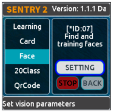  

* **Parámetros**  

> * **Entrenando nueva cara**: Un nuevo objeto se puede entrenar desde la página de ejecución.

  

Una nueva etiqueta se asigna a la nueva cara tomando como criterio escoger el número mas pequeño de los ID disponibles.

> * **Borrar todas las caras**: Una pulsación superior a 2 segundos del botón del joystick.

|Parámetro|Resumen|
|:-:|---|
|1|Ninguno|
|2|Ninguno|
|3|Ninguno|
|4|Ninguno|
|5|Escribe 0 para borrar el objeto actual o 100 para entrenamiento|

Puedes renombrar o borrar el objeto entrenado desde la página de configuración de la interfaz de usuario.

  

* **Resultados**  

  

Esta cámara de visión artificial admite la detección de rostros (rostros nuevos) y el reconocimiento de rostros (rostros entrenados) que se ejecutan al mismo tiempo. A los rostros nuevos se les asignará la etiqueta 0. En particular, si se detecta un rostro nuevo que lleva una mascarilla, se mostrará 'Rostro nuevo (mascarilla)' y la etiqueta se fijará en 200.

  

|Resultado|Resumen|
|:-:|---|
|1|Coordenada X del centro de la cara|
|2|Coordenada Y del centro de la cara|
|3|Ancho de la cara|
|4|Alto de la cara|
|5|Etiqueta 0: nueva cara, 200: cara con máscarilla|

### **ID:8 20Class (objetos)**

* **Resumen**  
Identifica 20 tipos comunes de objetos y devuelve sus coordenadas, tamaño y etiquetas, tal y como se muestra en la tabla siguiente.

  

|Resultado|Resumen|Resultado|Resumen|Resultado|Resumen|
|:-:|---|:-:|---|:-:|---|
|1|Avión (Airplane)|2|Bicicleta (Bicycle)|3|Pájaro (Bird)|
|4|Barco (Boat)|5|Botella (Bottle)|6|Autobús (Bus)|
|7|Coch (Car)|8|Gato (Gat)|9|Silla (Chair)|
|10|Vaca (Cow)|11|Mesa de comedor (DiningTable)|12|Perro (Dog)|
|13|Caballo (Horse)|14|Motocicleta (Motorbike)|15|Persona (Person)|
|16|Maceta (PottedPlant)|17|Oveja (Sheep)|18|Sofá (Sofa)|
|19|Tren (Train)|20|Monitor de televisión (Tvmonitor)|||

* **Parámetros**  

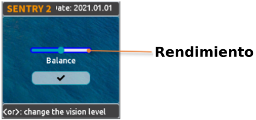  

**Nivel de rendimiento del algoritmo**: Para seleccionar el rendimiento de la visión según los diferentes requisitos de la aplicación: 'Sensible (Sensitive)', 'Equilibrado (Balance)' y 'Preciso (Accurate)'.

* **Resultados**  

  

|Resultado|Resumen|
|:-:|---|
|1|Coordenada X del centro del objeto|
|2|Coordenada Y del centro del objeto|
|3|Ancho del objeto|
|4|Alto del objeto|
|5|Etiqueta|

### **ID:9 Código QR**

!!! Bug " "
    **SOLAMENTE DISPONIBLE PARA LA VERSIÓN ENTERPRISE**

* **Resumen**  

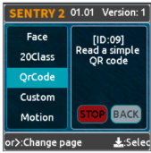  

Se puede reconocer un código QR estándar (menos de 25 caracteres ASCII).

**Tabla [ASCII](https://es.wikipedia.org/wiki/ASCII)**

|Etiqueta|ASCII|Etiqueta|ASCII|Etiqueta|ASCII|
|:-:|:-:|:-:|:-:|:-:|:-:|
|32|Espacio|33|!|34|“|
|35|#|36|$|37|%|
|38|&|39|‘|40|(|
|41|)|42|*|43|+|
|44|,|45|-|46|.|
|47|/|48|0|49|1|
|50|2|51|3|52|4|
|53|5|54|6|55|7|
|56|8|57|9|58|:|
|59|;|60|<|61|=|
|62|>|63|?|64|@|
|65|A|66|B|67|C|
|68|D|69|E|70|F|
|71|G|72|H|73|I|
|74|J|75|K|76|L|
|77|M|78|N|79|O|
|80|P|81|Q|82|R|
|83|S|84|T|85|U|
|86|V|87|W|88|X|
|89|Y|90|Z|91|[|
|92|\\|93|]|94|^|
|95|_|96|`|97|a|
|98|b|99|c|100|d|
|101|e|102|f|103|g|
|104|h|105|i|106|j|
|107|k|108|l|109|m|
|110|n|111|o|112|p|
|113|q|114|r|115|s|
|116|t|117|u|118|v|
|119|w|120|x|121|y|
|122|z|123|{|124||
|125|}|126|~|||

* **Parámetros**  
Ninguno

* **Resultados**  
A diferencia de otras cámaras de visión artificial, esta devuelve dos tipos de información, paquete de atributos y datos de caracteres.

  

**Paquete de atributos**

|Resultado|Resumen|
|:-:|---|
|1|Coordenada X del centro del QR|
|2|Coordenada Y del centro del QR|
|3|Ancho del QR|
|4|Alto del QR|
|5|Número de caracteres|

**Datos de caracteres**

|Resultado|Resumen|
|:-:|---|
|1|Dato de caracter|
|2|Dato de caracter|
|3|Dato de caracter|
|4|Dato de caracter|
|5|Dato de caracter|

### **ID:10 Custom (Personalizado)**

* **Resumen**  
Si este modo está habilitado, el chip wifi estará en modo ejecución. Mas detalles en:

**^^Versión en Inglés:^^**  

[Sentry2 WiFi Firmware Developing User Guide_V1.1.pdf](../Sentry2/Sentry2%20WiFi%20Firmware%20Developing%20User%20Guide_V1.1.pdf)
  

**^^Versión en Castellano:^^**  

[Guía de desarrollo del firmware WiFi Sentry2_V1.1.pdf](../Sentry2/Guía%20de%20desarrollo%20del%20firmware%20WiFi%20Sentry2_V1.1.pdf)

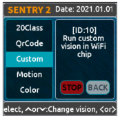  

* **Parámetros**  
Personalizados

* **Resultados**  
Personalizados

### **ID:11 Motion (Movimiento)**

!!! Bug " "
    **SOLAMENTE DISPONIBLE PARA LA VERSIÓN ENTERPRISE**

* **Resumen**  
Compara la diferencia de píxeles de los fotogramas adyacentes para determinar si hay una región con movimiento en la imagen, devolviendo su coordenada y tamaño.

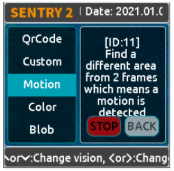  

* **Parámetros**  
Ninguno

* **Resultados**  

  

|Resultado|Resumen|
|:-:|---|
|1|Coordenada X del centro de la región|
|2|Coordenada Y del centro de la región|
|3|Ancho de la región|
|4|Alto de la región|
|5|Ninguno|

## **Resumen de la interfaz de ejecución (Running)**

  

Hay varias formas de habilitar/desactivar la visión:

* **Desde la página de la interfaz de usuario**

  

1. Selecciona la vista en los menús de la izquierda de la página de configuración de la visión.
2. Algunas visiones se pueden configurar. Pulsa en "Setting / configuración" para entrar.
3. Si se muestra el botón rojo "STOP / detener" en la parte inferior izquierda del área de control derecha, significa que el algoritmo está cerrado actualmente. Después de clicar en él, cambiará a un botón verde "RUN / ejecuta", lo que significa que el algoritmo se inicia. Pulsa de nuevo y volverá a cambiar en el botón rojo "STOP / detener".

* **Con el joystick**

  

1. Pulsa brevemente en el joystick hacia arriba y hacia abajo para activar o desactivar una visión. La visión anterior se cerrará si se está ejecutando una visión nueva.
2. La secuencia de cambio de visión se ordena por Vision-ID.

* Mediante las instrucciones de programación del controlador

De esta forma, el controlador necesita leer y escribir registros para habilitar o desactivar la visión. Se ofrecen las bibliotecas de controladores para distintas plataformas de programación.

En el modo UART, la lectura o la escritura de registros se realiza de acuerdo con el protocolo estándar o el protocolo simple. Para obtener más información, consulte las secciones relacionadas.

El modo I2C puede leer o escribir registros directamente.

Activa la visión:

1. Escribe **Vision ID** en el registro **0x20-VISION_ID**
2. Escribe **0x01** en el registro **0x21-VISIO_CONF1** para habilitar la visión. De lo contrario, escribe **0x00** para desactivarla.
