Sentry2 tiene un chip WiFi ESP8285 integrado que se puede programar directamente con el IDE de Arduino para hacer reconocimiento online, transmisión de imágenes, AIoT y otras aplicaciones. El ESP8285 se puede utilizar como controlador para K210, que es una ayuda para la programación de IA sin dispositivo externo.

## **Entorno de desarrollo**
* **Añade el soporte para las placas ESP8266**

En primer lugar, descarga e instala el IDE de Arduino: [Enlace a la web de descarga](https://www.arduino.cc/en/software/?_gl=1*vdfdlx*_up*MQ..*_ga*ODYyOTk4MjA3LjE3NTM4OTQ5Nzg.*_ga_NEXN8H46L5*czE3NTM4OTQ5NzgkbzEkZzAkdDE3NTM4OTQ5NzgkajYwJGwwJGg0MDAwNjU2NA..)

Abre el IDE de Arduino y haz clic en **Archivo → Preferencias**.

Escribe, o copia y pega, http://arduino.esp8266.com/stable/package_esp8266com_index.json en **URL Adicionales de gestor de placas**. Guarda los cambios.

Abre **Herramientas → Placa → Gestor de placas**…

En **Filtrar la búsqueda…** escribe **esp8266** y después clica en **Instalar** y en **Cerrar**.

* **Prueba simple**

Abre **Herramientas → Placa → ESP8266… → Generic ESP8285 Module**.

Abre **Archivo → Ejemplos → ESP8266… → Blink**.

Conecta Sentry2 a tu ordenador con un cable USB-C.

Abre **Herramientas** y cambia la configuración como se muestra a continuación:

- Builtin Led: **“4”**
- CPU Frequency：**“80 MHz”** o **“160 MHz”**
- Upload Speed：**“57600”**
- Reset Method：**“no dtr (aka ck)”**
- Puerto：selecciona el puerto al que está conectado Sentry2

Mueve el joystick abajo y mantenlo (NO lo presiones verticalmente).

En el IDE de Arduino, pulsa en el botón **Subir** para iniciar la compilación y la subida. Manten el joystick hacia abajo hasta que en la pantalla del IDE se muestre Writing at … (xx% progress).

Espera a se cargue el 100%.

Reinicia Sentry2 y ejecuta la visión **“Custom”**. El LED azul de WiFi se mantendrá brillante y el LED **personalizado** parpadeará.

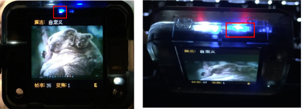  

## **Demo WiFi**
Se proporcionan algunos programas WiFi de código abierto.

!!! Note "NOTAS:"
    NOTA 1: el AI Cloud Servide (servicio de nube de IA) de terceros puede requerir una cuenta o un pago para utilizarla. Por favor, lea atentamente las condiciones de uso.

    NOTA 2: estas demostraciones sólo se utilizan como referencia para el uso de la función WiFi y no garantizan el rendimiento, seguridad o disponibilidad de la identificación.

### Bemfa AIoT - Carga de imágenes
Código Arduino → [sentry2_esp8285_bemfa_image_transfer.zip](https://tosee.readthedocs.io/en/latest/_downloads/950c9ed9c029c2c5c717fda0fcca5305/sentry2_esp8285_bemfa_image_transfer.zip)

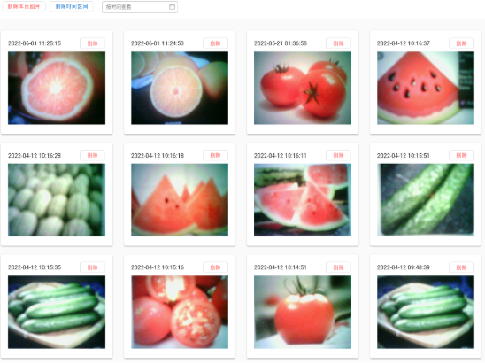  

### Bemfa AIoT - MQTT para Sentry2
Código Arduino → [sentry2_esp8285_bemfa_mqtt_run_vision.zip](https://tosee.readthedocs.io/en/latest/_downloads/8453ff9578a1ff72a79c970a396aa8c8/sentry2_esp8285_bemfa_mqtt_run_vision.zip)

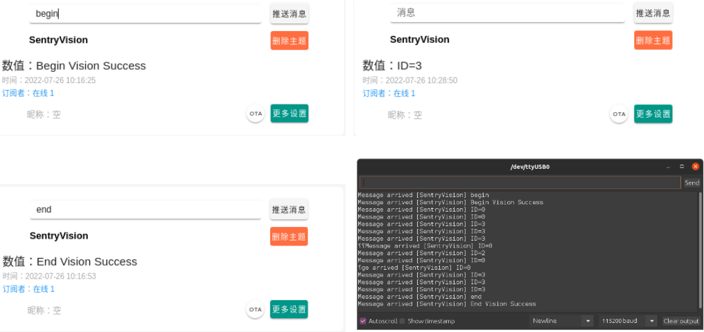  

### Baidu AI - Clasificación de ingredientes por URL
Código Arduino → [sentry2_esp8285_baidu_ingredient_classify_by_url.zip](https://tosee.readthedocs.io/en/latest/_downloads/b2b6e3aa796caef9d94946093cbd9f2f/sentry2_esp8285_baidu_ingredient_classify_by_url.zip)

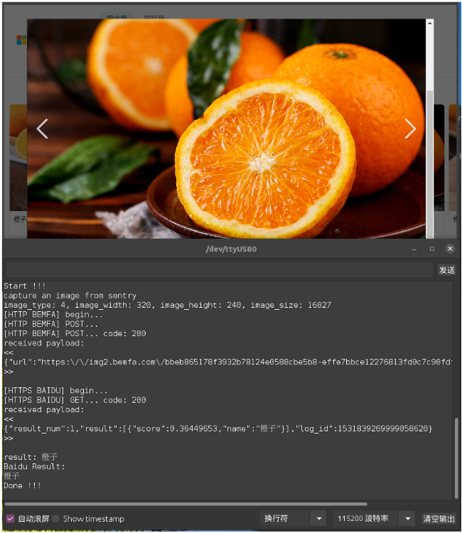  

### Baidu AI - Clasificación de ingredientes por imagen
Código Arduino → [sentry2_esp8285_baidu_ingredient_classify_by_image.zip](https://tosee.readthedocs.io/en/latest/_downloads/213ea58607489c99f888c3691a23c04a/sentry2_esp8285_baidu_ingredient_classify_by_image.zip)

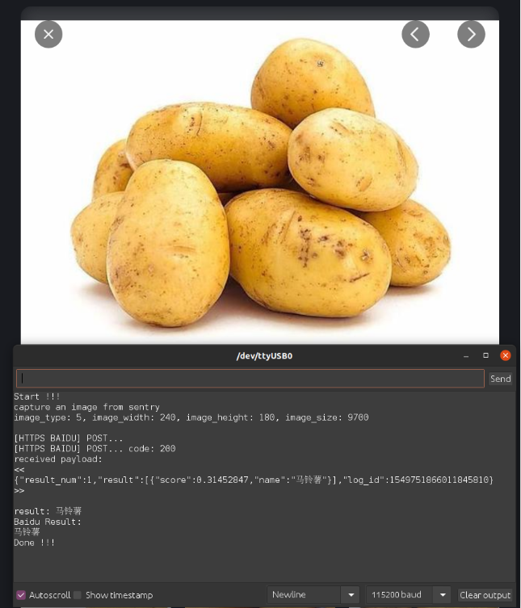  

### Baidu AI - Matricula
Código Arduino → [sentry2_esp8285_baidu_ocr_license_plate_by_image.zip](https://tosee.readthedocs.io/en/latest/_downloads/7adc88c456494825a4b66ba3885327a6/sentry2_esp8285_baidu_ocr_license_plate_by_image.zip)

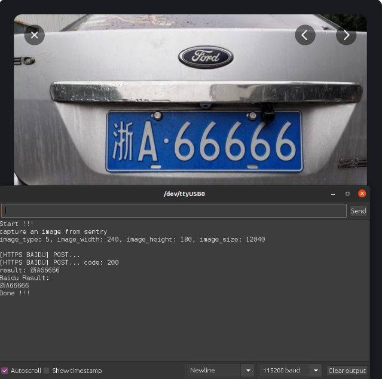  

### Baidu AI - OCR (Reconocimiento óptico de caracteres)
Código Arduino → [sentry2_esp8285_baidu_ocr_general_basic_by_image.zip](https://tosee.readthedocs.io/en/latest/_downloads/348fcb5f1ccb14655b08531eee5cbbb1/sentry2_esp8285_baidu_ocr_general_basic_by_image.zip)

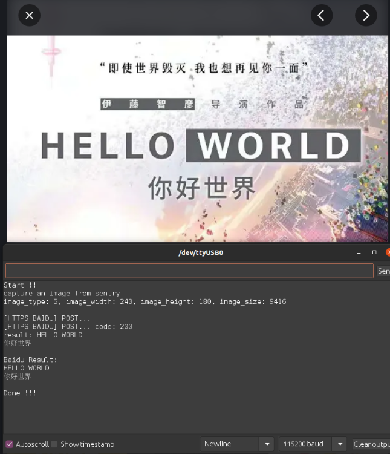  

### Baidu AI - Clasificación general de objetos
Código Arduino → [sentry2_esp8285_baidu_general_by_image.zip](https://tosee.readthedocs.io/en/latest/_downloads/7284a7af7e4b9a7db1b228e1bbae628a/sentry2_esp8285_baidu_general_by_image.zip)

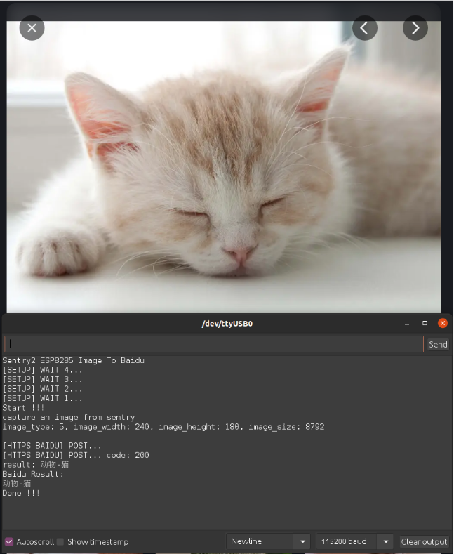  

### Baidu AI - Gestos
Código Arduino → [sentry2_esp8285_baidu_gesture_by_image.zip](https://tosee.readthedocs.io/en/latest/_downloads/42edfbf6498b0b23ad78f1376f2839c0/sentry2_esp8285_baidu_gesture_by_image.zip)

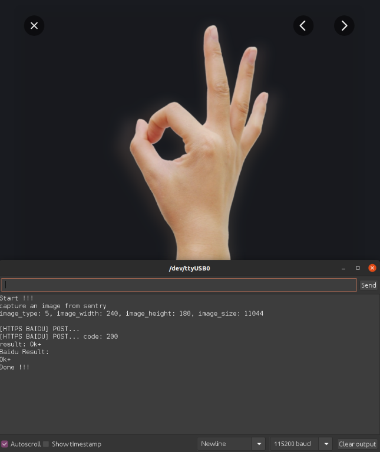  

### Microsoft Azure - Clasificación general de objetos
Necesitas una cuenta de Azure para utilizar esta demostración. Tienes más detalles en la página de inicio de Azure: [https://azure.microsoft.com/es-es/](https://azure.microsoft.com/es-es/)

Código Arduino → [sentry2_esp8285_microsoft_azure_detect_objects_by_image.zip](https://tosee.readthedocs.io/en/latest/_downloads/49df44f30dc9f62cf0fbfd76042c8c3f/sentry2_esp8285_microsoft_azure_detect_objects_by_image.zip)

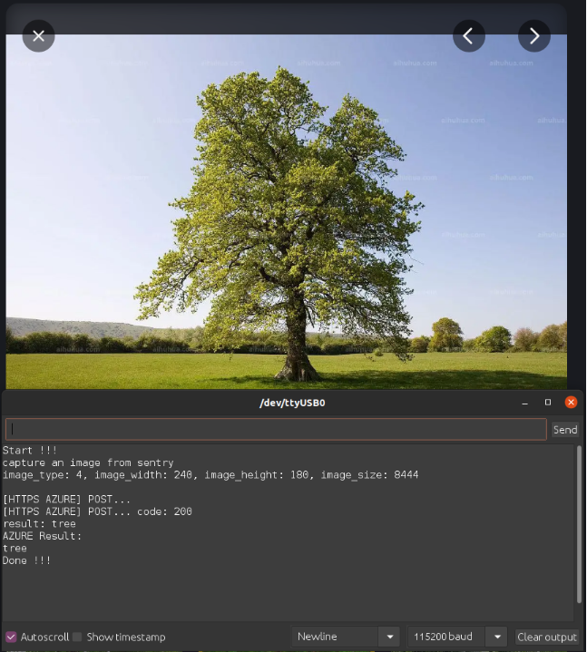  

### Transmisión de imágenes y mando a distancia
Código Arduino → [sentry2_esp8285_image_transfer_remoter.zip](https://tosee.readthedocs.io/en/latest/_downloads/aabff8254bf5d03ddc6e7baba90e057d/sentry2_esp8285_image_transfer_remoter.zip)

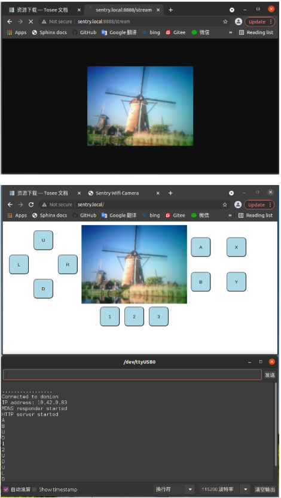  

### Activa visión desde el chip WiFi
Código Arduino → [sentry2_esp8285_run_vision.zip](https://tosee.readthedocs.io/en/latest/_downloads/4b40d0a83f5c0f08d71b5908d30f00b7/sentry2_esp8285_run_vision.zip)

  

