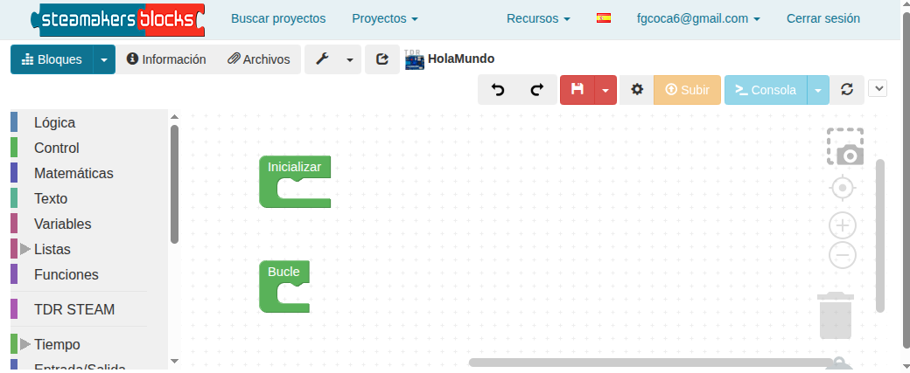

breve entrada al trabajo con el entorno de programación STEAMakersBlocks como sucesor con muchas mejoras del anterior arduinoblocks.

## **Entorno de programación STEAMakersBlocks**
STEAMakersBlocks [https://www.steamakersblocks.com/](https://www.steamakersblocks.com/) es un entorno de programación visual por bloques que facilita la programación de la placa y procede del cambio de nombre de ArduinoBlocks.

!!! Tip "**Para tener en cuenta**"
    * STEAMakersBlocks soporta Connector v6 o posterior.
    * El funcionamiento de proyectos y usuarios es idéntico con la excepción de los nuevos usuarios que inicien sesión con Google debido a que la clave se ignora y el usuario se crea internamente.
    * Todos los enlaces a proyectos compartidos que existen en webs o en documentación seguirán funcionando aunque el enlace será redirigido de arduinoblocks a steamakersblocks.

    ==**PRINCIPALES MEJORAS**==

    * Actualización del framework usado internamente con muchas mejoras internas
    * Desaparece la barra inferior para aprovechar mejor el espacio en la pantalla mejor
    * Mejoras en el diseño "responsive" (diseño web adaptable para que sea accesible desde tablets, smartphones, etc.) para distintos tamaños de pantallas
    * Inicio de sesión con Google
    * Modo "prueba" para proyectos de distintos tipos, para poder programar y hacer pruebas sin tener que crear un proyecto nuevo.
    * Nuevos bloques y funcionalidades

STEAMakersBlocks es compatible con varias placas electrónicas y en su entorno de programación o IDE se pueden distinguir las siguientes partes:

  

<table>
<tr>
  <td>1</td>
  <td>Página principal STEAMakersBlocks</td>
  <td>15</td>
  <td>Configuraciones de STEAMakersBlocks</td>
</tr>
<tr>
  <td>2</td>
  <td>Repositorio de proyectos</td>
  <td>16</td>
  <td>Botón para grabar el programa en la placa una vez conectada</td>
</tr>
<tr>
  <td>3</td>
  <td>Desplegar para acceder a nuestros proyectos y para crear un proyecto nuevo</td>
  <td>17</td>
  <td>Botón para abrir la consola serie. Desplegando podemos abrir serial plotter</td>
</tr>
<tr>
  <td>4</td>
  <td>Acceso a la información del proyecto referente a nombre, descripción, etc.</td>
  <td>18</td>
  <td>Actualización puerto. Muestra puerto cuando hay una placa conectada (/dev/ttyUSBn)</td>
</tr>
<tr>
  <td>5</td>
  <td>Acceso a los archivos adjuntos al proyecto</td>
  <td>19</td>
  <td>Captura de pantalla del programa sin fondo</td>
</tr>
<tr>
  <td>6</td>
  <td>Acceso a herramientas de edición de matrices de leds, pantallas LCD y OLED, Neopixel e información RTTTL</td>
  <td>20</td>
  <td>Espacio para guardar instrucciones y estructuras de programación y reutilizarlas en el proyecto actual o en otro diferente</td>
</tr>
<tr>
  <td>7</td>
  <td>Botón para compartir el proyecto via correo electrónico</td>
  <td>21</td>
  <td>Botón para maximizar el tamaño de los bloques</td>
</tr>
<tr>
  <td>8</td>
  <td>Nombre del proyecto con el icono de la placa seleccionada para programar</td>
  <td>22</td>
  <td>Botón para centrar los bloques</td>
</tr>
<tr>
  <td>9</td>
  <td>Desplegable para acceder a Connector, documentación varia y librerias usadas por la aplicación</td>
  <td>23</td>
  <td>Botón para ampliar el tamaño de los bloques</td>
</tr>
<tr>
  <td>10</td>
  <td>Idioma del IDE de STEAMakersBlocks</td>
  <td>24</td>
  <td>Botón para reducir el tamaño de los bloques</td>
</tr>
<tr>
  <td>11</td>
  <td>Identificación de la cuenta con la que hemos accedido</td>
  <td>25</td>
  <td>Papelera para descartar bloques no usados</td>
</tr>
<tr>
  <td>12</td>
  <td>Cerrar la sesión actual</td>
  <td>26</td>
  <td>Espacio de programación</td>
</tr>
<tr>
  <td>13</td>
  <td>Botones deshacer y rehacer</td>
  <td>27</td>
  <td>Bloques de programación organizados por categorias</td>
</tr>
<tr>
  <td>14</td>
  <td>Botón y un desplegable para guardar y exportar el proyecto</td>
  <td>28</td>
  <td>Desplegable para mostrar el código del programa, descargarlo en formato .ino o descargar en formato .zip (se descargan el programa y las librerias</td>
</tr>
</table>

#### <b>Programando con STEAMakersBlocks</b>
Para poder conectar y programar las placas con STEAMakersBlocks, es necesario instalar STEAMakersBlocks Connector v6 o posterior para permitir la comunicación entre el entorno STEAMakersBlocks y la placa electrónica.

En "Recursos" de "STEAMakersBlocks" tenemos todas las opciones de descarga y condiciones de instalación de “STEAMakersBlocks - Connector” para los sistemas operativos soportados. Para el caso de Ubuntu nos indica:

  

Una vez instalado lo podemos encontrar entre las aplicaciones:

  

Al abrir Connector, aparece este cuadro de diálogo que va mostrando información sobre la placa y arduinoblocks:

  

Dejamos “STEAMakersBlocks-Connector en ejecución minimizado en segundo plano.

#### <b>Comenzando con STEAMakersBlocks</b>
En la página principal de STEAMakersBlocks tenemos una nueva funcionalidad que consiste en crear un proyecto en modo demostración haciendo clic en el botón "Probar ahora".

  

Hacemos una prueba con la placa UNO + la Imagina TdR STEAM:

  

Se crea una ventana que permite realizar un proyecto completo y totalmente funcional en modo demostración, lo que significa que las opciones referentes al menú Proyectos no están disponibles y por tanto no se puede archivar.

  

Si cargamos el proyecto podemos observar su funcionamiento.

#### <b>Proceso con STEAMakersBlocks</b>

<b>1.</b> En STEAMakersBlocks, crea una cuenta pulsando en “Iniciar sesión” en la ventana anterior y, posteriormente, en “nuevo usuario”, o puedes iniciar sesión con tu cuenta de Google:

  

<b>2. </b> Al entrar en la plataforma te encontrarás esta pantalla:

  

<b>3.</b> Al hacer clic en "Empezar un nuevo proyecto!" aparece la siguiente pantalla para seleccionar el tipo de proyecto:

  

<b>4.</b> Para crear un nuevo **proyecto personal**, debes elegir al menos el tipo de proyecto y ponerle un nombre. Si utilizas la placa Keyestudio UNO y la Imagina TdR STEAM, debes seleccionar UNO + ImaginaTdRSTEAM en **Tipo de proyecto**.

  

<b>5.</b> Una vez creado el proyecto, después de haber cumplimentado su nombre y demás campos, se abre el entorno de programación:

  

<b>6.</b> En la parte izquierda de esta pantalla, encontrarás los bloques disponibles clasificados por diferentes categorías. Por ejemplo, en la siguiente imagen puedes ver los bloques de algunos de los sensores que se pueden controlar con el conjunto de placas escogido.

  

<b>7.</b> Arrastra los bloques al espacio de programación para programar tu placa. Por ejemplo, podemos programar el envío en bucle de un mensaje por puerto serie mientras parpadean los LEDs azul y rojo de manera alterna a intervalos de un segundo. El **puerto serie**, también conocido como puerto de comunicaciones serie o interfaz serie, es un tipo de conexión utilizada en ordenadores y dispositivos periféricos para la transferencia de datos. La característica principal del puerto serie es que envía los datos en serie; es decir, bit a bit, a través de un solo canal o hilo. Los bloques más importantes para utilizar el puerto serie son:

  

<b>8.</b> El programa de este ejemplo sería así:

  
*[Descargar el programa Hola mundo](../TdR_STEAM/programas/HolaMundo.abp)*

Dentro de la estructura “**Inicializar**” colocamos el bloque de configuración de la velocidad de transferencia de datos (“**baudrate**”) del puerto serie a 9600. Y en el bucle principal, colocamos el bloque para enviar un mensaje en concreto, seleccionando que se realice un salto de línea. Después de cada mensaje activamos el LED del color indicado en el mismo y apagamos el otro.

<b>9.</b> Una vez creado el programa, debes transferirlo (subirlo) a la placa. Para ello, sigue los siguientes pasos:

* Comprueba que Connector está ejecutańdose.
* Conecta la placa al ordenador mediante un cable USB.
* Selecciona el puerto de comunicación. Puedes conectar y desconectar el cable USB del ordenador para diferenciar cuál es el puerto de comunicación que utiliza la placa.
* Si no aparece el "/dev/ttyACM" directamente, pulsa en el icono de actualización. En entornos Linux, MacOS y Chromebook se muestra así el nombre. En Windows se muestra como COM.

  
*Establecer conexión USB*

* Pulsando en el botón “Subir”, carga el programa en la placa.

  
*Subir el programa a la placa*

Para poder visualizar el monitor serie y comprobar qué mensajes está enviando la placa al ordenador, debes abrirlo en tu entorno de programación, pulsando el botón “Consola”:

  
*Abrir consola serie*

<b>10.</b> Se abrirá la ventana siguiente:

  

#### <b>Bloques específicos TdR STEAM</b>
Los bloques de instrucciones específicos de la placa de extensión o shiel Imagina TdR STEAM son los siguientes:

  

