comenzar a utilizar la placa Imagina TdR STEAM con Keyestudio UNO o con ESP32 STEAMakers, tienes que comprobar que tu ordenador tenga instalados los controladores necesarios. Por ello es aconsejable estudiar antes de nada los contenidos de este apartado.

## **Descripción**

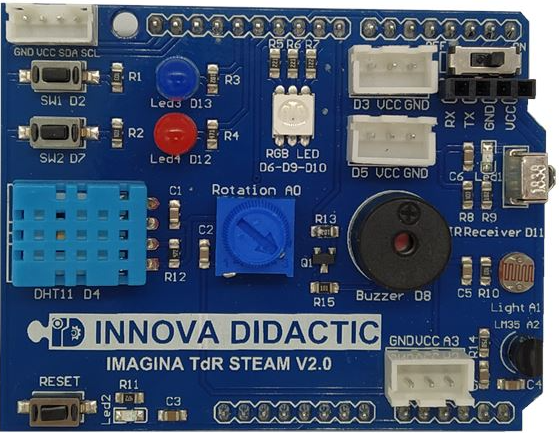  

La placa de extensión Imagina TdR STEAM es un dispositivo electrónico de extensión; por tanto, es una placa que debe ir colocada encima de otra que contenga el sistema de control, como puede ser una placa tipo Arduino, Keyestudio UNO o ESP32 STEAMakers. La placa integra numerosos sensores, actuadores, entradas y salidas.

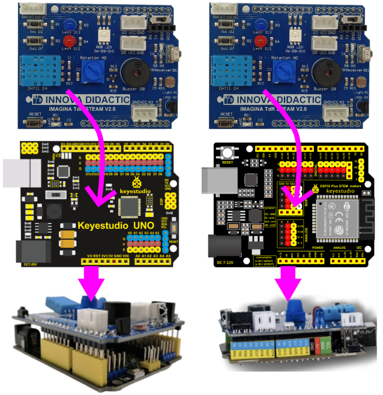  

Esta placa puede programarse mediante diversas plataformas y lenguajes como los entornos de programación visual STEAMakersBlocks, MicroBlocks y Snap4Arduino o Arduino IDE con código basado en C/C++.

## **Componentes de la placa**
Las partes que lo componen las vemos en la imagen siguiente y en los apartados subsiguientes se describen:

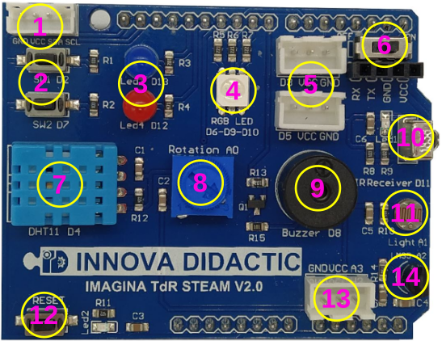  

### **Conexiones**

<b>1. Interfaz I2C</b>  
Interfaz I2C o IIC conectados a los pines VCC, GND, SDA (A4) y SCL (A5). El pin A4 corresponde con SDA (Serial DAta) y es por donde se transmiten los datos en la comunicación I2C. El pin A5 es SCL (Serial CLock) donde está la señal de sincronización o reloj de la comunicación I2C.

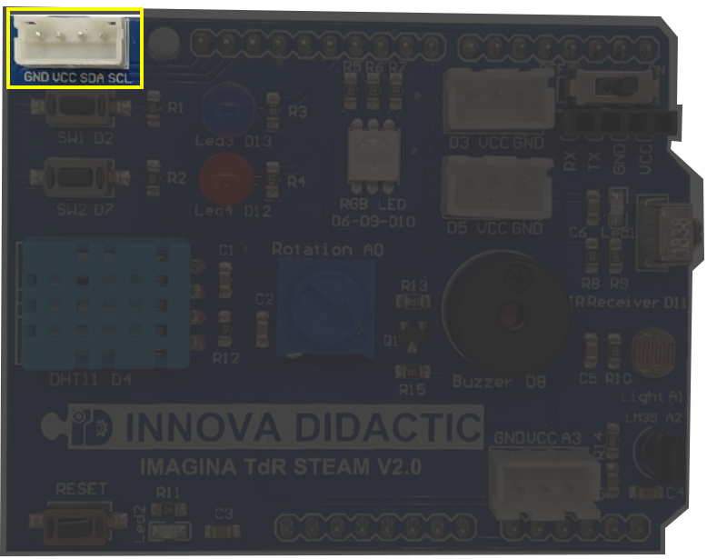  

<b>5. Conectores E/S digital</b>  
Son dos conectores para Entradas/Salidas digitales dotados de alimentación y conectados a los pines D3 y D5. A estos conectores podemos colocarles sensores externos.

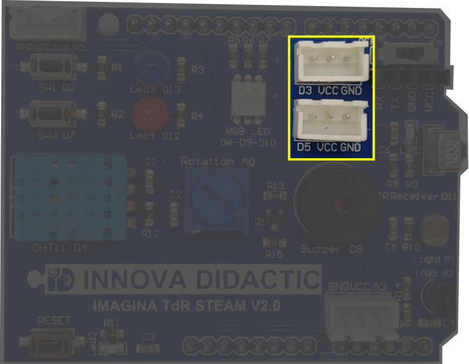  

<b>6. Conector de comunicaciones WiFi Bluetooth</b>  
Conector de comunicaciones Bluetooth y WiFi conectado a los pines D0 (Rx) y D1 (Tx).

El puerto de comunicaciones serie nos permite conectar módulos Bluetooth o WiFi. Este puerto utiliza los mismos pines Rx/Tx que se utilizan para comunicarse con el ordenador.

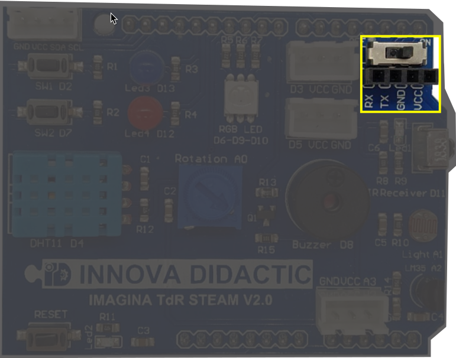  

<b>13. Entrada analógica</b>  
Conector para entrada analógica desde sensor externo conectado al pin A3.

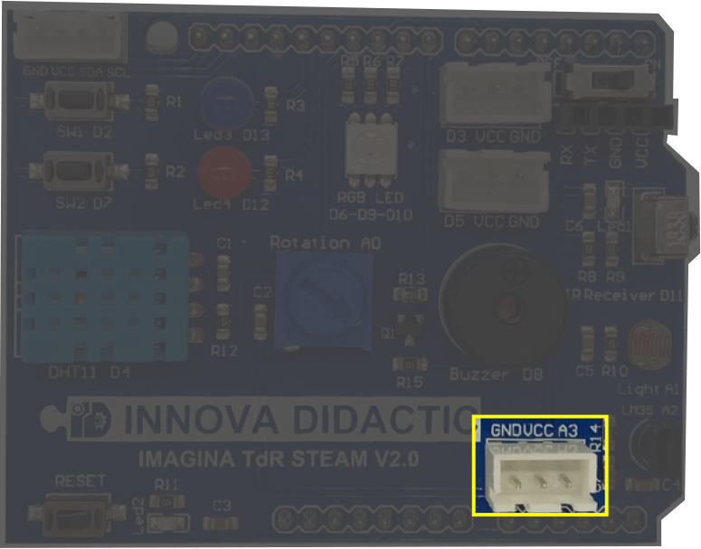  

### **Pulsadores y conmutador**

<b>2. Pulsadores</b>  
Los pulsadores SW1 y SW2 se conectan a D2 y D7 respectivamente y se configuran como entradas digitales con sus correspondientes resistencias de polarización que hacen que cuando están en reposo pongan su entrada digital correspondiente a "0" (cero lógico) y que se ponga a "1" (uno lógico) cuando los accionemos.

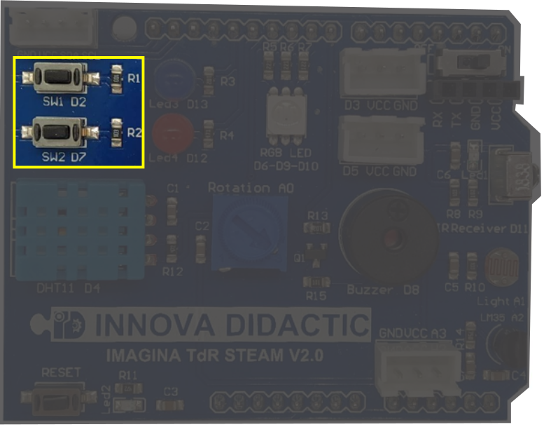  

<b>6. Conmutador de WiFi Bluetooth</b>  
El conector de comunicaciones Bluetooth y WiFi va acompañado de un conmutador (Swich On/Off) para poder conectarlo o desconectarlo ya que utiliza los mismos pines Rx/Tx que se utilizan para comunicarse con el ordenador. Si vamos a subir firmware a la placa debe estar en posición OFF y si vamos a trabajar con Bluetooth o WiFi en posición ON.

  

<b>12. Botón de Inicialización o Reset</b>  
Botón de Reset conectado directamente a la entrada de reset de las placas. Sirve para inicializar el funcionamiento del conjunto.

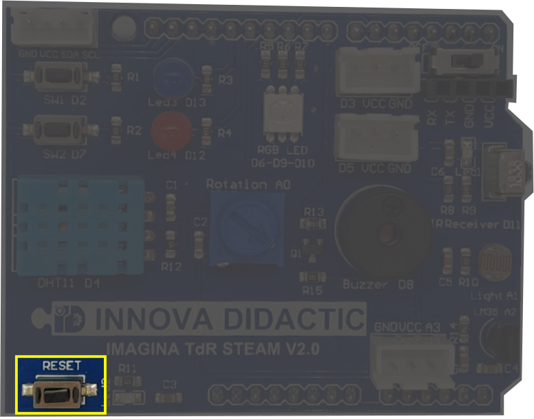  

### **Componentes integrados**

<b>3. Diodos LED</b>  
Diodos LED Azul (LED3) y Rojo (LED4) conectados a D13 y D12 respectivamente. Configurados como salidas con su resistencia limitadora.

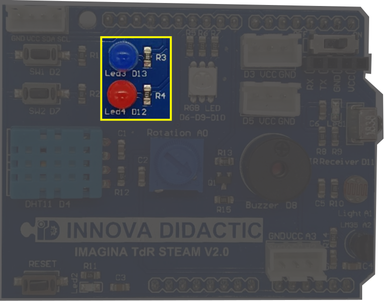  

<b>4. Led RGB</b>  
El Led RGB o neopixel de la placa es del tipo 5050 conectado a los pines D6 (Red), D9 (Green) y D10(Blue). Estos tres pines son PWM y nos van a permitir regular su intensidad.

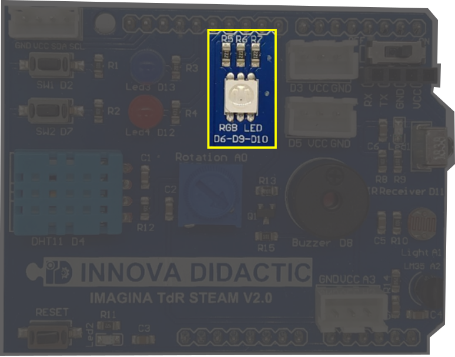  

<b>7. DHT11</b>  
Sensor digital de Temperatura y Humedad DHT11 conectado como entrada a D4.

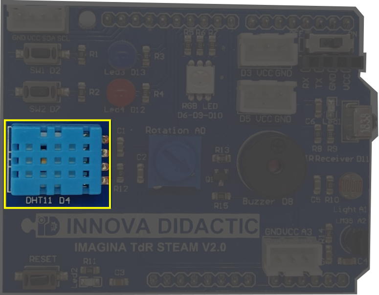  

<b>8. Potenciómetro</b>  
Potenciómetro giratorio de 270º conectado como entrada analógica al pin A0.

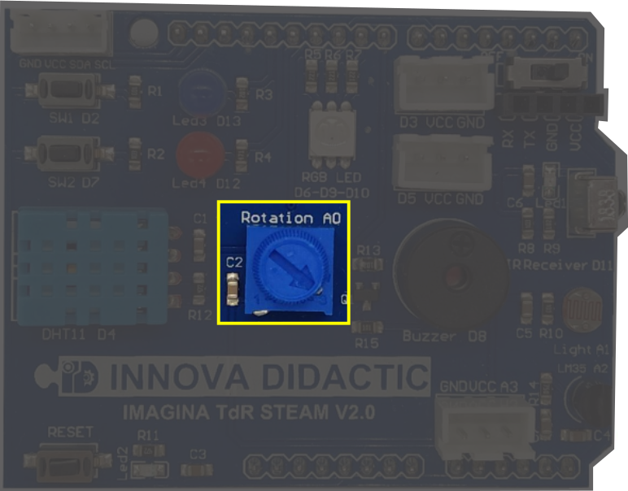  

<b>9. Buzzer</b>  
El zumbador Piezoeléctrico o buzzer es un pequeño altavoz conectado a la salida digital D8.

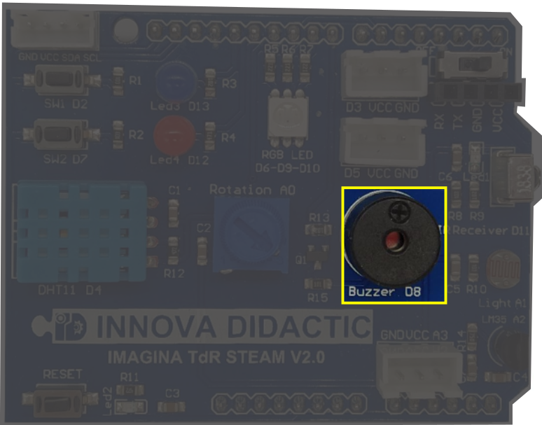  

<b>10. Receptor IR</b>  
Diodo receptor de infrarrojos (IR) conectado a la entrada digital D11.

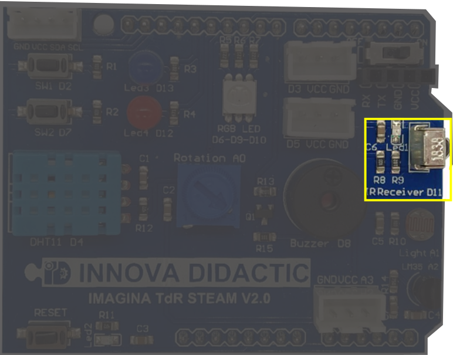  

<b>11. LDR</b>  
Sensor de luminosidad o resistencia LDR conectada al pin analógico A1.

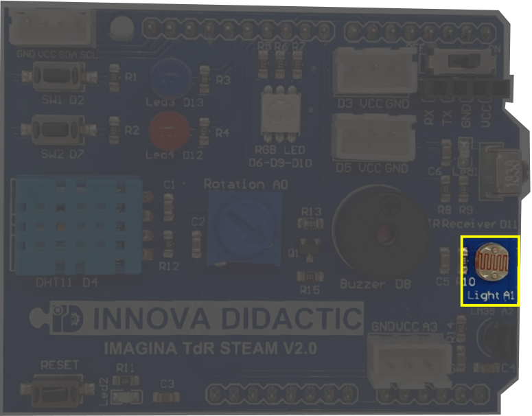  

<b>14. LM35</b>  
Sensor de temperatura (LM35) conectado al pin analógico A2.

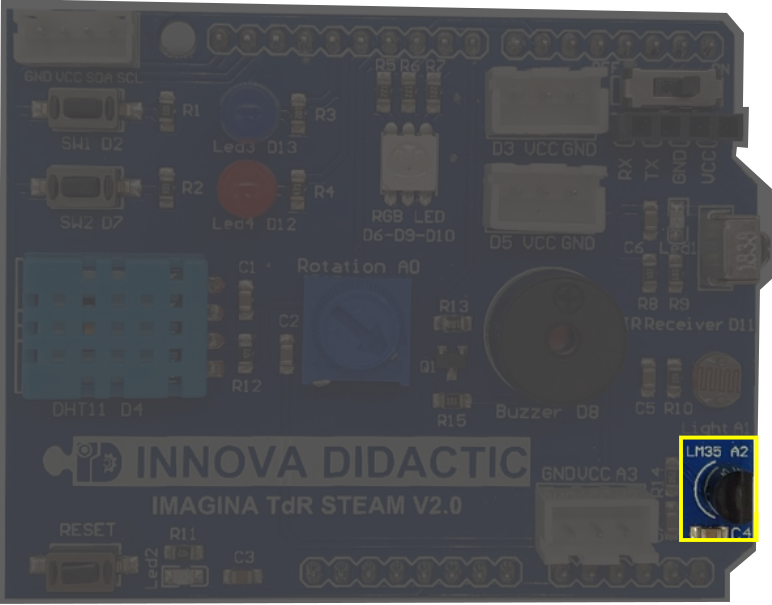  

