Se describe el paso a paso para crear un par de programas de ejemplo de uso del entorno de programación STEAMakersBlocks.

## <b>Semáforo con LED RGB</b>
Crea un programa para que la Imagina TdR STEAM encienda y apague el LED RGB como si de un semáforo de tráfico se tratase.

<b>1.</b> La secuencia de las luces del semáforo debe repetirse de forma infnita, por eso todos los bloques de programación deben colocarse dentro del “bucle” principal.

Para controlar el LED RGB de la placa Imagina TdR STEAM, utiliza los bloques que aparecen en el apartado “TDR STEAM” de STEAMakersBlocks en color púrpura. Accede a este apartado y encontrarás los bloques correspondientes a la placa Imagina TDR STEAM.

<b>2.</b> Busca el bloque “Led RGB Color” y arrástralo hasta colocarlo dentro del bloque “Bucle”. Modifica el color del mismo para establecer el color con el que quieres que empiece el semáforo. Ante todo, programa que al empezar se encienda la luz verde.

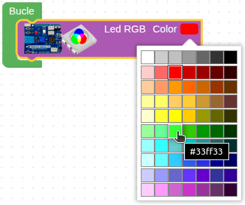  

<b>3.</b> En este momento el programa deberá estar así:

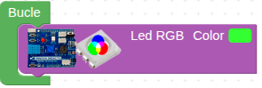  

<b>4.</b> Para controlar el tiempo que quieres que esté encendida cada luz, utiliza el bloque “**Esperar xxxx milisegundos**” que encontrarás en la categoría **“Tiempo”**. En este bloque puedes modifcar el tiempo de espera, pero hay que tener en cuenta que se trata de milisegundos (un segundo equivale a 1.000 milisegundos). Arrastra el bloque “**Esperar X milisegundos**”, colócalo debajo del bloque de encender la luz verde e indica cuánto tiempo debe estar encendida. En nuestro caso, pondremos 5 segundos (5.000 milisegundos). Este par de bloques deberían estar colocados dentro del bucle de esta forma:

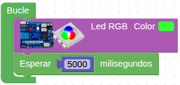  

<b>5.</b> Ahora es momento de dar paso al LED amarillo. Vas a hacer que el LED parpadee 3 veces con esperas de 500 milisegundos entre apagado y encendido. Arrastra el bloque "**Repetir xx veces**" de la categoria "**Control**" y configuralo a tres. Ahora, vuelve a arrastrar el bloque “LED RGB Color” dentro del bloque repetir y cambia el color a amarillo. Coloca una espera de 500 milisigundos a continuación y coloca debajo un nuevo bloque “LED RGB Color” al que debes configurar el color a negro (apagado) y tras este repite el retardo de 500 milisegundos. El programa en este momento estará así:

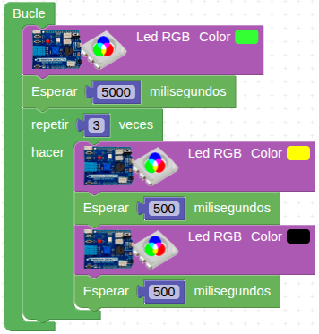  

<b>6.</b> Termina el programa haciendo el último cambio de luz del semáforo al rojo. Vuelve a añadir el bloque “LED RGB Color”, esta vez seleccionando el color rojo y el bloque “Esperar xxxx milisegundos” para hacer una pausa de 5000 milisegundos. Con esto habrás terminado el programa, ya que el bucle volverá a iniciarse encendiendo la luz verde que has programado al principio de la secuencia.

Éste es el programa completo:

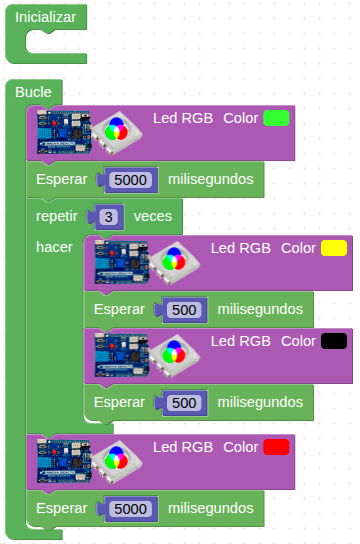  
*[Descarga Semáforo con LED RGB](../TdR_STEAM/programas/Semaforo.abp)*

<b>7.</b> Finalmente, descarga el programa en la placa haciendo clic en el botón "**Subir**" situado en la parte superior derecha del editor y observa el funcionamiento.

## <b>¿Que temperatura y humedad hay?</b>
Crea un programa con STEAMakersBlocks que lea la temperatura y la humedad ambiental mediante el sensor de la placa y muestre estos valores por la consola serie cada 3 segundos.

<b>1.</b> Utiliza los siguientes bloques de programación para realizar este reto:

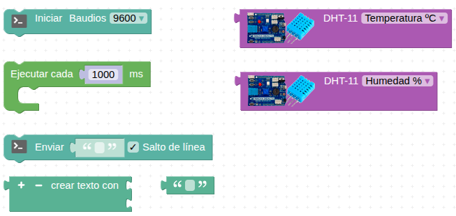  

<b>2.</b> Comienza el programa confgurando el puerto serie a una tasa de baudios (velocidad de transferencia de datos) de 9600. Coloca el bloque “**Iniciar Baudios**” de la categoría “**Comunicaciones” → “Puerto serie**” dentro de la estructura “**Inicializar**”, para que se ejecute esta instrucción al inicio del programa y sólo una vez.

La programación del bloque “**Inicializar**” debería quedarte así:

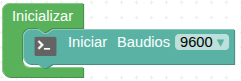  

<b>3.</b> Seguidamente, coloca, dentro del Bucle principal, la estructura de programación "**Ejecutar cada X ms**" de la categoría "**Tiempo**" para indicar al programa cada cuánto quieres ejecutar una acción. Escribe “***3000***” en el parámetro de la estructura “**Ejecutar cada X ms**” para que se ejecute cada 3 segundos.

La estructura de programación debería quedar así:

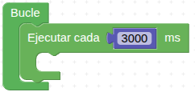  

<b>4.</b> Coloca, dentro de esta estructura, un bloque de la categoría “**Comunicaciones → Puerto serie**”, el bloque “**Enviar**” para llevar a cabo, en la frecuencia de tiempo especifcada, la tarea de enviar un mensaje por el puerto en serie.

El mensaje a enviar, con la información sobre la temperatura, puede constar de varios elementos, en este caso pondrás tres: un texto que será “**Temperatura:**”, el **valor numérico que lea el sensor** de temperatura y otro texto que sea “**ºC**”.

<b>5.</b> Para poder colocar los tres bloques a la vez en la instrucción de enviar, necesitas el bloque “**crear texto con**” del apartado “**Texto**”. Arrastra este bloque dentro del bloque “**Enviar**”, de modo que encajen como si se tratara de un rompecabezas:

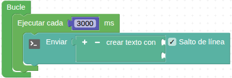  

<b>6.</b> De nuevo, en el apartado “**Texto**”, encontrarás el primer bloque que te permitirá escribir lo que quieres. Tendrás que arrastrarlo al primer espacio que te permite el bloque “**Crear texto con**” y tendrás que escribir “**Temperatura:** ”:

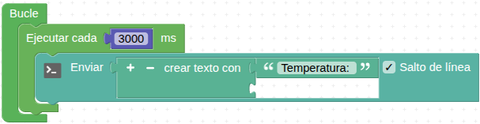  

<b>7.</b> A continuación tienes que añadir el bloque que te permita escribir la lectura de la temperatura. El bloque para hacerlo es el que lee el sensor “**DHT-11**” y lo encontrarás en la categoría “**TDR STEAM**”.

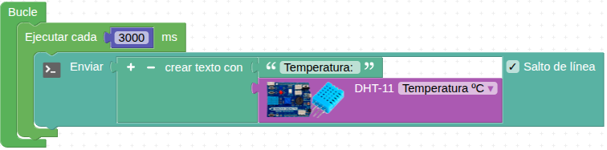  

<b>8.</b> Por último, debes añadir las unidades. Como no tienes espacios para añadir otro bloque, debes clicar en el icono “+” del bloque “**crear texto con**” para que añada un tercer espacio:

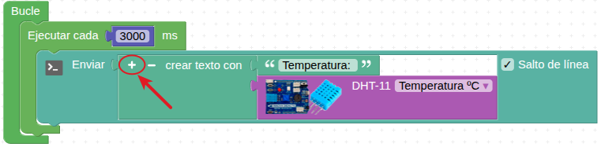  

<b>9.</b> Una vez pulsado, podrás añadir el último bloque de texto y escribir las unidades. También debes asegurarte de que el salto de línea esté activado, para que cada vez que muestre el mensaje por el monitor en serie sea en una línea nueva.

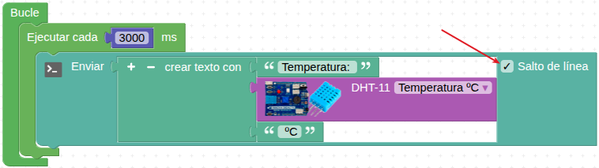  

<b>10.</b> Repite el proceso para añadir el envío de la lectura de la humedad. Tendrás que fijarte en que el bloque del sensor “DHT-11” indica la lectura de la humedad en vez de la temperatura:

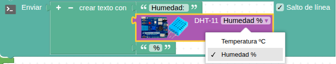  

<b>11.</b> El programa completo queda así:

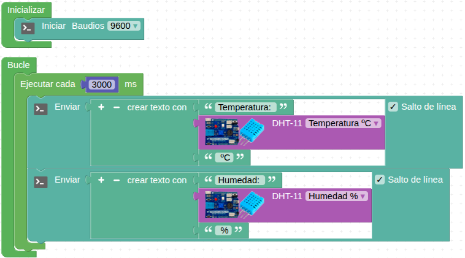  
*[Descargar programa Temperatura y humedad](../TdR_STEAM/programas/Temperatura_humedad.abp)*

<b>12.</b> Descarga el programa en la placa de control pulsando el botón “**Subir**” situado en la parte superior derecha del editor. Asegúrate de que la placa está conectada con un cable USB al ordenador y abre la “**Consola**” serie para visualizar el envío del mensaje de forma periódica.

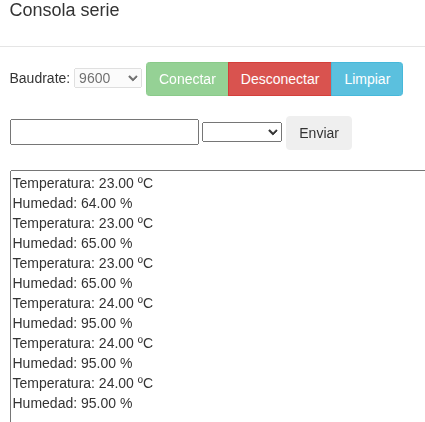  

