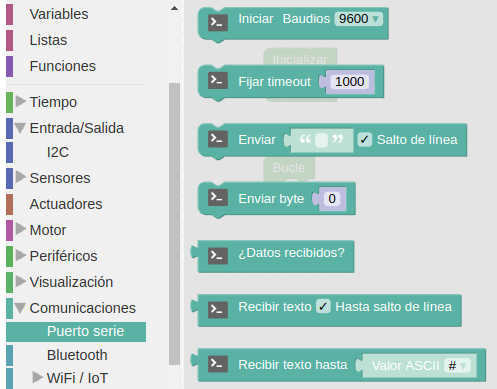
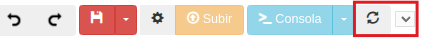
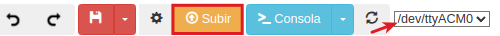
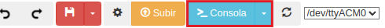
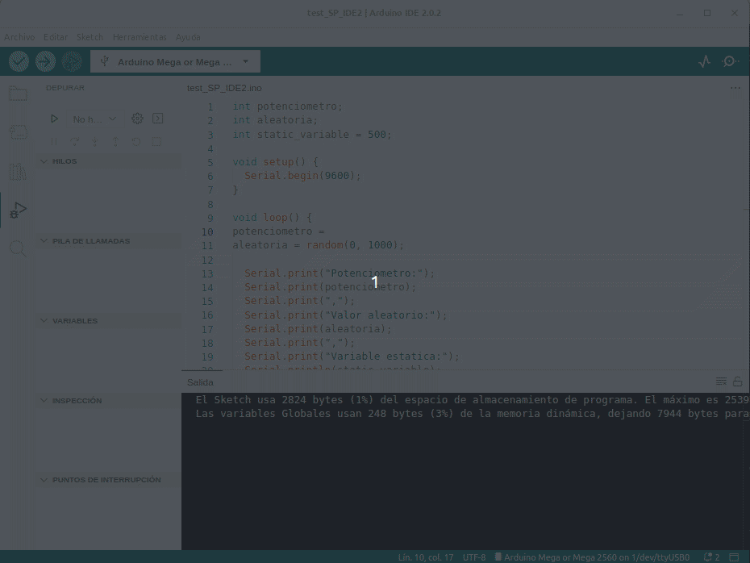

comenzar a utilizar la placa Keyestudio UNO, tienes que comprobar que tu ordenador tenga instalados los controladores necesarios. Por ello es aconsejable estudiar antes de nada los contenidos de este apartado.

## **Descripción**

  
*Placa Keyestudio UNO con conector de 3 pines*

La placa Keyestudio UNO es una placa basada en el microcontrolador ATmega328P, con la diferencia sobre la versión estándar, de que incorpora una interfaz de tres pines (GND, VCC, Señal) para cada una de las entradas y salidas de la placa. Esto facilita enormemente la conexión de sensores y actuadores sin la necesidad de utilizar una protoboard.

Los pines de Señal (S) se corresponden con los 14 pines digitales y los 6 pines analógicos. Los pines GND (G) se corresponden con masa. Los pines VCC (V) a la tensión de los mismos. Puedes controlar el voltaje VCC mediante un interruptor deslizante para ponerlo a 5V o 3.3V.

Cuando se sitúa a 5V, el nivel en el puerto de comunicación serie es de 5V, el voltaje de los pines es de 5V. Cuando se cambia a 3.3V, el nivel en el puerto de comunicación serie es de 3.3V, el voltaje de los pines es de 3.3V.

También, de forma separada hay dos conjuntos de cuatro pines para comunicación serie y comunicación IIC o I2C.

Esta placa keyestudio UNO con pines, el chip regulador de voltaje es el MP2307DN. Cuando se conecta a la alimentación externa, la salida de 5V, la corriente es de 2A.

Esta placa puede programarse mediante diversas plataformas y lenguajes, como Arduino IDE con código basado en C/C++ o entornos de programación visual como ArduinoBlocks y MicroBlocks.

## **Componentes de la placa**

  
*Componentes de la placa Keyestudio UNO con conector de 3 pines*

1. **Conector ICSP (In-Circuit Serial Programming)**. ICSP consta de MOSI, MISO, SCK, RESET, VCC y GND para programar el firmware para ATMEGA 16U2-MU. Este circuito integrado USB a chip, puede convertir la señal USB en señal de puerto serie.
2. **Conector USB-B**. Puedes alimentar la placa a través de la conexión USB o bien puedes cargar los programas a la placa a través del puerto USB. Conecta la placa al PC mediante un cable USB a través del puerto USB.
3. **Conmutador deslizante**. Permite controlar el voltaje en los pines V (VCC) entre 3.3V or 5V.
4. **Regulador de tensión**. Se encarga de convertir la tensión externa de entrada (**5. Conector alimentación DC**) de entre 7 y 12V en 5V si el conmutador está en esa posición. Con la salida a 5V la corriente máxima es de 2A.
5. **5. Conector alimentación DC**. La placa se puede alimentar con una tensión continua externa de 7 a 12V desde la toma de alimentación DC.
6. **Pines G,V,S (GND, VCC, Señal)**. La placa UNO tiene 6 entradas analógicas, etiquetadas desde A0 a A5. También se pueden utilizar como pines digitales, A0=D14, A1=D15, A2=D16, A3=D17, A4=D18, A5=D19. Estos pines analógicos se pueden conectar mediante conectores hembra tipo dupont individuales o de 2,54mm de paso. Selecciona la tensión de 3,3 V o 5 V mediante el interruptor deslizante.
7. **Pines de alimentación**. Pin **IOREF**, de escasa utilización, para configurar la tensión de funcionamiento del microcontrolador. **RESET** para conectar a un botón externo de reinicio. **3V3** que proporciona una salida de tensión de 3,3 V. **5V** que proporciona una salida de tensión de 5 V. **Vin** es un pin para suministrar a la placa una entrada de tensión externa DC7-12V.
8. **Pines analógicos**. La placa UNO tiene 6 entradas analógicas, etiquetadas desde A0 a A5. También se pueden utilizar como pines digitales, A0=D14, A1=D15, A2=D16, A3=D17, A4=D18, A5=D19. Estos pineas analógicos se pueden conectar mediante conectores macho tipo dupont individuales.
9. **Pines I2C**. Conector para comunicaciones I2C de 4 pines (GNC, VCC, SDA y SCL).
10. **Botón de RESET**. Puedes reiniciar la placa para comenzar el programa desde el estado inicial.
11. **Microcontrolador**. Cada placa de control tiene su propio microcontrolador o cerebro de la placa. Antes de cargar un nuevo programa debes saber qué circuito integrado hay en tu placa. Esta información se puede comprobar en la parte superior del integrado. El microcontrolador utilizado en esta placa es el [ATMEGA328P-AU](https://ww1.microchip.com/downloads/en/DeviceDoc/Atmel-7810-Automotive-Microcontrollers-ATmega328P_Datasheet.pdf).
12. **Conector ICSP (In-Circuit Serial Programming)**. ICSP consta de MOSI, MISO, SCK, RESET, VCC y GND para programar el firmware para ATMEGA328P-AU.
13. **Comunicación serie**. Para conectar la comunicación serie. 4Pines (GND, VCC, RX, TX).
14. **Entradas salidas digitales**. Dispone de 14 pines digitales de entrada/salida, etiquetados de D0 a D13 (de los cuales 6 pueden utilizarse como salidas PWM). Estos pines se pueden configurar como pines de entrada digital para leer el valor lógico (0 o 1); o utilizarse como pines de salida digital para accionar diferentes módulos como LED, relé, etc. Los pines D3, D5, D6, D9, D10 y D11 son PWM. Se pueden conectar mediante dupont macho.
15. **Pines I2C**. Pines para comunicaciones I2C de 4 pines (GNC, VCC, SDA y SCL).
16. **Pines G,V,S (GND, VCC, Señal)**. La placa UNO tiene 14 pines digitales de entrada/salida, etiquetados de D0 a D13 (de los cuales 6 pueden utilizarse como salidas PWM). Los pines D3, D5, D6, D9, D10 y D11 son PWM. Estos pines digitales se pueden conectar mediante conectores hembra tipo dupont individuales o de 2,54mm de paso. Selecciona la tensión de 3,3 V o 5 V mediante el interruptor deslizante.

## **Posibilidades de la placa**
La placa UNO tiene una disposición versátil de conectores y una amplia variedad de entradas y salidas. Esto permite crear de forma sencilla toda clase de proyectos interactivos con sensores, actuadores y comunicaciones inalámbricas.

Algunos ejemplos de proyectos que se pueden realizar en el aula:

* **MEDIR LA TEMPERATURA**

Mediante un sensor de temperatura tipo DHT11 o DHT22 se puede obtener el valor de la temperatura y la humedad en el entorno cercano al sensor. Se puede mostrar a través de una pantalla o enviarlo a un broker o servidor.

* **DETECTAR EL NIVEL DE LUZ**

A través de un sensor de luz conectado a una de las entradas analógicas de la placa, se puede medir la intensidad lumínica de un espacio y activar actuadores en función de si hay más o menos claridad.

* **DETECTAR PROXIMIDAD O MOVIMIENTO**

Mediante un sensor de tipo Hall (magnético) o un sensor de ultrasonidos conectado a una entrada se puede detectar cuándo un objeto o persona se acerca o se aleja de la placa.

* **REPRODUCIR AUDIO**

Empleando un zumbador se pueden generar tonos y melodías que puedan formar parte de una experiencia interactiva.

## **Entorno de programación**
### Arduinoblocks
ArduinoBlocks [http://www.arduinoblocks.com](http://www.arduinoblocks.com/) es un entorno de programación visual por bloques que facilita la programación de la placa.

ArduinoBlocks es compatible con varias placas electrónicas, entre ellas la placa Keyestudio UNO. En su entorno de programación o IDE se pueden distinguir las siguientes partes:

  
*Entorno de programación o IDE de arduinoblocks*

<table>
<tr>
  <td>1</td>
  <td>Página principal arduinoblocks</td>
  <td>15</td>
  <td>Configuraciones de arduinoblocks</td>
</tr>
<tr>
  <td>2</td>
  <td>Repositorio de proyectos</td>
  <td>16</td>
  <td>Botón para grabar el programa en la placa una vez conectada</td>
</tr>
<tr>
  <td>3</td>
  <td>Desplegar para acceder a nuestros proyectos y para crear un proyecto nuevo</td>
  <td>17</td>
  <td>Botón para abrir la consola serie. Desplegando podemos abrir serial plotter</td>
</tr>
<tr>
  <td>4</td>
  <td>Acceso a la información del proyecto referente a nombre, descripción, etc.</td>
  <td>18</td>
  <td>Actualización puerto. Muestra puerto cuando hay una placa conectada (/dev/ttyUSBn)</td>
</tr>
<tr>
  <td>5</td>
  <td>Acceso a los archivos adjuntos al proyecto</td>
  <td>19</td>
  <td>Captura de pantalla del programa sin fondo</td>
</tr>
<tr>
  <td>6</td>
  <td>Acceso a herramientas de edición de matrices de leds, pantallas LCD y OLED, Neopixel e información RTTTL</td>
  <td>20</td>
  <td>Espacio para guardar instrucciones y estructuras de programación y reutilizarlas en el proyecto actual o en otro diferente</td>
</tr>
<tr>
  <td>7</td>
  <td>Botón para compartir el proyecto via correo electrónico</td>
  <td>21</td>
  <td>Botón para maximizar el tamaño de los bloques</td>
</tr>
<tr>
  <td>8</td>
  <td>Nombre del proyecto con el icono de la placa seleccionada para programar</td>
  <td>22</td>
  <td>Botón para centrar los bloques</td>
</tr>
<tr>
  <td>9</td>
  <td>Desplegable para acceder a Connector, documentación varia y librerias usadas por la aplicación</td>
  <td>23</td>
  <td>Botón para ampliar el tamaño de los bloques</td>
</tr>
<tr>
  <td>10</td>
  <td>Idioma del IDE de arduinoblocks</td>
  <td>24</td>
  <td>Botón para reducir el tamaño de los bloques</td>
</tr>
<tr>
  <td>11</td>
  <td>Identificación de la cuenta con la que hemos accedido</td>
  <td>25</td>
  <td>Papelera para descartar bloques no usados</td>
</tr>
<tr>
  <td>12</td>
  <td>Cerrar la sesión actual</td>
  <td>26</td>
  <td>Espacio de programación</td>
</tr>
<tr>
  <td>13</td>
  <td>Botones deshacer y rehacer</td>
  <td>27</td>
  <td>Bloques de programación organizados por categorias</td>
</tr>
<tr>
  <td>14</td>
  <td>Botón y un desplegable para guardar y exportar el proyecto</td>
  <td>28</td>
  <td>Desplegable para mostrar el código del programa, descargarlo en formato .ino o descargar en formato .zip (se descargan el programa y las librerias</td>
</tr>
</table>

#### <b>Programando con arduinoblocks</b>
Para poder conectar y programar la placa Keyestudio UNO con arduinoblocks, es necesario instalar “AB-Connector” para permitir la comunicación entre el entorno arduinoblocks y la placa electrónica.

En "Recursos" de "arduinoblocks" tenemos todas las opciones de descarga y condiciones de instalación de “AB-Connector” para los sistemas operativos soportados. Para el caso de Ubuntu nos indica:

  
*AB-Connector*

Una vez instalado lo podemos encontrar entre las aplicaciones:

  
*AB-Connector*

Al abrir AB-Connector, aparece este cuadro de diálogo que va mostrando información sobre la placa y arduinoblocks:

  
*AB-Connector en ejecución*

Dejamos AB-Connector en ejecución minimizado en segundo plano.

<b>1.</b> En ArduinoBlocks, crea una cuenta pulsando en “Iniciar sesión” y, posteriormente, en “nuevo usuario”:

  
*Pantalla inicial arduinoblocks*

<b>2. </b> Al entrar en la plataforma te encontrarás esta pantalla:

  
*Sesión iniciada en arduinoblocks*

<b>3.</b> Al hacer clic en "Empezar un nuevo proyecto!" aparece la siguiente pantalla para seleccionar el tipo de proyecto:

  
*Nuevo proyecto*

<b>4.</b> Para crear un nuevo **proyecto personal**, debes rellenar un formulario. Si utilizas la placa Keyestudio UNO, debes seleccionar UNO en **Tipo de proyecto**.

  
*Tipo de proyecto*

<b>5.</b> Una vez creado el proyecto, después de haber cumplimentado su nombre y demás campos del formulario, se abre el entorno de programación:

  
*Proyecto creado*

<b>6.</b> En la parte izquierda de esta pantalla, encontrarás los bloques disponibles clasificados por diferentes categorías. Por ejemplo, en la siguiente imagen puedes ver los bloques de algunos de los sensores que se pueden controlar con la placa Keyestudio UNO.

  
*Algunos bloques de sensores*

<b>7.</b> Arrastra los bloques al espacio de programación para programar tu placa. Por ejemplo, podemos programar el envío en bucle de un mensaje por puerto serie. El **puerto serie**, también conocido como puerto de comunicaciones serie o interfaz serie, es un tipo de conexión utilizada en ordenadores y dispositivos periféricos para la transferencia de datos. La característica principal del puerto serie es que envía los datos en serie; es decir, bit a bit, a través de un solo canal o hilo. Los bloques más importantes para utilizar el puerto serie son:

  
*Bloques puerto serie*

<b>8.</b> El programa de este ejemplo sería así:

  
*Programa Hola mundo. [Descargar](../UNO/programas/HolaMundo.abp)*

Dentro de la estructura “**Inicializar**” colocamos el bloque de configuración de la velocidad de transferencia de datos (“**baudrate**”) del puerto serie a 9600. Y en el bucle principal, colocamos el bloque para enviar un mensaje en concreto, seleccionando que se realice un salto de línea. Para que el mensaje no se muestre tan rapidamente hacemos que se reproduzca cada cierto tiempo.

<b>9.</b> Una vez creado el programa, debes transferirlo (subirlo) a la placa. Para ello, sigue los siguientes pasos:

* Comprueba que AB-Connector está ejecutańdose.
* Conecta la placa al ordenador mediante un cable USB.
* Selecciona el puerto de comunicación. Puedes conectar y desconectar el cable USB del ordenador para diferenciar cuál es el puerto de comunicación que utiliza la placa.
* Si no aparece el "/dev/ttyACM" directamente, pulsa en el icono de actualización. En entornos Linux, MacOS y Chromebook se muestra así el nombre. En Windows se muestra como COM.

  
*Establecer conexión USB*

* Pulsando en el botón “Subir”, carga el programa en la placa.

  
*Subir el programa a la placa*

Para poder visualizar el monitor serie y comprobar qué mensajes está enviando la placa al ordenador, debes abrirlo en tu entorno de programación, pulsando el botón “Consola”:

  
*Abrir consola serie*

<b>10.</b> Se abrirá la ventana siguiente:

  
*Consola serie*

<b>11.</b> Selecciona la tasa de baudios (velocidad de transmisión de datos) con la que has iniciado el puerto serie y después haz clic en conectar. Verás el resultado en pantalla.

  
*Consola serie recibiendo datos*

### Arduino IDE
Arduino IDE es un Entorno de Desarrollo Integrado multiplataforma (Linux, Windows y macOS) ideal para programar placas tipo Arduino y compatibles, como es el caso de la placa Keyestudio UNO, con un lenguaje de programación basado en C/C++.

IDE (Integrated Development Environment, traducido como Entorno Integrado de Desarrollo) incorpora un editor de código que facilita la escritura de programas. También dispone de numerosas bibliotecas y ejemplos que ayudan a la programación.

Permite compilar y subir los programas a la placa con tan sólo un clic, visualizando el resultado a través del monitor serie, por ejemplo.

En el entorno de programación se pueden distinguir las siguientes partes:

#### ==Descarga==
Podemos descargarlo desde la [página de software de Arduino IDE 2.0](https://www.arduino.cc/en/software) y en el momento de creación de este apartado de la web nos ofrece la versión 2.3.2 además de los enlaces al editor online, tal y como vemos en la figura siguiente.

  
*Descargas*

En esta página tenemos disponibles las versiones Nightly y otras informaciones importantes como:

* La versión de escritorio no está disponible para Chromebook donde deberemos trabajar con el [editor web de Arduino](https://create.arduino.cc/editor/).
* Es posible programar las placas utilizando MicroPython. En la página [MicroPython with Arduino](https://docs.arduino.cc/micropython) tenemos toda la información.
* Opciones de descarga de versiones anteriores del IDE.
* Términos de servicio

Si tenemos alguna duda podemos seguir el tutorial en inglés de [descarga e instalación de Arduino IDE 2.0](https://docs.arduino.cc/software/ide-v2/tutorials/getting-started/ide-v2-downloading-and-installing).

#### ==Ventana principal del IDE==
En la figura siguiente vemos el aspecto que presenta el IDE en la versión 2.0.

  
*Arduino IDE 2.0*

A continuación se describen de forma rápida los apartados señalados en la figura anterior.

1. Verify/Upload (Verificar/Cargar): Para compilar y cargar el código en la placa.
2. Select board & port (Seleccionar placa y puerto): En el desplegable se muestran las placas detectadas de forma automática, junto con el puerto asignado.
3. Open Serial Plotter (abrir trazador seríe): Abre la herramienta de graficado como una nueva ventana.
4. Open Serial Monitor (abrir el monitor serie): abre la herramienta Serial Monitor, como una nueva pestaña en la consola.
5. Sketchbook (Carpeta de programas): es el directorio o carpeta donde se almacenan localmente los programas. Además, desde aquí se puede sincronizar con Arduino Cloud y también obtener los sketch del entorno online.
6. Boards Manager (Administrador de placas): para explorar los paquetes de Arduino y de terceros que se pueden instalar. Por ejemplo, usar una placa MKR WiFi 1010 requiere tener instalado el paquete *Arduino SAMD Boards*.
7. Library Manager (Ad https://docs.arduino.cc/software/ide-v2./img/teo-basica/soft/ministrador de librerías): Para navegar por las librerías propias de Arduino y las creadas por la comunidad.
8. Debugger (Depurador): Para probar y depurar programas en tiempo real.
9. Search (Buscar): búsqueda de palabras en el código.

#### ==Características principales del IDE 2.0==

* <b>Ajustar preferencias</b>  
En la animación de la figura siguiente vemos como acceder a la configuración de las mismas y también como se realiza algún ajuste adicional.

  
*Preferencias IDE 2.0*

* <b>La carpeta de programas</b>  
Los programas o sketches de Arduino se guardan como .ino y deben almacenarse en una carpeta con el mismo nombre. Por ejemplo, un programa de nombre 'mi_programa.ino' debe almacenarse en una carpeta llamada 'mi_programa'. Generalmente se guardan en una carpeta de nombre 'Arduino' en la carpeta personal.  
En la animación siguiente vemos como abrir y cerrar esta carpeta desde el botón de la barra lateral y como nos muestra el contenido

  
*Carpeta de programas*

* <b>Administrador de placas</b>  
Con el Administrador de placas se pueden buscar e instalar paquetes o "núcleos" para nuestras placas. Compilar y cargar un programa en una placa siempre requiere un paquete de la placa. Hay muchos paquetes de placa Arduino disponibles, como avr, samd, megaav y muchos más.  
Podemos decir que un "núcleo" está escrito y diseñado para microcontroladores específicos y sabemos que las diferentes placas tienen micros de diferentes tipos. Por ejemplo, un Arduino UNO tiene un **ATmega328P**, que usa el **núcleo AVR**, mientras que un Arduino Nano 33 IoT tiene un microcontrolador **SAMD21**, donde necesitamos usar el **núcleo SAMD**. En definitiva, para poder usar una placa concreta debemos instalar su núcleo específico.  
Al hacer clic en el botón de la barra lateral se nos abren todas las opciones disponibles y ne indica si están o no instalados y además dispone de un buscador que permite localizar el núcleo que necesitamos. Hay que tener presente que la instalación de algunos de ellos puede tardar varios minutos.  
En la animación vemos el funcionamiento de este botón.

  
*Administrador de placas*

* <b>Gestor de librerías</b>  
Este botón nos permite buscar e instalar librerías, que son extensiones de la API de Arduino que facilitan el control de un servo, leer un sensor específico o utilizar un módulo WiFi.  
En la animación vemos como utilizar este botón.

  
*Gestor de librerías*

* <b>Monitor serie</b>  
Esta herramienta que habitualmente estaba en una ventana separada ahora se integra en el editor. La herramienta sirve para comunicarse con la placa o para depurar programas.  
Una ventaja de tener el Serial Monitor integrado con el editor es la posibilidad de tener múltiples monitores abiertos simultáneamente. En el editor antiguo, al cambiar el puerto/placa, cambiaba en todas las ventanas. Además, estábamos limitados a una ventana de Serial Monitor, un obstáculo que el IDE 2.0 elimina.  
En la animación vemos el uso básico del mismo.

  
*Monitor serie*

Para obtener más información sobre Serial Monitor podemos visitar el [Serial Monitor tutorial](https://docs.arduino.cc/software/ide-v2/tutorials/ide-v2-serial-monitor).

* <b>Serial Plotter</b>  
Nos permite visualizar datos utilizando gráficos permitiendo monitorizar varias variables de manera simultanea. Para ver mejor el funcionamiento de este elemento vamos a utilizar un potenciómetro conectado al pin analógico A3 junto con una variable estática y una aleatoria. El código del ejemplo es:

~~~C++
int potenciometro;
int aleatoria;
int static_variable = 500;

void setup() {
  Serial.begin(9600);
}

void loop() {
potenciometro = analogRead(A3);
aleatoria = random(0, 1000);
  Serial.print("Potenciometro:");
  Serial.print(potenciometro);
  Serial.print(",");
  Serial.print("Valor aleatorio:");
  Serial.print(aleatoria);
  Serial.print(",");
  Serial.print("Variable estatica:");
  Serial.println(static_variable);
}
~~~

En la animación vemos como cargar el programa y el funcionamiento en la ventana del Serial Plotter.

  
*Serial Plotter*

* <b>Debugger</b>  
El depurador se utiliza para probar y depurar programas. Básicamente lo que permite es navegar a través de la ejecución de un programa, lo que sirve para detectar fallos o errores de código.  
El depurador solamente está disponible con las placas SAMD.  
Tenemos mas información en [Debugging tutorial](https://docs.arduino.cc/software/ide-v2/tutorials/ide-v2-debugger).

* <b>Autocompletado</b>  
Es una nueva característica de la versión 2.0 muy bien equipada. Debemos tener presente que para que funcione debemos tener seleccionada la placa a utilizar.  
En la animación siguiente vemos la herramienta funcionando.

  
*Autocompletado*

#### <b>Programando con Arduino IDE</b>
<b>1.</b> Para poder programar la placa Keyestudio UNO en el entorno Arduino IDE, es necesario que conectes la placa al ordenador con un cable USB y la selecciones en el desplegable “Selecccione placa y puerto”.

  
*Seleccionar placa y puerto*

<b>2.</b> Y selecciona la placa “Arduino UNO” y el puerto adecuado en la ventana que se abre:

  
*Seleccionados placa y puerto*

<b>3.</b> Una vez configurado el entorno, vamos a programar el envío en bucle de un mensaje por puerto serie. Copiamos el código del programa de arduinoblocks y quedaría así:

  
*Programa Hola mundo*

Se ha cambiado el tiempo a un segundo para asegurarnos que el programa es diferente al de arduinoblocks. Este es el código del programa listo para copiar:

~~~C++
unsigned long task_time_ms=0;

void setup()
{
  // Inicar puerto serie a 9600 buadios
	Serial.begin(9600);
  // Espera a que se complete la transmision de datos serie
	Serial.flush();
	while(Serial.available()>0)Serial.read();
}

void loop()
{
  // millis() retorna los milisegundos desde que se inicio el programa
 	if((millis()-task_time_ms)>=1000){
    task_time_ms=millis();
    // Envia mensaje por puerto serie
    Serial.println(String("Hola mundo"));
  }
}
~~~

<b>4.</b> Dentro de la estructura “**setup()**” se añade la instrucción “**Serial.begin(9600);**” para configurar la velocidad de transferencia de datos (“**baudrate**”) del puerto serie a 9600. En el bucle principal, el “**loop()**”, añadimos la instrucción "**Serial.println();**" para enviar un mensaje. Cargamos el programa en la placa clicando el botón de carga:

  
*Cargar el programa Hola mundo*

<b>5.</b> Abrimos la consola serie para visualizar los datos que recibe el ordenador desde la placa mediante la comunicación serie:

  
*Programa Hola mundo en ejecución*

## **Seguridad**
A la hora de utilizar la placa keyestudio UNO, es fundamental seguir unas pautas de seguridad para garantizar tanto el buen funcionamiento de la placa como la seguridad de los usuarios. A continuación, se exponen varios consejos clave:

* **Evita cortocircuitos:** Hay que asegurarse de que la placa no esté alimentada cuando se manipulan materiales y herramientas conductores de electricidad. Esto ayuda a prevenir cortocircuitos inesperados que podrían dañar la placa o causar accidentes.
* **Manipula la placa con cuidado:** Los pines donde se conectan componentes diversos son delicados y pueden romperse o doblarse si se aplica una gran fuerza o palanca. Hay que ser especialmente prudente en la manipulación y evitar caídas o golpes que puedan afectar a la placa.
* **Controla la temperatura:** Es necesario tener en cuenta que la temperatura de la placa puede aumentar considerablemente durante el uso prolongado. Algunos componentes pueden calentarse y es importante evitar el contacto directo para prevenir
quemaduras o daños en la placa.
* **Revisa regularmente los componentes:** Es conveniente comprobar regularmente el estado de los componentes electrónicos y las conexiones. Los conectores sueltos o desgastados pueden causar un mal funcionamiento de la placa o ser un riesgo de seguridad.
* **Usa adecuadamente la alimentación:** Utiliza sólo las fuentes de alimentación recomendadas. Un voltaje incorrecto puede dañar la placa o incluso ser peligroso, ya que puede producir sobrecalentamiento de componentes o cortocircuitos.
* **Mantén la placa en un entorno seco y limpio:** La presencia de líquidos o polvo puede causar cortocircuitos o dañar los componentes de la placa.

Siguiendo estos consejos, podrás disfrutar de una experiencia segura y enriquecedora con la placa programable.
