## **Actividades**
A continuación se relacionan las actividades desarrolladas con algunos de los tipos de sensores y actuadores que usualmente se suelen tener disponibles o que forman parte de proyectos interesantes.

!!! danger "Por seguridad"
	Es muy conveniente tener la placa desprovista de cualquier tipo de alimentación mientras realizamos el conexionado de elementos. En caso contrario se pueden producir despefectos irreversibles en cualquiera de los elementos.

### Humedad del suelo

#### **Material necesario**

* Placa Keyestudio UNO
* Sensor de humedad del suelo (KS0049)
* Cable GVS o 3 cables dupont hembra-hembra
* Ordenador. Antes de empezar a utilizar la placa Keyestudio UNO, es necesario comprobar que nuestro dispositivo esté listo para trabajar. Encontrarás toda la información en [Antes de](https://fgcoca.github.io/GuiasFundamentales/UNO/contUNO/).

#### **Procedimiento**

**1.** Conecta el sensor de humedad de suelo a la placa utilizando un cable de tipo GSV o tres cables dupont hembra-hembra. El pin a utilizar será el A0.

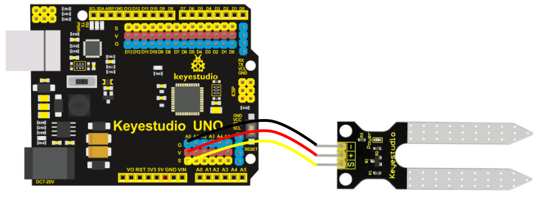  
*Conexionado*

!!! warning "CUIDADO"
    Si utilizas cables dupont, controla que cada cable conecte los terminales correspondientes de la placa y de la pantalla (GND con GND, VCC con VCC y S con S).

    Si utilizas un conector GSV ten cuidado de respetar el orden de los pines, es decir, que las conexiones son las mismas que con cables individuales.

**2.** Ejecuta el programa AB-Connector. Recuerda que debe estar en ejecución todo el rato mientras trabajas con Arduinoblocks.

**3.** Ve a ArduinoBlocks, inicia sesión y comienza un nuevo proyecto del tipo “UNO”:

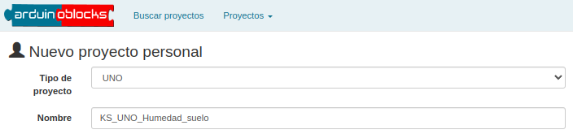  
*Proyecto KS_UNO_Humedad_suelo. Creación*

**4.** En la categoria de "Comunicaciones" busca "Puerto Serie" y coloca en "Inicializar" un bloque "Iniciar baudios 9600".

  
*Proyecto KS_UNO_Humedad_suelo. Iniciar puerto serie*

**5.** En "Bucle" sitúa un bloque "Enviar" dejando activado el salto de línea.

  
*Proyecto KS_UNO_Humedad_suelo. Enviar puerto serie*

**6.** En la categoría “Sensores”, busca el sensor para medir la humedad del suelo (KS0049) y sitúa el bloque correspondiente en el espacio vacío que hay en “Enviar”. Aparece como "Sonda de humedad" y la imagen del sensor. Fíjate que indica a qué pin se debe conectar el sensor. Puedes elegir el pin que desees de los que salen en el desplegable, teniendo en cuenta que el pin que selecciones en el bloque será el que debes utilizar para realizar la conexión (en nuestro caso A0). También puedes elegir entre ver la lectura en porcentaje (%) o en valor absoluto (0…1023). Pon también una espera de un segundo a continuación después del bloque enviar para evitar que haga las lecturas demasiado seguidas.

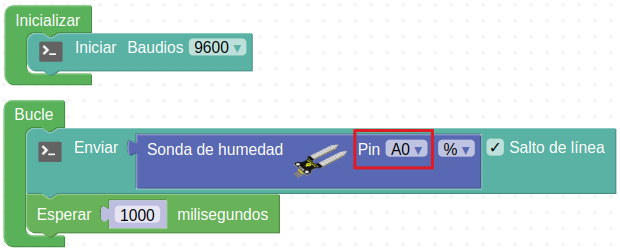  
*[Proyecto KS_UNO_Humedad_suelo](../UNO/programas/KS_UNO_Humedad_suelo_v1.abp)*

**7.** Subimos el proyecto a la placa haciendo clic en el botón "Subir". Una vez compilado y subido correctamente el programa, haz clic en "Consola" y después en "Conectar".

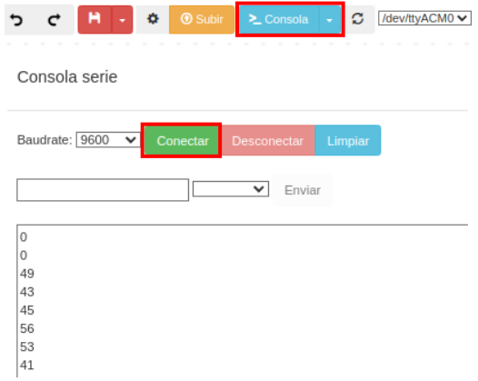  
*Proyecto KS_UNO_Humedad_suelo. Completo - Consola*

Comenzarás a ver valores medidos por el sensor en la consola o terminal serie.

**8.** También se pueden combinar bloques de texto, de la categoria "Texto", con las medidas efectuadas por el sensor. En el ejemplo siguiente se han realizados cambios al respecto:

  
*[Proyecto KS_UNO_Humedad_suelo_v2](../UNO/programas/KS_UNO_Humedad_suelo_v2.abp)*

La consola se verá ahora de la siguiente forma:

  
*Proyecto KS_UNO_Humedad_suelo. Completo - Consola*

### Sensor de luz ambiente
Una alternativa a la fotorresistencia muy sencillo de utilizar es el sensor de luz ambiental TEMT6000. Se supone que el TEMT6000 está adaptado a la sensibilidad del ojo humano, pero he comprobado que su rendimiento es malo en condiciones de poca luz.

No obstante, funciona muy bien reaccionando a cambios muy pequeños en un ambiente de buena luminosidad. Debido a que está diseñado para imitar el ojo humano, no reacciona bien a la luz IR o UV, así que asegúrate de tenerlo en cuenta cuando lo utilices en tu proyecto.

#### **Material necesario**

* Placa Keyestudio UNO
* Sensor de luz ambiental TEMT6000
* Cable I2C o 4 cables dupont hembra-hembra
* Cable GVS o 3 cables dupont hembra-hembra
* Matriz de LED 8x8 I2C HT16K33 (KS0064)
* Matriz de LED 8x8 I2C HT16K33 direccionable (KS0396)
* Ordenador. Antes de empezar a utilizar la placa Keyestudio UNO, es necesario comprobar que nuestro dispositivo esté listo para trabajar. Encontrarás toda la información en [Antes de](https://fgcoca.github.io/GuiasFundamentales/UNO/contUNO/).

#### **Procedimiento**

**1.** Conecta el sensor de humedad de luz ambiental al pin A0 utilizando un cable de tipo GSV o tres cables dupont hembra-hembra. Mediante un hub o expansor I2C conecta las dos matrices de 8x8 al puerto I2C de la placa.

  
*Conexionado*

!!! warning "CUIDADO"
    Si utilizas cables dupont, controla que cada cable conecte los terminales correspondientes de la placa y de la pantalla (GND con GND, VCC con VCC y S con S).

    Si utilizas un conector GSV ten cuidado de respetar el orden de los pines, es decir, que las conexiones son las mismas que con cables individuales.

**2.** Ejecuta el programa AB-Connector. Recuerda que debe estar en ejecución todo el rato mientras trabajas con Arduinoblocks. Iniciamos un nuevo proyecto de tipo "UNO".

**3.** Vamos a configurar "Inicializar" localizando y adaptando los bloques para tener dos matrices de 8x8 con dos direcciones diferentes, inicializar una variable donde almacenar los valores medidos por el sensor e iniciar el puerto serie.

  
*Bloque Inicializar del proyecto KS_UNO_claro_oscuro*

**4.** En "Bucle" vamos a hacer que en la variable se guarde la lectura del sensor mostrando el resultado por el puerto serie cada segundo. Si la luz ambiente es igual o está por debajo de un valor (lo adaptas a tu resultado de medida) va a significar oscuridad mostrándose una carita triste en la matriz 1 mientras en la matriz 2 se iluminan los 4 LEDs centrales. Si la luz ambiente es mayor que ese valor la matriz 2 mostrará una carita feliz mientras que en la matriz 1 se iluminan los 4 LEDs de las esquinas significando que hay bastante claridad.

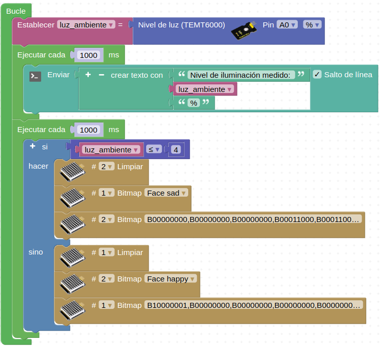  
*Bloque Bucle del proyecto KS_UNO_claro_oscuro*

**5.** El proyecto completo será:

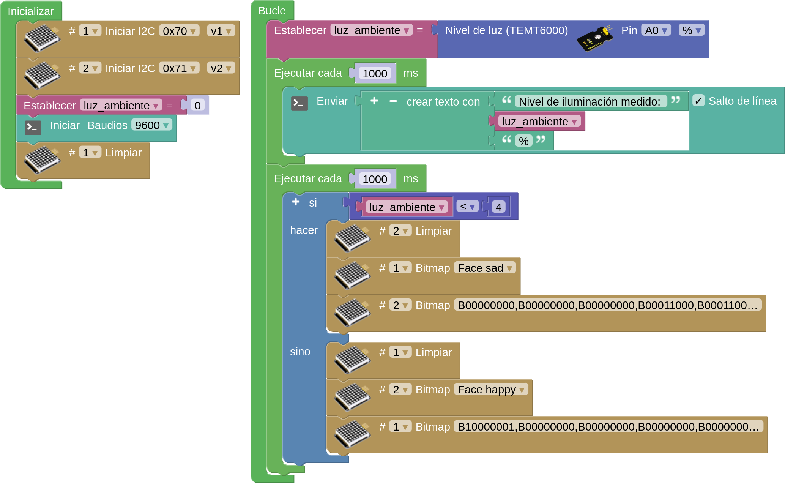  
*[Proyecto KS_UNO_claro_oscuro](../UNO/programas/KS_UNO_claro_oscuro.abp)*

**6.** Subimos el proyecto a la placa, conectamos la consola y vemos el valor que nos da el sensor (en mi caso la medida está en torno al 10%). Adaptamos el valor de la comparación en el bucle y volvemos a subir el proyecto si es necesario. En la animación podemos ver el funcionamiento del proyecto:

  
*Proyecto KS_UNO_claro_oscuro. Funcionamiento*

### Sensor de CO2
El sensor de dióxido de carbono es un sensor de calidad del aire que utiliza el chip CCS811. Se trata de un sensor digital de gas en miniatura de potencia ultrabaja que puede detectar una amplia gama de compuestos orgánicos volátiles (COV), incluidos los niveles de dióxido de carbono equivalente (eCO2) y óxido metálico (MOX). El dióxido de carbono equivalente (eCO2) se mide en un rango de 400 a 29206 ppm (partes por millón), y diversos compuestos orgánicos volátiles (TVOC) en un rango de 0 a 32768 ppb (partes por billón).

  
*Sensor de CO2*

En arduinoblocks está disponible un bloque para el sensor que devuelve el nivel de CO2 detectado tanto en ppm como en mg/m3 y el TVOC en ppb.

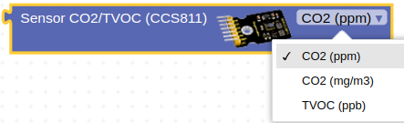  
*Bloque para sensor de CO2*

#### **Material necesario**

* Placa Keyestudio UNO
* Sensor CCS811 Sensor de eCO2 (Dióxido de Carbono Equivalente) y TVOC conexión I2C (KS0457)
* Cable I2C o 4 cables dupont hembra-hembra
* Ordenador. Antes de empezar a utilizar la placa Keyestudio UNO, es necesario comprobar que nuestro dispositivo esté listo para trabajar. Encontrarás toda la información en [Antes de](https://fgcoca.github.io/GuiasFundamentales/UNO/contUNO/).

#### **Procedimiento**

**1.** Conecta el sensor de CO2 al conector I2C utilizando un cable de tipo I2C o cuatro cables dupont hembra-hembra.

  
*Conexionado*

<b>Es muy importante conectar el pin WAKE a GND para el correcto funcionamiento del sensor</b>

!!! warning "CUIDADO"
    Si utilizas cables dupont, controla que cada cable conecte los terminales correspondientes de la placa y de la pantalla (GND con GND, VCC con VCC, SDA con SDA y SCL con SCL).

    Si utilizas un conector I2C ten cuidado de respetar el orden de los pines, es decir, que las conexiones son las mismas que con cables individuales.

**2.** Ejecuta el programa AB-Connector. Recuerda que debe estar en ejecución todo el rato mientras trabajas con Arduinoblocks. Iniciamos un nuevo proyecto de tipo "UNO".

**3.** Vamos a configurar "Inicializar" para trabajar con la consola serie. En el bucle vamos a inicializar las variables donde almacenar los valores medidos por el sensor en sus tres modos posibles. Enviaremos cada valor medidos a una línea con un texto indicativo, su valor y la unidad de medida. El programa será el siguiente:

  
*[Proyecto KS_UNO_CO2](../UNO/programas/KS_UNO_CO2.abp)*

**4.** Subimos el proyecto a la placa, conectamos la consola y vemos los valores medidos por el sensor.

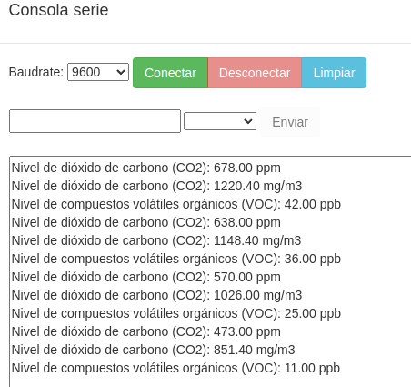  
*Proyecto KS_UNO_CO2. Consola*

Los valores que vemos en la gráfica se han forzado para el ejemplo introduciendo el sensor en una nube de IPA (alcohol isopropílico).

### Acelerómetro de tres ejes
El módulo ADXL345 es un acelerómetro MEMS (MicroelEctroMechanical Systems) o sistema microelectromecánico de 3 ejes, con una resolución (13 bits) de medición de hasta ±16g de fuerza gravitacional. Los datos de salida los entrega en formato digital en complemento a dos de 16 bits y se puede acceder a ellos a través de una interfaz digital I2C.

El ADXL345 es ideal para medir la aceleración estática de la gravedad en aplicaciones de detección de inclinación, así como la aceleración dinámica resultante del movimiento o impacto.

  
*Sensor acelerómetro de tres ejes ADXL345*

En arduinoblocks está disponible un bloque para el sensor en el que se pueden seleccionar las opciones que vemos a continuación:

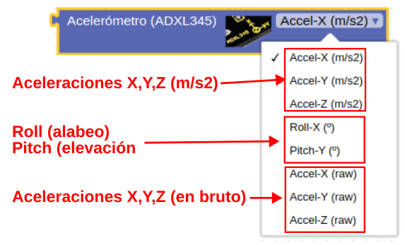  
*Bloque para sensor ADXL345*

Los conceptos que vemos en la imagen anterior se refieren a la rotación del eje X (Roll) y la rotación del eje Y (Pitch). Se ha prescindido del eje Z (Yaw). Para aprender mas sobre estos conceptos visita este enlace al [blog de Luis Llamas](https://www.luisllamas.es/como-usar-un-acelerometro-arduino/). En la explicación estos conceptos dada en la Wikipedia respecto a los [Aircraft principal axes](https://en.wikipedia.org/wiki/Aircraft_principal_axes) o [ejes del avión](https://es.wikipedia.org/wiki/Ejes_del_avi%C3%B3n) se muestran gráficos y animaciones referentes a su significado. En la imagen siguiente se comparan los conceptos de movimientos angulares aplicados a una aeronave.

  
*Movimientos angulares*

#### **Material necesario**

* Placa Keyestudio UNO
* Sensor acelerómetro de tres ejes ADXL345 (Ks0012)
* Cable I2C o 4 cables dupont hembra-hembra
* Ordenador. Antes de empezar a utilizar la placa Keyestudio UNO, es necesario comprobar que nuestro dispositivo esté listo para trabajar. Encontrarás toda la información en [Antes de](https://fgcoca.github.io/GuiasFundamentales/UNO/contUNO/).

#### **Procedimiento**

**1.** Conecta el sensor de ADXL345 al conector I2C utilizando un cable de tipo I2C o cuatro cables dupont hembra-hembra.

  
*Conexionado*

!!! warning "CUIDADO"
    Si utilizas cables dupont, controla que cada cable conecte los terminales correspondientes de la placa y de la pantalla (GND con GND, VCC con VCC, SDA con SDA y SCL con SCL).

    Si utilizas un conector I2C ten cuidado de respetar el orden de los pines, es decir, que las conexiones son las mismas que con cables individuales.

**2.** Ejecuta el programa AB-Connector. Recuerda que debe estar en ejecución todo el rato mientras trabajas con Arduinoblocks. Iniciamos un nuevo proyecto de tipo "UNO".

**3.** En la entrada "Funciones" tenemos las opciones disponibles de creación de funciones, sin retorno y con retorno de valor. Crear una función es tan sencillo como arrastrar el bloque a la zona de programa, ponerle un nombre descriptivo y en su interior crear el programa que se ejecutará cada vez que la invoquemos. Para invocar a la función se crea un bloque, que inicialmente no existe, con el nombre de la función. Para el ejemplo que estamos resolviendo esté menú quedará así:

  
*Proyecto KS_UNO_acelerometro. Funciones*

**4.** Vamos a trabajar con la consola serie para mostrar los ángulos de Pitch y Roll y con el plotter serie para mostrar graficamente las aceleraciones en los tres ejes. Además, para que el código quede mejor ordenado, vamos a crear funciones que realizarán las tareas de leer el sensor, enviar los ángulos a la consola y las aceleraciones al plotter. El programa quedará así:

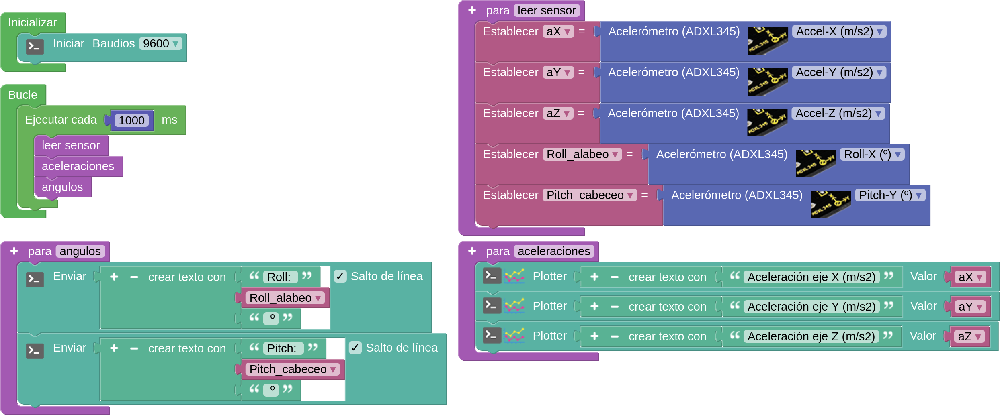  
*[Proyecto KS_UNO_acelerometro](../UNO/programas/KS_UNO_acelerometro.abp)*

Ahora podemos ver de forma completa las funciones definidas y como son invocadas.

**5.** Si subimos el programa tal cual está se van a mezclar los datos de consola y plotter ya que son enviados por el puerto serie todos. Arduinoblocks dispone de la posibilidad de activar y desactivar (comentar) bloques para poder hacer que formen, o no, parte del programa. En la animación siguiente vemos como activar y desactivar bloques.

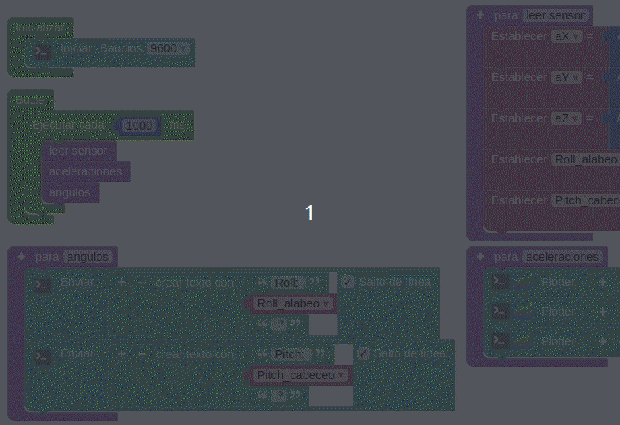  
*Proyecto KS_UNO_acelerometro. Activar/desactivar bloques*

**6.** Desactivamos la llamada a la función aceleraciones y subimos el proyecto a la placa. Comenzamos por enviar datos a la consola y vemos los valores medidos por el sensor girándolo en alabeo y cabeceo.

  
*Proyecto KS_UNO_acelerometro. Consola*

**7.** Activamos la llamada a la función aceleraciones y desactivamos la llamada a la función ángulos y subimos el proyecto a la placa. Comenzamos a enviar datos al plotter y vemos las gráficas de los valores medidos por el sensor moviéndolo en la dirección de cada eje.

  
*Proyecto KS_UNO_acelerometro. Plotter*

Si necesitamos mas opciones de medida podemos recurrir al modelo [Acelerómetro y Giroscopio MPU6050](https://shop.innovadidactic.com/es/standard-sensores/688-keyestudio-sensor-giroscopio-y-acelerometro-mpu6050-8436574311716.html) que combina un giroscopio MEMS de 3 ejes con un acelerómetro MEMS de 3 ejes y un procesador DMP (Digital Motion Processor) interno que ejecuta cálculos para combinar las mediciones de los sensores internos.
