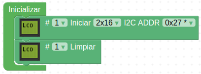

Aquí encontrarás información e instrucciones para conectar y mostrar textos o imágenes en una pantalla de tipo LCD 1602.

Para saber mas sobre la LCD 1602 puedes consultar [Pantalla LCD 1602 I2C](https://fgcoca.github.io/GuiasFundamentales/previos/#pantalla-lcd-1602-i2c).

!!! danger "Por seguridad"
	Es muy conveniente tener la placa desprovista de cualquier tipo de alimentación mientras realizamos el conexionado de elementos. En caso contrario se pueden producir despefectos irreversibles en cualquiera de los elementos.

## **Material necesario**

* Placa Keyestudio UNO
* Pantalla LCD 1602 I2C
* Cable I2C o 4 cables dupont hembra-hembra
* Ordenador. Antes de empezar a utilizar la placa ESP32 STEAMakers, es necesario comprobar que nuestro dispositivo esté listo para trabajar. Encontrarás toda la información en [Antes de](https://fgcoca.github.io/GuiasFundamentales/STEAMakers/contSM/).

## **Procedimiento**

**1.** Comenzamos conectando la pantalla LCD a la placa a través de los pines de comunicación I2C según muestra la imagen siguiente:

  
*Conexionado*

Puedes hacer las conexiones con un cable I2C o utilizando cuatro cables dupont hembra-hembra.

!!! warning "CUIDADO"
    Si utilizas cables dupont, controla que cada cable conecte los terminales correspondientes de la placa y de la pantalla (GND con GND, VCC con VCC, SCL con SCL y SDA con SDA).

    Si utilizas un conector I2C ten cuidado de respetar el orden de los pines, es decir, que las conexiones son las mismas que con cables individuales.

**2.** Sigue con la programación con Arduinoblocks: Ejecuta el programa AB-Connector. Recuerda que debe estar en ejecución todo el rato mientras trabajas con Arduinoblocks.

**3.** Ve a ArduinoBlocks, inicia sesión y comienza un nuevo proyecto del tipo “UNO”:

  
*Proyecto KS_UNO_LCD. Creación*

**4.** Para utilizar la pantalla LCD, primero debes inicializarla. En el bloque “Inicializar”, sitúa un bloque “LCD Iniciar I2C”, que encontrarás en la categoría "Visualización/Pantalla LCD (I2C)". Pon también el bloque “Limpiar” para asegurar que la pantalla no tenga nada escrito al inicio.

  
*Proyecto KS_UNO_LCD. Inicializar*

**5.** A continuación, en el bloque “Bucle”, sitúa alguno de los bloques de visualización de la pantalla LCD, en función de lo que desees mostrar. Comienza mostrando el texto “Hola”, con el bloque "LCD #1 Imprimir...":

  
*Proyecto KS_UNO_LCD. Hola*

Haz clic en el botón “Subir” situado arriba a la derecha, verificando primero que el puerto seleccionado sea correcto:

  
*Proyecto KS_UNO_LCD. Subir*

**6.** Vamos a crear dos símbolos propios, un muñequito y una letra "i" pero acentuada. La definición del símbolo la copiamos en un bloque "LCD #1 Definir símbolo..." y le asignamos el número 1 y al de la letra "i" le asignamos el número 2. Estos bloques de definición se ponen en "Inicializar".

  
*Proyecto KS_UNO_LCD.Símbolos*

**7.** De la categoría Visualización/Pantalla LCD I2C, elige el bloque “LCD #1 Imprimir…” y lo colocas un par de veces de manera que en uno aparezca el texto "Hola desde" en la fila 0 y en el otro "Keyestudio UNO" en la fila 1. Ahora, añade una espera de 2 segundos (2000 milisegundos). Cambia el valor a 2000. Para añadir la espera de 2 segundos, ve a la categoría “Tiempo” y elige el bloque “Esperar 1000 milisegundos”. Haz que se limpie la pantalla y que a continuación se muestre la letra "S" en la fila 0 y columna 0. A continuación, de la categoría Visualización/Pantalla LCD I2C, elige el bloque “LCD #1 Imprimir… Símbolo…” y pon el número correspondiente a la letra "i" ajustando la columna a 1. Ahora ponemos a partir de la columna 2 el resto del texto ("mbolo"). Ya solamente queda colocar en la fila uno la definición del símbolo del muñequito. Pon otra espera de 2 segundos. El código completo de la programación debe quedar así:

  
*[Proyecto KS_UNO_LCD](../UNO/programas/KS_UNO_LCD.abp)*

## **Funcionamiento**
En la animación podemos observar el programa en funcionamiento:

  
*Proyecto KS_UNO_LCD*

