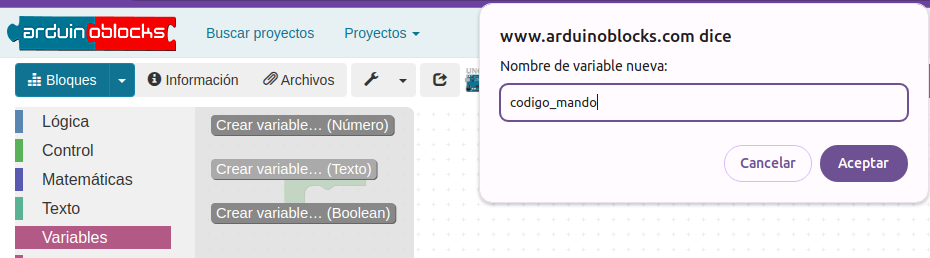
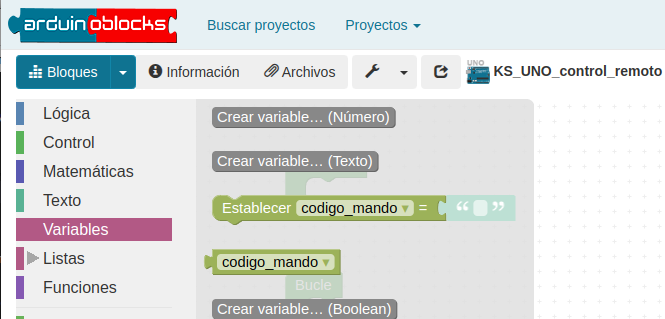
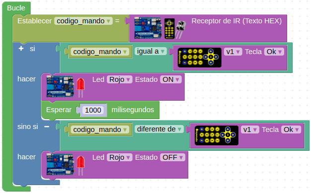
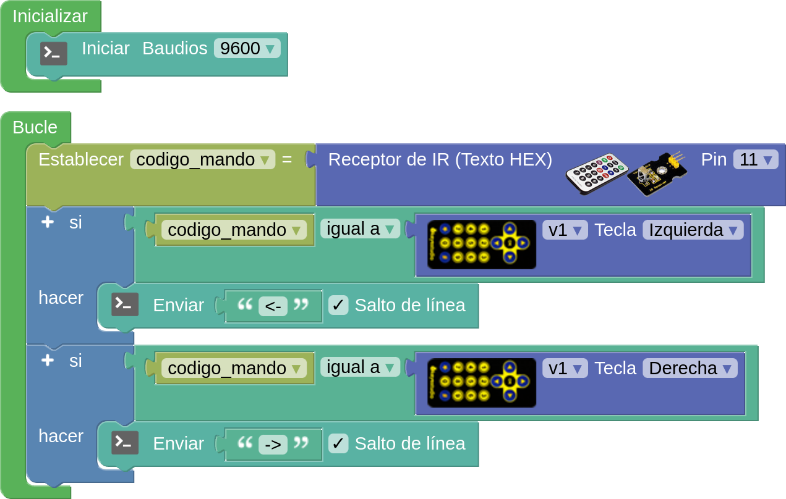
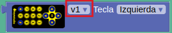

En esta ocasión vamos a trabajar con el [Kit Imagina TdR STEAM basado en la placa tipo Arduino UNO](https://shop.innovadidactic.com/ca/imagina-steam-y-makers/1445-kit-imagina-tdr-steam-basado-en-arduino-8436574314229.html) en el que ya disponemos del mando y del sensor.

Es conveniente repasar los contendiso explicados en [Emisor y receptor de infrarrojos](https://fgcoca.github.io/GuiasFundamentales/previos/#emisor-y-receptor-de-infrarrojos) y en [Placa TdR-STEAM y keyestudio UNO](https://fgcoca.github.io/GuiasFundamentales/UNO/tdrsteam/) puesto que vamos a utilizar el mando y el sensor de ese conjunto.

!!! danger "Por seguridad"
    Es muy conveniente tener la placa desprovista de cualquier tipo de alimentación mientras realizamos el conexionado de elementos. En caso contrario se pueden producir despefectos irreversibles en cualquiera de los elementos.

## **Material necesario**

* Kit Imagina TdR STEAM basado en la placa tipo Arduino UNO
* Ordenador. Antes de empezar a utilizar la placa Keyestudio UNO, es necesario comprobar que nuestro dispositivo esté listo para trabajar. Encontrarás toda la información en [Antes de](https://fgcoca.github.io/GuiasFundamentales/UNO/contUNO/).

## **Procedimiento**

**1.** Ejecuta el programa AB-Connector. Recuerda que debe estar en ejecución todo el rato mientras trabajas con Arduinoblocks. Iniciamos un nuevo proyecto de tipo "UNO".

**2.** Partimos de los componentes del kit ya conectados. Procede a crear una variable de tipo texto  entrando en la categoria "Variables". Debe ser de tipo texto porque el código que se recibirá del mando es un texto en formato hexadecimal.

  
*Proyecto KS_UNO_control_remoto. Crear variable*

  
*Proyecto KS_UNO_control_remoto. Variable creada*

!!! info "IMPORTANTE:"
    El sensor funciona a 5V. comprueba que tienes el interruptor selector de voltaje en la posición correcta:

    

    

    

**3.** A partir de aquí vamos a hacer dos ejemplos diferentes que, lógicamente deberemos subir en cada caso a la placa para probar su funcionamiento.

## **Ejemplos**

==**Ejemplo 1**==

Vamos a realizar un programa en el que si pulsamos la tecla Ok del control remoto se nos encienda el diodo LED rojo. 

  
*[Proyecto KS_UNOyTdRSTEAM_control_remoto. Ejemplo 1](../UNO/programas/KS_UNOyTdRSTEAM_control_remoto.abp)*

Sabemos que el diodo IR está recibiendo un código porque junto al mismo hay un diodo LED rojo que parpadea.

==**Ejemplo 2**==

Vamos a realizar un programa en el que si pulsamos la tecla flecha izquierda envie a la consola el mensaje "<-" y se se ha pulsado la tecla derecha "->".

  
*[Proyecto KS_UNO_control_remoto. Ejemplo 2](../UNO/programas/KS_UNO_control_remoto.abp)*

!!! info "IMPORTANTE:"
    Puede que no te funcione porque que tengas seleccionado un valor incorrecto del modelo del mando en el bloque correspondiente. Si este fuera el caso, cambia al valor alternativo y vuelva a intentarlo.

    

    

    

