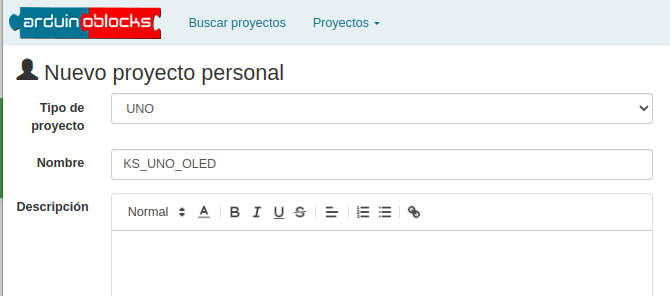
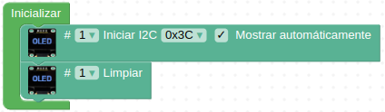
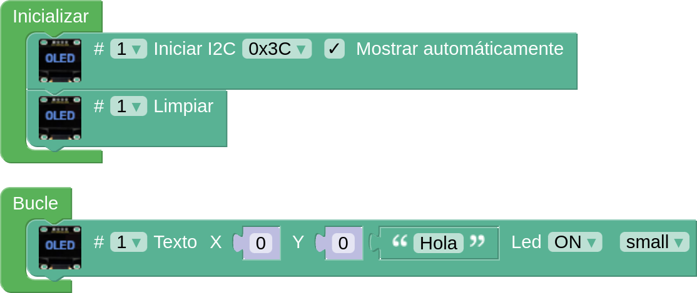
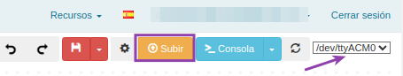

Aquí encontrarás información e instrucciones para conectar y mostrar textos o imágenes en una pantalla de tipo OLED de 0.96" de 128x64 pixels.

Para saber mas sobre la OLED puedes consultar [Pantalla OLED](https://fgcoca.github.io/GuiasFundamentales/previos/#pantalla-oled).

!!! danger "Por seguridad"
	Es muy conveniente tener la placa desprovista de cualquier tipo de alimentación mientras realizamos el conexionado de elementos. En caso contrario se pueden producir despefectos irreversibles en cualquiera de los elementos.

## **Material necesario**

* Placa Keyestudio UNO
* Pantalla OLED 0.96"
* Cable I2C o 4 cables dupont hembra-hembra
* Ordenador. Antes de empezar a utilizar la placa Keyestudio UNO, es necesario comprobar que nuestro dispositivo esté listo para trabajar. Encontrarás toda la información en [Antes de](https://fgcoca.github.io/GuiasFundamentales/UNO/contUNO/).

## **Procedimiento**

**1.** Comenzamos conectando la pantalla OLED a la placa a través de los pines de comunicación I2C según muestra la imagen siguiente:

  
*Conexionado*

Puedes hacer las conexiones con un cable I2C o utilizando cuatro cables dupont hembra-hembra.

!!! warning "CUIDADO"
    Si utilizas cables dupont, controla que cada cable conecte los terminales correspondientes de la placa y de la pantalla (GND con GND, VCC con VCC, SCL con SCL y SDA con SDA).

    Si utilizas un conector I2C ten cuidado de respetar el orden de los pines, es decir, que las conexiones son las mismas que con cables individuales.

**2.** Sigue con la programación con ArduinoBlocks: Ejecuta el programa AB-Connector. Recuerda que debe estar en ejecución todo el rato mientras trabajas con ArduinoBlocks.

**3.** Ve a ArduinoBlocks, inicia sesión y comienza un nuevo proyecto del tipo “UNO”:

  
*Proyecto KS_UNO_OLED. Creación*

**4.** Para utilizar la pantalla OLED, primero debes inicializarla. En el bloque “Inicializar”, sitúa un bloque “OLED Iniciar I2C”, que encontrarás en la categoría "Visualización/Pantalla OLED". Pon también el bloque “Limpiar” para asegurar que la pantalla no tenga nada escrito al inicio.

  
*Proyecto KS_UNO_OLED. Inicializar*

**5.** A continuación, en el bloque “Bucle”, sitúa alguno de los bloques de visualización de la pantalla OLED, en función de lo que desees mostrar. Comienza mostrando el texto “Hola”, con el bloque “OLED #1 Text…”:

  
*Proyecto KS_UNO_OLED. Hola*

Haz clic en el botón “Subir” situado arriba a la derecha, verificando primero que el puerto seleccionado sea correcto:

  
*Proyecto KS_UNO_OLED. Subir*

**6.** Ahora, añade una espera de 2 segundos (2000 milisegundos), haz que se limpie la pantalla y que a continuación se muestre una imagen. Para añadir la espera de 2 segundos, ve a la categoría “Tiempo” y elige el bloque “Esperar 1000 milisegundos”. Cambia el valor a 2000. A continuación, de la categoría Visualización/Pantalla OLED, elige el bloque “OLED #1 Bitmap…” y cargalo con una imagen. Poner otra espera de 2 segundos. El código completo de la programación debe quedar así:

  
*[Proyecto KS_UNO_OLED](../UNO/programas/KS_UNO_OLED.abp)*

## **Funcionamiento**
En la animación podemos observar el programa en funcionamiento:

  
*Proyecto KS_UNO_OLED*

