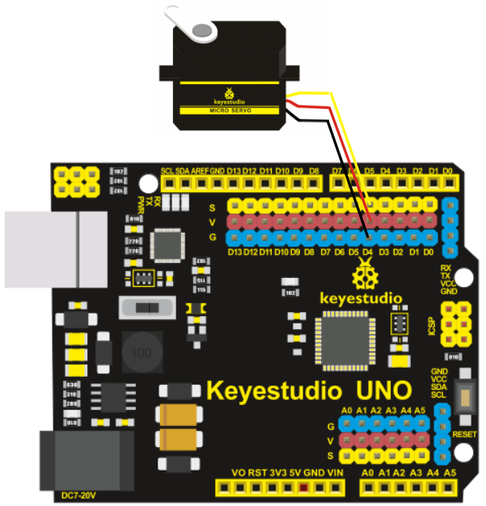
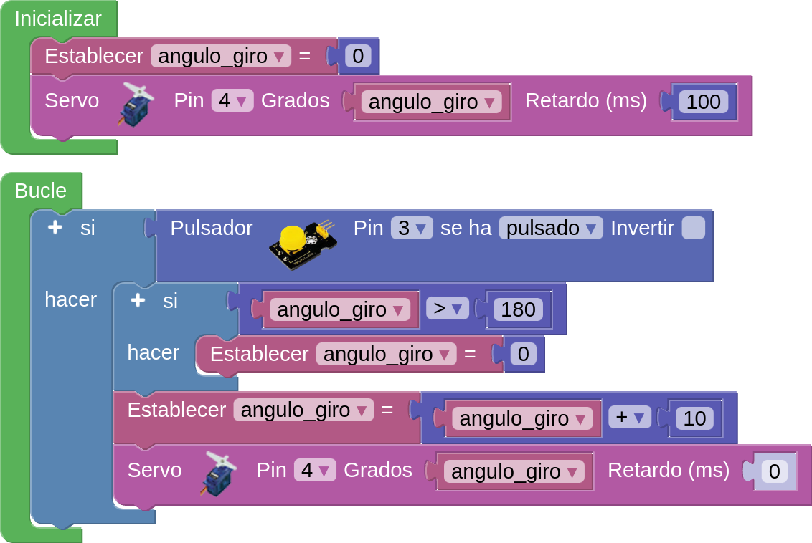
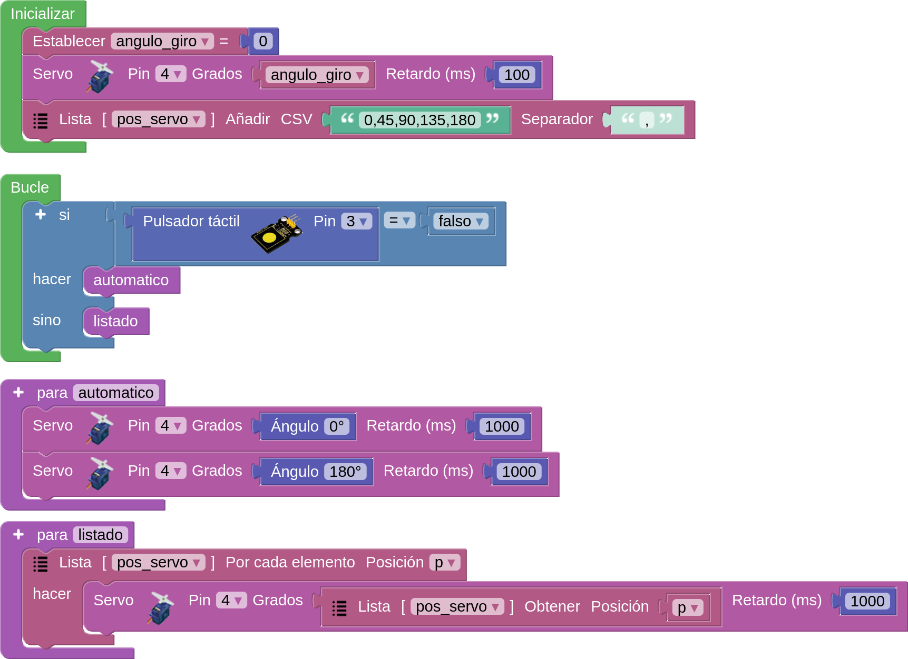

Antes de nada se recomienda repasar los conceptos dados en [Control de un servomotor](https://fgcoca.github.io/GuiasFundamentales/previos/#control-de-un-servomotor) y el uso de las listas de datos.

!!! danger "Por seguridad"
	Es muy conveniente tener la placa desprovista de cualquier tipo de alimentación mientras realizamos el conexionado de elementos. En caso contrario se pueden producir despefectos irreversibles en cualquiera de los elementos.

## **Material necesario**

* Placa Keyestudio UNO
* Servomotor 9g negro con rotación de 0 a 180 grados KS0194
* Pulsador táctil capacitivo (KS0031) o de botón (KS0029).
* Cable SVG o 3 cables dupont hembra-hembra
* Ordenador. Antes de empezar a utilizar la placa Keyestudio UNO, es necesario comprobar que nuestro dispositivo esté listo para trabajar. Encontrarás toda la información en [Antes de](https://fgcoca.github.io/GuiasFundamentales/UNO/contUNO/).

## **Procedimiento**

**1.** Ejecuta el programa AB-Connector. Recuerda que debe estar en ejecución todo el rato mientras trabajas con Arduinoblocks. Iniciamos un nuevo proyecto de tipo "UNO".

**2.** Conecta el servomotor a alguno de los pines digital de la placa (en el ejemplo utilizaremos el pin D4), teniendo en cuenta que el cable marrón del servomotor corresponde a la G -tierra- (color azul de la placa), el cable rojo del servomotor corresponde a la V -voltaje- (color rojo de la placa) y el cable naranja del servomotor corresponde al S -señal- (color amarillo de la placa).

  
*Proyecto KS_UNO_servo_conecta*

**3.** Conecta el pulsador también a un pin digital (D3 en mi caso) teniendo especial cuidado que el orden de los pines sea el correcto.

**4.** A partir de aquí vamos a hacer dos ejemplos diferentes que, lógicamente deberemos subir en cada caso a la placa para probar su funcionamiento.

## **Ejemplos**

==**Ejemplo 1**==

Vamos a crear un programa en el que cada vez que pulsemos el botón el servo gire un ángulo de 10 grados. Si no activamos el pulsador el servo permanecerá en su posición actual. La posición inicial del servo será en cero grados y si se alcanzan los 180 grados de giro retornará a su posición inicial.

  
*[Proyecto KS_UNO_servo. Ejemplo 1](../UNO/programas/KS_UNO_servo_ejem1.abp)*

En la animación vemos el programa funcionando.

  
*Proyecto KS_UNO_servo. Funcionamiento Ejemplo 1*

==**Ejemplo 2**==

Vamos a crear un programa en el que si no activamos el botón el servo se moverá entre 0 y 180 grados a intérvalos de un segundo. Si el botón se acciona el servo se moverá entre las posiciones fijadas en una lista creada al efecto.

  
*[Proyecto KS_UNO_servo. Ejemplo 2](../UNO/programas/KS_UNO_pos_servo_listas2.abp)*

En la animación vemos el programa funcionando.

  
*Proyecto KS_UNO_servo. Funcionamiento Ejemplo 2*

