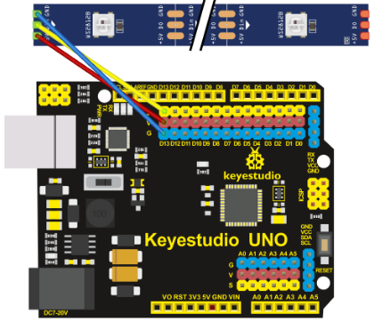
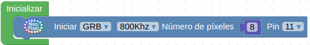
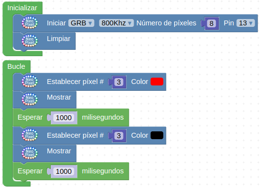
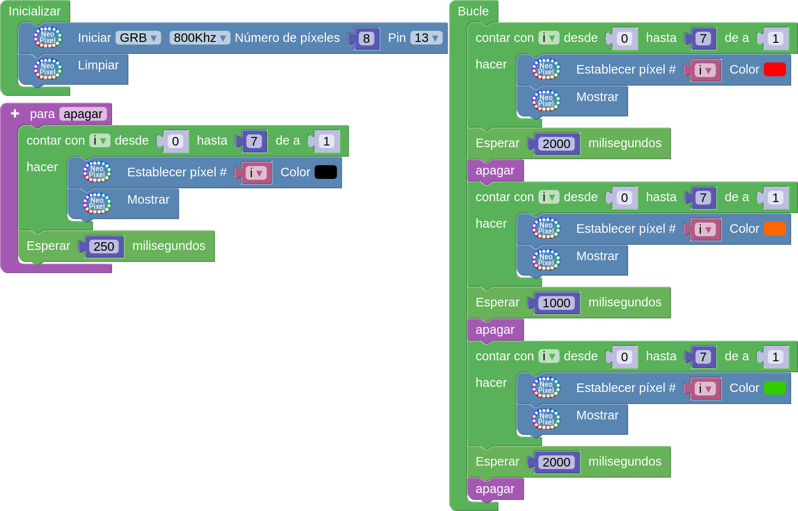

Para saber mas sobre tiras de LEDs RGB direccionables puedes consultar la web [Tiras y matrices de LEDs](https://fgcoca.github.io/tiras-y-matrices-de-LEDs/).

!!! danger "Por seguridad"
    Es muy conveniente tener la placa desprovista de cualquier tipo de alimentación mientras realizamos el conexionado de elementos. En caso contrario se pueden producir despefectos irreversibles en cualquiera de los elementos.

## **Material necesario**

* Placa Keyestudio UNO
* Tira de 8 LEDs
* Cable SVG o 3 cables dupont hembra-hembra
* Ordenador. Antes de empezar a utilizar la placa Keyestudio UNO, es necesario comprobar que nuestro dispositivo esté listo para trabajar. Encontrarás toda la información en [Antes de](https://fgcoca.github.io/GuiasFundamentales/UNO/contUNO/).

## **Procedimiento**

**1.** Ejecuta el programa AB-Connector. Recuerda que debe estar en ejecución todo el rato mientras trabajas con Arduinoblocks. Iniciamos un nuevo proyecto de tipo "UNO".

**2.** Conecta la tira de LEDs a alguno de los puertos digitales de la placa. En el ejemplo utilizamos el pin D13.

  
*Proyecto KS_UNO_tiraLEDs_conecta*

**3.** La tira de LEDs debe inicializarse. Para ello, ve a la categoría “Visualización/NeoPixel” y coloca el bloque “Iniciar GRB 800Khz…”. A continuación, cambia el número de píxeles al número de pixeles de tu tira (8 en el ejemplo) y selecciona el pin al que has conectado la tira (en el ejemplo utilizamos el D13)

  
*Proyecto KS_UNO_tiraLEDs_bloque_inicializar*

A continuación del bloque “Iniciar”, coloca un bloque “Limpiar”, para asegurar que todos los LEDs estén apagados cuando se inicie el programa.

**4.** En esta misma categoría verás que hay varias opciones para trabajar con los LEDs de manera individual. Puedes establecer el color, el brillo, etc. Ten en cuenta que la numeración comienza en “0”, por lo que los LEDs van desde el 0 hasta el 7.

  
*Bloques de Neopixels*

**5.** Si deseas iluminar un píxel en concreto de un color, sólo tienes que situar el bloque “Establecer píxel #…” en el bloque “Bucle”, indicar el número del LED que deseas iluminar y a continuación poner el bloque “Mostrar”. A continuación vemos como hacer parpadear en color rojo al LED 3.

  
*Iluminar un pixel de un color*

Puedes construir y subir el programa de la imagen anterior para probar su funcionamiento.

**6.** Vamos a implementar como ejemplo un semáforo. Haremos primero que los LEDs muestren el color rojo durante 2 segundos, a continuación se apagarán y se mostrarán en color naranja durante 1 segundo. Por último, se apagarán de nuevo y se mostrarán de color verde durante 2 segundos, como si fuera un semáforo. El encendido y apagado de todos los LEDs se resolverá mediante bucles. Para empezar, de la categoría "Control", elije "contar con..." y establece el valor "hasta" en 7, dejando el resto como está. Dentro del bucle, desde la categoria “Visualización / NeoPixel”, elije el bloque “Establecer píxel #”, para definir el pixel a iluminar tras # debes poner la variable del bucle y define el color rojo. A continuación, pon el bloque “Mostrar”, seguido de una pausa de 2000 milisegundos (de la categoría “Tiempo”). Para apagar los LEDs, repite el bucle de nuevo esta vez sin retardo y estableciendo el color negro, seguido del bloque “Mostrar”. Los tiempos de espera se deben establecer fuera de los bucles para que todos los LEDs se enciendan al mismo tiempo. En caso contrario el retardo se producirá en cada iteración. Para que el cambio de color se aprecie aún mas podemos establecer un pequeño retardo tras el apagado. El programa completo es el siguiente:

  
*[Proyecto KS_UNO_tiraLEDs](../UNO/programas/KS_UNO_tiraLEDs.abp)*

