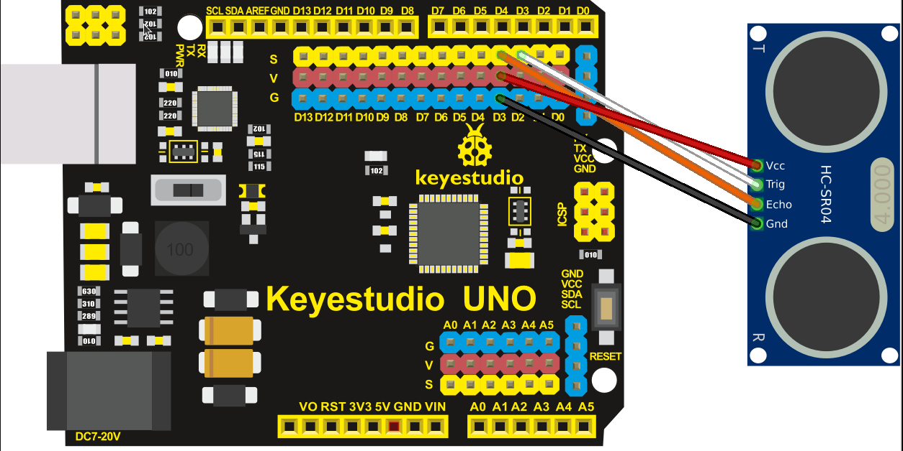
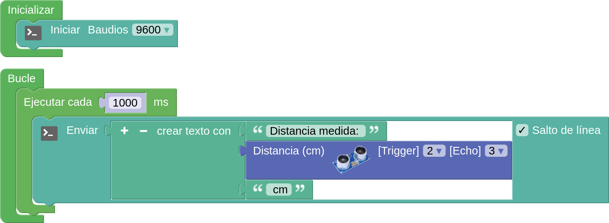
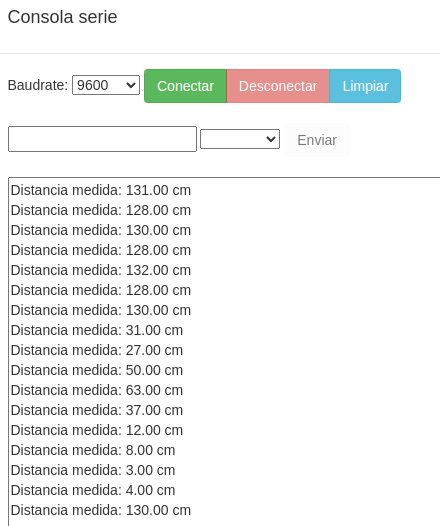

Antes de nada se recomienda repasar los conceptos dados en [El sensor de ultrasonidos HC-SR04](https://fgcoca.github.io/GuiasFundamentales/previos/#el-sensor-de-ultrasonidos-hc-sr04).

!!! danger "Por seguridad"
    Es muy conveniente tener la placa desprovista de cualquier tipo de alimentación mientras realizamos el conexionado de elementos. En caso contrario se pueden producir despefectos irreversibles en cualquiera de los elementos.

## **Material necesario**

* Placa Keyestudio UNO
* Sensor de ultrasonidos HC-SR04
* Ordenador. Antes de empezar a utilizar la placa Keyestudio UNO, es necesario comprobar que nuestro dispositivo esté listo para trabajar. Encontrarás toda la información en [Antes de](https://fgcoca.github.io/GuiasFundamentales/UNO/contUNO/).

## **Procedimiento**

**1.** Ejecuta el programa AB-Connector. Recuerda que debe estar en ejecución todo el rato mientras trabajas con Arduinoblocks. Iniciamos un nuevo proyecto de tipo "UNO".

**2.** Conecta el sensor a pines digitales de la placa (en el ejemplo utilizaremos el pin D2 para Trigger y D3 para Echo). Además tienes que conectar los pines de alimentación teniendo especial cuidado de que VCC se conecta con V y Gnd con G.

  
*Proyecto KS_UNO_ultrasonidos. Conexionado*

Hemos conectado el pin “Trig” del sensor al pin D2 de la placa y el pin “Echo” al pin D3, para hacerlos coincidir con los que indica el bloque que vamos a utilizar en Arduinoblocks. Si quieres puedes utilizar otros pines para realizar las conexiones, haciendo los cambios correspondientes en el bloque en Arduinoblocks. 

!!! info "IMPORTANTE:"
    El sensor funciona a 5V. comprueba que tienes el interruptor selector de voltaje en la posición correcta:

    

    

    

**3.** Vamos a crear un programa en el que cada segundo se envíe a la consola una composición de texto de la forma "Distancia medida: xx.xx cm". El programa puede ser como el siguiente:

  
*[Proyecto KS_UNO_ultrasonidos](../UNO/programas/KS_UNO_ultrasonidos.abp)*

La consola nos mostrará resultados de la forma siguiente:

  
*Consola de proyecto KS_UNO_ultrasonidos*

