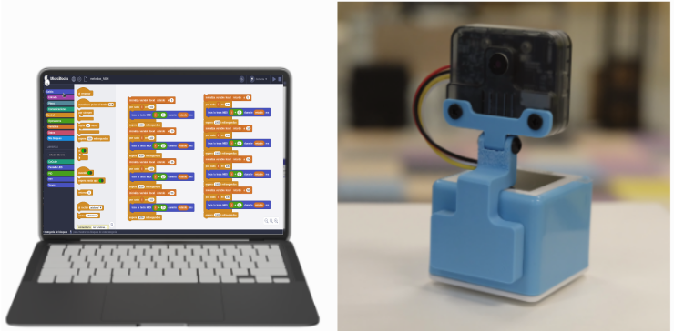
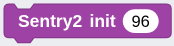
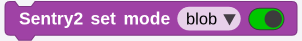

## **Objetivo**
Utilizar la función de reconocimiento de bloques de color del sensor de visión artificial Sentry2 y utilizar el CoCube para seguir el movimiento de un cilindro.

## **Materiales**
Robot CoCube, pinza con servomotor y ordenador ejecutando el IDE de MicroBlocks.

## **Información de algoritmos de Sentry2**
### Introducción

  

El usuario especifica uno o más colores para detectar si hay manchas de ese color en la imagen, devolviendo sus coordenadas y tamaño. Admite la detección multicolor y multibloque, y las etiquetas de clasificación de colores son las mismas que las del reconocimiento de colores.

### Configurar parámetros
Los usuarios deben especificar las etiquetas de color que se van a detectar, pudiendo detectarse hasta seis colores simultáneamente, aunque la velocidad disminuirá. Los usuarios también pueden filtrar las manchas más pequeñas que el ancho mínimo w y la altura mínima h especificados para reducir los falsos positivos.

Al configurar los registros a través del controlador principal, es necesario establecer los siguientes parámetros:

|==**Parámetro**==|==**Significado**==|
|:-:|---|
|1|Ninguno|
|2|Ninguno|
|3|Ancho mínimo 'w' de los puntos válidos|
|4|Alto mínimo 'h' de los puntos válidos|
|5|Etiquetas de clasificación de colores 1~6. Uso especial: al escribir un valor de color RGB565 superior a 6 en el parámetro 5, se pueden identificar colores específicos, por ejemplo, escribiendo 0xFB00 para el color naranja y 0xA11E para el color morado|

!!! Note "NOTA:"
    El RGB565 es un RGB de 16 bits que utiliza una paleta de colores de 32×64×32 = 65.536 colores en lugar de los 256x256x256 del RGB. Normalmente, se asignan 5 bits para los componentes rojo y azul (32 niveles cada uno) y 6 bits para el componente verde (64 niveles), debido a la mayor sensibilidad del ojo humano a este color.

En la interfaz de usuario, hay varios parámetros preestablecidos que se pueden usar:

* **Rendimiento del algoritmo.** De acuerdo con los diferentes requisitos de la aplicación, hay 3 opciones para elegir el rendimiento adecuado del algoritmo, que son "Sensible (Sensitive)", "Equilibrado (Balanced)" y "Preciso (Accurate)".

En el modo sensible, la velocidad de reconocimiento es rápida y la frecuencia de fotogramas es alta. En el modo preciso, se pueden detectar manchas distantes, pero la velocidad disminuirá. El valor predeterminado es un rendimiento equilibrado.

Especial: En el modo preciso, se obtiene un buen reconocimiento y seguimiento de las manchas, pero solo se puede reconocer una mancha.

* **Número máximo de pruebas simultáneas.** El número máximo de detecciones para un solo color admite 1 ~ 5 salidas.

Cuando se establece en 1, solo se devuelve el mejor resultado. Si hay varias manchas en la imagen, se devuelve la más grande. Si los tamaños son similares, se da prioridad a la que se encuentra en la esquina superior izquierda.

Cuando se establece en un valor superior a 1, el número de manchas devueltas no superará este valor.

* **Tamaño del bloque de color mínimo.** Si hay pequeños parches del mismo color en el fondo, puedes filtrarlos estableciendo un valor mínimo razonable.

Los valores predeterminados en el sistema de coordenadas absolutas son: 2x2, 4x4, 8x8, 16x16, 32x32, 64x64, 128x128 píxeles.

Los valores predeterminados en el sistema de coordenadas porcentuales son: 1x1, 2x3, 3x4, 6x8, 9x12, 21x28, 42x56 %.

* **Colores a inspeccionar.** Se proporciona en forma de botón para que el usuario lo seleccione. Cuando se habilita un color, se muestra un pequeño icono con forma de ojo; si no está habilitado, se muestra un icono con forma de ojo tachado. Se pueden habilitar uno o más colores simultáneamente.

  

Una vez que se reconoce el bloque de color especificado, se marcará en la interfaz de usuario y mostrará su ubicación, tamaño, etiqueta de clasificación, nombre y otra información.

Cuando se leen los registros a través del maestro, se devuelven los siguientes datos:

|==**Parámetro**==|==**Significado**==|
|:-:|---|
|1|Coordenada X del centro del bloque de color|
|2|Coordenada Y del centro del bloque de color|
|3|Ancho del bloque 'w'|
|4|Alto del bloque 'h'|
|5|Etiquetas de clasificación de colores|

### Consejos de uso
1. Cuando se determina que es necesario rastrear un único objeto, como detectar una carretera blanca o seguir una pelota, se puede establecer el número de número de bloques de color en 1 para mejorar la velocidad y reducir los falsos positivos.
2. El uso de un área de reconocimiento más pequeña y un modo de rendimiento preciso permite ver objetos más lejanos.
3. Al reconocer grandes áreas de manchas de color, la velocidad de fotogramas disminuirá significativamente. En este caso, se debe utilizar el modo sensible.
4. Cuando hay una mancha de color en la imagen, es necesario bloquear la función de balance de blancos.

### Explicación de los bloques necesarios
- **Inicialización de Sentry2**
Es un parámetro opcional que determina la dirección I2C del dispositivo. El valor por defecto es 96 (0x60) de entre el rango válido que va desde 96 (0x60) hasta 99 (0x63).

Antes de poder usar Sentry2, debes inicializarla mediante el bloque de la imagen, que por lo general, se coloca debajo de un bloque tipo sombrero "al empezar".

  

- **Modo configuración de Sentry2**

  

Para este caso hay que establecer el modo en 'blob', es decir, el modo de detección de bloques de color.

- **Resultados de las pruebas de Sentry2**

  

Este bloque debe utilizarse para activar la detección antes de obtener resultados.

El resultado devuelto es el número de resultados identificados por el algoritmo 'blob' actual.

El número de resultados se verá afectado por la configuración de parámetros del algoritmo correspondiente.

- **Sentry2 detección de los atributos del objeto**

  

Devuelve las propiedades del identificador del objeto detectado, incluida la coordenada x central del bloque de color, la coordenada y del centro del bloque de color, el ancho del bloque de color w, la altura del bloque de color h y la etiqueta de clasificación de color.

Las etiquetas de clasificación por colores van del 1 al 5, y representan el negro, el blanco, el rojo, el verde y el azul, respectivamente.

## **Programación**
