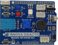
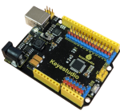
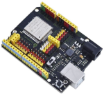
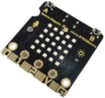
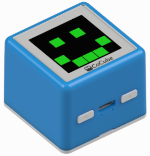
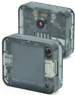
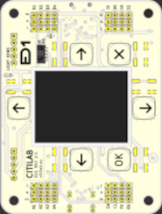

# Guías fundamentales
En esta web vamos a encontrar diversas guías para iniciarnos en placas como Keyestudio UNO, micro:bit, ESP32 micro:STEAMakers, ESP32STEAMakers y otras.

El formato que vamos a seguir será:

* Dar toda la información necesaria para comenzar con la placa o robot.
* Listar el material necesario para realizar todas las actividades.

|[Shield Imagina TdR STEAM](https://fgcoca.github.io/GuiasFundamentales/TdR_STEAM/contTdR/)|[Placa Keyestudio UNO](https://fgcoca.github.io/GuiasFundamentales/UNO/contUNO/)|[Placa ESP32 STEAMakers](https://fgcoca.github.io/GuiasFundamentales/STEAMakers/contSM/)|[Placa ESP32 micro:STEAMakers](https://fgcoca.github.io/GuiasFundamentales/microSTEAMakers/contmicroSM/)|
|:-:|:-:|:-:|:-:|
|||||
|[Robot CoCube](https://fgcoca.github.io/GuiasFundamentales/cocube/introCC/)|[Sensor de visión IA Sentry2](../docs/Sentry2/contSentry2.md)|[Placa ED1 y Robot Fantastic](https://fgcoca.github.io/GuiasFundamentales/introED1)||
|||||

