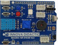
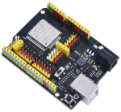
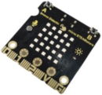
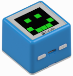
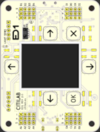

# Guías fundamentales
En esta web vamos a encontrar diversas guías para iniciarnos en placas como Keyestudio UNO, micro:bit, ESP32 micro:STEAMakers, ESP32STEAMakers y otras.

El formato que vamos a seguir será:

* Dar toda la información necesaria para comenzar con la placa o robot.
* Listar el material necesario para realizar todas las actividades.

|[Imagina TdR STEAM](https://fgcoca.github.io/GuiasFundamentales/TdR_STEAM/contTdR/)|[Keyestudio UNO](https://fgcoca.github.io/GuiasFundamentales/UNO/contUNO/)|[ESP32 STEAMakers](https://fgcoca.github.io/GuiasFundamentales/STEAMakers/contSM/)|[ESP32 micro:STEAMakers](https://fgcoca.github.io/GuiasFundamentales/microSTEAMakers/contmicroSM/)|
|:-:|:-:|:-:|:-:|
|||||
|* Shield Imagina TdR STEAM *|* Placa Keyestudio UNO *|* Placa ESP32 STEAMakers *|* Placa ESP32 micro:STEAMakers *|
|[Robot CoCube](https://fgcoca.github.io/GuiasFundamentales/cocube/introCC/)|[ED1](https://fgcoca.github.io/GuiasFundamentales/introED1)|||
|||||
|* Plataforma modular multirrobot de sobremesa para educación e investigación *|* Placa ED1 y robot Fantastic *|*  *|*  *|

