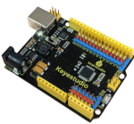

# Guías fundamentales
En esta web vamos a encontrar diversas guías para iniciarnos en placas como Keyestudio UNO, micro:bit, ESP32 micro:STEAMakers, ESP32STEAMakers y otras.

El formato que vamos a seguir será:

* Dar toda la información necesaria para comenzar con la placa o robot.
* Listar el material necesario para realizar todas las actividades.

|[Keyestudio UNO](http://127.0.0.1:8000/GuiasFundamentales/UNO/contUNO/)|
|:-:|
||
|*Guía fundamental para la placa Keyestudio UNO *|

