## **Libreria BLE Scanner**
Vamos a describir los bloques de la libreria para finalmente ver un ejemplo de uso.

### scan received

Este bloque se utiliza para detectar avisos BLE. Cuando se detecta una exploración, la variable interna  se rellena con toda la información BLE relevante. Todos los demás bloques de la biblioteca extraen partes de la información BLE del contenido de esta variable.

### RSSI

RSSI son las siglas en inglés de Indicador de Intensidad de Señal Recibida. Es la intensidad de la señal tal y como se ve en el dispositivo receptor, por ejemplo, un smartphone. La intensidad de la señal depende de la distancia y del valor de la potencia de emisión. Con la máxima potencia de emisión (+4 dBm), el RSSI oscila entre -26 (unos pocos centímetros) y -100 (40-50 m de distancia). 
Esta información puede utilizarse para calcular la distancia entre el dispositivo emisor y el dispositivo receptor. Un ejemplo de ello puede verse en la imagen [Dispositivos emparejados y resultado BLE Scanner de la sección "Libreria BLE Scanner" del apartado "Guía de MicroBlocks"](http://127.0.0.1:8000/....https://fgcoca.github.io/ESP32-micro-STEAMakers/guiamb/mblocks/#libreria-ble-scanner), donde la aplicación BLE Scanner muestra las distancias reales de los dispositivos detectados.

### address

Una dirección Bluetooth, a veces denominada dirección MAC Bluetooth, es un valor de 48 bits que identifica de forma exclusiva un dispositivo Bluetooth.

Una dirección pública de dispositivo es un identificador único global de 48 bits, que consta de dos campos:

- Los 24 bits más significativos se denominan Identificador Único Organizativo, y su finalidad es identificar a cada empresa. Es administrado por la Autoridad de Registro del IEEE.
- Los 24 bits menos significativos son asignados por la empresa, y sirven para identificar cada dispositivo.

### address type

Existen dos tipos principales de direcciones Bluetooth: **públicas** y **aleatorias**.

Una **dirección pública Bluetooth** es una dirección fija global que debe registrarse en el IEEE. Esta dirección nunca cambia y se garantiza que es única para un dispositivo Bluetooth.

Las **direcciones aleatorias** son más populares que las públicas, ya que no requieren registro en el IEEE. Una dirección aleatoria es un identificador que está

* programado en el dispositivo o
* generado en tiempo de ejecución (dependiendo del subtipo).

Dirección estática aleatoria

Este tipo específico de dirección Bluetooth es una alternativa popular a las direcciones públicas, ya que su uso no conlleva ningún coste.

Las direcciones estáticas aleatorias pueden utilizarse de dos maneras:

* Puede ser asignada y fijada para toda la vida del dispositivo.
* Puede cambiarse en el arranque. Sin embargo, no se puede cambiar durante el tiempo de ejecución.

Una Dirección de Dispositivo Aleatoria es una característica de privacidad del protocolo BLE, y ayuda a prevenir el rastreo de un dispositivo.

### device name

Dado que sería bastante difícil para un usuario identificar un dispositivo utilizando sólo su dirección, BLE proporciona la propiedad *Nombre de dispositivo*, que es un nombre amigable utilizado para etiquetar un dispositivo.

Las especificaciones BLE definen el nombre del dispositivo como un campo de 20 bytes. Sin embargo, debido a las limitaciones de longitud de los paquetes, a menudo puede ser necesario utilizar un nombre más corto.

Existen dos tipos de nombre para BLE:

* Nombre local completo: tipo 9
* Nombre local abreviado: tipo 8

### hasType

Este bloque se utiliza internamente para escanear el paquete BLE y ver si contiene un nombre del tipo deseado.

### Ejemplo
Este programa está basado en el programa de ejemplo proporcionado en el Fichero/Abre/Ejemplos/Red/BLE Scanner Demo. Se ha mejorado para mostrar toda la información encontrada, así como una lista de todos los dispositivos detectados al final.

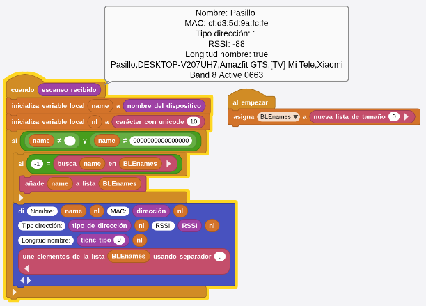  
[Descargar programa](../microSTEAMakers/programas/BLE_Scanner_Demo.ubp)

## **Comunicación BLE bidireccional básica**
Veamos algunos ejemplos de uso de Bluetooth para comunicarnos con la placa desde un móvil. Utilizaremos la APP **Serial Bluetooth Terminal** descrita en la entrada "Comunicaciones Bluetooth" de la opción "Principal" del menú.

!!! info "Importante"
    Para que el programa creado en MicroBlocks se guarde en la placa es necesario tener establecida la conexión entre el IDE y la placa.  
    Cuando queremos transmitir datos entre la APP y la placa debemos establecer la conexión entre ambas y para ello no podemos tener establecida la conexión entre el IDE y la placa. No es posible tener dos conexiones establecidas con la misma placa.  
    Si se da esta circunstancia cuando tratemos de establecer la conexión esta se perderá de manera inmediata.

    

    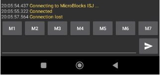  
    *Comunicación APP a placa perdida*  

    

Desde MicroBlocks creamos y llevamos a la placa el siguiente programa:

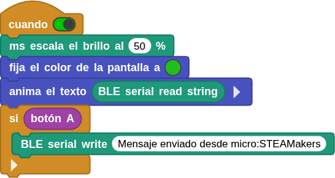  
[Descargar programa](../microSTEAMakers/programas/comunicacion_bidireccional_base.ubp)

El programa realiza un desplazamiento de la cadena de texto recibida en la pantalla de la micro:STEAMakers y envia la cadena que se muestra al pulsar el botón A. El intercambio de mensajes se realiza desde la APP citada.

Con la APP abierta y la conexión realizada enviamos el mensaje que vemos en la captura.

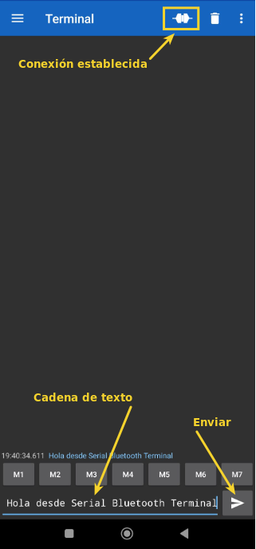  
*Comunicación APP a placa*  

Tras pulsar el botón de enviar el mensaje comienza a aparecer en la pantalla.

  
*Comunicación placa a APP*  

Si ahora pulsamos el botón de la placa en la APP se recibe e mensaje que esta envia:

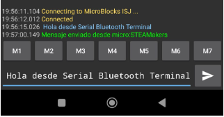  
*Comunicación placa a APP*  

## **Comunicación BLE Radio**
Esta libreria permite intercambiar mensajes de forma sencilla entre placas compatibles con Bluetooth Low Energy (BLE).

Es una libreria similar a la libreria 'Radio', pero los mensajes se envían a través de notificaciones BLE en lugar del sistema Nordic de radio. "Nordic Radio System" se refiere a un sistema de comunicaciones por radio desarrollado por Nordic Semiconductor, una empresa noruega especializada en soluciones de conectividad inalámbrica de bajo consumo. En [Nordic,nRF-Radio](https://docs.nordicsemi.com/bundle/ncs-2.5.3/page/nrf/index.html) está disponible la documentación técnica de estos dispositivos.

Un mensaje puede contener una cadena, un número o ambos. Los mensajes son recibidos por todas las placas del mismo grupo de radio BLE que el remitente. Los bloques siguientes se especializan en esta tarea.

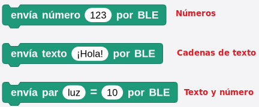  
*Bloques BLE Radio para enviar mensajes*  

Existe también bloques para determinar si se ha recibido un mensaje a través de BLE y el tipo de mensaje recibido.

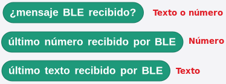  
*Bloques BLE Radio para saber si se han recibido mensajes*  

La comunicación entre dispositivos solamente es posible si se encuientran en el mismo grupo BLE, lo que se establece con el bloque siguiente:

  
*Bloque para fijar el grupo BLE*  

### Ejemplo comunicación básica por BLE Radio
Un ejemplo sencillo de envio de un número al azar entre 0 y 9 al pulsar el botón A y de una letra, la B, al pulsar el botón B. El dato recibido se muestra en la otra placa.

En la imagen siguiente tenemos el programa emisor.

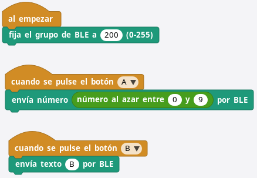  
*[Programa emisor BLE](../microSTEAMakers/programas/emisorBLE.ubp)*  

A continuación vemos el programa receptor:

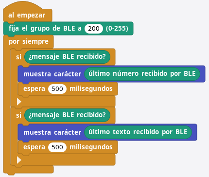  
*[Programa receptor BLE](../microSTEAMakers/programas/receptorBLE.ubp)*  

Ejecutando un programa en una placa con BLE y el otro en otra que tenga los botones A y B como la micro:STEAMakers se puede ver el funcionamiento del ejemplo.

### Ejemplo con textos y números
Se trata de crear un ejemplo en el que desde una placa micro:STEAMakers se envía el valor de luminosidad medido por la misma al pulsar el botón A y el de la temperatura medida por el sensor onboard cuando se pulsa el botón B. En ambos casos la información se envia con un par "texto - número" y en la recepción se determina cual se ha enviado determinando el texto del último mensaje recibido y en función de ello mostrará un valor u otro.

El programa del emisor es muy sencillo, como vemos en la imagen siguiente:

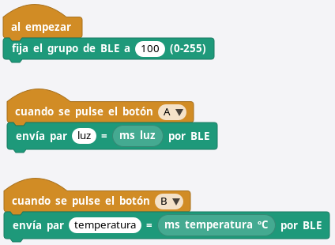  
*[Programa emisor BLE de dos datos](../microSTEAMakers/programas/emisorBLE2Datos.ubp)*  

El programa receptor tampoco es muy complicado. Mientras no se reciban mensajes BLE en pantalla se estará mostrando una interrogación de color rojo, mientras que los mensajes recibidos se muestran en color verde.

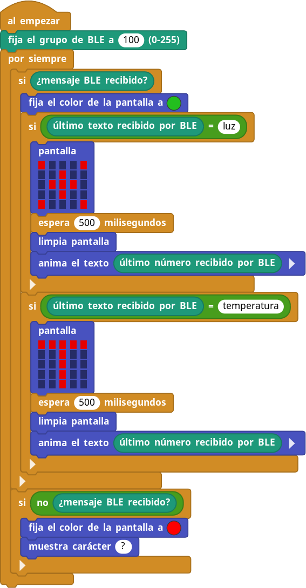  
*[Programa receptor BLE de dos datos](../microSTEAMakers/programas/receptorBLE2Datos.ubp)*  

A continuación se puede observar el funcionamiento del sistema entre dos placas.

  
*Programa emisor/receptor BLE de dos datos*  

