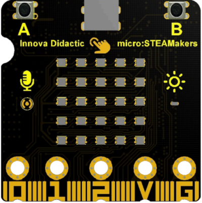
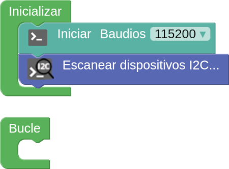
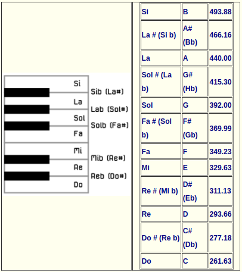
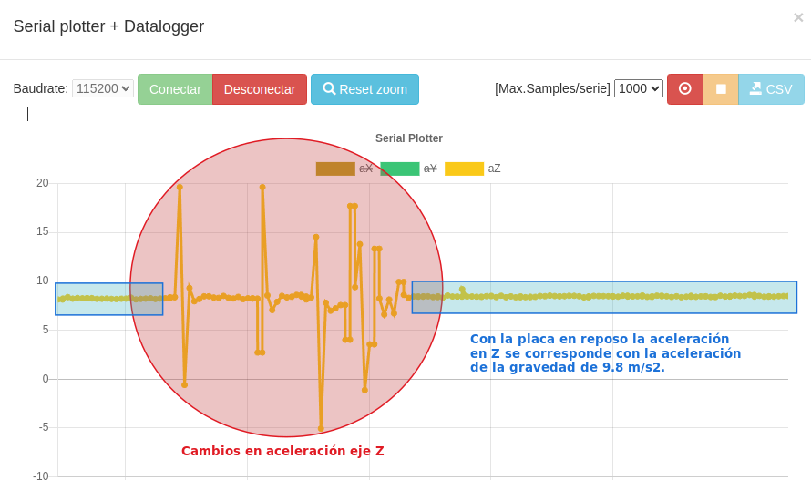

comenzar a utilizar la placa ESP32 microSTEAMakers, tienes que comprobar que tu ordenador tenga instalados los controladores necesarios. Por ello es aconsejable estudiar antes de nada los contenidos de este apartado.

Vas a encontrar toda la información que necesites en la web [ESP32-microSTEAMakers](https://fgcoca.github.io/ESP32-micro-STEAMakers/) y todos los enlaces que en la misma se proponen.

## <FONT COLOR=#007575>**Descripción**</font>

<center>

  
*Placa ESP32 microSTEAMakers*

</center>

La placa está equipada con:

* 520 KB de memoria dinámica
* 4 MB de memoria flash
* procesador de doble núcleo de 240 MHz
* Bluetooth de bajo consumo (BLE)
* WiFi

Esta placa también integra diversos sensores:

* temperatura y humedad
* giroscopio acelerómetro de seis ejes
* sensor de luz ambiente
* interfaz para tarjeta microSD
* micrófono de sonido ambiente
* zumbador
* botones por presión A y B y botón táctil
* matriz de 5x5 puntos RGB

## <FONT COLOR=#007575>**Componentes de la placa**</font>

<center>

  
*Componentes de la placa ESP32 micro:STEAMakers en la cara frontal*

  
*Componentes de la placa ESP32 micro:STEAMakers en la cara posterior*

</center>

## <FONT COLOR=#007575>**Pines GPIO**</font>
La siglas GPIO se corresponden con las iniciales de <b>G</b>eneral <b>P</b>urpose <b>I</b>nput/<b>O</b>utput,
 que se traduce como Entrada/Salida de Propósito General y se refieren a un pin genérico en un chip, cuyo comportamiento (incluyendo si es un pin de entrada o salida) se puede controlar (programar) por el usuario en tiempo de ejecución.

La placa ESP32 micro:STEAMakers está equipada con pines de expansión tipo gold-finger, incluyendo todos los pines IO, 19 puertos digitales, 7 puertos analógicos, interfaces I2C, UART y SPI. En la imagen siguiente tenemos la descripción de pines de la placa.

<center>

  
*Pinout del conector de borde*

</center>

## <FONT COLOR=#007575>**Compatibilidad de pines**</font>

!!! Warning "<FONT COLOR=#FF0000>AVISO IMPORTANTE</font>"
    Cuando vamos a trabajar con señales analógicas debemos tener muy presente que, aunque todos los pines IOxx son entradas y salidas digitales, algunas incluso con más funciones. **Cuando tenemos que utilizar la comunicación WiFi el convertidor ADC2 NO funciona.**

Las placas ESP32 tienen disponibles dos ADC (Analog to Digital Converter) de 12 bits que se denominan ADC1 y ADC2. Esos 12 bits dan una precisión de $2^{12} = 4096$. Por lo tanto, si tenemos 12 bits para 3.3V podemos asegurar que 
$3.3V/4096 = 0,8mV$ es la tensión correspondiente a cada paso.

!!! Danger "<FONT COLOR=#FF0000>Máxima tensión admisible en el ADC</font>"
    Aunque los pines GPIO de la ESP32 pueden funcionar a 5V, los conversores ADC no pueden. Debemos tener cuidado de no sobrepasar esos 3.3V si el pin es uno de los que están conectados a uno de los conversores.

La placa ESP32 micro:STEAMakers es al fin y al cabo una ESP32 y la lectura de una entrada analógica se realiza de la forma habitual en entornos basados en Arduino, es decir con ```analogRead(pin_GPIO)```. Internamente la ESP32, de manera genérica, compara la tensión que pretendemos medir con un valor de referencia Vref mediante un circuito atenuador de ganancia variable, tipicamente de -11dB para poder medir hasta 3.3V.

En la ESP32 micro:STEAMakers los pines que tienen conxión con los conversores ADC y que pueden ser utilizados como entradas analógicas están distribuidos de la siguiente forma:

* **ADC1** se conecta a 8 pines GPIO:  
<center>32 , 33, 34, 35, 36, 37, 38, 39</center>

* **ADC2** se conecta a 10 pines GPIO:  
<center>0, 2, 4, 12, 13, 14, 15, 25, 26, 27  
<FONT COLOR=#FF00FF><b>WiFi ON → INHABILITA ADC2</b></font></center>

A efectos prácticos, revisando el pinout de la placa podemos asegurar que **todos los pines catalogados como entradas analógicas, con la única excepción de la patilla 2 que se conecta a io32 y que pertenece a ADC1, funcionarán correctamente siempre y cuando no realicemos configuración WiFi alguna, dado que están conectados a ADC2.**

## <FONT COLOR=#007575>**I2C en la micro:STEAMakers**</font>
La placa ESP32 micro:STEAMakers incorpora un puerto de expansión I2C localizado en un conector hembra de 4 pines de 100mils (2,54mm) de separación entre pines.

<center>

  
*Conector de expansión I2C*

</center>

Además la placa incorpora dos dispositivos que son I2C y que es conveniente tener claro cuales son y que direcciones físicas utilizan para que no interfiramos con los mismo desde lo que conectemos externamente al puerto de expansión I2C de la placa que sea de tipo I2C. Son los siguientes:

* Sensor de temperatura y humedad **AHT20**.

<center>

  
*Sensor de temperatura y humedad AHT20*

</center>

* Acelerómetro, giroscopio de 6 ejes **MPU-6050**.

<center>

  
*Acelerómetro, giroscopio de 6 ejes MPU-6050*

</center>

Observamos en este caso que el dispositivo tiene posibilidad de configurar la dirección I2C del mismo entre dos posibilidades:

* Dirección 0x68 configurada por defecto al estar unidos los dos pads de configuración mediante una resistencia de cero ohmios.
* Dirección 0x69 que podemos configurar desoldando la resistencia de la 0x68 y soldandola en los dos pads de la 0x69.

!!! Info
    Aunque no es una operación muy compleja no se recomienda acometerla si no tenemos experiencia trabajando con soldadura en este tipo de placas y componentes y en cualquier caso no se recomienda a no ser que resulte totalmente imprescindible.

A continuación se muestra un ejemplo realizado en steamakersblocks en el que averiguamos las direcciones físicas de estos dos dispositivos I2C.

<center>

  
*Obtención de la dirección I2C de los dispositivos conectados*

</center>

Cargamos el programa en la placa, conectamos la consola serie y tras hacer un reset físico en la micro:STEAMakers nos aparece la siguiente información:

<center>

  
*Resultados obtención de la dirección I2C de los dispositivos conectados*

</center>

El bloque 'Escanear lo encontramos en 'Entrada/Salida' en I2C.

## <FONT COLOR=#007575>**Zumbador**</font>
### <FONT COLOR=#AA0000>Ideas básicas de sonido</font>
Antes de entrar en descripciones técnicas de componentes vamos a hablar un poco del sonido, sin entrar en profundidad, y como reproducirlo con una micro:STEAMakers.

Uno de los parámetros que caracterizan a un sonido es su frecuencia de emisión, siendo la frecuencia el número de veces que se repite por unidad de tiempo (segundo). La transmisión del sonido se realiza por ondas a través en cualquier medio (sólido, líquido o gaseoso) excepto en el vacío. La frecuencia de un sonido nos indica cuantos ciclos por segundo tiene una onda.

En la imagen y la tabla siguientes vemos un dibujo con un fragmento de las teclas de un piano estando todo referido a una nota estándar, la nota "La" central que tiene una frecuencia de 440 Hz. Podemos ver la nota musical que reproduce, en las dos notaciones más comunes de los sonidos (Inglés: C D E F G A B, Alemán: C D E F G A H, Español, italiano y francés: Do Re Mi Fa Sol La Si) y además se encuentra la frecuencia que produce esa nota musical.

<center>
  
.  
*Sección de piano y notas*

</center>

Otro de los parámetros que caracterizan al sonido es su nivel y en sonido se caracteriza con los decibelios (dB) que es la forma de medir la intensidad del sonido. La percepción del sonido depende de factores como la intensidad, el tiempo que dura, las frecuencias o tonos y el entorno donde estamos. Vamos a introducir brevemente como medir la intensidad del sonido.

Los decibelios (dB) son la unidad de medida de presión acústica. Medimos presión, luego estamos midiendo una fuerza y mas concretamente una fuerza por unidad de superficie. Un sonido pierde intensidad según nos alejamos de la fuente y lo hace a un ritmo de unos 6 dB cada que vez que se duplica la distancia. Vemos un ejemplo: supongamos que escuchamos un sonido de 45 dB a una distancia de un metro, cuando nos pongamos a dos metros escucharemos 39 dB, cuando estemos a 4 metros, será de 33 dB y cuando estemos a 8 metros, de 27 dB.

La escala de medida en dB no es lineal, es logaritmica porque representa mejor la forma en que sentimos los cambios de la intensidad del sonido con nuestro oido. Algunos datos para reflexionar sobre el ruido:

* El sonido se vuelve dañino para el ser humano a partir de los 75 dB.
* Alrededor de los 120 dB causa dolor. Una exposición de dos horas a 100 dB necesita un día completo para que el oido compense la exposición.
* Sonido en torno a 180 dB pueden ocasionar la muerte.

En la tabla vemos algunos ejemplos del día a día:

<center>

|nivel de sonido|Percepción|Situación|
|---|---|---|
|0 dB|Muy bajo|Nivel de audición humano|
|10 a 30 dB|Nivel bajo|Conversación tranquila. Biblioteca|
|30 a 50 dB|Nivel bajo|Conversación normal. Motor frigorifico. Agua saliendo del grifo|
|55 a 75 dB|Nivel considerable|Aspirador. Calle con trafico denso. Despertador. Batidora|
|75 a 100 dB|Nivel alto|Sensación molesta. Atasco de tráfico. Sirena de policia|
|100 a 120 dB|Muy alto|Taladro/claxon/concierto R&R = 120 dB. Interior discoteca = 110 dB|
|mas de 120 dB|Dolor|Avión despegando a 25 metros. Petardo a un metro|

</center>

Una equivalencia que nos puede ayudar a familiarizarnos con esta unidad es la tabla de equivalencias entre potencias y dBm (decibelios milivatio):

<center>
<font size="1">

| <font size="1">P (mW) | <font size="1">dBm | <font size="1">P (mW) | <font size="1">dBm | <font size="1">P (mW) | <font size="1">dBm | <font size="1">P (mW) | <font size="1">dBm |
|:-:|:-:|:-:|:-:|:-:|:-:|:-:|:-:|
| <font size="1">1 | <font size="1">0 | <font size="1">16 | <font size="1">12 | <font size="1">250 | <font size="1">24 | <font size="1">4 W | <font size="1">36 |
| <font size="1">1.3 | <font size="1">1 | <font size="1">20 | <font size="1">13 | <font size="1">315 | <font size="1">25 | <font size="1">5 W | <font size="1">37 |
| <font size="1">1.6 | <font size="1">2 | <font size="1">25 | <font size="1">14 | <font size="1">400 | <font size="1">26 | <font size="1">6 W | <font size="1">38 |
| <font size="1">2 | <font size="1">3 | <font size="1">32 | <font size="1">15 | <font size="1">500 | <font size="1">27 | <font size="1">8 W | <font size="1">39 |
| <font size="1">2.5 | <font size="1">4 | <font size="1">40 | <font size="1">16 | <font size="1">630 | <font size="1">28 | <font size="1">10 W | <font size="1">40 |
| <font size="1">3.2 | <font size="1">5 | <font size="1">50 | <font size="1">17 | <font size="1">800 | <font size="1">29 | <font size="1">13 W | <font size="1">41 |
| <font size="1">4 | <font size="1">6 | <font size="1">64 | <font size="1">18 | <font size="1"> 1 W | <font size="1">30 | <font size="1">16 W | <font size="1">42 |
| <font size="1">5 | <font size="1">7 | <font size="1">80 | <font size="1">19 | <font size="1">1.3 W | <font size="1">31 | <font size="1">20 W | <font size="1">43 |
| <font size="1">6 | <font size="1">8 | <font size="1">100 | <font size="1">20 | <font size="1">1.6 W | <font size="1">32 | <font size="1">25 W | <font size="1">44 |
| <font size="1">8 | <font size="1">9 | <font size="1">125 | <font size="1">21 | <font size="1">2 W | <font size="1">33 | <font size="1">32 W | <font size="1">45 |
| <font size="1">10 | <font size="1">10 | <font size="1">158 | <font size="1">22 | <font size="1">2.5 W | <font size="1">34 | <font size="1">40 W | <font size="1">46 |
| <font size="1">13 | <font size="1">11 | <font size="1">200 | <font size="1">23 | <font size="1">3 W | <font size="1">35 | <font size="1">50 W | <font size="1">47 |

</font size>
</center>

Si observamos cuidadosamente la tabla veremos que la potencia se duplica o divide por dos, según recorramos la tabla, cada 3 dB.

### <FONT COLOR=#AA0000>**Zumbador pasivo**</font>
Un zumbador o buzzer pasivo no es mas que un pequeño altavoz que nos sirve para convertir una señal eléctrica en una onda de sonido. Son dispositivos que no disponen de ningún tipo de electrónica interna, por lo que tenemos que proporcionar una señal eléctrica para conseguir el sonido deseado.

Normalmente (como componente) estos dispositivos se incluyen en un módulo que incorpora un transistor y una resistencia de polarización del mismo para hacer funcionar al altavoz que actúa como carga.

Un buzzer se basa en un transductor piezoeléctrico que es capaz de variar su volumen con el paso de la corriente eléctrica, fenómeno que se aprovecha para hacer vibrar la membrana del altavoz. Esquemáticamente vemos esto en la figura siguiente:

<center>

  
*Funcionamiento y aspecto de un buzzer pasivo*

</center>

Un zumbador pasivo requiere para su funcionamiento una señal de tipo PWM para poder indicarle la frecuencia y la duración de la señal.

El aspecto de un buzzer clásico visto por ambos lados nos ayudará a distinguirlo del activo.

<center>

  
*Aspecto de un buzzer pasivo típico*

</center>

El que incorpora la ESP32 micro:STEAMakers es de tipo 'montaje superficial' y tiene el aspecto de la imagen siguiente:

<center>

  
*Aspecto del buzzer pasivo en la micro:STEAMakers*

</center>

### <FONT COLOR=#AA0000>**Zumbador activo**</font>
Este tipo de zumbador incluye un oscilador que genera una frecuencia audible fija y que se conoce como zumbador pasivo y,  en realidad, es el que de forma correcta **se puede denominar como zumbador**. Este es mucho mas sencillo de usar ya que basta con conectarlo a un pin digital y cuando pongamos a nivel alto este pin el zumbador generará su zumbido característico durante el tiempo que establezcamos. Con este tipo de zumbador no se pueden generar melodías.

Cuando está nuevo se distingue del zumbador pasivo o altavoz por la pegatina de protección que lo acompaña, pero esta hay que quitarla para oir el zumbido y sin ella es difícil distinguir un tipo del otro, salvo por su reverso. Es aconsejable marcar alguno de los dos cuando podemos distinguirlos, sobre todo si van a ir montados sobre una PCB. Una buena idea puede ser utilizar la propia pegatina en el lateral del mismo para distinguirlo a primera vista.

Un zumbador activo produce un tono audible fijo con tan solo aplicarle tensión.

El aspecto por ambos lados de uno típico nos ayudará a distinguirlo del pasivo.

<center>

  
*Aspecto de un buzzer activo típico*

</center>

## <FONT COLOR=#007575>**Micrófonos**</font>
Un micrófono es un dispositivo de entrada que sirve para transformar ondas sonoras en energia electrica y vicerversa en procesos de grabación.

Existe multitud de tipos de micrófonos para distintas aplicaciones en las que no vamos a entrar. En el [enlace](https://es.wikipedia.org/wiki/Micr%C3%B3fono#:~:text=Un%20micr%C3%B3fono%20funciona%20como%20un,su%20intensidad%2C%20transmitirla%20y%20registrarla.) tienes un amplio artículo sobre los mismos.

Existe un tipo denominado MEMs ("Microelectromechanical systems" en inglés) que también se denominan chips microfónicos y son variantes del micrófono a condensador. El diafragma sensible está grabado sobre la oblea de silicio y suelen integrarse con un amplificador incorporado.

La micro:STEAMakers tiene un micrófono integrado. Puede usarse como una entrada simple (encender luces cuando se aplaude) o tambien se puede medir la cantidad de sonido, por lo que puede hacer un medidor de nivel de ruido o sonómetro básico Tambien podemos hacer que las luces se enciendan en modo disco, al compás de la música. Un micrófono funciona como un transductor o sensor electroacústico y convierte el sonido (ondas sonoras) en una señal eléctrica para aumentar su intensidad, transmitirla y registrarla.

El micrófono está en la parte delantera de la micro:STEAMakers y tiene el aspecto que vemos en la imagen siguiente:

<center>

  
*Aspecto del micrófono en la micro:STEAMakers*

</center>

Un circuito de aplicación típica lo vemos a continuación. En el mismo podemos observar que la capsula microfónica incluye su propia circuiteria amplificadora.

<center>

  
*Esquema circuito altavoz*

</center>

## <FONT COLOR=#007575>Acelerómetro + giroscopio</font>
La ESP32 micro:STEAMakers monta un chip MPU-6050 de InvenSense que es un dispositivo MEMS de 6 ejes (giroscopio + acelerómetro). El término MEMS, del inglés MicroElectroMechanical Systems, se refiere a la tecnología electromecánica de dispositivos microscópicos o sistemas microelectromecánicos.

Los dispositivos MPU-6050 combinan un giroscopio de 3 ejes y un acelerómetro de 3 ejes en el mismo chip, junto con un procesador digital (Digital Motion Processor™ o DMP) integrado, que procesa algoritmos complejos de 6 ejes. El dispositivo puede acceder a magnetómetros externos u otros sensores a través de un bus I²C maestro auxiliar, lo que permite a los dispositivos recopilar un conjunto completo de datos de sensores sin intervención del procesador del sistema.

Para un seguimiento preciso de los movimientos rápidos y lentos, el chip incorpora un giroscopio programable por el usuario con una escala completa de ±250, ±500, ±1000 y ±2000 °/seg (dps), y un acelerómetro programable por el usuario con una escala completa de ±2g, ±4g, ±8g y ±16g. Otras características son un sensor de temperatura integrado con una variación del ±1% en el rango de temperatura de funcionamiento.

En arduinoblocks se implementa el bloque del sensor con las aceleraciones y giros en los ejes X, Y y Z que vemos en la imagen siguiente:

<center>

  
*Bloque Accel+Gyro*

</center>

A continuación vamos a analizar la posición de los ejes X, Y, Z con la micro:STEAMakers vista por su cara frontal con el conector USB-C en la parte superior. La forma habitual en que vemos la pantalla de LEDs RGB.

Analizando la imagen siguiente:

<center>

  
*Analisis de la posición de los ejes*

</center>

Fijamos la posición de los ejes que vemos en la imagen siguiente:

<center>

  
*Posición de los ejes*

</center>

Tal y como vemos en la imagen siguiente, un programa en el que asignamos al plotter las aceleraciones en los tres ejes nos devuelve como resultado que cuando movemos la placa en el eje X habitual responde la aceleración en Y (marrón oscuro) y al moverlo en Y responde la de X (magenta claro). La tercera gráfica corresponde al eje Z.

<center>

  
*Cambios de ejes X e Y*

</center>

Como veremos en la actividad correspondiente el problema en muy sencillo de solucionar (si no lo está en el propio IDE de programación) para que las direcciones del movimiento sean la que habitualmente utilizamos en los ejes coordenados.

En la imagen siguiente se analiza la aceleración en el eje Z:

<center>

  
*Aceleración eje Z*

</center>

El problema se repite cuando trabajamos con los datos de giro.

## <FONT COLOR=#007575>**Tarjeta microSD**</font>
La placa ESP32 microSTEAMakers incorpora un lector de tarjetas microSD conectada mediante el bus SPI para comunicarse con el micro controlador.

El lector se conecta utilizando los pines:

* io5 - CS o Chip Select
* io23 - MOSI o Master Output Slave Input: Salida de datos del Master y entrada de datos al Esclavo.
* io19 - MISO o Master Input Slave Output: Salida de datos del Esclavo y entrada al Master.
* io18 - SCK o Clock

En la imagen siguiente podemos apreciar la posición del lecto SD en la parte posterior de la placa.

<center>

  
*Lector de tarjetas microSD*

</center>

## <FONT COLOR=#007575>**Seguridad**</font>
A la hora de utilizar la placa ESP32 STEAMakers, es fundamental seguir unas pautas de seguridad para garantizar tanto el buen funcionamiento de la placa como la seguridad de los usuarios. A continuación, se exponen varios consejos clave:

* **Evita cortocircuitos:** Hay que asegurarse de que la placa no esté alimentada cuando se manipulan materiales y herramientas conductores de electricidad. Esto ayuda a prevenir cortocircuitos inesperados que podrían dañar la placa o causar accidentes.
* **Manipula la placa con cuidado:** Los pines donde se conectan componentes diversos son delicados y pueden romperse o doblarse si se aplica una gran fuerza o palanca. Hay que ser especialmente prudente en la manipulación y evitar caídas o golpes que puedan afectar a la placa.
* **Controla la temperatura:** Es necesario tener en cuenta que la temperatura de la placa puede aumentar considerablemente durante el uso prolongado. Algunos componentes pueden calentarse y es importante evitar el contacto directo para prevenir
quemaduras o daños en la placa.
* **Revisa regularmente los componentes:** Es conveniente comprobar regularmente el estado de los componentes electrónicos y las conexiones. Los conectores sueltos o desgastados pueden causar un mal funcionamiento de la placa o ser un riesgo de seguridad.
* **Usa adecuadamente la alimentación:** Utiliza sólo las fuentes de alimentación recomendadas. Un voltaje incorrecto puede dañar la placa o incluso ser peligroso, ya que puede producir sobrecalentamiento de componentes o cortocircuitos.
* **Mantén la placa en un entorno seco y limpio:** La presencia de líquidos o polvo puede causar cortocircuitos o dañar los componentes de la placa.

Siguiendo estos consejos, podrás disfrutar de una experiencia segura y enriquecedora con la placa programable.
