Sección basada en la entrada de la [MicroBlocks Wiki](https://wiki.microblocks.fun/en/home) titulada [How to create a library - by Turgut Guneysu](https://wiki.microblocks.fun/en/create_a_library) donde se muestra el paso a paso para crear nuestras propias librerias en MicroBlocks.

En realidad la libreria que vamos a hacer no sirve nada mas que para explicar los pasos a seguir para su creación. No obstante si vamos a traducir las definiciones y procesos descritos en el enlace anterior.

## **Que es una libreria**
Cuando escribimos código y nos encontramos repitiendo constantemente un conjunto de instrucciones o ciertos procedimientos, puede resultar útil codificarlos una sola vez y convertir el resultado en una libreria o libreria, de modo que nosotros y otros podamos utilizarla más adelante simplemente cargándola y utilizándola en nuestros programas.

Por lo tanto, una libreria es una colección de código centrada en habilitar un componente, periférico o funcionalidad específicos. Lo importante que distingue a una libreria de un programa es que una libreria es un componente o un bloque de construcción que se utilizará en un programa, pero no es un programa completo en sí misma.

Las librerias se pueden crear utilizando el entorno de desarrollo integrado (IDE) del lenguaje de programación correspondiente o escribiendo código en el lenguaje fuente original que se utilizó para crear dicho entorno IDE.

## **Que hace una libreria**
Una buena libreria debe:

* Tener un propósito u objetivo específico.
* Implementar una interfaz de usuario limpia.
* No hacer cosas irrelevantes.

Para lograr los objetivos mencionados anteriormente, necesitamos planificar y reflexionar.

* **Objetivo:**  

La libreria debe tener una función específica para lograr un resultado concreto.

Para ello, debemos pensar en la tarea que se nos ha encomendado y asegurarnos de reducirla a su funcionalidad más importante, que será la que se recoja en la libreria. Ya sea para activar un componente de hardware o para realizar algún tipo de manipulación de datos, el objetivo de la libreria debe ser claro y conciso.

* **Interface:**  

La libreria debe implementar una interfaz de usuario limpia y clara.

Este aspecto es el más visible y relevante de la libreria. Los usuarios de nuestra libreria interactuarán con nuestro código a través de la interfaz de usuario y juzgarán su usabilidad y claridad en función de esta.

Para organizar la interfaz de nuestra libreria, debemos tener en cuenta tanto las entradas como las salidas.

Las entradas constituirán todos los datos que necesitamos de los usuarios para que la libreria pueda realizar su función. Estos se organizarán como parámetros de entrada para nuestra libreria.

Las salidas son lo que la libreria proporcionará como resultado del procesamiento de las entradas. Algunas librerias solo realizan operaciones que dan lugar a un cambio físico. Otras devuelven un valor claramente definido.

Es importante tener en cuenta que no todas las funciones de la libreria devuelven siempre un valor.

* **Relevancia:**  

La mayoría de los códigos de la libreria comienzan su vida como una funcionalidad de bloque personalizada codificada por el usuario. Nos damos cuenta de que nos falta alguna característica y escribimos algunos bloques personalizados para solucionarlo. Luego, decidimos que sería útil compartir esta funcionalidad y la convertimos en una libreria.

Es fácil dejarse llevar y empezar a añadir más y más funcionalidades al código. Esto conduce a un resultado final muy complicado. Lo mejor es planificar lo que hay que hacer y centrarse únicamente en conseguir esa funcionalidad.

A menudo será necesario desglosar ciertas características y agruparlas para crear la libreria. Estas se presentarán como bloques de funciones relacionadas que realizan diversos aspectos de la misma tarea original.

Un buen ejemplo es la libreria de pantallas LED de MicroBlocks, que contiene bloques para manipular el panel LED como un agregado o como LEDs individuales, y también tiene la capacidad de mostrar letras y números.

!!! Warning " "
    Los bloques de una libreria MicroBlocks no deben superar los 1000 bytes de longitud.

## **Vamos a escribir una**
Para simplificar las cosas, nos centraremos en el desarrollo de una libreria sencilla utilizando el IDE de MicroBlocks.

Dicha libreria no va a tener un propósito especifico, salvo ilustrar el proceso de creación, y solamente va a contener bloques que nos mostrarán mensajes en la pantalla.

La interface va a contener inicialmente dos bloques definidos así:

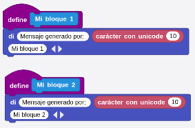

Y esta sería la parte de código de nuestra libreria que denominaremos "Mensajes".

En una situación real (mas complejidad en el código) es muy conveniente guardar nuestro programa para evitar accidentes que puedan ocasionar la pérdida del trabajo realizado. Por ahora vamos a llamarlo "Mensajes.ubp".

### Conversión a libreria
El siguiente paso que vamos a dar es convertir el programa "Mensajes.ubp" es una libreria para MicroBlocks.

Una libreria se define con la extensión ".ubl".

Lo que tenemos que hacer es tomar el programa con los códigos que hemos creado y convertirlo en un archivo con la extensión adecuada.

MicroBlocks proporciona la forma de hacerlo fácilmente. Hay que tener activado el modo avanzado y tendremos disponible la opción "Exportar funciones como libreria" en el botón "Fichero".

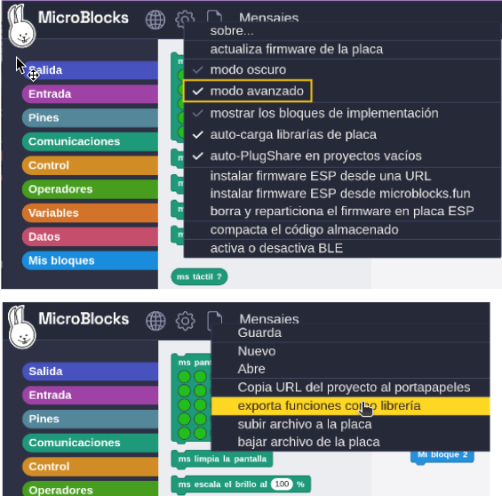

Esta opción nos proporciona una manera de guardar el programa personalizado que hemos creado como un archivo con formato de libreria.

Escribimos (o se nos mostrará) el nombre "Mensajes" para nuestra Librería y pulsamos Aceptar.

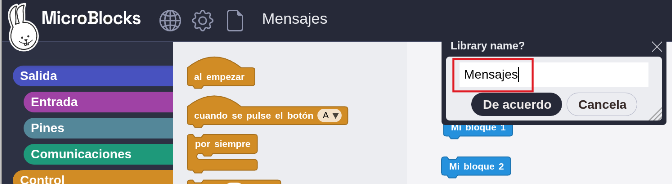

Ahora se muestra la ventana de diálogo para guardar archivos donde podremos colocar el archivo de libreria "Mensajes.ubl" en el directorio deseado de nuestro sistema.

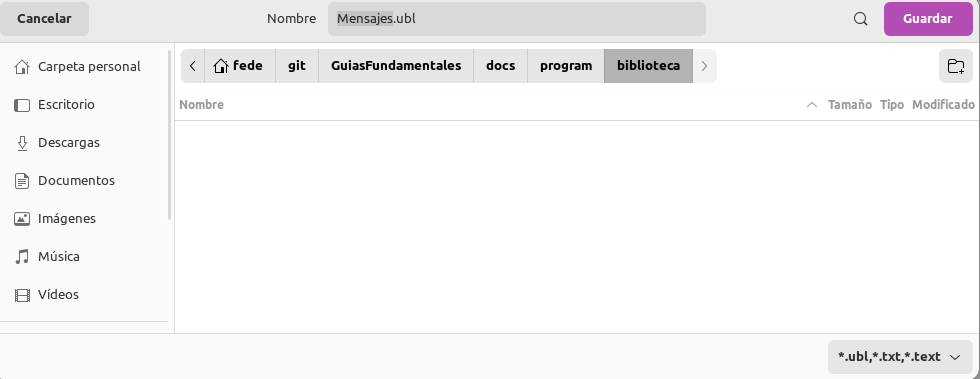

Una vez completado el proceso ya podremos comenzar un nuevo proyecto, ir a la sección Añadir librería del IDE de MicroBlocks y cargar nuestra Librería desde donde la guardamos directamente en cualquier programa que queramos.

Al compartir el archivo "Mensajes.ubl", proporcionaremos la manera en que otros usuarios puedan utilizar nuestra libreria de la misma manera. Evidentemente, en este caso no lo haremos.

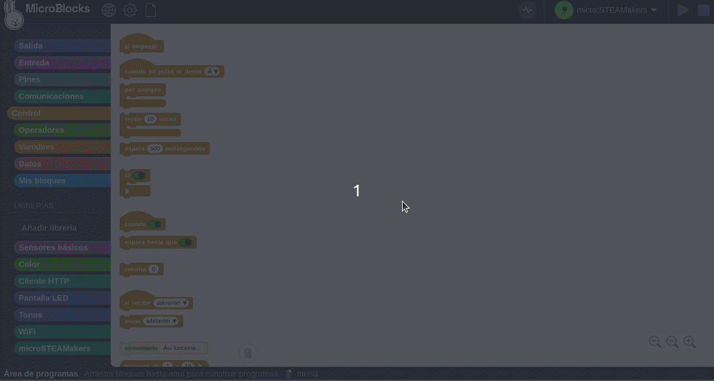

### Información de la libreria
Ya sea en un programa nuevo o en el mismo que se ha creado, una vez añadida la libreria al IDE es conveniente cumplimentar la información básica de la misma. Para ello hacemos clic derecho sobre el nombre de la libreria y escogemos la opción marcada:

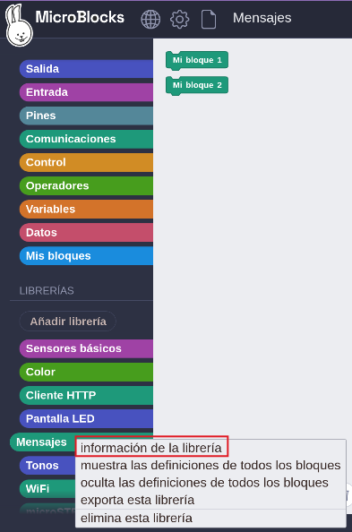

Haciendo clic en la opción indicada accedemos a la ventana de información de la libreria Mensajes:

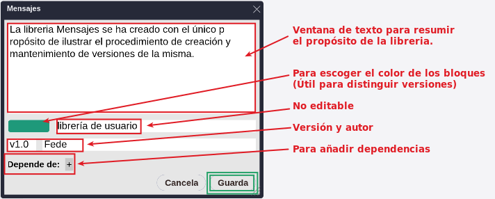

Ahora debemos guardar la información suministrada en la ventana haciendo clic en el botón "Guarda" remarcado en verde en la imagen anterior. Pero ***¡CUIDADO!*** porque esto solamente guarda los cambios realizados en la ventana para el proyecto actual. Si queremos guardar los cambios en la libreria, para que estos queden disponibles en la misma, debemos acceder a la opción "Exportar esta libreria" del menú contextual de la misma y sobre escribir la misma.

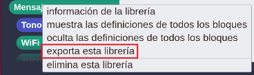

## **Método sencillo de versionando de una libreria**
Una vez creada una libreria, es necesario mantenerla actualizada y, con el tiempo, es posible que tengas varias versiones de la misma.

Pero antes de nada, algunos comentarios sobre cómo trabajar con scripts destinados a convertirse en librerias:

* No es necesario exportar los bloques personalizados a una libreria para poder probarlos.
* Simplemente utilízalos en el mismo programa donde los has desarrollado y sigue mejorándolos hasta que estén listos.

==**Guardar nuestra libreria**==  
Como hemos hecho en la sección anterior, cuando estemos satisfechos con el progreso, guardaremos nuestra libreria exportándola con la ayuda del menú Archivos.

* **Fase n.º 1:**

Durante el proceso de exportación, se solicita un nombre para la libreria. Este nombre será el que se utilizará cuando se cargue la libreria en MicroBlocks.

El proceso de exportación muestra un cuadro de diálogo y propone el nombre original del programa como predeterminado.

Aquí, es posible que desees cambiar el nombre propuesto por otro para la libreria y eliminar definitivamente la extensión UBP sugerida.

Ten en cuenta que no se utiliza ninguna extensión en el cuadro de diálogo Guardar.

Este primer paso del proceso de exportación crea un archivo de exportación a partir del programa fuente original. También realiza un cambio interno en este archivo para designarlo como archivo de libreria y coloca el nombre que se le da en la primera línea del archivo UBL exportado.

* **Fase n.º 2:**

En el segundo paso de la exportación, se pedirá un nombre de archivo del sistema para el archivo exportado en el disco del PC.

La extensión UBL se asignará automáticamente, lo que indica que se trata de un archivo de libreria.

Ten en cuenta estas diferencias:

      - El programa inicial era el archivo de script con extensión UBP.
      - El archivo de libreria exportado tiene la extensión UBL.

==**Cambiar y guardar una versión de nuestra libreria**==  
Cada vez que necesites cambiar la libreria, debes trabajar con el archivo .UBP. Esa es la fuente original y contiene todos sus bloques.

Aquí puedes realizar cambios en los bloques existentes, así como crear otros nuevos, según sea necesario. Y puedes probarlos en el mismo programa, sin necesidad de exportarlos.

Cuando todo esté listo y desees crear otra versión de la libreria, sigue el proceso de exportación:

  - [x] En el primer paso, puedes mantener el mismo nombre interno de la libreria.
  - [x] En el segundo paso, al escribir el archivo de la libreria en el disco del PC, puedes nombrarlo con un número de versión; por ejemplo: Mensajes-v01.UBL

Para el caso de la libreria "Mensajes", este proceso dará como resultado los siguientes archivos:

:    ARCHIVO ORIGINAL: Mensajes.UBP  
:    Archivo Lib: Mensajes.UBL <-- primera versión que se guardó
:    Archivo Lib: Mensajes-v01.UBL <-- siguiente versión que se guardó y a la que se asignó un número de versión.

Si quieres probar la libreria como tal, inicia un nuevo proyecto y arrastra y suelta cualquiera de los archivos Mensajes.UBL en él. Aparecerán en la sección librerias y podrán utilizarse en el código.

A medida que avances, es posible que decidas que algunas de las versiones anteriores ya no son necesarias. Por lo tanto, puedes eliminar cualquiera de los archivos UBL anteriores y crear otros nuevos según sea necesario.

Aunque el proceso descrito puede resultar un poco complicado, es infalible para un usuario de MicroBlocks:

  - [x] Siempre tendrás tu programa original.
  - [x] Y siempre tendrás tus versiones de libreria exportadas.
  - [x] Puedes ir y venir y trabajar con ellas sin preocuparte por perder tu trabajo.

Después de unos cuantos ciclos y librerias publicadas, podemos empezar a buscar otras formas de editar las librerias.

## **Método avanzado de versionando de una libreria**
Existe otro método útil para añadir nuevos bloques a una libreria sin tener que volver al código fuente original del proyecto.

Empieza creando un nuevo proyecto e importando la libreria en la que estás trabajando. Para ello, arrastra y suelta el archivo UBL en el IDE.

Crea un nuevo bloque en la categoría "Mis bloques" y prueba su funcionamiento.

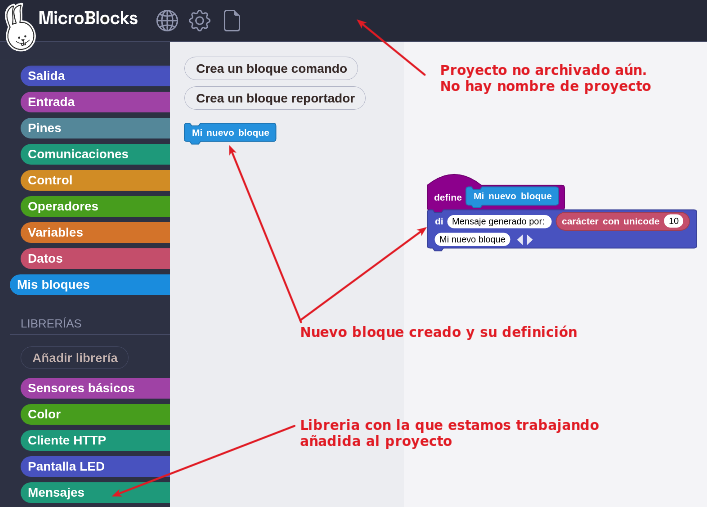

Ahora viene la parte mágica:

- [X] Si aún no se muestra, haz clic con el botón derecho en el bloque nuevo y selecciona "Mostrar definición de bloque". También puedes hacer clic con el botón derecho en el nombre de la categoría Mis bloques y seleccionar "Mostrar todas las definiciones de bloques".

- [X] Arrastra la definición del bloque nuevo (la definición de bloque es la pila de bloques con un bloque con sombrero morado en la parte superior) y suéltala sobre el nombre de tu libreria en la paleta. ¡El bloque desaparecerá de "Mis bloques" y aparecerá en la libreria!

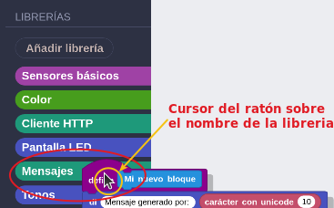

En la animación siguiente observamos como el bloque ha desaparecido de "Mis bloques" y se ha colocado como parte de la libreria.

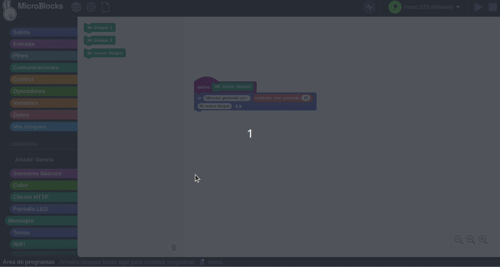

Cuando tengas todo listo, puedes volver a exportar la libreria con un nuevo número de versión. Puede conservar varias versiones antiguas por si deseas volver a alguna de ellas.

!!! info "**NOTA:**"
    Es **muy importante que**, al arrastrar y soltar el bloque recién creado en el nombre de la libreria en el menú "Librerias" de la izquierda, **coloques el puntero del ratón exactamente sobre el nombre de la libreria que aparece en el menú**. **No basta** con que el **script** copiado se **superponga al nombre de la libreria** que aparece en el menú: **el cursor del ratón debe estar dentro de él**.

    

    

    

### Los cambios de color ayudan
A medida que sigues el ejemplo anterior, debes prestar atención a los cambios de color de los bloques. Estos son útiles para seguir el proceso.

Cuando cargas "Mensajes", el nombre de la libreria en el menú y sus bloques son de color verde. El color de la libreria depende de la funcionalidad que proporcionan los bloques y, por lo general, lo asignan los desarrolladores de MicroBlocks al incorporar la libreria al IDE. Las diferentes librerias tendrán diferentes colores.

Cuando creas tu nuevo bloque personalizado en la categoría Mis bloques, el bloque recién creado tiene el mismo color que la categoría Mis bloques: azul.

Al arrastrar y soltar este bloque en el nombre de la libreria "Mensajes" en la sección del menú "Librerias", y se convierte en parte de tu libreria, cambia de color a verde, el color de tu libreria.

En "Mensajes-v1.2" se ha cambiado el color a rojo para distinguirla de la versión anterior.

 

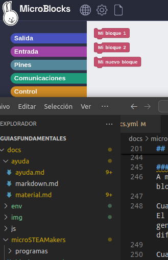

### Aviso final

!!! Warning " "
    Este método de actualización de la libreria no conserva el archivo UBP original. En su lugar, se crea un archivo UBP temporal exportando la libreria cargada. La libreria exportada recibe el mismo nombre y cualquier bloque nuevo se añade directamente a este archivo. A continuación, es necesario realizar otra exportación para capturar las últimas modificaciones.
    Una vez completado, se obtiene una libreria recién actualizada, sin embargo, no hay un archivo UBP correspondiente que lo incluya todo. En su lugar, se obtiene la última versión del archivo UBL para la libreria. Todas las actualizaciones futuras se realizarán a partir de este archivo.
