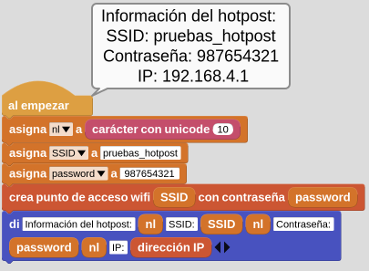

  
*Logo Wi-Fi*  
[Obtenido en Wikipedia](https://upload.wikimedia.org/wikipedia/commons/a/ae/WiFi_Logo.svg)

Wi-Fi es el nombre comercial propiedad de la Wi-Fi Alliance para designar su familia de protocolos de comunicación inalámbrica basados en el estándar IEEE 802.11 para redes de área local sin cables. Su primera denominación en inglés fue Wireless Ethernet Compatibility Alliance.

**WLAN** (Wireless Local Area Network o red de área local inalámbrica) es una red inalámbrica que permite conectar de forma inalámbrica dos o más dispositivos para formar una red de área local a escala limitada.

  
*WLAN*  
[Traducido de MicroBlocks Wiki](hhttps://wiki.microblocks.fun/en/network_libraries/wifi)

la libreria WIFI de MicroBlocks es compatible con muchas placas microcontroladas con capacidad WIFI. Con unos simples bloques, no es muy complicado configurar una conexión WIFI para participar en la infraestructura IP local; o incluso crear una red basada en hotspot o punto de acceso portatil.

Esta librería forma la base para aplicaciones más avanzadas basadas en WIFI donde uno de los muchos protocolos IP son usados para construir aplicaciones; ej: WebSocket, UDP, HTTP, MQTT etc. Hay bibliotecas separadas y ejemplos proporcionados sobre cómo lograr estos.

Para ver algunos ejemplos de proyectos WIFI, consulte el artículo [Métodos de control remoto WIFI](https://wiki.microblocks.fun/en/wifi) en la WIKI de MicroBlocks. También se pueden probar los ejemplos proporcionados en el menú Archivo/Abrir/Ejemplos/ Red:

  
*Abrir ejemplo*  

## **Resumen de los bloques**
Para cada bloque hay una breve descripción y una descripción detallada del bloque y los componentes.

Se dan códigos de ejemplo sobre cómo utilizar los bloques. Para probarlos, todo lo que tienes que hacer es descargar los archivos ubp y abrirlos en una sesión del IDE de MicroBlocks en un navegador y los tendrás en el área de programación del editor. A continuación, basta con hacer clic sobre ellos y ver los resultados.

||Descripción corta|
|:-:|---|
||Permite conectarse a la red local|
||Crea un punto de acceso dando sus credenciales|
||Retorna la dirección IP obtenida|
||Retorna la dirección MAC del dispositivo WIFI|
||Habilita el uso simultaneo de WIFI y BLE|

Hay dos tipos distintos de formas de bloque:

* oval: son bloques de información que devuelven algún tipo de información. Normalmente, el usuario los asignaría a una variable del proyecto o los utilizaría en una ranura de entrada adecuada de otros bloques.
* rectangular: son bloques de comando que realizan una función programada y no devuelven ninguna información.

!!! info "Sobre la descripción de los bloques"
    Estos bloques sólo funcionarán con placas que tenga capacidad WIFI; por ejemplo: ESP8266 y ESP32.

    Asegúrate de utilizar **credenciales WIFI específicas para tu entorno de red**. Las utilizadas aquí son a modo de ejemplo y **NO FUNCIONARÁN**.

## **Conéctate a la wifi**
  
Este bloque se utiliza para iniciar sesión en la red IP local con las credenciales proporcionadas. Una vez completado el proceso de registro, se obtiene una dirección IP del router local.

El siguiente ejemplo demuestra la conexión a la red WIFI local mostrando las credenciales utilizadas. Recuerda sustituir tus propios valores de SSID (Service Set Identifier o nombre público de una red WLAN) y CONTRASEÑA.

  
*Conéctate a la wifi*  
[Descargar archivo](../microSTEAMakers/programas/wifi_conectar.ubp)

## **Crea un punto de acceso wifi**
  
Si no hay una red IP disponible en las proximidades, es posible hacer que el microcontrolador cree un punto de acceso para proporcionar este servicio. En este caso, el microcontrolador actúa como un punto de acceso (AP) al igual que lo hace el router en el ejemplo de red WIFI normal. Una vez establecido el hotspot, todos los dispositivos remotos pueden conectarse a él y obtener sus direcciones IP directamente del dispositivo hotspot.

Asegúrate de que la contraseña que utiliza es del tipo **STRING** y tiene como **mínimo 8 caracteres de longitud**. Hay entornos como Windows, en los que el SO no permitirá la creación de hotspots "sin contraseña" (hotspots de acceso abierto). En la imagen siguiente se ha pulsado el botón derecho del ratón sobre el campo de entrada de valor de la variable password y vemos cómo verificar el tipo de variable de contraseña:

  
*Verificar tipo de variable*  

Cuando seleccione sólo texto en el menú desplegable, el campo cambiará de un blanco ovalado a un blanco rectangular.

En el ejemplo siguiente, programamos el microcontrolador para crear un hotspot con las credenciales dadas. Los detalles del hotspot se muestran una vez completado con éxito el inicio del hotspot.

Tengase en cuenta que en este modo de funcionamiento, no es posible el acceso a Internet en circunstancias normales. Además, el rango de direcciones IP asignadas por el punto de acceso será diferente del asignado por tu router de Internet.

  
*Crea un punto de acceso wifi*  
[Descargar archivo](../microSTEAMakers/programas/wifi_hotpost.ubp)

!!! info "El hotpost no provee acceso a internet"
    Tengase en cuenta que, en circunstancias normales, el **hotspot NO proporciona acceso a Internet**.
    
    Es sólo un medio para que los dispositivos locales se comuniquen entre sí.

    

      
    *Crea un punto de acceso wifi*  

    

## **Dirección IP**
  

!!! info "De Wikipedia, la enciclopedia libre"
    Una dirección de Protocolo de Internet (dirección IP) es una etiqueta numérica como 192.0.2.1 que está conectada a una red informática que utiliza el Protocolo de Internet para la comunicación. Una dirección IP cumple dos funciones principales: la identificación de la interfaz de red y el direccionamiento de la ubicación.
    
    La versión 4 del Protocolo de Internet (IPv4) define una dirección IP como un número de 32 bits. Sin embargo, debido al crecimiento de Internet y al agotamiento de las direcciones IPv4 disponibles, en 1998 se estandarizó una nueva versión de IP (IPv6), que utiliza 128 bits para la dirección IP. El despliegue de IPv6 está en marcha desde mediados de la década de 2000.
    
    Las direcciones IP se escriben y muestran en notaciones legibles para el ser humano, como 192.0.2.1 en IPv4, y 2001:db8:0:123:0:567:8:1 en IPv6.
    
    El tamaño del prefijo de enrutamiento de la dirección se designa en notación CIDR sufijando la dirección con el número de bits significativos, por ejemplo 192.0.2.1/24, que equivale a la máscara de subred 255.255.255.0 utilizada históricamente.

En la imagen siguiente podemos ver la descomposición de una dirección IPv4:

  
*Dirección IPv4*

Cuando se establece con éxito una conexión entre el microcontrolador y el router de Internet, o se inicia un hotspot, se asigna una dirección IP.

En el caso de la conexión normal a Internet, se trata de la dirección asignada por el DHCP del router de Internet. En el caso del hotspot, la dirección es asignada por el dispositivo microcontrolador.

## **Dirección MAC**
  

!!! info "De Wikipedia, la enciclopedia libre"
    Una dirección de control de acceso al medio (dirección MAC) es un identificador único asignado a un controlador de interfaz de red (NIC) para su uso como dirección de red en comunicaciones dentro de un segmento de red. Este uso es común en la mayoría de las tecnologías de red IEEE 802, incluidas Ethernet, Wi-Fi y Bluetooth. Tal y como suelen representarse, las direcciones MAC se reconocen como seis grupos de dos dígitos hexadecimales, separados por guiones, dos puntos o sin separador.

Una dirección MAC tiene el formato siguiente:

  
*Dirección MAC*  

En [HWaddress: MAC address and OUI lookup](https://hwaddress.com/) podemos localizar información sobre direcciones MAC.

En la imagen siguiente tenemos ampliada la información de la MAC:

  
*Dirección MAC*  
[Obtenida de Wikipedia](https://en.wikipedia.org/wiki/MAC_address#/media/File:MAC-48_Address.svg)

El siguiente ejemplo muestra como obtener la dirección MAC. En el mismo se muestra la conexión a la red WIFI local mostrando las credenciales utilizadas.

  
*MAC del dispositivo*  
[Descargar archivo](../microSTEAMakers/programas/wifi_MAC.ubp)

## **Permitir WiFi y BLE**
  
Para las placas que tienen funcionalidad WIFI y BLE soportadas en MicroBlocks, permite controlar el uso simultáneo de ambas, basándose en la configuración del interruptor booleano.

MicroBlocks IDE soporta conectividad BLE, para poder editar el código de forma inalámbrica. Uno puede combinar esto con la función WIFI de la placa si es necesario.

## **Libreria BLE Scanner**
[BLE Scanner Library](https://play.google.com/store/apps/details?id=com.macdom.ble.blescanner&hl=es) es una herramienta para monitorizar dispositivos BLE públicos y acceder a sus características. La más útil de ellas es el nombre del dispositivo. Los dispositivos BLE tienen asignado un nombre corto o largo, y se pueden identificar en las listas de exploración con esos nombres.

BLE Scanner está desarrollado para ayudar a la comunidad Bluetooth, tanto desarrolladores como usuarios para rastrear dispositivos inteligentes Bluetooth.

En las siguientes imágenes se ve cómo un escaneo BLE muestra los nombres de los dispositivos y las direcciones MAC en una aplicación de escaneo BLE de Android, así como los nombres de los dispositivos en el escaneo interno de la configuración BLE de Android.

  
*Dispositivos emparejados y resultado BLE Scanner*  

Los bloques disponibles son:

|Bloque|Descripción|
|:-:|---|
||Devuelve TRUE cuando se detecta un dispositivo por escaneo BLE|
||Devuelve el RSSI(*), oscila entre -26 (unos pocos centímetros) y -100 (40-50 m de distancia)|
||Devuelve la dirección MAC, un identificador único de 48 bits|
||Devuelve el tipo de dirección|
||Devuelve el nombre del dispositivo|
||Devuelve TRUE si el nombre del dispositivo es de tipo 8 o 9|

***(*) RSSI (Received Signal Strength Indicator) o indicador de fuerza de la señal recibida.***

## **Web Serial ESPTool**

### Compatibilidad y configuraciones
Esta herramienta se ha diseñado para ser una opción web para programar placas microcontroladoras de la familia ESP de Espressif. Es una herramienta que nos permite cargar cualquier firmware sin necesidad de usar el conector y cable USB nativo de la placa.

Web serial funciona en el navegador Chrome, [Chromium](https://es.wikipedia.org/wiki/Chromium_(navegador)) o navegadores que son Chromium como Microsoft Edge y Opera. Safari, Firefox y otros sistemas no son compatibles porque [no implementan Web Serial! (they have not implemented Web Serial!)](https://developer.mozilla.org/en-US/docs/Web/API/Serial#browser_compatibility). En la imagen vemos una captura de la web anterior que muestra la compatibilidad de navegadores tanto en ordenadores como en dispositivos móviles:

  
*Compatibilidad de navegadores*

Es muy posible que debamos habilitar la API serie, lo cual es realmente sencillo. Visitamos ***chrome://flags*** desde la barra de navegación de Chrome o Chromium. En la imagen vemos como localizar ***Experimental Web Platform features*** y el estado actual.

  
*Experimental Web Platform features*

Cuando habilitamos la característica se nos avisa de que los cambios se aplican al reiniciar el navegador y nos muestra un botón para realizar la tarea.

  
*Experimental Web Platform features*

Con esto ya tendremos disponible el dispositivo para la conexión vía web.