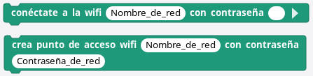
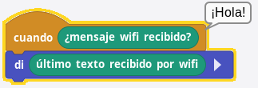
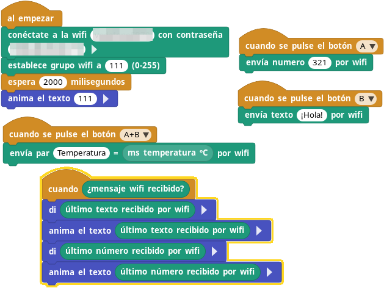

## **Libreria WiFi Radio**
La libreria WiFi ya está descrita en [Microblocks, libreria WiFi](https://fgcoca.github.io/GuiasFundamentales/microSTEAMakers/lib_wifi/).

La libreria WiFi Radio permite intercambiar mensajes fácilmente entre placas con WiFi que estén en la misma red.

Un mensaje puede contener una cadena, un número o ambos. Los mensajes son recibidos por todas las placas del mismo grupo de radio que el remitente.

Esta libreria es similar a la libreria Radio utilizable en micro:bit, pero los mensajes se envían a través de UDP por WiFi en lugar del sistema de radio Nordic. Dado que UDP admite paquetes más grandes, esta libreria puede enviar cadenas más largas.

Esta libreria solo puede comunicarse con otras placas que admitan WiFi; no puede interoperar con placas basadas en Nordic como micro:bit.

El uso de diferentes códigos de grupo (del 0 al 255) permite que varios proyectos de radio wifi funcionen simultáneamente en entornos educativos. Un grupo es un canal de comunicación independiente. Cada microcontrolador envía y recibe mensajes solo a otros miembros de su grupo. Los mensajes intercambiados por otros grupos se ignoran.

El grupo está configurado en cero de forma predeterminada. No es necesario cambiar a otro grupo a menos que otras personas ya estén utilizando el grupo cero.

La versión WIFI de Radio Messaging utiliza el protocolo UDP de WIFI en modo BROADCAST. Cada mensaje enviado se transmite a través de la subred IP local. Por lo tanto, antes de utilizar esta función, es necesario establecer una conexión a una red wifi.

Esta red wifi puede ser la propia red local basada en un router de internet o una red configurada mediante la función Hotspot de la liberia wifi. Para establecer la conectividad o crear un punto de acceso, se debe utilizar uno de los siguientes bloques de la libreria WIFI.

  

!!! Warning " "
    El dispositivo que envía mensajes no puede recibir.

### envia numero ... por wifi

Envia un mensaje que contiene un número.

En el extremo receptor, el número se lee con el bloque del "último número recibido por wifi".

### envia texto ... por wifi

Envía una cadena de texto (hasta 800 bytes aproximadamente). Puedes enviar mensajes más largos dividiéndolos en trozos de menor número de bytes.

En el extremo receptor, la cadena se lee con el bloque "último texto recibido por wifi".

### enviar par ...=... por wifi

Envía un mensaje que contiene una cadena de texto corta y un número. La cadena puede utilizarse para especificar el significado del número; por ejemplo, "luz = 10" para significar que la lectura del sensor de luz es 10.

En el extremo receptor, la parte de la cadena del mensaje se lee con el bloque "último texto recibido por wifi" y la parte del número con el bloque "último número recibido por wifi".

### ¿mensaje wifi recibido?

Devuelve cierto (true) cuando se recibe un nuevo mensaje wifi.

Este bloque se utiliza a menudo en un bloque sombrero cuando para procesar los mensajes de radio entrantes. Por ejemplo este script imprime los mensajes de texto entrantes:

  

### último número recibido por wifi

Devuelve la parte numérica del último mensaje wifi recibido. Devuelve cero si el mensaje no contiene un número.

### último texto recibido por wifi

Devuelve la parte de cadena de text del último mensaje wifi recibido. Devuelve una cadena vacía si el mensaje no contenía ninguna cadena.

### establecer grupo wifi a ... (0-255)

Establece el número de grupo (0-255) utilizado para enviar y recibir mensajes.

Un grupo es un canal de comunicación independiente. Los mensajes enviados por un microcontrolador de un grupo determinado son recibidos por todos los demás microcontroladores de ese grupo. Los mensajes intercambiados por otros grupos se ignoran.

El número de grupo por defecto es cero. El microcontrolador vuelve a ese grupo cuando se reinicia.

### Ejemplo
El programa será el mismo para al menos dos placas con WiFi, aunque hay que recordar que la emisora no puede recibir el mensaje emitido. El funcionamiento será que al pulsar el botón A se envie un número, al pulsar el B una cadena de texto y al pulsar A+B se enviará el par de valores "Temperatura" y el valor de la temperatura medida por el sensor de la placa micro:STEAMakers. Cuando se reciba un mensaje wifi se mostrará el resultado tanto en la pantalla de los dispositivos como en el ordenador donde se está ejecutando MicroBlocks.

  
[Descargar programa](../microSTEAMakers/programas/comunicaciones__similar_radio.ubp)

