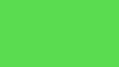
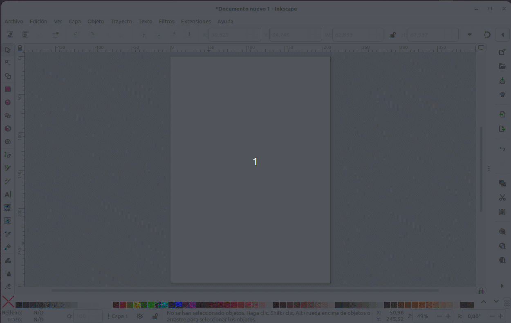
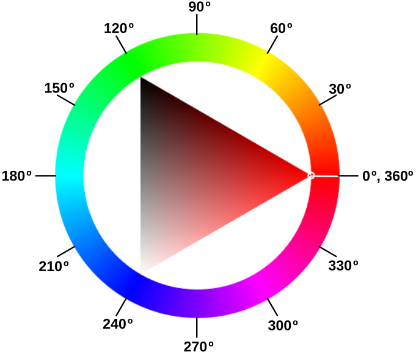
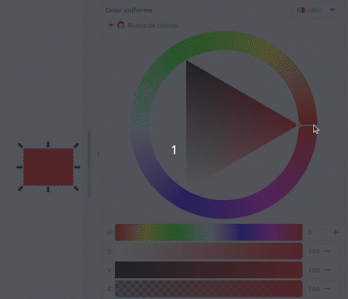

Según [Wikipedia](https://es.wikipedia.org/wiki/Modelo_de_colores) un modelo de colores es un modelo matemático abstracto que permite representar los colores en forma numérica, utilizando típicamente tres o cuatro valores o componentes cromáticos (por ejemplo **RGB** y **CMYK** son modelos de colores). Es decir, un modelo de colores sirve en una aplicación que asocia a un vector numérico un elemento en un espacio de color.

En el enlace anterior tenemos mayor información de los modelos existentes, de los que nosotros vamos a ver los dos que habitualmente se utilizan en programación de placas microcontroladas, el RGB y el HSV.

## **Modelo RGB**
El modelo de color RGB utiliza los componentes RGB (Red, Green, Blue) o RVA (Rojo, Verde, Azul) para definir la cantidad de luz de cada color en un color determinado. En una imagen cada componente se expresa como un número entre 0 y 255, lo que significa que hay 256 grados de cada color primario. Si multiplicamos todos los grados de color disponibles por canal se obtiene $256x256x256 = 16777216$, es decir mas de 16,7 millones de combinaciones de color.

El ojo humano sitúa su espectro visible entre la lu6z violeta y la luz roja estimándose que puede distinguir hasta 10 millones de colores. El funcionamiento del ojo de manera resumida es: la córnea inclina la luz hacia la pupila, esta es la que regula la cantidad de luz que llega al cristalino. El cristalino se encarga de enfocar la luz en la retina, la capa de células nerviosas situada en el fondo del ojo. En la retina hay dos tipos de células, los conos (se estimulan en condiciones de buena luminosidad) y los bastones (se estimulan en condiciones de baja luminosidad). Los conos humanos tienen habitualmente tres tipos de pigmentos: rojo, verde y azul. 

Es un modelos de color aditivo, luego el color se produce a partir de la luz transmitida. RGB se utiliza por lo tanto en monitores, donde las luces roja, azul y verde se mezclan de distintas formas para reproducir un amplio rango de colores. Cuando las luces roja, azul y verde se combinan en su máxima intensidad, el ojo percibe el color resultante como blanco. En teoría, los colores mezclados siguen siendo rojo, azul y verde, pero los pixeles del monitor se encuentran demasiado juntos para que nuestro ojo pueda diferenciar los tres colores. Cuando el valor de cada componente es 0, indica que hay una ausencia de luz y el ojo percibe el color negro.

## **Modelo HSL**
El modelo **HSL** o a veces **HSI** (siglas del inglés Hue, Saturation, Lightness o Intensity; traducido por, ‘matiz o tono, saturación, luminosidad o intensidad’), define un modelo de color en términos de sus componentes constituyentes.

En el modelo de color **HSV**, un color se define por su matiz o tono (H), su saturación (S) y su luminosidad o intensidad (L). Ahora las siglas no significan colores como en RGB, sino parámetros.

La variedad de colores se obtiene cambiando los tres canales de color de tono (H), saturación (S) y luminosidad (L) y superponiéndolos entre sí. Este modo de color cubre los colores que puede percibir la visión humana.

Se suele representar mediante la rueda de color, como vemos a continuación:

### Tono, matiz o Hue (H)
En el círculo cromático el grado 0 (o 360º si hemos dado una vuelta completa) del Hue es el color rojo. El circulito rodeado corresponde al ángulo en la rueda de color. Cada ángulo representa un color. En esa posición la saturación S por defecto toma su valor máximo de 100, y el brillo (L) es de 50. Nos podemos mover con estas condiciones por la rueda y obtener los distintos colores para esos valores de saturación o brillo.

### Saturación o Saturation (S)
Indica la intensidad de un tono concreto. Los valores varian entre 0 y 100, siendo 100 el máximo de saturación posible y 0 el mínimo, que dará como resultado, gris. El parámetro cambia sus valores moviendose dentro del triángulo en la línea del díametro del círculo que corresponde a la posición del ángulo determinado por H.

Observamos que al acercarnos al gris el valor de H se restablece a su valor por defecto. Hasta ese punto el tono se mantiene en el valor definido.

### Luminosidad o Lightness (L)
El parámetro se refiere a como de claro u oscuro es un color. Si queremos aclarar un color nos moveremos hacia el blanco y si quiero oscurecerlo hacia el negro.

Hay un parámetro que suele acompañar a la rueda de color que es el Alfa (A), que puede variar entre 0 y 100 y se refiere al grado de opacidad del color, correspondiendo 100 a totalmente opaco y 0 a totalmente transparente.

### **Convertir RGB a HSL**
Nos vamos a basar en un ejemplo descrito por los valores R=90, G=220, B=80 correspondiente a un tono verde oscuro.

* **Paso 1. Máximo y Mínimo**. Convertimos los valores RGB a valores en el rango 0-1 dividiendo por 255 cada valor.

$R = \dfrac{90}{255}= 0.353 \space; \space G = \dfrac{220}{255}= 0.863 \space; \space B = \dfrac{80}{255}= 0.314$

$\boxed{R = 0.353 \space; \space G = 0.863 \space(Max) \space; \space B = 0.314 \space(Min)}$

* **Paso 2. Luminancia**. Calculamos la Luminancia sumando los valores máximo y mínimo obtenidos en el paso 1 y lo dividimos por 2.

$L \space = \space \dfrac{0.863 + 0.314}{2} \space= \space 0.5885 \space\approx59 \%$

$\boxed{L \space = \space 0.5885 \space \approx 59 \%}$

* **Paso 3. Saturación**. A la hora de calcular la saturación S tendremos en cuenta que:

>
- <b>Si los valores máximo y mínimo son iguales: No hay saturación.
- Si todos los valores RGB son iguales: Tono gris mas o menos oscuro o claro dependiendo de la luminosidad.
- Si no hay saturación el Tono será 0º.</b>

Si no se da alguna de las condiciones anteriores sabemos que hay Saturación, que se calcula según sea el nivel de Luminancia:

$\Rightarrow$ **Si $L \leq 0.5$**

$S = \dfrac{Max-Min}{Max+Min}$

$\Rightarrow$ **Si $L > 0.5$**

$S = \dfrac{Max-Min}{2.0-Max-Min}$

$S = \dfrac{0.863-0.314}{2-0.863-0.314} = \dfrac{0.549}{0.823}=0.667 \approx 67 \%$

$\boxed{S = 0.667 \approx 67 \%}$

* **Paso 4. Tono**. La fórmula del Tono depende de qué canal de color RGB es el valor máximo. Las tres fórmulas diferentes son:

$\Rightarrow$  Si **Rojo** es el máximo, entonces:

$H = \dfrac{G-B}{Max-Min}$

$\Rightarrow$  Si **Verde** es el máximo, entonces:

$H = 2.0 + \dfrac{B-R}{Max-Min}$

$H = 2.0 + \dfrac{0.314-0.353}{0.863-0.314} = 2.0 + \dfrac{(-0.039)}{0.549} = 1.929$

$\boxed{H=1.929}$

$\Rightarrow$  Si **Azul** es el máximo, entonces:

$H = 4.0 + \dfrac{R-G}{Max-Min}$

El valor obtenido de H lo multiplicamos por 60 para convertirlo en grados en el círculo cromático. Si resulta un valor negativo de H le sumamos 360.

$H = 1.929 \times 60 = 115.74 \approx 116 \space grados$

$\boxed{H=116 \space grados}$

Resultado final:

R = 90, G = 220, B = 80

H = 116, S = 67, L = 59

### Convertir HSL a RGB
En el mismo sitio en que hemos basado la conversión de RGB a HSL de [Nikolai Waldman](https://www.niwa.nu/2013/05/math-behind-colorspace-conversions-rgb-hsl/) está documentado como hacerlo a la inversa, pero nosotros no lo vamos a hacer de este modo.

Se encuentran facilmente en la web páginas con calculadoras que permiten convertir de un modelo a otro con tan solo introducir los valores. Algunas incluso indican las fórmulas de cálculo, que usualmente están basadas en la entrada [HSL and HSV](https://en.wikipedia.org/wiki/HSL_and_HSV#Converting_to_RGB) de la Wikipedia. A título de ejemplo aquí pongo la de [rapidtables](https://www.rapidtables.org/convert/color/hsl-to-rgb.html), que ofrece muchas calculadoras en línea gratuitas

Hay una forma de hacerlo a partir de un programa libre como es Inkscape, publicado bajo licencia **GNU General Public License, version 3** y que hemos utilizado para las animaciones donde se han explicado los conceptos y donde además se pueden obtener otros datos y por supuesto modificarlos.

Es muy sencillo de utilizar y nos ofrece además otras posibilidades interesantes. Veamos como llegar a ello una vez abierto Inkscape con un archivo en blanco.

Dibujamos cualquier cosa y abrimos las opciones de Relleno y borde del objeto y desde ahí ya podemos cambiar el modelo de color, activar la rueda, mover la rueda o los valores lineales, volver a cambiar de modelo, etc y se nos irán mostrando los valores convetidos de uno a otro, como se observa en la animación siguiente cuando cambiamos del modelo HSL a RGB.

  

## Modelo HSV
El modelo HSV (**Hue**, **Saturation**, **Value** – **Matiz**, **Saturación**, **Valor**), es también llamado HSB (Hue, Saturation, Brightness – Matiz, Saturación, Brillo), define un modelo de color en términos de sus componentes.

El **Matiz** o **Hue** se representa como un ángulo de 0 a 360º correspondiendo cada valor a un color. En una rueda de colores se puede representar de la siguiente forma:

  

Si asociamos con RGB vemos que el rojo corresponde a un ángulo de 0º, el verde a 120º y el azul a 240º. Los colores entre estos tres ángulos divisorios corresponden a niveles de mezcla de los dos colores extremos. Por ejemplo, justo en la mitad entre el rojo y el verde estaría la mezcla de ambos colores que corresponde al amarillo.

La **Saturación** puede variar entre 0 y 100% y representa el porcentaje de brillo. En la animación siguiente vemos el funcionamiento de la rueda de color y del parámetro de saturación en el programa Inkscape.

  
*Rueda de colores HSV y Saturación*

El **Valor** también puede variar entre 0 y 100%, correspondiendo el 0 siempre a negro y el resto de valores un color mas o menos saturado. En la animación siguiente vemos el funcionamiento del parámetro Valor en el programa Inkscape.

  
*Rueda de colores HSV y Valor*

El propio Inkscape no puede servir para convertir RGB a HSV y viceversa. En la web también podemos encontrar calculadoras que lo hacen indicando incluso las fórmulas de conversión y dandonos una previsualización del color. A continuación, a título de ejemplo, ponemos enlaces a dos de ellas:

* Conversor de [RapidTables](https://www.rapidtables.com/convert/color/hsv-to-rgb.html) en inglés.
* Conversor de [peko-step](https://www.peko-step.com/es/tool/hsvrgb.html) en español.