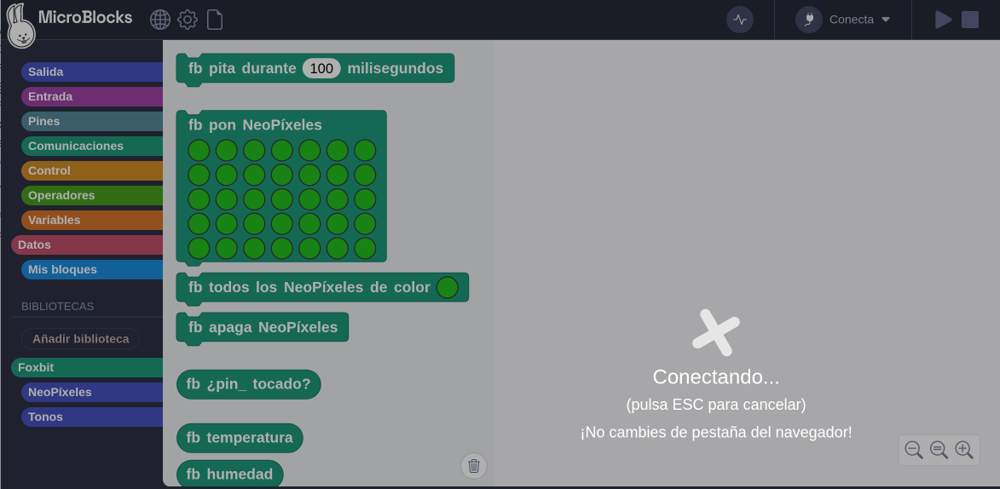
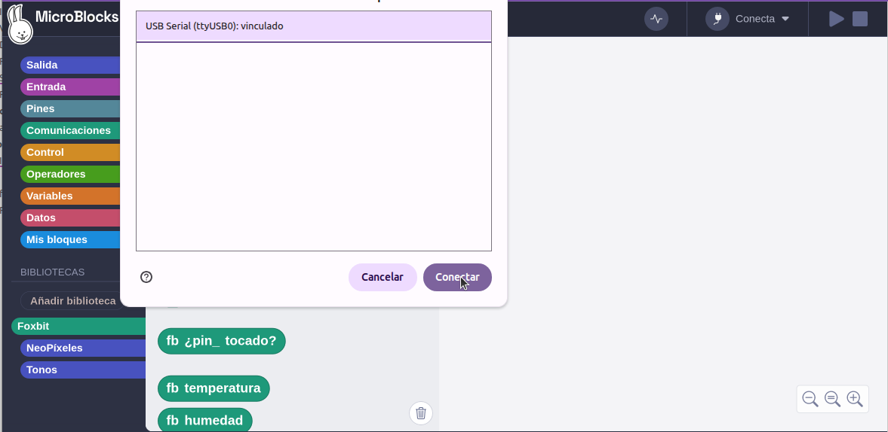
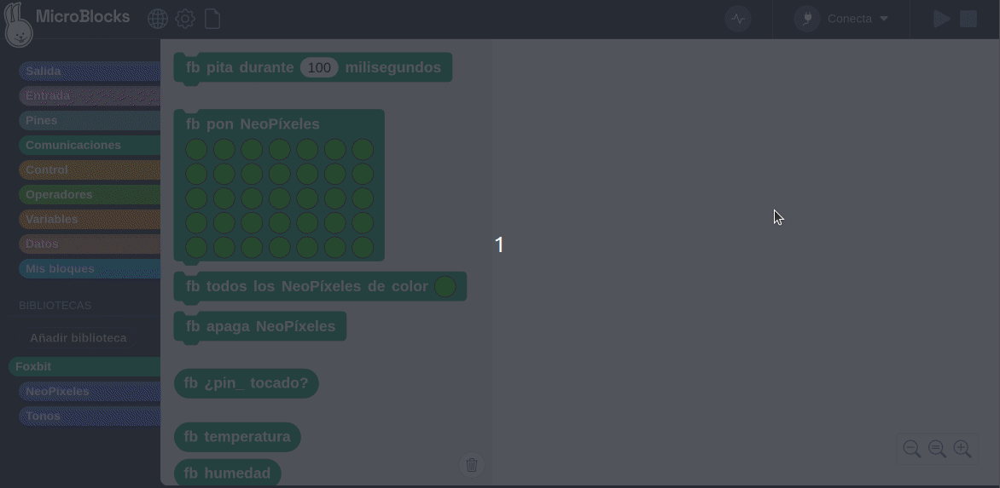

La descripción que sigue se produce en las siguientes condiciones:

* **Sistema operativo**: Ubuntu 22.04.5 LTS (Jammy Jellyfish)
* **Navegador**: Chromium, Versión 140.0.7259.2 (Build oficial) snap (64 bits)
* **Programa**: MicroBlocks, Versión v2.0.60 pilot
* **Dispositivo microcontrolado**: Placa Foxbit

Si tu caso es similar o tienes el mismo tipo de problema puedes probar los comandos descritos para ver si se soluciona.

La problemática parte de la siguiente situación: cuando se conecta la placa a un puerto USB se intenta actualizar el firmware de la misma se inicia el proceso tal y como vemos en la imagen siguiente:

<center>
  
.  

</center>

Pero no se produce ningún progreso y tras un tiempo la ventana pasa a tener el aspecto habitual. Si se hace clic en "Conecta" y se elige "Conect (USB)" se abre la ventana de dispositivos vinculados:

<center>
  
.  

</center>

Al hacer clic en el botón "Conectar" aparentemente no ocurre nada y no se muestra la placa conectada ni el logo en verde. En cambio si vamos a desplegar "Conecta" vemos lo siguiente:

<center>
  
.  

</center>

Aparentemente la placa está conectada pero la conexión no es completa y si se intenta ejecutar algo en la misma genera error de "Placa no conectada", tal y como vemos en la animación siguiente:

<center>
  
.  

</center>

El problema radica en la configuración de las conexiones en caliente o hotplug y su integración en USB u Udev bajo Linux. La entrada [udev](https://es.wikipedia.org/wiki/Udev) encontrada en Wikipedia que se reproduce a continuación lo acalara a la perfección:

!!! Note " "
    **udev** es el gestor de dispositivos que usa el núcleo Linux en su versión 2.6. Su función es controlar los ficheros de dispositivo en /dev. Es el sucesor de devfs y de hotplug, lo que significa que maneja el directorio /dev y todas las acciones del espacio de usuario al agregar o quitar dispositivos, incluyendo la carga de firmwares.

El problema lo centramos en el navegador y que este ha sido instalado desde la tienda Snap.

## <FONT COLOR=#007575>**Hotplug**</font>
Según la documentación de soporte sobre Hotplug dada por [Canonical](https://snapcraft.io/docs/hotplug-support) la compatibilidad con Hotplug está actualmente en desarrollo y estará disponible en una versión futura de snapd.

Hay que habilitar la conexión en caliente dado que Hotplug es actualmente una función experimental.

El soporte de hotplug se habilita con el siguiente comando:

``` sh
sudo snap set system experimental.hotplug=true
```

Para que el comando tenga efecto es necesario reiniciar snapd o volver a conectar los dispositivos USB para iniciar el procesamiento de conexión en caliente para los dispositivos conectados.

``` sh
sudo systemctl restart snapd
```

## <FONT COLOR=#007575>**Chromium**</font>
En primer lugar añadimos a Chromium raw-usb para permitir el acceso a todos los dispositivos USB conectados.

``` sh
sudo snap connect chromium:raw-usb
```

Añadimos puerto serie a la conexión:

``` sh
sudo snap connect chromium:serial-port
```
