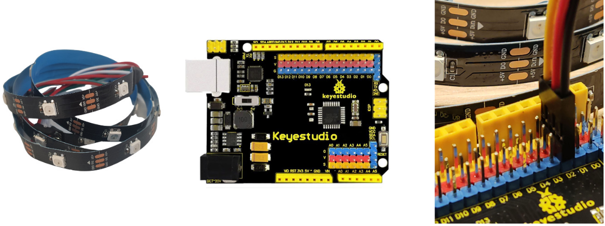
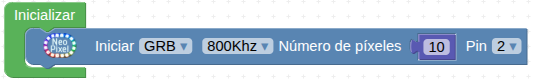
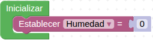
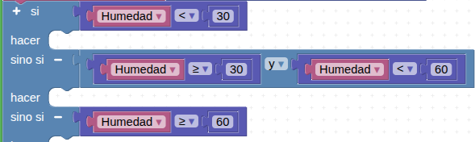
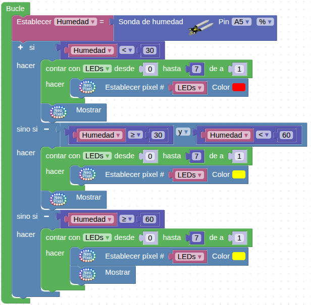
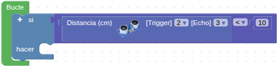
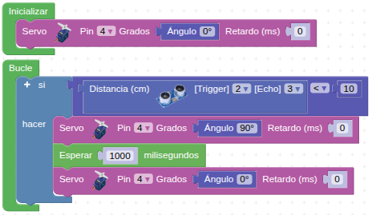
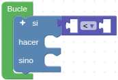

## **NIVEL I. Detector de movimiento**
En primer lugar, conecta la tira de **leds Neopixel** en uno de los **pines GVS**, por ejemplo el **pin D2**, de la placa **Keyestudio UNO** como en la siguiente imagen:

  

Es necesario que el cable negro (GND) del sensor coincida con el pin negro (GND) de la placa Keyestudio UNO para que la conexión sea correcta.

Para programar la tira de leds Neopixel, primero toma este bloque de programación de la categoría **Visualización - Neopixel**

  

Colocalo dentro del bloque “Inicializar” e indica que hay 10 leds en la tira de leds Neopixel conectados al pin 2 de la placa Keyestudio UNO. El bloque “Inicializar” debería quedar así:

  

Seguidamente, toma el bloque de programación condicional "si / si no" de la categoría **“Lógica”** y colócalo dentro del **“bucle”** principal. La estructura queda de la siguiente forma:

  

Hecho esto, conecta el **sensor de movimiento PIR** en uno de los **pines GVS**, por ejemplo el pin D8, de la placa **Keyestudio UNO** como en la siguiente imagen:

  

Coloca el bloque de programación **“Detector de movimiento (PIR)”** de la categoría "**Sensores**" en la condición del bloque condicional. Indica que el sensor “**lectura del sensor de movimiento PIR**” está conectado al **pin 8**. Colócalo dentro del bloque de programación condicional **“sí”** para que cuando el sensor detecte un movimiento se ejecute una acción. Y si no detecta ninguna, se ejecute otra.

  

Por último, y para cada caso, coloca un bloque de programación **“Contar con”** de la categoría **“Control”** para que se pongan todos los leds de la tira de Neopixel de un mismo color. Cambia el nombre de la variable **“i”** del contador por **LEDs”** y colócala dentro del bloque de programación **“Establecer pixel #”**. Indica que el contador vaya del número 0 al 9 para que encienda los 10 leds de la tira de Neopixel.
En caso de que se detecte movimiento, puedes programar que los leds Neopixel se enciendan de color rojo. Y si no se detecta, que se enciendan de color verde.

  

Para que las luces se enciendan habrá que añadir el bloque "**Mostrar**" que encontraremos en la categoría **Visualización - Neopixel**. Lo añadiremos después de establecer de qué color queremos los pixels.

El programa final quedará así:

  
*[Descargar: NIVEL I. Detector de movimiento](../UNO/programas/R_UNO_Detector_mov.abp)*

## **NIVEL II. Control de humedad**
Lo primero de todo, crea una variable denominada **Humedad** desde el menú "**Variables**".

  

Coloca el bloque de programación "**Establecer Humedad**" de la categoría "**Variables**" dentro del bloque "**Inicializar**" para empezar el programa con un valor de la variable "0".

  

Después, conecta el **sensor de humedad** a la Keyestudio UNO, por ejemplo en el **pin A5**, ya que es un **sensor analógico**, como en la siguiente imagen. Es necesario que el cable negro (GND) del sensor coincida con el pin negro (GND) de la placa para que la conexión sea correcta.

  

Y conecta la tira de **leds Neopixel** en uno de los **pines GVS**, por ejemplo el **pin 4**, de la placa **Keyestudio UNO** como en la siguiente imagen:

  

Seguidamente, para iniciar la tira de leds Neopixel, configura los leds mediante este bloque de programación de la categoría **Visualización - Neopixel**

  

Colócalo dentro del bloque **“Inicializar”** e indica el número de leds Neopixel conectados al **pin 4** de la placa Keyestudio UNO tienen 10 leds. El bloque **“Inicializar”** debería quedar así tras los pasos dados:

  

Coloca dentro del "**bucle**" principal el bloque de la variable creada con el bloque de programación "**Sonda de humedad**" de la categoría "**Sensores**" indicando que está conectado al pin A5 y las unidades en %.

  

Seguidamente, toma el bloque de programación condicional "si / si no" de la categoría **“Lógica”** y colócalo dentro del **“bucle”** principal. La estructura queda de la siguiente forma:

  

Pulsa en el símbolo “+” para crear más condiciones:

  

Después, coloca un bloque de comparación y el bloque booleano “y” de la categoría "**Lógica**" en la condición "**si**" y "**si no, si**" respectivamente. Uno de los elementos de la comparación debe ser el bloque del valor de la variable **“Humedad”** y el otro, **los valores de la humedad** que queramos establecer, por ejemplo “30” y “60”. De esta forma, define el límite inferior (30), el límite superior (60) y el rango intermedio (entre 30 y 60).

  

Por último, y para cada caso, coloca un bloque de programación “**Contar con**” de la categoría **“Control”** para que se pongan todos los leds de la **tira de Neopixel** de un mismo color. Cambia el nombre de la variable “i” del contador por **“LEDs”** y colócala dentro del bloque de programación “**Establecer pixel #**”. Indica que el contador vaya del número 0 al 7 para que encienda 8 leds de la tira de Neopixel.

Para que las luces se enciendan habrá que añadir el bloque “Mostrar” que encontraremos en la categoría **Visualización - Neopixel**. Lo añadiremos después de establecer de qué color queremos los pixels.

El bloque condicional debe quedar así:

  

Por último, y para dar tiempo a la lectura del sensor, añade una pausa con el bloque de programación “**Esperar (ms)**”.

Ten en cuenta que el valor que debes escribir en este bloque indica un valor de tiempo con unidades en milisegundos. Por tanto, si queremos indicar una pausa de 1 segundo, es necesario escribir un valor de 1000 en el mismo.

El programa completo queda así:

  
*[Descargar: NIVEL II. Control de humedad](../UNO/programas/R_UNO_Detector_mov.abp)*

## **NIVEL III. Barrera automática**
En este reto, crea un programa que levante una barrera accionada por el servomotor en función de si detecta o no un objeto a cierta distancia en centímetros gracias al sensor de ultrasonidos.

Utiliza los siguientes bloques de programación para realizar este reto:

  

==**POSIBLE SOLUCIÓN**==

El primer paso que debes dar es conectar el sensor de ultrasonidos a la **Keyestudio UNO**. Este sensor tiene **cuatro cables de conexión**: uno de tierra GND, otro de voltaje VCC y dos de señal (Trig y Echo). Por tanto, debes realizar la conexión a la Keyestudio UNO formando una “L”, tal y como se indica en la imagen. Indica cm como unidades de la lectura de distancia y los pines de señal donde hayas conectado los cables de Trig (emisor) y Echo (receptor) en el bloque de programación del sensor de ultrasonidos. Puedes conectarlos a los pines 2 y 3, por ejemplo, de la hilera de pines GVS como en la siguiente imagen:

  

También conecta el **servomotor** en uno de los pines GVS de la hilera de conexiones de la Keyestudio UNO, por ejemplo el **pin 4**.

  

Preparados los componentes, es hora de realizar el programa. Dentro del "**bucle**" principal coloca el bloque de programación "**si hacer**". Dentro de este condicional, añade el bloque de comparación de la categoría **lógica**. Uno de los elementos de la comparación debe ser el bloque de lectura del sensor de ultrasonidos ya configurado y el otro, el valor de la distancia, que en este caso puede ser de **10 centímetros**, para detectar cuándo un objeto está cerca de la barrera. El bloque para escribir un valor numérico se encuentra dentro de la categoría **“Matemáticas”**. El programa en este punto debería estar así:

  

A continuación, de la categoría “**Motor - Servo**” selecciona el bloque de programación **“Servo”**. Colócalo dentro del bloque condicional “si” para que cuando se detecte una distancia menor de 10 centímetros el servomotor haga un movimiento. Por ejemplo, programa que se mueva primero en la **posición angular 90º**. Indica que has conectado el servomotor al **pin 4**.

En este momento el programa debería estar así:

  

Sin embargo, es necesario **devolver al servomotor a su posición inicial**, por lo que hay que añadir el bloque **“Esperar”**. Decide cuál es el tiempo óptimo a "esperar", normalmente se toma 1.000 milisegundos (1 segundo). Seguidamente, añade el bloque del servomotor que lo devuelve a su posición inicial. Por tanto, el programa del bucle principal queda de la siguiente manera:

  

Para asegurar que el servomotor realice un movimiento de forma correcta, es necesario “reinicializarlo” al iniciar el programa. Por eso, en el bloque **“Inicializar”**, coloca el bloque de programación del **servomotor** para que se inicie en la **posición 0º**.

  

El programa completo de este reto queda así:

  
*[Descargar: NIVEL III. Barrera automática](../UNO/programas/R_UNO_Barrera_automatica.abp)*

## **NIVEL IV. Contaminación acústica**
Crea un programa capaz de emitir una alerta cuando detecte un nivel de sonido excesivo mediante el sensor de sonido, un LED verde y un LED rojo.

Para empezar, conecta el sensor de sonido analógico a uno de los pines A0-A5 de la placa Keyestudio UNO. Por ejemplo, puedes conectar el cable GVS al pin A0. Es necesario que el cable negro (GND) del sensor de sonido coincida con el pin azul (GND) de la placa Keyestudio UNO.

  

Conecta los leds a la hilera de pines de entradas y salidas digitales GVS. Por ejemplo, conecta los cables GVS del LED rojo en el pin P0 y el LED verde en el pin P1. Comprueba que el cable negro (GND) del LED coincida con el pin azul (GND) de la placa Keyestudio UNO.

  

Inicia un nuevo programa en steamakerblocks añadiendo el bloque de programación condicional "**si / hacer / si no**" que encontrarás en la categoría de "**Lógica**". Como el objetivo es que este condicional funcione en todo momento, deberás introducirlo dentro del bloque **“Bucle”** que aparece al iniciar un proyecto:

  

A continuación, debes introducir un comparador para medir el nivel de sonido del sensor y compararlo con un valor determinado, que será el valor umbral. En la categoría **“Lógica”** arrastra el bloque de comparación de valores numéricos en el lado derecho del **“sí”** y cambia el símbolo “**=**” (igual) por el de “**<**” (menor que).

  

En **“Sensores”** arrastra el bloque “**Nivel de sonido Pin A0 %**” y sitúalo en el primer espacio del comparador. Despliega el campo donde aparece el porcentaje para dejarlo en de "0..1023".

En **“Matemáticas”** arrastra un bloque para añadir un número y sitúalo después del símbolo “<” (menor que) del comparador. Cambia el valor **“0”** por **“700”**, como ejemplo de umbral que determinemos (el sensor de sonido analógico proporciona valores entre 0 y 1023).

  

Ahora define el comportamiento de los leds. Arrastra el bloque "**Led Pin 2 Estado ON**" que encontrarás en "**Actuadores**" y sitúalo en el lado derecho de "**hacer**". Duplícalo, o arrastra de nuevo el bloque, y encajalo debajo del anterior. Para encender el LED verde y apagar el LED rojo (el valor del sensor no supera el umbral) deberás poner el pin 2 en “**Estado OFF**” y el pin 3 en “**Estado ON**” en cada uno de los bloques dentro de **“hacer”**.

Duplica de nuevo los bloques y sitúalos en el lado derecho del “**si no**”. Cambia los estados de los pines: ahora el LED rojo (pin 2) estará encendido (**“ON”**) cuando el nivel de sonido supere el valor umbral y el LED verde (pin 3) estará apagado (**“OFF”**).

  
*[Descargar: NIVEL IV. Contaminación acústica](../UNO/programas/R_UNO_Contaminacion_acustica.abp)*

## **NIVEL V. Trasvase de agua**
Consigue trasvasar agua de un vaso a otro mediante la bomba de agua y el relé utilizando un pulsador.

Antes de empezar a programar es esencial que conectes adecuadamente el pulsador, el relé y la bomba de agua con la placa Keyestudio UNO.

Primero, conecta el pulsador a la placa Keyestudio UNO mediante los pines GVS de la hilera de conexiones. Puedes utilizar, por ejemplo, el pin 2. Luego conecta el relé a la placa en la misma hilera. Puedes conectarlo al siguiente pin, el pin 3, por ejemplo. Comprueba que el cable negro (GND) del relé coincida con el pin azul (GND) de la Keyestudio UNO para garantizar una conexión correcta.

A continuación conecta uno de los cables de la bomba de agua a un pin GND de la placa Keyestudio UNO. El otro cable de la bomba debes conectarlo al conector central de salida del relé. Para finalizar, quita el cabezal de plástico de un extremo de un cable hembra-hembra y conéctalo desde el conector de salida del relé hasta un pin VCC de la placa Keyestudio UNO. Esto dejará el circuito en abierto y permitirá que, al activarse el relé, el circuito se cierre y, en consecuencia, la bomba se active.

  

Inicia un nuevo programa en steamakerblocks añadiendo el bloque de programación condicional "**si / hacer / si no**" que encontrarás en la categoría de "**Lógica**". Como el objetivo es que este condicional funcione en todo momento, deberás introducirlo dentro del bloque **“Bucle”** que aparece al iniciar un proyecto:

  

A continuación, debes introducir la condición a evaluar para ejecutar una acción u otra, que en este caso consiste en que si el pulsador está pulsado, se activa el relé y, por tanto, se pone en funcionamiento la bomba de agua, y si no lo está, no funciona. Encontrarás este bloque en el apartado **“Sensores”** con el nombre de **“Pulsador”**. Tienes que colocarlo en el conector justo al lado del **“si”**, y el programa quedará configurado de la siguiente manera:

  

En este punto falta definir, por un lado, qué pasará cuando se pulse el pulsador, y por otro, qué pasará cuando se deje de pulsar. Toma el bloque de programación para controlar el relé de la categoría **“Actuadores”**, colócalo en cada caso del condicional. Indica que el relé está conectado al pin 3 y que si el pulsador está pulsado, el estado del relé debe estar en **“ON”**, y si no lo está, en **“OFF”**.

El programa quedará configurado de la siguiente forma:

  
*[Descargar: NIVEL V. Trasvase de agua](../UNO/programas/R_UNO_Trasvase_agua.abp)*

## **NIVEL IV. Contaminación acústica**

  
*[Descargar: NIVEL IV. Contaminación acústica](../UNO/programas/R_UNO_Contaminacion_acustica.abp)*

NIVEL V. Trasvase de agua