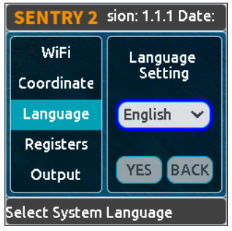
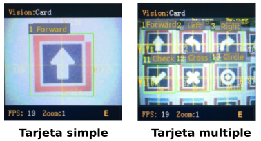

## **Hardware**
### Resumen
- Processador → K210, 400 MHz
- Lente de la cámera → 200 píxels
- Voltage de funcionamiento → 3,3 - 5 V
- Dimensiones → 42 x 36 x 12 mm
- Pantalla → TFT-IPS de 1,3”
- Resolución de la pantalla → 240 x 240 píxels

Sus principales funcionalidades son:

- Reconocimiento de colores
- Detección de bloques de color
- Reconocimiento de etiquetas
- Aprendizaje
- Detección de líneas
- Reconocimiento de tarjetas
- Reconocimiento de caras

Sentry2 es un sensor de visión artificial diseñado con un procesador de red neuronal RISC-V de 64 bits avanzado K210.

  

Este dispositivo integra varios algoritmos de visión avanzados que pueden satisfacer las necesidades básicas de procesamiento de imágenes. El chip ESP8285-WiFi integrado se puede programar desde el IDE de Arduino para realizar reconocimiento en línea, transmisión de imágenes, AIoT (Artificial Intelligence of Things) y otras aplicaciones. El ESP8285 se puede utilizar como controlador para el K210, lo que facilita la programación de IA sin necesidad de un controlador externo.

Aplicaciones: robots, coches inteligentes, diseño creativo, educación STEAM, creadores, juguetes, AIoT.

En la imagen vemos los nombre y situación de sus principales partes:

  

- **LED**: representa diferentes estados de detección.
- **Cámara**: captura de imágenes. El usuario puede ajustar el nivel de zoom, el balance de blancos, el brillo, la saturación y otros parámetros de la cámara.
- **Antena WiFi**: el chip WiFi ESP8285 puede realizar reconocimiento en línea, transmisión de imágenes y aplicaciones AIoT.
- **Procesador K210**: un potente MCU (Multipoint Control Unit) con unidad de procesamiento de red neuronal, procesador RISC-V de doble núcleo y 64 bits.
- **Ranura microSD**: admite tarjetas microSD (también conocidas como TF, que significa TransFlash) para el almacenamiento de imágenes (nota: no se admiten todos los tipos de tarjetas SD, solo con comunicación SPI).
- **USB**: el chip USB-UART integrado puede comunicarse y controlarse directamente con el ordenador, así como actualizar el firmware.

!!! Danger "**PRECAUCIÓN**"
    La alimentación USB se conecta al puerto de comunicación de 4 pines. **Nunca se deben usar dos alimentaciones al mismo tiempo**.

- **Pantalla LCD**: pantalla TFT-ISP (Thin Film Transistor - In-Plane Switching) a color con alta definición y amplio ángulo de visión.
- **Joystick**: para interactuar con la interfaz de usuario, admite control en cinco direcciones (arriba, abajo, izquierda, derecha, pulsar).
- **Reset o botón de reinicio**: reinicia el hardware.
- **Puerto de salida**: puerto de salida de 4 pines para comunicación, compatible con los modos UART e I2C.

### Parámetros del hardware

|Parámetro|Valor|Unidad|Notas|
|---|:-:|:-:|---|
|Tensión|3.3 a 5|V|No alimentar por USB e I2C/UART simultaneamente|
|Corriente|150|mA|Alimentada a 5V y en modo reconocimiento de caras|
|Tamaño|40x32x12.5|mm|Sin carcasa|
|Peso|15|g|Sin carcasa|
|Distancia entre agujeros de montaje|32|mm||
|Diámetro agujeros de montaje|3|mm||
|Tipo de cámara|CMOS|||
|Resolución cámara|200|pixel||
|FPS|25|fps||
|Campo de visión FOV|68|º||
|Tipo|TFT-ISP LCD|||
|Tamaño|1.3|Pulgadas||
|Resolución pantalla|240x240|pixel||

### Algoritmos de visión
Sentry 2 integra una variedad de algoritmos de visión sin conexión para reconocer objetos sin red, y el chip WiFi ESP8285 integrado puede realizar la función de reconocimiento de imágenes basada en nube.

|ID|Nombre| |Información|
|:-:|---|---|---|
|1|Color|Colores (*)|Devuelve el valor R (rojo), G (verde), B (azul) y su etiqueta en cada región. Hasta 25 regiones|
|2|Blob|Bloques de color (*)|Detecta un bloque de color especificado. Admite la selección de bloques de color negro, blanco, rojo, verde, azul y amarillo a la vez|
|3|Apriltat|Etiquetas April|Admite las familias Apriltag 16H5, 25H9, 36H11. Hasta 25 etiquetas|
|4|Line|Líneas (*)|Encuentra líneas y devuelve sus puntos finales y grados. Admite de 1 a 5 líneas|
|5|Learning|Aprendizaje|Entrena objetos y los categoriza. Hasta 15 modelos|
|6|Card|Tajetas (tráfico)|Identifica patrones de tarjetas especiales, incluidas 10 tarjetas de tráfico|
|7|Face|Caras|Detección y reconocimiento facial que admite la detección de máscaras. Hasta 15 caras|
|8|20Class|Objetos comunes|Clasifica 20 objetos comunes como gato, coche, etc|
|9|QRCode|Códigos QR|Reconocimientos de código QR sencillo. No disponible en la versión comercial|
|10|Custom|Personalizar|Algoritmos personalizados que se ejecutan en el chip WiFi ESP8255 incorporado|
|11|Motion|Movimiento|Determina si hay zonas en movimiento en la imagen. No disponible en la versión comercial|

!!! Note "(*)"
    Los algoritmos **Colores**, **Bloques de color** y **Líneas** se pueden abrir simultáneamente con el resto de algoritmos, mientras que el resto ^^NO se pueden abrir a la vez entre sí^^, pero SÍ que se pueden abrir a la vez que los 3 citados.

    Por ejemplo, podríamos abrir simultáneamente **Colores**, **Líneas** y **Caras**, pero NO **Colores**, **Tarjetas** y **Caras**.

### Cómo se utiliza
Sentry2 se puede conectar a un controlador a través del puerto de salida (ver imagen siguiente) o a un ordenador mediante un cable USB. El puerto de salida se puede configurar en modo UART o I2C y también es posible modificar la dirección del dispositivo y la velocidad de transmisión.

Desde el enlace se pueden [descargar](https://tosee.readthedocs.io/en/latest/Sentry2/Download/index.html#chapter-download-index): Controladores, firmware, manuales y recursos de terceros.

!!! Danger "**PRECAUCIÓN:**"
    ¡El puerto USB y el puerto de comunicación no se pueden alimentar al mismo tiempo!

### Definición de los pines del puerto de salida
Para la conexión entre la placa controladora y el sensor Sentry2 resultará útil la información de pines del conector de salida:

  

|Pines|Modo UART|Modo I2C|
|:-:|:-:|:-:|
|1|Rx|SDA|
|2|Tx|SCL|
|3|GND|GND|
|4|VCC|VCC|

!!! Danger "**ATENCIÓN:**"
    Cuando se inserta el cable USB, este puerto puede suministrar energía a dispositivos externos.
    
    
<b>Este puerto NO puede conectarse directamente a una fuente de alimentación, no se puede acceder al sistema de 3,3V.</b>

### Conexionado
Veamos en primer lugar como conectar el sensor de visión IA a una placa ESP32 STEAMakers.

#### **Modo UART**

  

En modo UART debes asegurarte de:

* La conexión Tx - Rx entre la placa y Sentry2 está cruzada. Sentry2 Rx → Tx placa y Sentry2 Tx → Rx placa.
* Dado que los pines RX y TX de STEAMakers son utilizados para la carga del firmware, es necesario desconectar las conexiones Rx y Tx durante la carga del programa. Se recomienda utilizar el modo I2C.

#### **Modo I2C ESP32 STEAMakers**

  

#### **Modo I2C ESP32 micro:STEAMakers**

  

!!! Note "NOTA:"
    Si quieres utilizar el puerto serie por software, puedes especificar otros puertos de entrada/salida. Para más detalles, mira el SoftSerialExample en el IDE de Arduino.

### Interface de usuario
Sentry2 tiene dos tipos de páginas o modos de interfaz de usuario:

==**Ejecución (Running)**==

  

En este modo el significado de las partes es:

* Estado de la cámara: En esta área se muestra el nombre actual del modo de visión.
* Imagen: Muestra las imágenes de la cámara.
* Marcos: Enmarca los objetos detectados, como el cuadro de detección, las coordenadas o la información.
* Estado del sistema: Velocidad de fotogramas de la cámara, nivel de zoom o estado de la conexión WiFi.

==**Configuración (Setting)**==

  

En la página de ejecución, puedes hacer clic derecho en el joystick para acceder a la página de configuración de la interfaz de usuario. Hay tres páginas: **Configuración Vision**, **Configuración cámara** y **Configuración hardware**.

  

Si haces clic con el joystick hacia la izquierda, saldrá de la página actual y pasará una por una hasta volver a la página de ejecución.

* **Configuración Vision**: habilita o deshabilita la configuración del modo de visión y parámetros.
* **Configuración cámara**: puedes configurar el zoom de la cámara, el balance de blancos, la saturación, etc.
* **Configuración hardware**: configura el modo de salida, la velocidad de transmisión UART, la dirección del dispositivo, el color de la luz, el idioma y otras configuraciones de hardware.

#### **Configuración del hardware**
En la tabla siguiente se resumen las operaciones posibles con el joystick:

|Página actual|Operación|Resumen|
|:-:|:-:|---|
|Ejecución|Clic arriba|Cambia a la última visión|
|Ejecución|Clic abajo|Cambia a la siguiente visión|
|Ejecución|Clic izquierdo|Instantánea (cuando hay insertada tarjeta microSD)|
|Ejecución|Clic derecho|Entra en la página de configuración|
|Ejecución|Pulsar|Modelos de entrenamiento (para visiones especiales)|
|Ejecución|Pulsación larga arriba|Acercar zoom|
|Ejecución|Pulsación larga abajo|Alejar zoom|
|Ejecución|Pulsación larga izquierda|Enciende/apaga la pantalla LCD|
|Ejecución|Pulsación larga|Borra todos los modelos (para visiones especiales)|
|...|||
|Configuración|Clic arriba|Cambia al menú o botón anterior|
|Configuración|Clic abajo|Cambia al siguiente menú o botón|
|Configuración|Clic izquierdo|Cambia a la anterior página de configuración Vuelve a la página de ejecución |
|Configuración|Clic derecho|Cambia a la siguiente página de configuración|
|Configuración|Pulsar|Selecciona|
|...|||
|Inicio|Pulsación mayor de 10 segundos arriba|Restaura la configuración de hardware por defecto|
|Inicio|Pulsar|Entra en modo actualización de firmware de K210|
|Inicio|Pulsación larga abajo|Entra en modo actualización de firmware de ESP8255|

!!! Note "NOTA:"
    Un clic es una pulsación corta, para que sea una pulsación larga debes mantener pulsado el botón durante al menos 2 segundos antes de soltarlo.

==**Configuración de salida**==

Si quieres utilizar un controlador para comunicarte con la Sentry2 debes hacer ajustes en algunas configuraciones de salida.

  

1. En la página de *'ejecución'*, haz clic derecho tres veces en el joystick para acceder a la página de configuración del hardware.
2. En la opción *'Salida' (Output)*, pulsa el botón del joystick para acceder a la configuración.
3. Selecciona el modo *'[UART](https://es.wikipedia.org/wiki/Universal_Asynchronous_Receiver-Transmitter)'* o *'[I2C](https://es.wikipedia.org/wiki/I%C2%B2C)'*. Por lo general, el modo I2C es más rápido, lo que favorece la mejora de la velocidad de fotogramas del procesamiento de imágenes especialmente si tu controlador no es compatible con el modo UART de alta velocidad de transmisión.
4. Elige el *'Protocolo estándar'* o el *'Protocolo simple'* para el modo UART. Por lo general, hay que seleccionar *'Protocolo estándar'* para utilizar la biblioteca de controladores.
5. Haz clic en *'YES'* para volver atrás.
6. Seleccione la opción *'Dirección' (Address)* en los menús de la izquierda.
7. Configura la dirección de hardware de Sentry2 con un valor entre *'0x60'* y *'0x63'*, haz clic en *'YES'* y vuelve atrás. El valor predeterminado es: *'0x60'*.
8. Accede a la página de configuración *'UART'* si seleccionas este modo.
9. **Mueve el control deslizante hacia la izquierda o hacia la derecha para configurar la velocidad de transmisión UART a alguno de los valores siguientes: 9600, 19200, 38400, 57600, 115200, 921600, 1152000, 2000000**.
    
    Una velocidad de transmisión más alta puede reducir el tiempo de transferencia de datos, lo que puede mejorar la velocidad de fotogramas de la imagen. Debes comprobar que la velocidad de transmisión máxima de tu controlador sea compatible. Si la comunicación es anómala, debes reducir la velocidad de transmisión.

10. Haz clic izquierdo con el joystick tres veces para volver a la página de ejecución.

==**Configuración USB**==

Sentry2 puede comunicarse con el ordenador mediante un cable USB-C. Su velocidad de transmisión se puede configurar por separado. El modo USB también se basa en el *'protocolo estándar o simple'*.

  

**Velocidad en baudios**: admite velocidades de 9600, 19200, 38400, 57600, 115200, 921600, 1152000 y 2000000 baudios. El USB se puede desactivar si el control deslizante 'To UART' está a la izquierda.

**To UART**: activa o desactiva la transmisión de datos entre el USB y la UART.

!!! Tip "Consejo:"
    Si los datos enviados coinciden con las instrucciones del protocolo, se ejecutan las instrucciones en lugar de la salida.

==**Configuración de la pantalla**==

Los resultados de la detección, cuando el modo visión está en funcionamiento, se indican a través de tres marcas: cuadro de detección, coordenadas X-Y e información.

  

**Box**: Cuadro rectangular que muestra los objetos detectados.

**X-Y**: Dibuja las líneas de coordenadas horizontales y verticales del objeto detectado y muestra:

* X: posición horizontal
* Y: posición vertical
* W: anchura del objeto
* H: altura del objeto.

**Info**: muestra información del objeto, como su etiqueta de clasificación y su nombre.

==**Configuración diodos LED**==

Hay dos diodos LED en la parte delantera del hardware para indicar el estado de la detección. El color del LED cambiará en función de los resultados de la detección de cada fotograma.

  

El usuario puede configurar el color del LED para el estado *'detectado'* o *'no detectado'* respectivamente. Haz clic en el joystick para cambiar el color siguiendo la secuencia siguiente:

  

El color negro significa que el LED está apagado.

Cuando los colores *'Detected' (Detectado)* y *'Undetected' (No detectado)* son iguales, los LED permanecerán encendidos.

El rango de *'Brillo'* va de 0 a 15, donde 0 es como apagar la luz y 15 es el más brillante. Por lo general, se recomienda ajustar el brillo a 1 o 2.

* **Apagar el LED**

    En algunos casos, el LED debe apagarse, ya que su iluminación puede causar interferencias en el reconocimiento de imágenes (como la visión de color o de manchas). Hay dos formas de apagar el LED:

        1. Establecer 'Detected' y 'Undetected' en negro.
        2. Establecer el brillo a 0.

* **Luz de relleno**

Cuando el entorno es oscuro o hay contraluz, es necesario utilizar luz de relleno:

        1. Establece 'Detected' y 'Undetected' a blanco.
        2. Establece 'Brillo' a 15.

==**Comnfiguración WiFi**==

El chip ESP8285-WiFi integrado en Sentry2 puede comunicarse con el chip K210 a través de un puerto UART interno. Cuando se activa la función *'Custom Vision'*, el chip ESP8285 entra en funcionamiento.

  

**Baudrate**: Velocidad en baudios. Admite velocidades de 9600, 74880, 115200, 921600, 1152000, 2000000, 3000000, 4000000 baudios. El WiFi se desactivará si el control deslizante está a la izquierda.

**to UART**: Activa o desactiva la transmisión de datos entre WiFi y UART.

**to USB**: Habilita o deshabilita la transmisión de datos entre WiFi y USB.

!!! Tip "Consejo:"
    Si los datos enviados coinciden con las instrucciones del protocolo, se ejecutan las instrucciones en lugar de la salida.

==**Configuración de coordenadas**==

Sentry2 soporta dos sistemas de coordenadas: Absolutas y Porcentuales.

  

**Absoluto**: En este modo, se devuelven los resultados de coordenadas reales. El rango va de 0 a 319 (horizontal) y de 0 a 239 (vertical). El punto central es (160,120). Este modo tiene una mayor precisión.

**Porcentuales**: En este modo, los resultados de las coordenadas reales se cuantifican en un rango de 0 a 100, tanto en el rango en dirección horizontal como en dirección vertical. El punto central es (50,50).

==**Configuración de idioma**==

Se puede cambiar el idioma entre Chino e Inglés.

  

==**Configuración de registros**==

Operaciones con registros Sentry2: Modo de guardado automático (Auto Save Mode), Guardar registro (Save Register), Configuración predeterminada (Default Settings).

  

**Auto Save (Autoguardado)**: Algunos valores de los registros se guardarán automáticamente si se habilita este modo; de lo contrario, los registros se restablecerán a su valor predeterminado después del siguiente inicio. Por lo general, este modo debe estar deshabilitado.

**Save REG**: Guarda los valores actuales de los registros.

**Default**: Restaura los registros a la configuración de fábrica. Haz clic primero en este botón y, a continuación 'YES'.

#### **Configuración de la cámara**

==**Zoom digital**==

Puedes ampliar la vista de zoom de la cámara para ver objetos lejanos. Admite de 1 a 5 niveles de ajuste.

Al aumentar el zoom, el objeto se verá más grande, pero el campo de visión será más pequeño. Por el contrario, al reducir el zoom, el objeto se verá más pequeño, pero el campo de visión será mayor.

También puedes cambiar el zoom con el joystick: para acercar, manten pulsado hacia arriba; para alejar, manten pulsado hacia abajo.

==**Autobalanace de blancos (AWB)**==

Diferentes condiciones de iluminación (luz blanca o luz amarilla) pueden provocar un desequilibrio en el color blanco. Es necesario ajustar el balance de blancos. Hay disponibles cuatro modos: Automático, Bloqueado, Blanco y Amarillo.

**Auto (Automático)**: este modo es el modo predeterminado y se aplica a la mayoría de los entornos.

**Lock (Bloqueado)**: cuando hay una gran área de fondo monocromático en la imagen, el blanco se desequilibra, lo que provoca errores en el reconocimiento del color. Por lo tanto, es necesario bloquear el balance de blancos antes del reconocimiento para evitar el ajuste automático del color. El método es el siguiente:

    1. Apunta la cámara hacia un papel blanco y manten una distancia de unos 20 cm.
    2. Entra en el menú 'AWB' y selecciona el modo 'Bloqueado'.
    3. Haz clic en 'YES'.
    4. Vuelve a la página de ejecución.

**White (Blanco)**: úsalo en entornos con luz blanca.

**Yellow (Amarillo)**: úsalo en entornos con luz amarilla.

==**Saturación**==

Aumentar la saturación hará que el color se vuelva más brillante, se intensifique y resalte.

Disminuir la saturación hará que el color se vuelva más apagado y, a niveles muy bajos, parecerá blanco y negro.

==**Brillo**==

Para cambiar el brillo de la imagen si resulta necesario.

==**Contraste**==

Aumentar el contraste hará que la diferencia entre lugares próximos con diferencia de color sea mayor.

Reducir el contraste hará que la imagen se vea apagada.

==**Sharpness (Nitidez)**==

Aumentar la nitidez hará que el contorno de los bordes sea más claro y los detalles más evidentes, pero si se aumenta demasiado se producirá ruido.

Reducir la nitidez difuminará la imagen.

==**Control de autoexposición AEC**==

La luz intensa permite reducir el valor de exposición cuando se expone la imagen.

Por el contrario, si el entorno es oscuro, se debe aumentar el valor de exposición.

==**Rotación**==

La imagen rota 180 grados si se habilita.

#### **Ejecutando visión**
Hay varias formas de activar/desactivar la visión: desde la página de la interfaz de usuario, haciendo clic en el joystick o mediante comandos del controlador.

==**Interfaz de usuario**==

  

1. Selecciona visión en los menús de la izquierda de la página de configuración de 'Vision'.
2. Algunas visiones se pueden configurar, haz clic en *'Configuración'* para acceder.
3. Si aparece el botón rojo *'Stop'* en la parte inferior izquierda del área de control de la derecha, significa que el algoritmo está cerrado actualmente. Al hacer clic en él, cambiará a un botón verde *'run'*, lo que significa que el algoritmo se ha iniciado. Vuelve a hacer clic en él y volverá a cambiar al botón rojo Detener.

==**Con joystick**==

  

1. Haz un clic corto con el joystick hacia arriba y hacia abajo para activar o desactivar visión. La visión anterior se cerrará si se está ejecutando una nueva visión.
2. La secuencia de cambio de visión se ordena por ID de visión.

==**Comandos del controlador**==

Para hacerlo de esta manera, el controlador necesita leer y escribir registros para habilitar o deshabilitar la visión. [Se proporcionan las librerias de controladores para diferentes plataformas de programación](https://tosee.readthedocs.io/en/latest/Sentry2/Download/index.html).

En el modo UART, la lectura o escritura de registros debe realizarse de acuerdo con el protocolo estándar o el protocolo simple. Para obtener más detalles, consulta las secciones relacionadas.

En el modo I2C se pueden leer o escribir registros directamente.

Habilitar visión:

1. Escribe el ID de visión en el registro 0x20-VISION_ID.
2. Escribe 0x01 en el registro 0x21-VISIO_CONF1 para habilitar visión; o al contrario, escribe 0x00 para deshabilitarla.

Para obtener más detalles, consulta los registros.

#### **Resultados de visión**

==**Resultados en pantalla**==

El objeto objetivo se marcará en la pantalla cuando sea detectado. Significado de las marcas:

  

==**Resultados por comandos**==

Los resultados solamente los puede leer el controlador. Para leer resultados:

1. Escribir el identificador de visión en el registro 0x20-VISION_ID.
2. Leer el registro 0x34-RESULT_NUM para obtener el número de objetos detectados.
3. Escribir el identificador del resultado que se desea leer en el registro 0x24-RESULT_ID.
4. Leer los resultados en los registros 0x80~0x89.

|Dirección|Nombre|Resumen|
|:-:|---|---|
|0x80|RESULT_DATA1_H8|8 bits de mayor peso de Resultado 1|
|0x81|RESULT_DATA1_L8|8 bits de menor peso de Resultado 1|
|0x82|RESULT_DATA2_H8|8 bits de mayor peso de Resultado 2|
|0x83|RESULT_DATA2_L8|8 bits de menor peso de Resultado 2|
|0x84|RESULT_DATA3_H8|8 bits de mayor peso de Resultado 3|
|0x85|RESULT_DATA3_L8|8 bits de menor peso de Resultado 3|
|0x86|RESULT_DATA4_H8|8 bits de mayor peso de Resultado 4|
|0x87|RESULT_DATA4_L8|8 bits de menor peso de Resultado 4|
|0x88|RESULT_DATA5_H8|8 bits de mayor peso de Resultado 5|
|0x89|RESULT_DATA5_L8|8 bits de menor peso de Resultado 5|

## **Visión**
### Resumen
El sensor de visión Sentry2 integra una variedad de algoritmos de visión offline para reconocer objetos sin necesidad de conexión a la red, y el chip ESP8285-WiFi integrado permite realizar la función de reconocimiento de imágenes basada en la nube.

### Introducción
#### **Listado**

|ID|Nombre|Resumen|
|:-:|:-:|---|
|1|Color|Devuelve el valor R (rojo), G (verde) y B (azul) y la etiqueta de cada región. Hasta 25 regiones|
|2|Blob (Burbuja) |Detectar un bloque de color específico. Admite la selección simultánea de bloques de color negro, blanco, rojo, verde, azul y amarillo|
|3|Apriltag|Compatible con familia Apriltag 16H5, 25H9, 36H11. Hasta 25 etiquetas|
|4|Line|Busca líneas y devuelve sus extremos y grados, admite entre 1 y 5 líneas|
|5|Learning|Entrenar objetos y clasificarlos. Hasta 25 datos de modelo|
|6|Card|Identificar patrones especiales de tarjetas, incluyendo 10 de tráfico, 9 de formas y 10 de números|
|7|Face|Detección y reconocimiento facial, compatible con detección de máscaras, puede almacenar datos de 25 modelos|
|8|20Class|Clasifica 20 objetos comunes, como gato, coche, persona, etc|
|9|QrCode|Reconocimiento de un código QR sencillo|
|10|Custom|Ejecutar algoritmos personalizados que se ejecutan en el chip ESP8285-WiFi integrado|
|11|Motion|Determinar si hay áreas en movimiento en la imagen|

#### **Introducción detallada**
==**ID:1 Color**==

* **Resumen**  
El usuario puede establecer desde una hasta 25 regiones para el reconocimiento de colores y obtener los valores R (rojo), G (verde) y B (azul) y la etiqueta de cada región. Las coordenadas y el tamaño de cada región se pueden configurar.

  

* **Etiqueta Color**  
Una etiqueta de color es un número que se utiliza para representar un color:

  

|Etiqueta|Nombre|Etiqueta|Nombre|Etiqueta|Nombre|
|:-:|---|:-:|---|:-:|---|
|1|Negro (Black)|2|Blanco (White)|3|Rojo (Red)|
|4|Verde (Green)|5|Azul (Blue)|6|Amarillo (Yellow)|
|0|Desconocido (Unknown)|||||

* **Parámetros**  
El usuario puede configurar las regiones para el reconocimiento:

|Parámetro|Resumen|
|:-:|---|
|1|Coordenada X del centro de la región|
|2|Coordenada Y del centro de la región|
|3|Ancho de la región|
|4|Alto de la región|
|5|Ninguno|

  

Existen varios parámetros preestablecidos en la página de configuración de la interfaz de usuario:

Cuadrícula (X x Y): 1x1, 2x2, 3x3, 4x4, 5x5, 1x10, 2x10, 6x1, 6x2

Tamaño (Ancho x Alto): 2x2, 4x4, 8x8, 16x16, 32x32

!!! Note "NOTA:"
    Para representar un cuadrado en el sistema de coordenadas porcentuales, la anchura y la altura no son iguales, sino que se ajustan a la relación 3:4. Por ejemplo, si la anchura de un cuadrado es del 12%, entonces su altura h debe ser 12/3 × 4 = 16 %. En el sistema de coordenadas absolutas, los tamaños preestablecidos del área de reconocimiento son: 1x1, 2x3, 3x4, 6x8, 9x12.

* **Resultados**  
En la pantalla aparecerá un recuadro rectangular que identifica el color, y un recuadro de cuatro esquinas que identifica el color desconocido.

  

|Resultado|Resumen|
|:-:|---|
|1|R, valor del canal rojo con rango 0 a 255|
|2|G, valor del canal verde con rango 0 a 255|
|3|B, valor del canal azul con rango 0 a 255|
|4|Ninguno|
|5|Etiqueta de color|

==**ID:2 Blob (bloques de color)**==

* **Resumen**  
Busca un bloque de color determinado en una imagen y devuelve sus coordenadas y tamaño. Admite la detección de múltiples colores y múltiples resultados. La etiqueta de color tiene la misma definición que en Color vision.

  

* **Parámetros**  
El usuario debe decidir primero qué color desea detectar. El ancho y el alto de la pieza de color mínima se pueden configurar para reducir los resultados falsos:

|Resultado|Resumen|
|:-:|---|
|1|Ninguno|
|2|Ninguno|
|3|Ancho mínimo|
|4|Alto mínimo|
|5|La etiqueta Color será detectada|

  

Existen varios parámetros preestablecidos en la página Interfaz de Usuario:

>
* **Nivel de rendimiento del algoritmo**: Para seleccionar el rendimiento de la visión según los diferentes requisitos de la aplicación, entre 'Sensible', 'Equilibrado' y 'Preciso'.
* **Número máximo de bloques**: Admite de 1 a 5 bloques para cada color.
* **Tamaño mínimo del bloque**: En sistema de coordenadas absolutas: 2x2, 4x4, 8x8, 16x16, 32x32, 64x64, 128x128 píxeles. En sistema de coordenadas porcentuales: 1x1, 2x3, 3x4, 6x8, 9x12, 21x28, 42x56 %.
* Color a detectar: Se muestra un icono de ojo abierto si la etiqueta de color está activada.

* **Resultados**  

  

Obtén los resultadfos:

|Resultado|Resumen|
|:-:|---|
|1|Coordenada X del centro del bloque|
|2|Coordenada Y del centro del bloque|
|3|Ancho del bloque|
|4|Alto del bloque|
|5|Etiqueta Color|

==**ID:3 Apriltag (etiquetas)**==

Los [AprilTag](https://april.eecs.umich.edu/software/apriltag) son marcadores visuales para detección e identificación mediante sistemas de visión artificial desarrollados por investigadores de la universidad de Michigan.

Tecnicamente su diseño fiducial y sistema de codificación se basan en lexicografia. El sistema se describe en los artículos enlazados en la web anterior.

Conceptualmente son similares a los códigos QR pero diseñados para cargas de datos mucho mas pequeñas (entre 4 y 12 bits), lo que permite una detección mejor a mayor distancia. Están diseñados para calcular su posición 3D precisa respecto a la cámara.

Se utilizan como marcadores fiduciales en robótica y otras aplicaciones.

Un marcador fiducial o solamente fiducial es un objeto colocado en el campo de visión de un sistema de imágenes que aparece en la imagen producida, para su uso como punto de referencia o medida.

Su nombre procede del laboratorio de robótica "April" de la Universidad de Michigan, siendo AprilTag una biblioteca y algoritmo que permite a un sistema identificar características en hasta seis grados de libertad.

* **Resumen**  
Busca etiquetas AprilTag en una imagen, compatible con las familias de codificación 16H5, 25H9 y 36H11, y hasta 25 resultados. Debes decidir qué familia de codificación utilizar antes de habilitar esta función, y solo se puede procesar una familia.

  

**Etiqueta**  

  

En el enlace puedes [descargar imágenes de AprilTag](https://github.com/AprilRobotics/apriltag-imgs/tree/master) y aprender mas sobre el tema.

* **Parámetros**  

  

Existen varios parámetros preestablecidos en la página de configuración de la interfaz de usuario:

>
* **Nivel de rendimiento del algoritmo**: Para seleccionar el rendimiento de la visión según los diferentes requisitos de la aplicación: 'Sensible (Sensitive)', 'Equilibrado (Balance)' y 'Preciso (Accurate)'.
* **Familia de codificación**: Compatible con 16H5, 25H9 y 36H11.

* **Resultados**  

  

Obtén los resultadfos:

|Resultado|Resumen|
|:-:|---|
|1|Coordenada X del centro del marcador|
|2|Coordenada Y del centro del marcador|
|3|Ancho del marcador|
|4|Alto del marcador|
|5|Etiqueta|

==**ID:4 Line (lineas)**==

* **Resumen**  
Busca desde una hasta 5 líneas en una imagen y devuelve las coordenadas y los grados de sus dos extremos. Si se trata de una curva, devuelve un segmento de línea aproximado.

  

* **Parámetros**  
En la página de configuración de la interfaz de usuario se pueden establecer varios parámetros.

  

>
* **Nivel de rendimiento del algoritmo**: Para seleccionar el rendimiento de la visión según los diferentes requisitos de la aplicación: 'Sensible (Sensitive)', 'Equilibrado (Balance)' y 'Preciso (Accurate)'.
* **Número máximo de líneas**: Rango de 1 a 5

* **Resultados**  

  

!!! Note "NOTA:"
    La horizontal hacia la derecha es 0 grados, el valor aumenta en sentido antihorario. Hacia arriba es 90 grados, y la horizontal hacia la izquierda es 180 grados.

Se utilizan 5 colores diferentes para distinguir las líneas: rojo, amarillo, verde, azul y púrpura.

 

  

|Resultado|Resumen|
|:-:|---|
|1|Coordenada X del punto final de la línea (superior)|
|2|Coordenada Y del punto final de la línea (superior)|
|3|Coordenada X del punto inicial de la línea (inferior)|
|4|Coordenada Y del punto inicial de la línea (inferior)|
|5|Grados de la línea|

==**ID:5 Learning (aprendizaje)**==

* **Resumen**  
Los objetos pueden ser entrenados y reconocidos por esta cámara de visión artificial y se pueden guardar hasta 25 datos de modelos.

  

* **Parámetros**  

**Entrenamiento de un nuevo objeto**: El nuevo objeto se puede entrenar en la página en ejecución:

  

Se asignará automáticamente una etiqueta al nuevo objeto. El principio es: seleccionar el número más pequeño de los ID disponibles.

**Eliminar todos los objetos**: Manten pulsado verticalmente el joystick durante más de 2 segundos en la página en ejecución.

  

|Parámetro|Resumen|
|:-:|---|
|1|Ninguno|
|2|Ninguno|
|3|Ninguno|
|4|Ninguno|
|5|Escribe 0 para borrar el objeto actual o 100 para entrenamiento|

Puedes renombrar o borrar el objeto entrenado.

  

>  * **Renombrar**:

  

>  * **Borrar**:

  

* **Resultados**  
La visión solo puede juzgar la existencia del objeto entrenado, pero no sus coordenadas y tamaño, por lo que el cuadro de reconocimiento es un valor de salida fijo.

  

|Resultado|Resumen|
|:-:|---|
|1|Fijado, 160|
|2|Fijado, 120|
|3|Fijado, 224|
|4|Fijado, 224|
|5|Etiqueta|

==**ID:6 Card (tarjeta)**==

* **Resumen**  
Reconocer una tarjeta específica en la imagen y devolver sus coordenadas, tamaño, etiqueta y otra información. Incluye tarjetas de tráfico, de formas y de números.

  

Las etiquetas se muestran en la siguiente tabla. Del 1 al 10 para **Tráfico**, del 11 al 19 para **Formas** y del 20 al 29 para **Números**.

|Etiqueta|Nombre|Etiqueta|Nombre|Etiqueta|Nombre|
|:-:|---|:-:|---|:-:|---|
|1|Avanzar (Forward)|2|Izquierda (Left)|3|Derecha (Right)|
|4|Dar la vuelta (Turn Around)|5|Aparcamiento (Park)|6|Verde (Green)|
|7|Rojo (Red)|8|Velocidad 40 (Speed 40)|9|Velocidad 60 (Speed 60)|
|10|Velocidad 80 (Speed 80)|||||
|11|Comprueba (Check)|12|Aspa (Cross)|13|Círculo (Circle)|
|14|Cuadrado (Square)|15|Triángulo (Triangle)|16|Suma (Plus)|
|17|Resta (Minus)|18|División (Divide)|19|Igual (Equal)|
|20|Número 0|21|Número 1|22|Número 2|
|23|Número 3|24|Número 4|25|Número 5|
|26|Número 6|27|Número 7|28|Número 8|
|29|Número 9|

* **Parámetros**  
Ninguno.

* **Resultados**  
Esta visión puede reconocer varias tarjetas al mismo tiempo, incluso se están rotadas hasta 30 grados, pero no las gires demasiado.

  

|Resultado|Resumen|
|:-:|---|
|1|Coordenada X del centro de la tarjeta|
|2|Coordenada Y del centro de la tarjeta|
|3|Ancho de la tarjeta|
|4|Alto de la tarjeta|
|5|Etiqueta de de la tarjeta|

==**ID:7 Face (Caras)**==

* **Resumen**  
Esta visión permite entrenar y reconocer rostros, se pueden guardar hasta 25 datos de modelos y también admite la detección de máscaras.

  

* **Parámetros**  

> * **Entrenando nueva cara**: Un nuevo objeto se puede entrenar desde la página de ejecución.

  

Una nueva etiqueta se asigna a la nueva cara tomando como criterio escoger el número mas pequeño de los ID disponibles.

> * **Borrar todas las caras**: Una pulsación superior a 2 segundos del botón del joystick.

|Parámetro|Resumen|
|:-:|---|
|1|Ninguno|
|2|Ninguno|
|3|Ninguno|
|4|Ninguno|
|5|Escribe 0 para borrar el objeto actual o 100 para entrenamiento|

Puedes renombrar o borrar el objeto entrenado desde la página de configuración de la interfaz de usuario.

  

* **Resultados**  

  

Esta cámara de visión artificial admite la detección de rostros (rostros nuevos) y el reconocimiento de rostros (rostros entrenados) que se ejecutan al mismo tiempo. A los rostros nuevos se les asignará la etiqueta 0. En particular, si se detecta un rostro nuevo que lleva una mascarilla, se mostrará 'Rostro nuevo (mascarilla)' y la etiqueta se fijará en 200.

  

|Resultado|Resumen|
|:-:|---|
|1|Coordenada X del centro de la cara|
|2|Coordenada Y del centro de la cara|
|3|Ancho de la cara|
|4|Alto de la cara|
|5|Etiqueta 0: nueva cara, 200: cara con máscarilla|

==**ID:8 20Class (objetos)**==

* **Resumen**  
Identifica 20 tipos comunes de objetos y devuelve sus coordenadas, tamaño y etiquetas, tal y como se muestra en la tabla siguiente.

  

|Resultado|Resumen|Resultado|Resumen|Resultado|Resumen|
|:-:|---|:-:|---|:-:|---|
|1|Avión (Airplane)|2|Bicicleta (Bicycle)|3|Pájaro (Bird)|
|4|Barco (Boat)|5|Botella (Bottle)|6|Autobús (Bus)|
|7|Coch (Car)|8|Gato (Gat)|9|Silla (Chair)|
|10|Vaca (Cow)|11|Mesa de comedor (DiningTable)|12|Perro (Dog)|
|13|Caballo (Horse)|14|Motocicleta (Motorbike)|15|Persona (Person)|
|16|Maceta (PottedPlant)|17|Oveja (Sheep)|18|Sofá (Sofa)|
|19|Tren (Train)|20|Monitor de televisión (Tvmonitor)|||

* **Parámetros**  

  

**Nivel de rendimiento del algoritmo**: Para seleccionar el rendimiento de la visión según los diferentes requisitos de la aplicación: 'Sensible (Sensitive)', 'Equilibrado (Balance)' y 'Preciso (Accurate)'.

* **Resultados**  

  

|Resultado|Resumen|
|:-:|---|
|1|Coordenada X del centro del objeto|
|2|Coordenada Y del centro del objeto|
|3|Ancho del objeto|
|4|Alto del objeto|
|5|Etiqueta|

==**ID:9 Código QR**==

!!! Bug " "
    **SOLAMENTE DISPONIBLE PARA LA VERSIÓN ENTERPRISE**

* **Resumen**  

  

Se puede reconocer un código QR estándar (menos de 25 caracteres ASCII).

**Tabla [ASCII](https://es.wikipedia.org/wiki/ASCII)**

|Etiqueta|ASCII|Etiqueta|ASCII|Etiqueta|ASCII|
|:-:|:-:|:-:|:-:|:-:|:-:|
|32|Espacio|33|!|34|“|
|35|#|36|$|37|%|
|38|&|39|‘|40|(|
|41|)|42|*|43|+|
|44|,|45|-|46|.|
|47|/|48|0|49|1|
|50|2|51|3|52|4|
|53|5|54|6|55|7|
|56|8|57|9|58|:|
|59|;|60|<|61|=|
|62|>|63|?|64|@|
|65|A|66|B|67|C|
|68|D|69|E|70|F|
|71|G|72|H|73|I|
|74|J|75|K|76|L|
|77|M|78|N|79|O|
|80|P|81|Q|82|R|
|83|S|84|T|85|U|
|86|V|87|W|88|X|
|89|Y|90|Z|91|[|
|92|\\|93|]|94|^|
|95|_|96|`|97|a|
|98|b|99|c|100|d|
|101|e|102|f|103|g|
|104|h|105|i|106|j|
|107|k|108|l|109|m|
|110|n|111|o|112|p|
|113|q|114|r|115|s|
|116|t|117|u|118|v|
|119|w|120|x|121|y|
|122|z|123|{|124||
|125|}|126|~|||

* **Parámetros**  
Ninguno

* **Resultados**  
A diferencia de otras cámaras de visión artificial, esta devuelve dos tipos de información, paquete de atributos y datos de caracteres.

  

**Paquete de atributos**

|Resultado|Resumen|
|:-:|---|
|1|Coordenada X del centro del QR|
|2|Coordenada Y del centro del QR|
|3|Ancho del QR|
|4|Alto del QR|
|5|Número de caracteres|

**Datos de caracteres**

|Resultado|Resumen|
|:-:|---|
|1|Dato de caracter|
|2|Dato de caracter|
|3|Dato de caracter|
|4|Dato de caracter|
|5|Dato de caracter|

==**ID:10 Custom (Personalizado)**==

* **Resumen**  
Si este modo está habilitado, el chip wifi estará en modo ejecución. Mas detalles en:

**^^Versión en Inglés:^^**  

[Sentry2 WiFi Firmware Developing User Guide_V1.1.pdf](../Sentry2/Sentry2%20WiFi%20Firmware%20Developing%20User%20Guide_V1.1.pdf)
  

**^^Versión en Castellano:^^**  

[Guía de desarrollo del firmware WiFi Sentry2_V1.1.pdf](../Sentry2/Guía%20de%20desarrollo%20del%20firmware%20WiFi%20Sentry2_V1.1.pdf)

  

* **Parámetros**  
Personalizados

* **Resultados**  
Personalizados

==**ID:11 Motion (Movimiento)**==

!!! Bug " "
    **SOLAMENTE DISPONIBLE PARA LA VERSIÓN ENTERPRISE**

* **Resumen**  
Compara la diferencia de píxeles de los fotogramas adyacentes para determinar si hay una región con movimiento en la imagen, devolviendo su coordenada y tamaño.

  

* **Parámetros**  
Ninguno

* **Resultados**  

  

|Resultado|Resumen|
|:-:|---|
|1|Coordenada X del centro de la región|
|2|Coordenada Y del centro de la región|
|3|Ancho de la región|
|4|Alto de la región|
|5|Ninguno|

### Resumen de la interfaz de ejecución (Running)

  

Hay varias formas de habilitar/desactivar la visión:

* **Desde la página de la interfaz de usuario**

  

1. Selecciona la vista en los menús de la izquierda de la página de configuración de la visión.
2. Algunas visiones se pueden configurar. Pulsa en "Setting / configuración" para entrar.
3. Si se muestra el botón rojo "STOP / detener" en la parte inferior izquierda del área de control derecha, significa que el algoritmo está cerrado actualmente. Después de clicar en él, cambiará a un botón verde "RUN / ejecuta", lo que significa que el algoritmo se inicia. Pulsa de nuevo y volverá a cambiar en el botón rojo "STOP / detener".

* **Con el joystick**

  

1. Pulsa brevemente en el joystick hacia arriba y hacia abajo para activar o desactivar una visión. La visión anterior se cerrará si se está ejecutando una visión nueva.
2. La secuencia de cambio de visión se ordena por Vision-ID.

* Mediante las instrucciones de programación del controlador

De esta forma, el controlador necesita leer y escribir registros para habilitar o desactivar la visión. Se ofrecen las bibliotecas de controladores para distintas plataformas de programación.

En el modo UART, la lectura o la escritura de registros se realiza de acuerdo con el protocolo estándar o el protocolo simple. Para obtener más información, consulte las secciones relacionadas.

El modo I2C puede leer o escribir registros directamente.

Activa la visión:

1. Escribe **Vision ID** en el registro **0x20-VISION_ID**
2. Escribe **0x01** en el registro **0x21-VISIO_CONF1** para habilitar la visión. De lo contrario, escribe **0x00** para desactivarla.

## **Ideas de utilización**
* **Reconocimiento de color (ID: 1)** → Esta función podría utilizarse en un robot de clasificación para identificar objetos de diferentes colores y separarlos según su etiqueta de color. Por ejemplo, podríamos configurar regiones de interés y el sensor devolvería la etiqueta de color (rojo, azul, etc.) para cada región, permitiendo al robot tomar decisiones basadas en la información de color.
* **Detección de bloques de color (ID: 2)** → Un ejemplo de uso podría estar en un sistema de seguimiento de objetos donde un robot sigue una pelota de un color específico (como el rojo). El sensor detectaría el bloque de color rojo y proporcionaría su posición, permitiendo al robot ajustar su movimiento para mantener la pelota dentro de su campo de visión
* **Reconocimiento de Apriltag (ID: 3)** → Esta tecnología podría aplicarse en la navegación robótica donde un robot utiliza etiquetas Apriltag colocadas en diferentes ubicaciones para orientarse y determinar su posición en un entorno. El sensor identificaría la etiqueta y devolvería su ID y coordenadas.
* **Detección de líneas (ID: 4)** → Un uso común sería en robots seguidores de líneas para competiciones o en sistemas automatizados de transporte. El sensor detectaría la línea y proporcionaría los puntos finales y el ángulo, permitiendo al robot seguir el trazado. Otro posible uso es el que ya implementan la mayoría de los coches, que consiste en corregir la dirección, o al menos avisar mediante señales optico-acústicas, de una salida de calzada o cambio de carril.
* **Aprendizaje (ID: 5)** → Este algoritmo permitiría a la Sentry2 reconocer objetos personalizados después de un entrenamiento. Un ejemplo podría estar en un control de calidad industrial donde el sensor aprende a identificar piezas defectuosas específicas. Tras el entrenamiento, el sensor podría determinar si el objeto entrenado está o no presente.
* **Reconocimiento de tarjetas (ID: 6)** → Se podría utilizar en aplicaciones educativas para interactuar con tarjetas que contienen símbolos, números o señales de tráfico. Por ejemplo, un niño podría mostrar una tarjeta con el número "5" y el sensor la identificaría, devolviendo la etiqueta correspondiente.
* **Reconocimiento facial (ID: 7)** → Un ejemplo de aplicación sería en un sistema básico de control de acceso donde el sensor puede detectar si existe una cara y, si se ha entrenado, identificar de quién se trata. También puede detectar si una "cara nueva" lleva máscara.
* **Reconocimiento de 20 clases de objetos (ID: 8)** → Esta función se podría utilizar en proyectos de visión por computador básicos para identificar objetos comunes como gatos, coches o personas. Por ejemplo, un robot podría utilizar esa capacidad para "ver" y reaccionar a la presencia de determinados objetos en su entorno.

## **Videos de la Sentry2**
!!! Warning "AVISO:"
    La mayoría de los enlaces que siguen a continuación nos dirigen a páginas escritas en Chino.

Búsqueda en [bilibili](https://search.bilibili.com/all?keyword=sentry2)

* **[Funciones](https://www.bilibili.com/video/BV19v4y1D785)**

Sentry2 es un sensor visual altamente integrado desarrollado por Tongxin Intelligent para las necesidades desde la escuela primaria a estudiantes universitarios en la realización de educación en inteligencia artificial, participación en concursos de robots y proyectos de graduación. Admite dos modos de trabajo: reconocimiento fuera de línea y reconocimiento online. Este vídeo presenta el hardware y los algoritmos de Sentry2 en detalle, permitiendo a los usuarios tener una comprensión intuitiva de qué es Sentry2 y qué puede hacer.

* **[Guia de trabajo con el joystick](https://www.bilibili.com/video/BV178411h7A6)**
* **[Instrucciones y ejemplos de protocolos sencillos](https://www.bilibili.com/video/BV13k4y1n7TD)**

Programa de muestra Makecode: https://makecode.microbit.org/_9akJuiCAg5xj Los sensores de la serie Sentry contienen una función muy práctica: instrucciones de protocolo sencillas. De este modo se puede dejar a un lado la dependencia con la biblioteca oficial y utilizar esta serie de sensores a través de plataformas, no siendo necesario importar archivos de biblioteca, ahorrando recursos valiosos del procesador de la placa de control, además, se pueden ampliar para conectarse al mismo sistema.

* **[Configuración del modo de comunicación](https://www.bilibili.com/video/BV1Ve4y1m7D2)**
* **[Reconocimiento de colores](https://www.bilibili.com/video/BV18K411Z7Gh)**

¿Qué tiene de distinto el algoritmo de reconocimiento de colores de Sentry2? ¿Cómo configurar la selección del algoritmo? ¿Qué aplicaciones creativas se pueden realizar con este algoritmo?

* **[Detección de bloques de color](https://www.bilibili.com/video/BV1KM411C73u)**

¿Qué diferencias existen entre el algoritmo de detección de bloques de color de Sentry2 y el algoritmo de reconocimiento de colores? ¿Qué diferencias existen en comparación con productos similares? ¿Cómo configurar la selección del algoritmo? ¿Qué aplicaciones creativas se pueden realizar con este algoritmo?

* **[Reconocimiento facial](https://www.bilibili.com/video/BV15e411N7Tj)**
* **[Aprendizaje](https://www.bilibili.com/video/BV1hh411A7Cd)**
* **[Reconocimiento de Apriltag](https://www.bilibili.com/video/BV1dP4y1e7SW)**
* **[Detección de líneas](https://www.bilibili.com/video/BV1de4y137QU)**
* **[Detección de líneas y un ejemplo de reconocimiento](https://www.bilibili.com/video/BV1qu411t78q)**
* **[Conducción autónoma con IA](https://www.bilibili.com/video/BV1Ls4y1R7s4)**
* **[Instrucciones de conexionado de la fuente de alimentación del puerto USB de la Sentry2](https://www.bilibili.com/video/BV1WG4y1b73i)**

Se han suministrado 5V a Sentry2 ¿Por qué Sentry2 se reinicia con una pantalla negra o no funciona? Cuando se alimenta a Sentry2 a través del puerto USB, ¿cómo se debe conectar Sentry2 a la placa base o a la placa de expansión de la placa base?

* **[WiFi ESP8285](https://www.bilibili.com/video/BV1Dg411B79o)**
* **[Reconocimiento de imágenes en la nube](https://www.bilibili.com/video/BV1Gv4y1S7Kv)**

Uno de los aspectos más destacados de Sentry2 es que tiene un chip WiFi ESP8285 incorporado que está abierto a la programación de los usuarios, ya sea para escribir programas de control o para desarrollar funciones relacionadas con WiFi, como la identificación en la nube y el acceso a Internet de las cosas.

* **[Control remoto de coche y transmisión de imágenes por WiFi](https://www.bilibili.com/video/BV1EX4y1y7o7)**
* **[Robot con Sentry2](https://www.bilibili.com/video/BV1N24y147AJ)**
* **[Robot con Sentry2](https://www.bilibili.com/video/BV1Ls4y1R7s4)**
